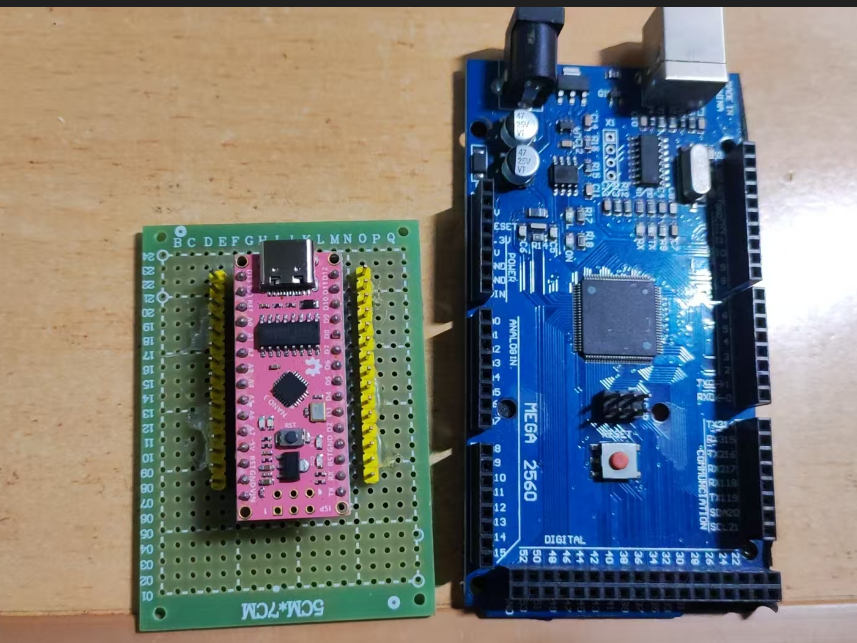
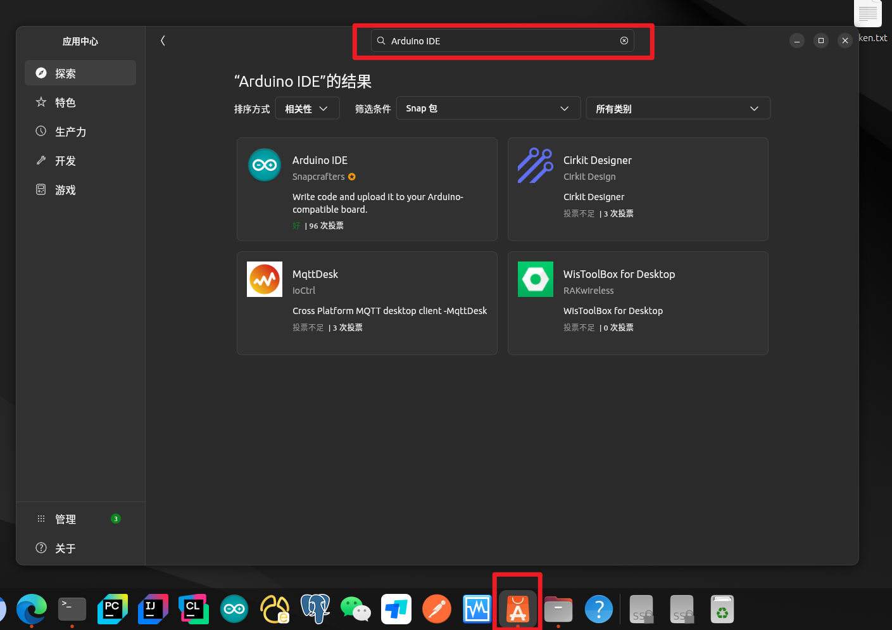
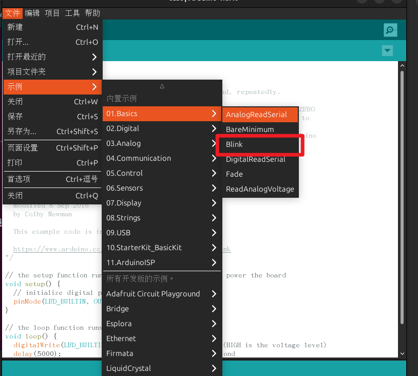
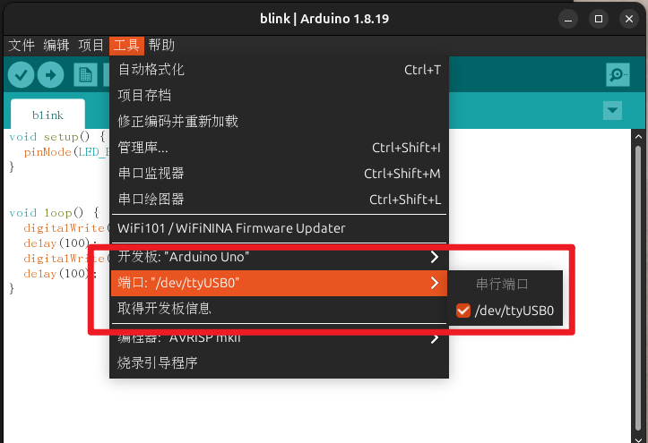

## 目录

[TOC]

---

## 前言

本文介绍  Arduino 在 Ubuntu 下的基本用法。

---

## 硬件

1. Arduino 家族的板子
2. 数据线

我测试的板子是 Arduino Nano 和 MEGA：



---

## 软件安装

在 Ubuntu 下的应用中心，搜索 Arduino IDE，然后下载。



---

## 运行示例

Arduino 官方给了很多示例，包括 LED 闪烁的代码示例：



Arduino 的优势在于其对产品线的板子作了很大的软件封装，所以代码很精简：

```c

/*
  Blink

  Turns an LED on for one second, then off for one second, repeatedly.

  Most Arduinos have an on-board LED you can control. On the UNO, MEGA and ZERO
  it is attached to digital pin 13, on MKR1000 on pin 6. LED_BUILTIN is set to
  the correct LED pin independent of which board is used.
  If you want to know what pin the on-board LED is connected to on your Arduino
  model, check the Technical Specs of your board at:
  https://www.arduino.cc/en/Main/Products

  modified 8 May 2014
  by Scott Fitzgerald
  modified 2 Sep 2016
  by Arturo Guadalupi
  modified 8 Sep 2016
  by Colby Newman

  This example code is in the public domain.

  https://www.arduino.cc/en/Tutorial/BuiltInExamples/Blink
*/

// the setup function runs once when you press reset or power the board
void setup() {
  // initialize digital pin LED_BUILTIN as an output.
  pinMode(LED_BUILTIN, OUTPUT);
}

// the loop function runs over and over again forever
void loop() {
  digitalWrite(LED_BUILTIN, HIGH);   // turn the LED on (HIGH is the voltage level)
  delay(1000);                       // wait for a second
  digitalWrite(LED_BUILTIN, LOW);    // turn the LED off by making the voltage LOW
  delay(1000);                       // wait for a second
}

```

LED\_BUILTIN 表示板载的 LED PIN，烧录好程序后，板载的 LED 就会闪烁。

烧录时，要确保板子类型和端口都要正确：



