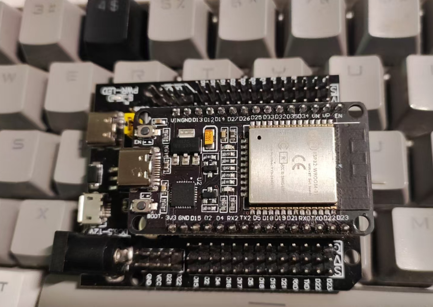

## 目录

[TOC]

---

## 前言

本文介绍 ESP32 在 Ubuntu 下的基本用法。

---

## 硬件

1. ESP32 开发板
2. 数据线

我使用的 ESP32 开发板：



---

## 软件

ESP32 可以使用 Arduino IDE 进行开发，安装好相应的库即可，本文介绍的是官方推荐的 ESP32 IDF 框架。

ESP IDF 的文档和 Github：

- https://docs.espressif.com/projects/esp-idf/en/stable/esp32/index.html
- https://github.com/espressif/esp-idf

安装过程参考 Github 的 README。

---

## 示例

为了使用这个工具，我们需要 source 一个 export.sh，export.sh 位于你安装的 esp-idf 目录下：

```shell
source ~/tool/esp/esp-idf/export.sh
```

然后，把 esp-idf 目录下的 examples/get-started/sample\_project/ 拷贝到自己的 blink 项目目录下，这是一个很干净的示例工程，没有包含任何逻辑代码。

编写一个简单的 LED 闪烁代码：

```c

#include "freertos/FreeRTOS.h"
#include "freertos/task.h"
#include <portmacro.h>
#include "driver/gpio.h"
#define LED_GPIO 2
void app_main(void)
{
    gpio_reset_pin(LED_GPIO);
    gpio_set_direction(LED_GPIO, GPIO_MODE_OUTPUT);

    while (1) {
        gpio_set_level(LED_GPIO, 1);
        vTaskDelay(500 / portTICK_PERIOD_MS);
        gpio_set_level(LED_GPIO, 0);
        vTaskDelay(500 / portTICK_PERIOD_MS);
    }
}

```

编译：
```
idf.py build
```

烧录：
```
idf.py flash
```

