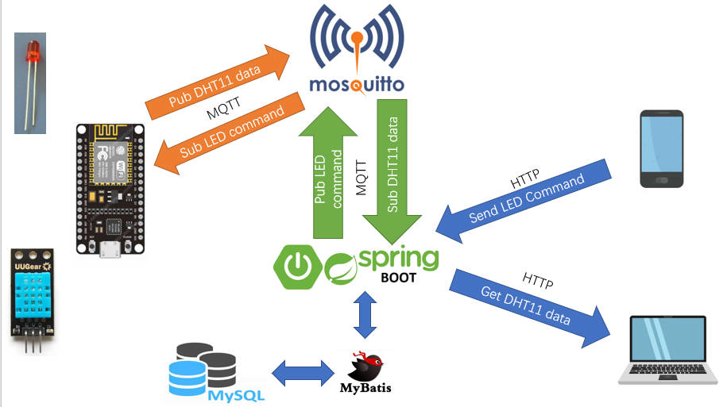
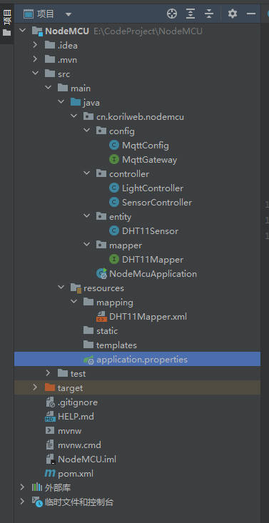

## 前言

MQTT 是一个基于客户端-服务器的消息发布/订阅传输协议。MQTT 协议是轻量、简单、开放和易于实现的，这些特点使它适用范围非常广泛。在很多情况下，包括受限的环境中，如：机器与机器（M2M）通信和物联网（IoT）。其在，通过卫星链路通信传感器、偶尔拨号的医疗设备、智能家居、及一些小型化设备中已广泛使用。——摘自百度百科

本文简单的使用 NodeMCU 作为载体，上面装了两个元器件，LED灯和DHT11传感器，LED 灯负责接收后端传来的信号，控制灯亮灭，DHT11 单纯的向后台发送数据。

后端采用 SpringBoot + MyBatis + MySQL 持久化 DHT11 传来的数据，并且集成了 MQTT 协议和 mosquitto 服务器进行通讯。

---

## 效果

展示效果放在了 B 站上：

https://www.bilibili.com/video/BV1p3411d7en/

---

## DHT11

一个温湿度传感器，用法可以参考我之前的文章：

http://korilweb.cn/tech/%E4%BD%BF%E7%94%A8oled%E5%B1%95%E7%A4%BAdht11%E7%9A%84%E6%B8%A9%E6%B9%BF%E5%BA%A6%E6%95%B0%E6%8D%AE/

---

## NodeMCU

关于 NodeMCU 的固件烧录和上传 python 文件的过程，可以参考我之前的文章：

http://korilweb.cn/tech/nodemcu%E5%8F%91%E9%80%81%E6%95%B0%E6%8D%AE%E7%BB%99%E6%A0%91%E8%8E%93%E6%B4%BE/

---

## Mosquitto

它是一款实现了消息推送协议 MQTT v3.1 的开源消息代理软件，提供轻量级的，支持可发布/可订阅的的消息推送模式，使设备对设备之间的短消息通信变得简单。

MQTT 有两个角色——服务端和客户端。

服务端（也可以叫做代理，即 Broker）是 MQTT 信息传输的枢纽，负责将 MQTT 客户端发送来的信息传递给 MQTT 客户端；MQTT 服务端还负责管理 MQTT 客户端，以确保客户端之间的通讯顺畅，保证 MQTT 信息得以正确接收和准确投递。

客户端可以向服务端发布信息，也可以从服务端收取信息，我们把客户端发送信息的行为称为 “发布”（Publish）信息。而客户端要想从服务端收取信息，则首先要向服务端“订阅”（Subscribe）信息。

Mosquitto 就扮演了服务端的角色，NodeMCU 扮演了客户端的角色。

---

## 架构图



手机端和电脑端可以通过 HTTP 来向后端接口发送 LED 控制命令或者获取 DHT11 的数据。

SpringBoot + SpringMVC 负责接受 HTTP 请求以及与 Mosquitto Broker 通讯，以及将 DHT11 的数据持久化到 MySQL 中。

NodeMCU 作为终端，接受来自 Mosquitto 的命令（Subscribe），以及推送 DHT11 的数据（Publish）。

---

## 启动 Mosquitto

下载页面：https://mosquitto.org/download/

下载好后，在目录下新建一个配置文件（它默认的配置文件是 mosquitto.conf），名字就叫 broker.conf，为了方便调试，这里就不设置用户名和密码，仅仅指定了监听端口，并且允许匿名链接。

broker.conf

```
listener 1883
allow_anonymous true
```

### 启动 Broker

```
.\mosquitto -v -c .\broker.conf
```

-v 指的是 verbose，打印详细的日志，-c 指的是使用我们自定义的配置文件启动。

为了检测是否运行正常，接下来分别启动一个 pub client 和 sub client 作为测试，一个发送消息，另一个接收消息。

### 启动 Sub Client

```
.\mosquitto_sub -h "192.168.10.108" -p 1883 -t "/device/led"
```

-h 指定 Broker 的 ip，-p 指定 Broker 的端口，-t 指定 sub client 需要订阅的主题。

### Pub Client 发送消息

```
.\mosquitto_pub -h 192.168.10.108 -p 1883 -t "/device/led" -m "on"
```

-h 指定 Broker 的 ip，-p 指定 Broker 的端口，-t 指定 pub client 需要向哪个主题发送消息，-m 指定需要发送的消息的内容。

---

## NodeMCU 连接 MQTT Broker

这里使用的是[umqtt.simple](https://mpython.readthedocs.io/en/master/library/mPython/umqtt.simple.html#module-umqtt.simple)，umqtt 是 MicroPython 的简单 MQTT 客户端实现库。

下面是代码实现，main.py

```python
import network
import urequests
import time
import dht
import json
import ntptime
from umqtt.simple import MQTTClient
from machine import Pin


# 客户的名称
CLIENT_ID = "nodemcu_1"
# mosquitto 地址
MQTT_SERVER_HOST = "192.168.10.108"
# mosquitto 端口
MQTT_SERVER_PORT = 1883


# DHT11 传感器主题
MQTT_SENSOR_TOPIC = b"/device/DHT11Sensor"
# LED 主题
MQTT_LED_TOPIC = b"/device/led"


led = Pin(0, Pin.OUT)
dht_sensor = dht.DHT11(Pin(4))

dht_sensor_id = "947106b6-94a5-11ed-8a33-44032c46921c"
api_url = "http://192.168.10.108:8080/nodemcu_data"

# 因为有时候带到不同的地方，学校，家里，还有公司
# 所以用一个 dict 存放所有的 WiFi 信息
wifi_dict = {
    "home" : ["CMCC-103", "68597213"],
    "phone" : ["djhxiaomi", "0987654321"]
}

# mqtt 客户端对象
c = MQTTClient(
        client_id=CLIENT_ID, 
        server=MQTT_SERVER_HOST, 
        port=MQTT_SERVER_PORT, 
        user=None, password=None, keepalive=300, ssl=False, ssl_params={}
    )


# 对某个WiFi进行连接
def do_connect(SSID, PASSWORD):
    wlan = network.WLAN(network.STA_IF)
    wlan.active(True)
    if not wlan.isconnected():
        print("connecting to " + SSID)
        wlan.connect(SSID, PASSWORD)

    start = time.time()
    while not wlan.isconnected():
        time.sleep(1)
        # 超过5秒，认为连接超时
        if time.time() - start > 5:
            print("connect timeout!")
            break
    # 连接成功，返回 True，打印 wlan 信息
    if wlan.isconnected():
        print('network config:', wlan.ifconfig())
        return True
    # 连接失败，返回 False
    return False


# 对 WiFi 字典进行遍历，某一个连接成功，就发送数据
def connect_wifi(wifi_dict):
    for wifi_info in wifi_dict:
        is_connected = do_connect(wifi_dict[wifi_info][0], wifi_dict[wifi_info][1])
        if is_connected:
            print("connect wifi succeed!")
            return True
    print("no wifi connect...")
    return False


# 连接到 mqtt broker
def connect_mqtt():
    # 设置回调函数
    c.set_callback(sub_callback)
    c.connect()
    # 订阅主题，接受 led 开关命令
    c.subscribe(MQTT_LED_TOPIC)
    print("MQTT connected and ready to receive message")


# 发送传感器数据，通过 http 协议
def send_sensor_data_http():

    headers = {
        "Content-Type" : "application/json"
    }

    sensor_data_json_str = get_temp_and_humidity_JSON_str()

    response = urequests.post(
        api_url,
        data = sensor_data_json_str, 
        headers = headers
    )
    print(f"send: {sensor_data_json_str}")
    print(f"receive: {response.text}")


# 发送传感器数据，通过 mqtt 协议
def send_sensor_data_mqtt():

    sensor_data_json_str = get_temp_and_humidity_JSON_str()

    c.publish(MQTT_SENSOR_TOPIC, sensor_data_json_str)

    print(f"send: {sensor_data_json_str}")


# 获取 DHT11 的数据，温度和湿度，以元组的形式返回
def get_temp_and_humidity():
    dht_sensor.measure()
    return (dht_sensor.temperature(), dht_sensor.humidity())


# 获取 DHT11 的数据，转换成 JSON 格式的字符串形式
def get_temp_and_humidity_JSON_str():
    temp_and_humidity = get_temp_and_humidity()
    
    sensor_data = {
        "sensorId":     dht_sensor_id,
        "temperature" : temp_and_humidity[0],
        "humidity" :    temp_and_humidity[1],
        "readTime":     get_format_time()
    }

    sensor_data_json_str = json.dumps(sensor_data)
    return sensor_data_json_str


# 获取当前的时间，格式：yyyy-MM-ddTHH:mm:ss
def get_format_time():
    time_tuple = time.localtime(time.time() + 8 * 3600)
    y, m, day, h, minute, s, _, _ = time_tuple
    return f"{y}-{m:02d}-{day:02d}T{h:02d}:{minute:02d}:{s:02d}"


# 获取订阅消息
def get_data():
    # wait_msg 是阻塞模式，check_msg 是非阻塞模式
    # 如果NodeMCU客户端只接受来自 Broker
    # 的数据，而不发送任何信息，可以用 wait_msg。
    # c.wait_msg()

    c.check_msg()


# 回调函数
def sub_callback(topic, msg): 
    print(f"topic: {topic}\nmsg: {msg}")
    topic_str = topic.decode()
    led_topic_str = MQTT_LED_TOPIC.decode()
    msg_str = msg.decode()

    if topic_str == led_topic_str:
        if msg_str == "on":
            print("led is on")
            led.value(1)
        elif msg_str == "off":
            print("led is off")
            led.value(0)


def main():
    if connect_wifi(wifi_dict):
        # 连接成功后，先设置正确的时间
        # ntptime.settime()
        time.sleep(1)
        connect_mqtt()
        while True:
            get_data()
            send_sensor_data_mqtt()
            time.sleep(1)


if __name__ == '__main__':
    main()
```

---

## SSM 整合 MQTT 以及持久化数据

pom.xml

```xml
<?xml version="1.0" encoding="UTF-8"?>
<project xmlns="http://maven.apache.org/POM/4.0.0" xmlns:xsi="http://www.w3.org/2001/XMLSchema-instance"
         xsi:schemaLocation="http://maven.apache.org/POM/4.0.0 https://maven.apache.org/xsd/maven-4.0.0.xsd">
    <modelVersion>4.0.0</modelVersion>
    <parent>
        <groupId>org.springframework.boot</groupId>
        <artifactId>spring-boot-starter-parent</artifactId>
        <version>3.0.1</version>
        <relativePath/> <!-- lookup parent from repository -->
    </parent>
    <groupId>cn.korilweb</groupId>
    <artifactId>NodeMCU</artifactId>
    <version>0.0.1-SNAPSHOT</version>
    <name>NodeMCU</name>
    <description>NodeMCU</description>
    <properties>
        <java.version>17</java.version>
    </properties>
    <dependencies>
        <dependency>
            <groupId>org.springframework.boot</groupId>
            <artifactId>spring-boot-starter-web</artifactId>
        </dependency>
        <dependency>
            <groupId>org.mybatis.spring.boot</groupId>
            <artifactId>mybatis-spring-boot-starter</artifactId>
            <version>3.0.0</version>
        </dependency>

        <dependency>
            <groupId>com.mysql</groupId>
            <artifactId>mysql-connector-j</artifactId>
            <scope>runtime</scope>
        </dependency>
        <dependency>
            <groupId>org.projectlombok</groupId>
            <artifactId>lombok</artifactId>
            <optional>true</optional>
        </dependency>
        <dependency>
            <groupId>org.springframework.integration</groupId>
            <artifactId>spring-integration-mqtt</artifactId>
            <version>6.0.1</version>
        </dependency>
        <dependency>
            <groupId>org.springframework.boot</groupId>
            <artifactId>spring-boot-starter-test</artifactId>
            <scope>test</scope>
        </dependency>
    </dependencies>

    <build>
        <plugins>
            <plugin>
                <groupId>org.springframework.boot</groupId>
                <artifactId>spring-boot-maven-plugin</artifactId>
                <configuration>
                    <excludes>
                        <exclude>
                            <groupId>org.projectlombok</groupId>
                            <artifactId>lombok</artifactId>
                        </exclude>
                    </excludes>
                </configuration>
            </plugin>
        </plugins>
    </build>

</project>

```

项目目录：



### Controller

除了使用 MQTT 接受传感器数据，这里我还写了一个 HTTP 接口来接受数据，就是 SensorController：

```java
package cn.korilweb.nodemcu.controller;


import cn.korilweb.nodemcu.entity.DHT11Sensor;
import cn.korilweb.nodemcu.mapper.DHT11Mapper;
import lombok.extern.slf4j.Slf4j;
import org.springframework.beans.factory.annotation.Autowired;
import org.springframework.web.bind.annotation.*;

import java.util.UUID;

@Slf4j
@RestController
@RequestMapping("/nodemcu_data")
public class SensorController {

    @Autowired
    private DHT11Mapper dht11Mapper;

    @PostMapping()
    public String getDHT11Data(@RequestBody DHT11Sensor dht11Sensor) {
        dht11Sensor.setId(UUID.randomUUID().toString());
        log.info("dht11-sensor-data: {}", dht11Sensor);
        dht11Mapper.insertDHT11SensorData(dht11Sensor);
        return "OK";
    }
}

```

LightController 接收到前端发来的 HTTP 请求后，使用 MQTT 再转发给 Mosquitto：

```java
package cn.korilweb.nodemcu.controller;


import cn.korilweb.nodemcu.config.MqttGateway;
import lombok.extern.slf4j.Slf4j;
import org.springframework.beans.factory.annotation.Autowired;
import org.springframework.web.bind.annotation.GetMapping;
import org.springframework.web.bind.annotation.PathVariable;
import org.springframework.web.bind.annotation.RequestMapping;
import org.springframework.web.bind.annotation.RestController;

@Slf4j
@RestController
@RequestMapping("/light")
public class LightController {

    @Autowired
    private MqttGateway mqttGateway;

    @GetMapping("/{cmd}")
    public String controlLight(@PathVariable String cmd) {
        log.info("cmd: {}", cmd);
        mqttGateway.senToMqtt(cmd, "/device/led");
        return "ok";
    }
}
```

### entity

entity.DHT11Sensor 就是持久化的 POJO 类：

```java
package cn.korilweb.nodemcu.entity;


import lombok.Data;

import java.time.LocalDateTime;
import java.util.Date;

@Data
public class DHT11Sensor {

    // 主键
    private String id;

    // 传感器编号
    private String sensorId;
    // 温度
    private Integer temperature;
    // 湿度
    private Integer humidity;
    // 传感器读取时间
    private Date readTime;
}

```

### Mapper

持久化层，存储 DHT11 的数据

DHT11Mapper.java

```java
package cn.korilweb.nodemcu.mapper;


import cn.korilweb.nodemcu.entity.DHT11Sensor;
import org.springframework.stereotype.Repository;

@Repository
public interface DHT11Mapper {

    int insertDHT11SensorData(DHT11Sensor dht11Sensor);
}
```

DHT11Mapper.xml

```xml
<?xml version="1.0" encoding="UTF-8" ?>
<!DOCTYPE mapper
        PUBLIC "-//mybatis.org//DTD Mapper 3.0//EN"
        "https://mybatis.org/dtd/mybatis-3-mapper.dtd">

<mapper namespace="cn.korilweb.nodemcu.mapper.DHT11Mapper">

    <sql id="DHT11SensorColumn">
        id,
        sensor_id,
        temperature,
        humidity,
        read_time
    </sql>

    <resultMap id="DHT11SensorResultMapper" type="DHT11Sensor">
        <id     column="id"             property="id" />
        <result column="sensor_id"      property="sensorId" />
        <result column="temperature"    property="temperature" />
        <result column="humidity"       property="humidity" />
        <result column="read_time"      property="readTime" />
    </resultMap>

    <insert id="insertDHT11SensorData" parameterType="DHT11Sensor">
        INSERT INTO
        dht11_sensor_data (<include refid="DHT11SensorColumn"/>)
        VALUES (#{id}, #{sensorId}, #{temperature}, #{humidity}, #{readTime})
    </insert>
</mapper>
```

### Config

主要是配置 MQTT

MqttConfig.java

```java
package cn.korilweb.nodemcu.config;


import cn.korilweb.nodemcu.entity.DHT11Sensor;
import cn.korilweb.nodemcu.mapper.DHT11Mapper;
import com.fasterxml.jackson.core.JsonProcessingException;
import com.fasterxml.jackson.databind.ObjectMapper;
import lombok.extern.slf4j.Slf4j;
import org.eclipse.paho.client.mqttv3.MqttConnectOptions;
import org.springframework.beans.factory.annotation.Autowired;
import org.springframework.context.annotation.Bean;
import org.springframework.context.annotation.Configuration;
import org.springframework.integration.annotation.ServiceActivator;
import org.springframework.integration.channel.DirectChannel;
import org.springframework.integration.core.MessageProducer;
import org.springframework.integration.mqtt.core.DefaultMqttPahoClientFactory;
import org.springframework.integration.mqtt.core.MqttPahoClientFactory;
import org.springframework.integration.mqtt.inbound.MqttPahoMessageDrivenChannelAdapter;
import org.springframework.integration.mqtt.outbound.MqttPahoMessageHandler;
import org.springframework.integration.mqtt.support.DefaultPahoMessageConverter;
import org.springframework.integration.mqtt.support.MqttHeaders;
import org.springframework.messaging.MessageChannel;
import org.springframework.messaging.MessageHandler;

import java.util.UUID;

@Slf4j
@Configuration
public class MqttConfig {

    @Autowired
    private DHT11Mapper dht11Mapper;

    private final static String username = "admin";

    private final static String password = "123456";

    @Bean
    public MqttPahoClientFactory mqttClientFactory() {

        DefaultMqttPahoClientFactory factory = new DefaultMqttPahoClientFactory();

        MqttConnectOptions options = new MqttConnectOptions();

        options.setServerURIs(new String[] { "tcp://192.168.10.108:1883" });
        options.setUserName(username);
        options.setPassword(password.toCharArray());
        options.setCleanSession(true);

        factory.setConnectionOptions(options);

        return factory;
    }

    @Bean
    public MessageChannel mqttInputChannel() {
        return new DirectChannel();
    }


    @Bean
    public MessageProducer inbound() {
        MqttPahoMessageDrivenChannelAdapter adapter = new MqttPahoMessageDrivenChannelAdapter("serverIn",
                mqttClientFactory(), "#");

        adapter.setCompletionTimeout(5000);
        adapter.setConverter(new DefaultPahoMessageConverter());
        adapter.setQos(2);
        adapter.setOutputChannel(mqttInputChannel());
        return adapter;
    }


    @Bean
    @ServiceActivator(inputChannel = "mqttInputChannel")
    public MessageHandler handler() {
        return message -> {
            String topic = message.getHeaders().get(MqttHeaders.RECEIVED_TOPIC).toString();
            if(topic.equals("/device/DHT11Sensor")) {
                log.info("Topic: {}, DHT11 Sensor Data: {}", topic, message.getPayload());
                ObjectMapper objectMapper = new ObjectMapper();
                DHT11Sensor sensorData = null;
                try {
                    sensorData = objectMapper.readValue(message.getPayload().toString(), DHT11Sensor.class);
                } catch (JsonProcessingException e) {
                    throw new RuntimeException(e);
                }
                sensorData.setId(UUID.randomUUID().toString());
                dht11Mapper.insertDHT11SensorData(sensorData);
            }
            else if (topic.equals("/device/led")) {
                log.info("Topic: {}, LED Command: {}", topic, message.getPayload());
            }
        };
    }


    @Bean
    public MessageChannel mqttOutboundChannel() {
        return new DirectChannel();
    }


    @Bean
    @ServiceActivator(inputChannel = "mqttOutboundChannel")
    public MessageHandler mqttOutbound() {
        //clientId is generated using a random number
        MqttPahoMessageHandler messageHandler = new MqttPahoMessageHandler("serverOut", mqttClientFactory());
        messageHandler.setAsync(true);
        messageHandler.setDefaultTopic("#");
        messageHandler.setDefaultRetained(false);
        return messageHandler;
    }
}
```

MqttGateway.java

```java
package cn.korilweb.nodemcu.config;

import org.springframework.integration.annotation.MessagingGateway;
import org.springframework.integration.mqtt.support.MqttHeaders;
import org.springframework.messaging.handler.annotation.Header;

@MessagingGateway(defaultRequestChannel = "mqttOutboundChannel")
public interface MqttGateway {

    void senToMqtt(String data, @Header(MqttHeaders.TOPIC) String topic);
}
```

application.properties

```properties
spring.datasource.driver-class-name=com.mysql.cj.jdbc.Driver
spring.datasource.url=jdbc:mysql://localhost:3306/nodemcu
spring.datasource.username=root
spring.datasource.password=123456

mybatis.mapper-locations=classpath:mapping/*Mapper.xml
mybatis.type-aliases-package=cn.korilweb.nodemcu.entity
```

---

## MySQL

只有一张表，用来存储 DHT11 的数据：

```mysql
create table dht11_sensor_data
(
    id          varchar(36) not null
        primary key,
    sensor_id   varchar(36) not null,
    temperature int         null comment '温度',
    humidity    int         null comment '湿度',
    read_time   timestamp   not null comment '读取数据的时刻'
);
```


---

## 参考

1. http://mqtt.p2hp.com/
2. http://mqtt.p2hp.com/mqtt311
3. https://mqtt.org/getting-started/
4. https://mosquitto.org/
5. https://mpython.readthedocs.io/en/master/library/mPython/umqtt.simple.html
6. https://www.youtube.com/watch?v=nFLWFJrqLDw
7. https://www.youtube.com/watch?v=HHKrKwI--Yw
8. https://docs.spring.io/spring-integration/reference/html/mqtt.html
