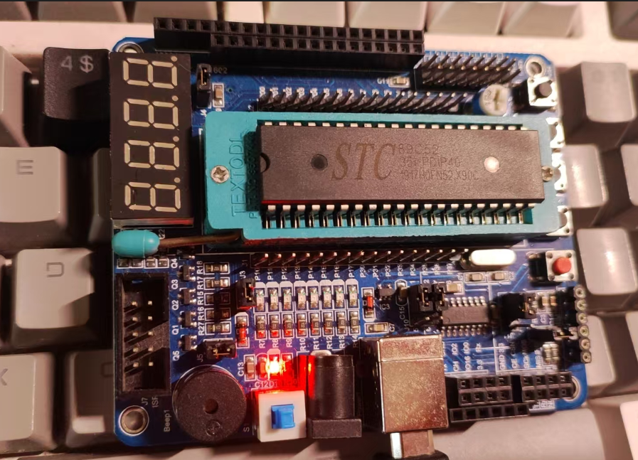

## 目录

[TOC]

---

## 前言

本文介绍 STC89C52 单片机在 Ubuntu 下的基本用法。

---

## 硬件

1. STC89C52 开发板
2. 数据线

我的开发板如下：



---

## 软件安装

### 编译器

编译 51 系列的单片机，需要有一个编译器——SDCC，官网: https://sdcc.sourceforge.net/

安装：

```shell
sudo apt install sdcc
```

### 烧录器

编译好的二进制文件需要烧写到单片机的 Flash 中，所以还需要一个烧写器——stcgal，官网：https://github.com/grigorig/stcgal

这个工具是用 Python 编写的，所以可以使用 pip 安装，为了不污染全局 pip，我单独在家目录的tool目录下给它建了个虚拟环境：

```
mkdir -p ~/tool/stcgal

cd ~/tool/stcgal

python3 -m venv venv

source ./venv/bin/activate

python -m pip install stcgal
```

之后需要使用这个烧写器的时候，source 这个目录的虚拟环境即可。

---

## 示例

这里提供一个最简单的 LED 闪烁示例代码：

```c

#include <8052.h>

void delay() {
    unsigned int i, j;
    for (i = 0; i < 100; i++) {
        for (j = 0; j < 100; j++) {
        }
    }
}

void main() {
    while (1) {
        P1_0 = 0;
        delay();
        P1_0 = 1;
        delay();
    }
}


```

编译代码：

```shell
sdcc ./main.c
```

编译成功后，会有很多中间文件，我们仅需要把 ihx 文件烧写到单片机即可，烧写前连接开发板和电脑。

连接成功的话，在 /dev 下会有 USB 的信息：

```shell
ls /dev/ttyUSB*
/dev/ttyUSB0
```

然后，通过 stcgal 工具烧写文件：

```shell

source ~/tool/stcgal/venv/bin/activate

stcgal -P stc89a -p /dev/ttyUSB0 main.ihx 

```

出现: Waiting for MCU, please cycle power: done，则需要重新打开单片机（在我的开发板上就是一个电源按键），成功后会提示：

```
(venv) koril@koril-ThinkBook-16-G6-IMH:~/project/c52/blink$ stcgal -P stc89a -p /dev/ttyUSB0 main.ihx 
Waiting for MCU, please cycle power: done
Target model:
  Name: STC89C52
  Magic: F051
  Code flash: 8.0 KB
  EEPROM flash: 6.0 KB
Target frequency: 11.088 MHz
Target BSL version: 7.2.5C
Target options:
  cpu_6t_enabled=False
  bsl_pindetect_enabled=False
  eeprom_erase_enabled=False
  clock_gain=high
  ale_enabled=True
  xram_enabled=True
  watchdog_por_enabled=False
Loading flash: 146 bytes (Intel HEX)
Switching to 115200 baud: checking 115200
testing done
Erasing All blocks: MCU ID: f051c5eb1b95c
done
Writing flash: 640 Bytes [00:00, 7510.03 Bytes/s]                                                                                          
Setting options: 
done
Disconnected!
```

