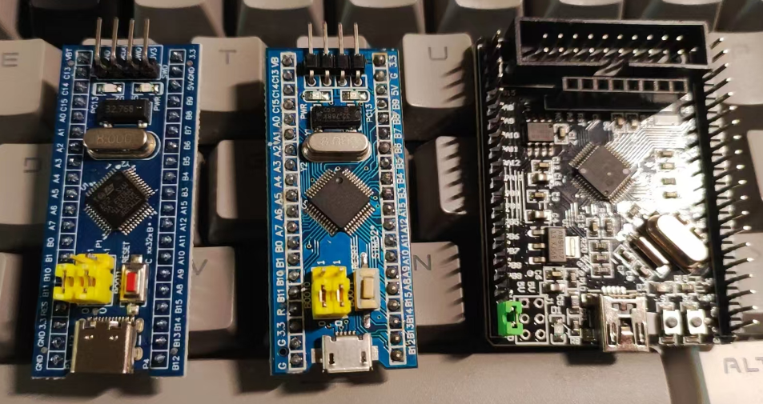
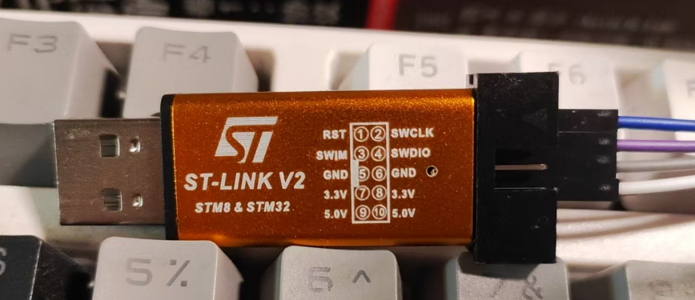
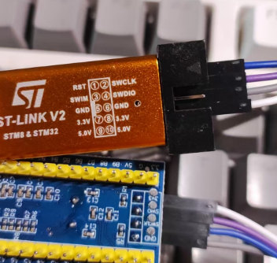
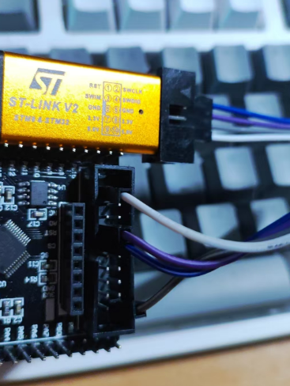

## 目录

[TOC]

---

## 前言

本文介绍 STM32F103C8T6 (后面简称为 STM32) 在 Ubuntu 下的基本用法。

---

## 硬件

1. STM32F103C8T6 开发板
2. ST-LINK V2

这是我用的几块测试板子：



ST-LINK V2：



接线：

1. 3.3V -> 3.3V
2. GND -> GND
3. SWCLK -> SWCLK
4. SWDIO -> SWIO



如果是 20PIN 的参考以下引脚图：


SWCLK 和 SWIO 分别在 9 和 7 号接口



---

## 软件

### 编译器

使用的编译器是 gcc-arm-none-eabi，它是一个 ARM 嵌入式系统的交叉编译工具链

安装：
```shell
sudo apt install gcc-arm-none-eabi
```

安装好后，可以查看版本：
```shell
arm-none-eabi-gcc --version
arm-none-eabi-gcc (15:13.2.rel1-2) 13.2.1 20231009
Copyright (C) 2023 Free Software Foundation, Inc.
This is free software; see the source for copying conditions.  There is NO
warranty; not even for MERCHANTABILITY or FITNESS FOR A PARTICULAR PURPOSE.
```

### 烧录器

烧录器使用的是 OpenOCD（Open On-Chip Debugger），一个用于调试和烧录嵌入式设备的工具。

安装：
```shell
sudo apt install openocd
```

安装好后，可以查看版本：
```shell
openocd --version
Open On-Chip Debugger v0.12.0-esp32-20241016 (2024-10-16-14:17)
Licensed under GNU GPL v2
For bug reports, read
	http://openocd.org/doc/doxygen/bugs.html
```

---

## 示例

这里用的示例，来源于 Github 一个项目：https://github.com/ubogdan/STM32F103C8T6

这个项目提供了一个让 STM32 的板载 LED 闪烁的示例，不过他用的是 J-LINK，如果用 ST-LINK 的话，只需要修改 Makefile 的 flash 指令即可：

```shell

# flash
flash: all
	openocd -f interface/stlink.cfg -f target/stm32f1x.cfg -c "program main.bin 0x08000000 verify reset exit"
```

编译，烧录：

```shell
make && make flash
```

如果碰到以下报错：

```
Warn : UNEXPECTED idcode: 0x2ba01477
Error: expected 1 of 1: 0x1ba01477
in procedure 'program'
** OpenOCD init failed **
shutdown command invoked
```

那就是因为芯片是CS32F103C8T6，一个中国仿制版本的芯片，原因参考博客：

1. https://blog.csdn.net/qq\_40923918/article/details/131698522
2. https://blog.csdn.net/nick\_young\_qu/article/details/108217987

可以把 /usr/share/openocd/scripts/target/stm32f1x.cfg 这个文件复制到当前的工程目录下，然后把文件中的 0x1ba01477 改称 0x2ba01477 就可以了

```
#jtag scan chain
if { [info exists CPUTAPID] } {
   set _CPUTAPID $CPUTAPID
} else {
   if { [using_jtag] } {
      # See STM Document RM0008 Section 26.6.3
      set _CPUTAPID 0x3ba00477
   } {
      # this is the SW-DP tap id not the jtag tap id
      # set _CPUTAPID 0x1ba01477 把这个改掉就行了
      set _CPUTAPID 0x2ba01477
   }
}
```

然后修改 Makefile 中的 flash，改为使用我们自己的 cfg 文件：
```
flash: all
	#openocd -f interface/stlink.cfg -f target/stm32f1x.cfg -c "program main.bin 0x08000000 verify reset exit"
	openocd -f interface/stlink.cfg -f /home/koril/project/stm32/STM32F103C8T6/stm32f1x.cfg -c "program main.bin 0x08000000 verify reset exit"
```

修改好 Makefile 后，再编译和烧录。
