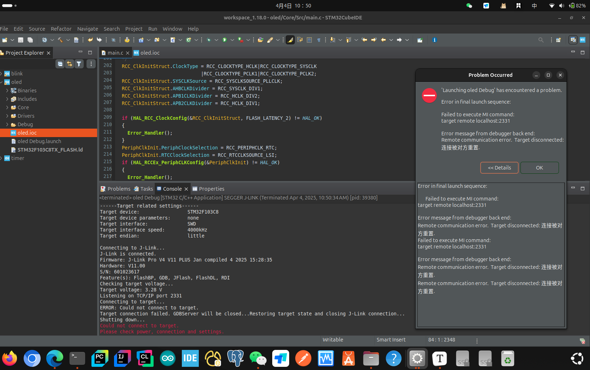
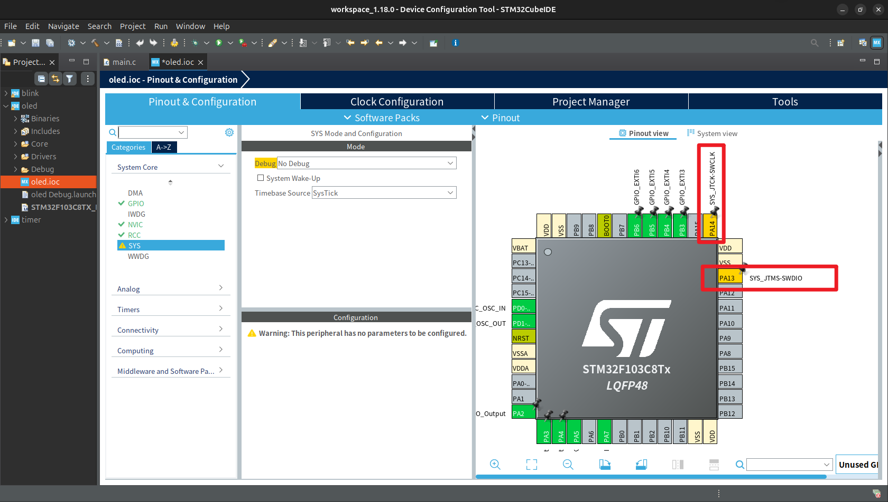
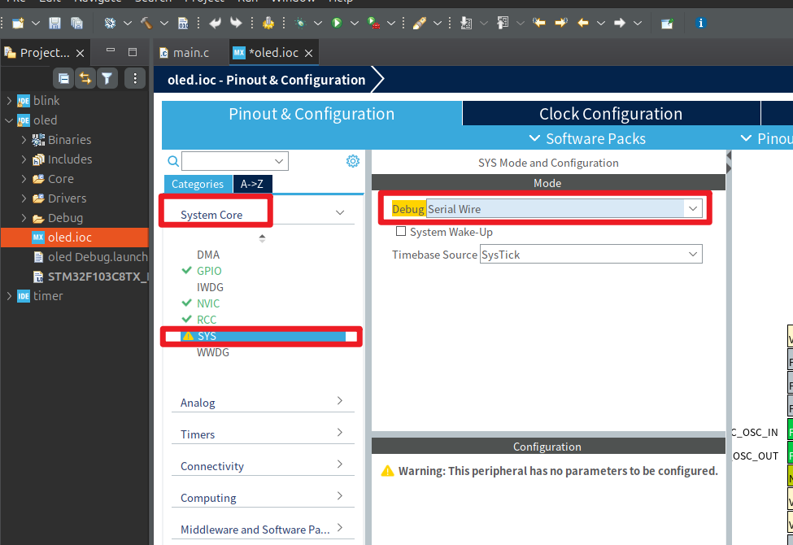
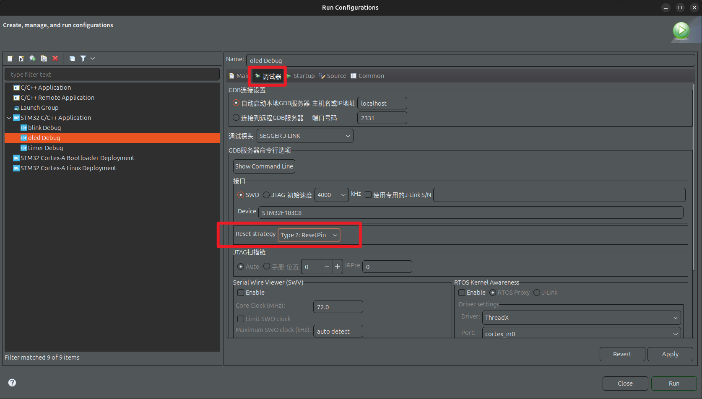

## 目录

[TOC]

---

## 问题

我在使用 STM32 开发板时碰到了一个很诡异的问题，而且目前以我的水平也无法理解它本质的原因，不过好歹是找到了解决方案，在此先记录下。

我使用 STM32CubeIDE 的 MX 工具配置点灯时，用的都是默认配置，只初始化了 PB13（板载 LED）的 GPIO。

我修改点灯程序，可以烧录到 STM32 板子，并且不需要 Reset 就可以直接看到新代码产生的效果。

但是当我学习稍微复杂些的内容时（比如：UART，TIM 中断，OLED），就会碰到这样的问题：

第一次烧录时，可以正常烧录，但是需要按下 Reset 键，才能看到新代码效果。

第二次烧录时，会碰到下面的报错：

---

## 解决

### 方案一

1. 先把 BOOT0 的跳帽从 GND 接到 3.3V，也就是进入 BOOT0 =  1, BOOT1 = 0 的启动模式
2. 按下 Reset 键
3. 点击 STM32CubeIDE 的烧录按钮，这时候就不会报错了
4. 把 BOOT0 的跳帽重新接到 GND
5. 按下 Reset 键，可以看到新代码的效果了

但是这个过程太麻烦了，尤其是改跳帽，所以找了别的方法。

### 方案二

打开项目的 ioc 图形配置界面，把 PA13，PA14 分别设置为以下功能：

然后在 SYS 中的 Debug 设置以下内容：

保存 ioc，配置 Debug 选项的 Reset 模式：

保存好后，先按照方案一，把代码烧录进去并且运行，之后就用方案二就行了。

方案二，不需要改跳帽，方便多了。
