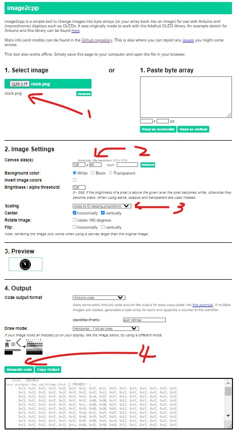

## 前言

本文实现了一个比较粗糙的手表原型，其中的很多代码，只是实现了功能，我对单片机的了解不深入，最佳实践更不清楚，仅作为后续自己的参考，如果后面学的更加深入了，回过来再改正。

---

## 项目代码

该项目有关的代码托管在了 Github 上：

https://github.com/Koril33/ArduinoProject/tree/main/OLED_watch

---

## 材料

| 名称              | 数量 | 单价（单位：元） |
| ----------------- | ---- | ---------------- |
| Arduino Nano      | 1    | 18               |
| 母对母杜邦线      | 10   | 0.051            |
| SSD1306 OLED 屏幕 | 1    | 13.5             |
| DHT11             | 1    | 8                |
| 按键              | 2    | 0.1              |

---

## OLED展示图片

Adafruit 库有一个函数`drawBitmap`用于绘制 OLED 的图像，bitmap 就是位图（或称为像素图，点阵图）存储了 OLED 每一个像素点上的信息。

免费图标的下载地址：

https://www.flaticon.com/

生成位图使用的工具是 image2cpp：

* Github：https://github.com/javl/image2cpp
* 在线转换网站：http://javl.github.io/image2cpp/

这里我的大小选择 128 × 48，是因为我的 OLED 是蓝黄双色，我把上面 16 个像素用来显示标题文字，剩下 48 的高度用于显示页面图片。



---

## 菜单页面

我总共打算放置 5 个功能：

1. 时钟：显示时间，时：分：秒。
2. 秒表：计时器功能。
3. 天气：没有联网，暂时使用上一个项目中的 DHT11 的温湿度数据。
4. 游戏：只有一个小游戏，Flappy Bird。
5. 设置

页面的展示和选择，使用一个按钮来控制，按下以后，切换到下一个功能页面。我想到最简单的办法是使用一个变量记录当前选择的页面，每按一次按钮，变量值加一，循环的时候不断检测这个变量值来判断应该绘制哪一个页面（有点像轮询，但我想这肯定不是好的办法）。

```c

void loop() {
  watch_app();
}

void watch_app() {
  // 绘制页面
  switchInterface(interface_index);

  // 菜单按钮按下，跳到下一个功能页面
  if (isBtnPressDown(MENU_BTN)) {
    delay(100);
    interface_index++;
    if (interface_index > interface_total_num) {
      interface_index = 1;
    }
  }
}


/**
 * 选择功能页面
 * param n: 指定的页面编号
 */
void switchInterface(int n) {

  switch (n) {
    
    case 1: clockInterface();   break;
    case 2: timerInterface();   break;
    case 3: weatherInterface(); break;
    case 4: gameInterface();    break;
    case 5: settingInterface(); break;

    default: clockInterface();
  }
}
```

---

## 进入功能页面

当选好页面后，点击另外一个按钮，进入功能，和上面的菜单选择思路一样。

```c
void watch_app() {
  // 绘制页面
  switchInterface(interface_index);

  // 菜单按钮按下，跳到下一个功能页面
  if (isBtnPressDown(MENU_BTN)) {
    delay(100);
    interface_index++;
    if (interface_index > interface_total_num) {
      interface_index = 1;
    }
  }

  // 确认按钮按下，进入当前功能页面
  if (isBtnPressDown(CHECK_BTN)) {
    delay(100);
    while (1) {
      enterInterface(interface_index);

      if (isBtnPressDown(MENU_BTN)) {
        delay(100);
        break;
      }
    }
  }
}


/**
 * 进入指定的功能页面
 */
void enterInterface(int n) {

  switch (n) {
    
    case 1: clock();   break;
    case 2: timer();   break;
    case 3: weather(); break;
    case 4: game();    break;
    case 5: setting(); break;

  }
}
```

---

## 功能逻辑代码

暂时省略，项目代码在 Github 上更新。
