## 前言

DHT11 传感器可以将湿度和温度数据非常方便的进行采集。它适合一些远程气象站、家庭环境控制系统以及农场或花园监控系统。

OLED 屏幕可以将数据可视化的展现出来。

---

## 项目代码

该项目有关的代码托管在了 Github 上：

https://github.com/Koril33/ArduinoProject/tree/main/DHT11_OLED_display

---

## 材料

| 名称              | 数量 | 单价（单位：元） |
| ----------------- | ---- | ---------------- |
| Arduino Nano      | 1    | 18               |
| 母对母杜邦线      | 10   | 0.051            |
| SSD1306 OLED 屏幕 | 1    | 13.5             |
| DHT11             | 1    | 8                |

---

## DHT11

### 接线

DHT11 如果买的是下图左边的模块的话，只有三根引脚：VCC，GND，DATA，并且信号线已经接上了上拉电阻。

如果买的是右边这种四个引脚的，就需要自己加个 10 KΩ 的上拉电阻，四个引脚有一个是没有作用的（N/C）。

引脚图：

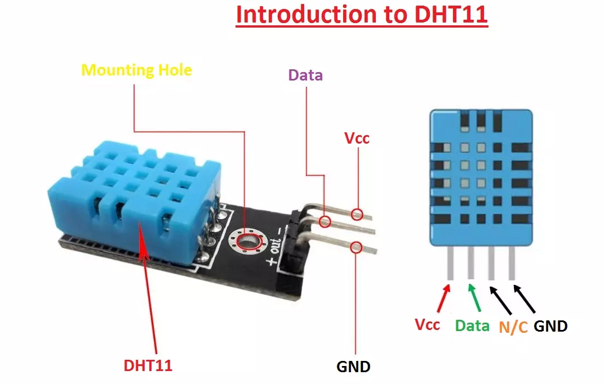

* VCC：+5V
* GND：接地
* Data：传感器输出的数字信号，接 arduino 的 IO引脚
* N/C：not connect，不连接

3pin 的接线图：

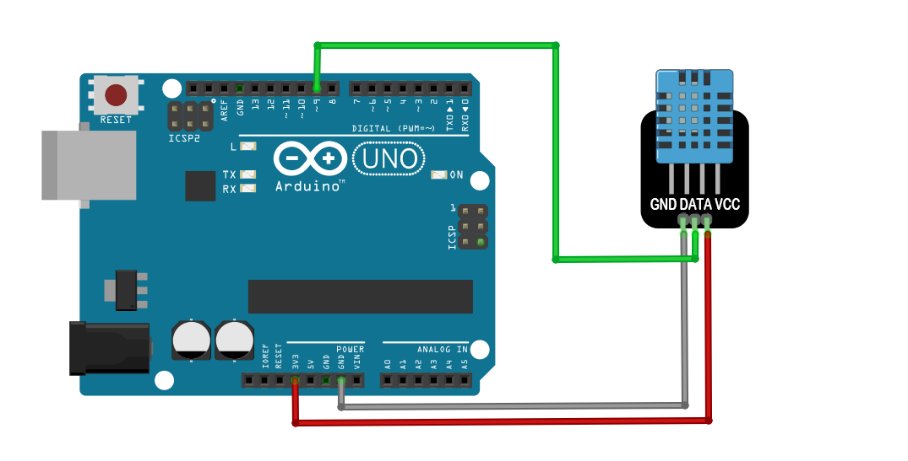

4pin 的接线图：

·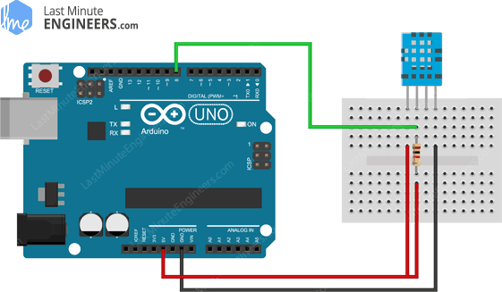

### DHT11 代码测试

关于 DHT11 有很多封装好的库，这里我使用的是下面这个库：

https://playground.arduino.cc/Main/DHT11Lib/

下载好库文件的压缩包后，解压放到 Arduino 的库目录下：

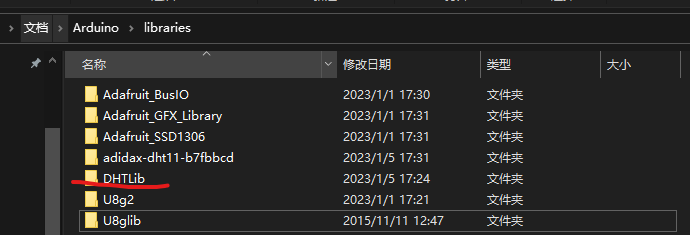

测试代码：

```c
#include <dht11.h>

#define DHT_DATA 7

dht11 DHT;

void setup() {
  // put your setup code here, to run once:
  Serial.begin(9600);
}

void loop() {
  DHT11Test();
}

void DHT11Test() {
  int chk = DHT.read(DHT_DATA);

  Serial.print("Humidity (%): ");
  Serial.println(DHT.humidity);

  Serial.print("Temperature (C): ");
  Serial.println(DHT.temperature);
  delay(1000); 
}
```

串口输出：

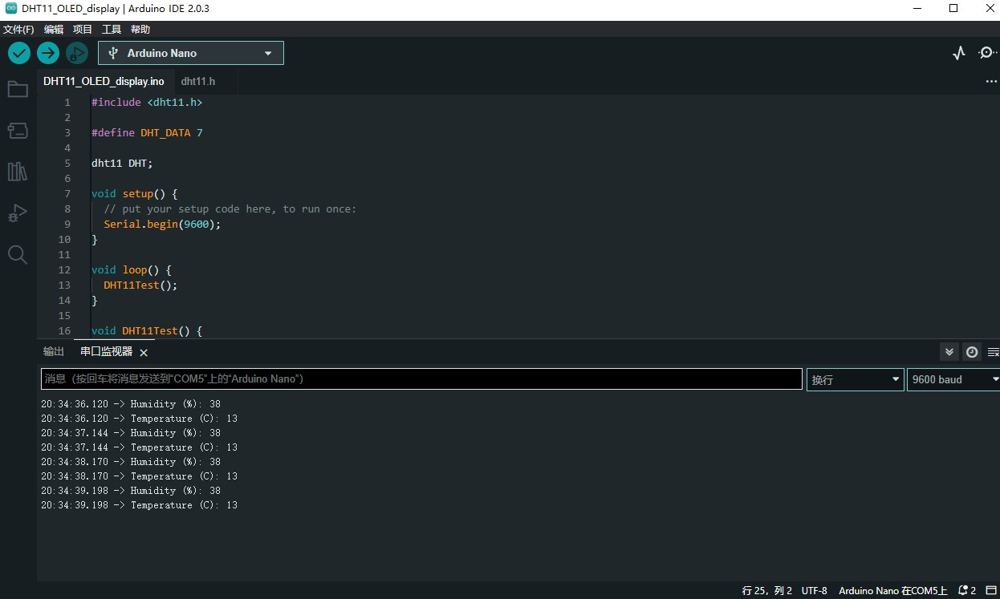

---

## SSD1306 OLED

SSD1306是一款单片 OLED 的驱动器，我购买的是 7pin 引脚，支持 SPI 和 I2C 通信的 OLED 模块。本文使用 SPI 通讯方式。

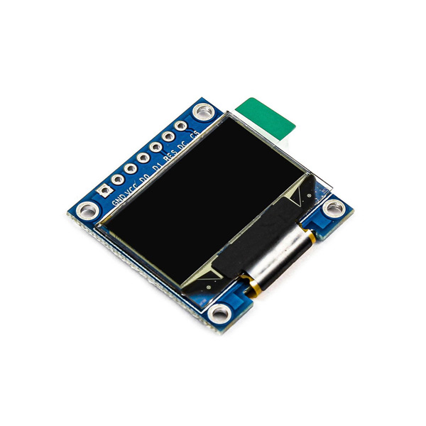

### 接线

引脚图：

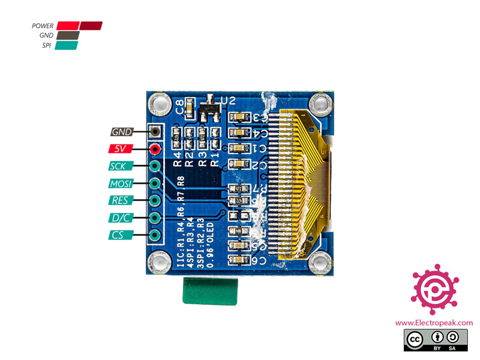

正面，从左至右：

1. GND：接地
2. VCC：3.3 - 5V
3. D0：SCK/SCL/CLK（clock），SPI 的时钟信号引脚
4. D1：MOSI（Master Output Slave Input），SPI 的数据输入输出引脚，这里指的是主设备数据输出，从设备数据输入。
5. RES：reset，复位引脚。
6. DC：D/C（Data/Command），选择传输数据还是指令。
7. CS：Chip Select，片选。

这里我选用 Nano 板上的 D2 - D6 连接 OLED 的 SPI 引脚：

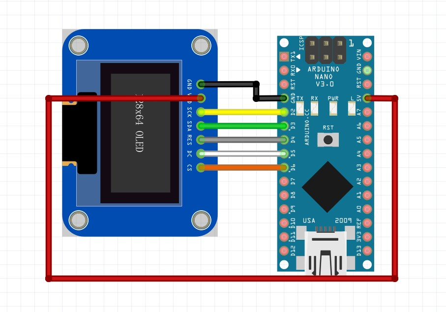

### OLED 代码测试

这里需要 adafruit 提供的库，可以在 Arduino 管理库中搜索下载，也可以手动解压放到库目录下：

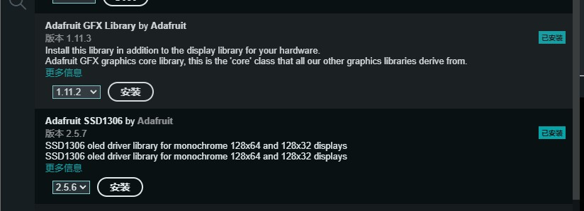

测试代码：

我直接使用 adafruit 库中自带的示例，唯一要改动地方的就是引脚。

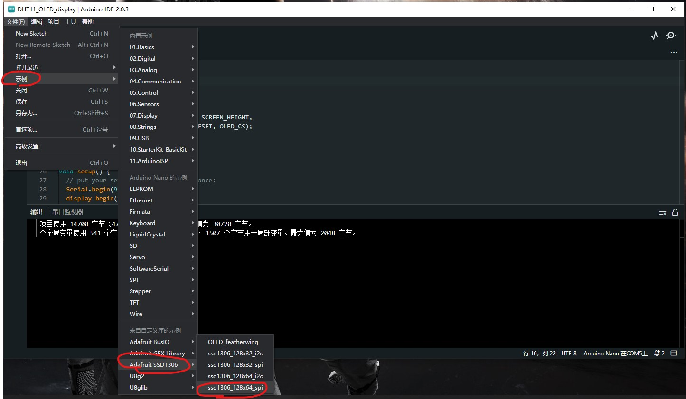

---

## OLED 展示 DHT11 的数据

接线图

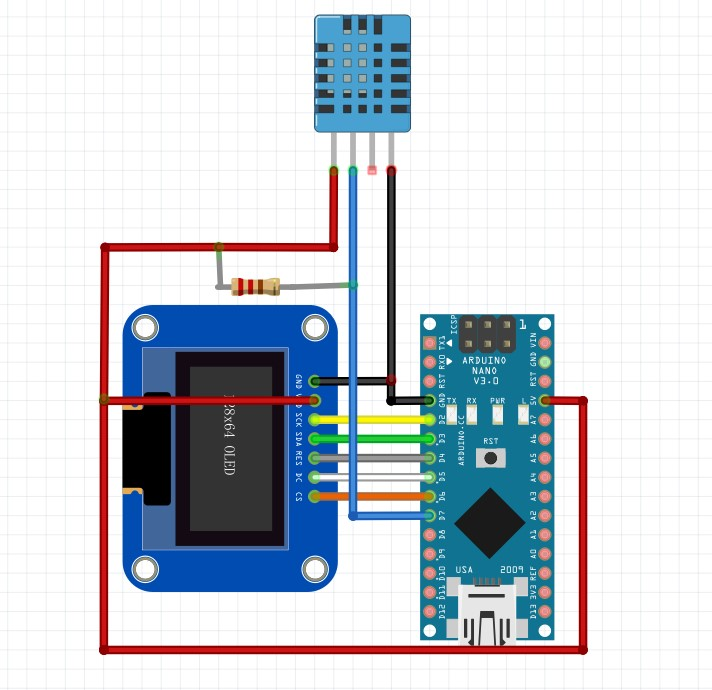

### 实物图

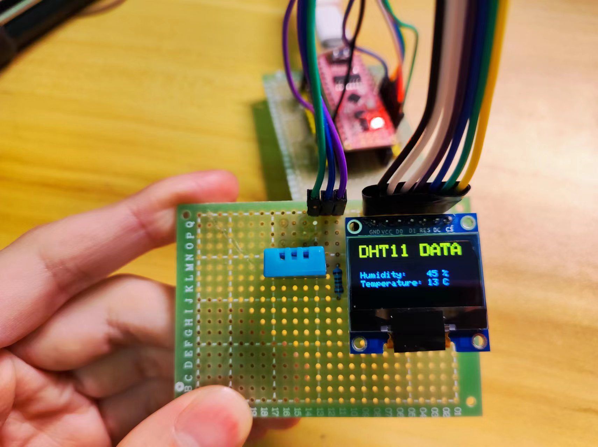

### 完整代码

```c
#include <SPI.h>
#include <Adafruit_SSD1306.h>
#include <dht11.h>

// OLED display width, in pixels
#define SCREEN_WIDTH 128
// OLED display height, in pixels
#define SCREEN_HEIGHT 64 

// Declaration for SSD1306 display connected using software SPI (default case):
// Clock
#define OLED_CLK    2
// Master Output Slave Input
#define OLED_MOSI   3
// Reset
#define OLED_RESET  4
// Data/Command
#define OLED_DC     5
// Chip Select
#define OLED_CS     6

#define DHT_DATA 7

// OLED 显示
Adafruit_SSD1306 display(SCREEN_WIDTH, SCREEN_HEIGHT,
  OLED_MOSI, OLED_CLK, OLED_DC, OLED_RESET, OLED_CS);

// DHT11
dht11 DHT;

void setup() {
  // put your setup code here, to run once:
  Serial.begin(9600);
  display.begin(SSD1306_SWITCHCAPVCC);
}

void loop() {
  // put your main code here, to run repeatedly:
  // 读取 DHT11 的数据
  int chk = DHT.read(DHT_DATA);
  // 显示在 OLED 上
  showDHT11Date(DHT.temperature, DHT.humidity);
  display.display();

  delay(100);
}

/**
 * DHT11 测试代码
 */ 
void DHT11Test() {
  int chk = DHT.read(DHT_DATA);

  Serial.print("Humidity (%): ");
  Serial.println(DHT.humidity);

  Serial.print("Temperature (C): ");
  Serial.println(DHT.temperature);
  delay(1000); 
}


/**
 * OLED 展示 DHT11 的数据
 * param t: 温度
 * param h: 湿度
 */
void showDHT11Date(int t, int h) {
  display.clearDisplay();
  // 设置 2 倍的字体大小
  display.setTextSize(2);
  // 设置文本颜色
  display.setTextColor(SSD1306_WHITE);
  
  // 标题
  display.setCursor(0, 0);
  display.println("DHT11 DATA");
  
  // 湿度数据
  display.setTextSize(1);
  display.setCursor(0, 30);
  display.print("Humidity:    ");
  display.print(h);
  display.print(" %");

  // 温度数据
  display.setCursor(0, 40);
  display.print("Temperature: ");
  display.print(t);
  display.print(" C");
}
```

---

## 参考

1. https://electropeak.com/learn/interfacing-dht11-temperature-humidity-sensor-arduino/
2. https://randomnerdtutorials.com/complete-guide-for-dht11dht22-humidity-and-temperature-sensor-with-arduino/
3. https://projecthub.arduino.cc/arcaegecengiz/12f621d5-055f-41fe-965d-a596fcc594f6
4. https://www.circuitbasics.com/how-to-set-up-the-dht11-humidity-sensor-on-an-arduino/
5. https://www.youtube.com/watch?v=7x1P80X1V3E
