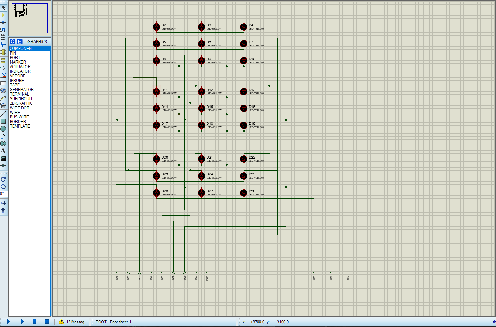

## 前言

光立方是个入门级的电路项目，而 3×3×3的 LED 光立方又是其中最为简单的一个。本文用 Arduino Nano 作为控制器，来控制 27 个LED 进行各种模式的闪烁。了解原理的同时，也是为了后面制作 8×8×8 LED 光立方打下基础。

采用 3×3×3的 LED 光立方，有以下的几个目的：

1. 复杂度较小，先以了解原理为主。
2. LED 数量少，不太需要担心供电电压， LED 电流和功率的问题。
3. 逻辑端口少，这里仅需要 12 个 IO 口控制，不需要额外的串行移位寄存器。

---

## 效果

仿真效果和实际效果的视频上传到了B站：

https://www.bilibili.com/video/BV1544y1972A/

---

## 项目代码

该项目有关的代码托管在了 Github 上：

https://github.com/Koril33/ArduinoProject/tree/main/led_cube_3%C3%973%C3%973

---

## 前置知识

* 欧姆定律
* LED 发光的原理
* LED 限流电阻的计算
* Arduino
* 电路焊接

---

## 材料

| 名称                                | 数量 | 单价（单位：元） |
| ----------------------------------- | ---- | ---------------- |
| 发光二极管                          | 27   | 0.036            |
| 200Ω 电阻                           | 3    | 0.202            |
| Arduino Nano                        | 1    | 18               |
| 母对母杜邦线                        | 12   | 0.051            |
| 单排针                              | 若干 |                  |
| 导线                                | 若干 |                  |
| 5×7 cm 万用板                       | 2    | 1.335            |
| 20 × 20 cm 瓦楞纸（快递盒剪下来的） | 若干 |                  |


总成本在 25 元左右。

---

## 注意事项

1. 在焊接之前，务必检查每个 LED 是否能正常点亮，因为焊接后，如果发现某个 LED 有问题，拆下来是很麻烦的。另外，每焊好一层 LED，都检查一下，再叠加焊接下一层。
2. 焊接时要注意 LED 引脚的正负极，不要接反了。

---

## 电路图



---

## 制作过程

### 焊接第一排 LED 串

首先需要用瓦楞纸板做一个模板，目的是为了固定 LED，方便焊接：


我使用的是 3mm 白光 LED，长脚（正极）18-19mm，短脚（负极）16-17mm，为了使负极引脚能够挨得上，每个孔的中心距约为 15mm 左右。

接下来，把两个 LED 放置在孔槽内：


然后将两个 LED 负极向同一侧弯折：


然后将负极与负极进行焊接，第三个LED同样如此操作，就得到了第一层第一行的 3 个焊接好的 LED 串：


### 焊接 3 排 LED 串

接下来就是同样的操作，焊好三串：


### 连接负极

完成第一层的最后一步，就是把三串的负极连接起来，这样我们就得到了 9 个独立的正极引脚，1 个公共的负极引脚的第一层 LED 矩阵。


### 焊接 3 层 LED 矩阵

同样的步骤，重复完成 3 层一模一样的 LED 矩阵：


焊接好每一层以后，对每一层都进行测试，确保每一个 LED 都能够正常发光。

### 连接 LED 矩阵层

需要将三层叠加在一起，形成 LED 立方体，具体的步骤就是把一层的正极和另一层对应的正极焊接到一起，这里需要把 LED 的正极引脚弯折，形成一定的空间：


然后层和层叠加，将上下两层对应的正极焊接起来：


这一步是最麻烦的，一定要小心。

### 将光立方焊接到万用板上

这里总共有 9 个正极引脚，3 个负极引脚（每一层一个公共负极引脚），所以准备 9 针红色排针，3 针黑色排针，将每一个引脚依次焊到排针上，这里每个负极引脚，我串联了 200Ω 的电阻限流：


万用板背面电路：


### 连接 Arduino Nano

我的两块万用板比较小，都是 5×7 cm，所以我分成了两部分，一块是 LED 立方电路，一块是 Arduino Nano，如果万用板大一些，可以焊在一块板子上。

9 个正极引脚分别连接到 Arduino Nano 上的 D2-D10。

3 个负极引脚分别连接到 Arduino Nano 上的 A0-A2。


### 烧录程序

```c
#define POSITIVE_NUM 9
#define NEGATIVE_NUM 3

#define first_layer   0
#define second_layer  1
#define third_layer   2

// 9 个公共正极引脚
uint8_t cp[POSITIVE_NUM] = {2, 3, 4, 5, 6, 7, 8, 9, 10};

// 3 层公共负极引脚
uint8_t cn[NEGATIVE_NUM] = {A0, A1, A2};

/**
 * 每个 LED 的坐标由两部分组成
 * 1. num:    编号（0 - 8），正极引脚
 * 2. layer:  层数（0 - 2），负极引脚
 */
struct coordinate {
  int num;
  int layer;
};


void setup() {
  // put your setup code here, to run once:
  setPinMode(cp, POSITIVE_NUM, OUTPUT);
  setPinMode(cn, NEGATIVE_NUM, OUTPUT);
}


void loop() {
  // put your main code here, to run repeatedly:
  lightenInOrder(500);
}


/**
 * 设置 pinMode
 * param a[]: 给定的 IO 端口数组
 * param len: 数组长度
 * param mode: pinMode，INPUT or OUTPUT
 */
void setPinMode(uint8_t a[], int len, uint8_t mode) {
  for (int i = 0; i < len; i++) {
    pinMode(a[i], mode);
  }
}


/**
 * 根据坐标，点亮单个 LED 灯
 * param c: 给定的坐标
 * return void
 */
void lighten(struct coordinate c) {
  for (int i = 0; i < NEGATIVE_NUM; i++) {
    if (i == c.layer) {
      analogWrite(cn[i], 0);
    }
    else {
      analogWrite(cn[i], 255);
    }
  }

  for (int j = 0; j < POSITIVE_NUM; j++) {
    if (j == c.num) {
      analogWrite(cp[j], 255);
    }
    else {
      analogWrite(cp[j], 0);
    }
  }
}


/**
 * 依次点亮每一个 LED
 * param ms: 点亮的间隔时间，单位：毫秒
 * return void
 */
void lightenInOrder(unsigned long ms) {
  struct coordinate c;

  // 外循环遍历每一层
  for (int i = 0; i < NEGATIVE_NUM; i++) {
    // 内循环遍历每一层的每一个 LED
    for (int j = 0; j < POSITIVE_NUM; j++) {
      c.num = j;
      c.layer = i;
      lighten(c);
      delay(ms);
    }
  }
}
```

上面的代码，双循环遍历每一层的每一个 LED 并点亮。

我用包含两个元素的结构体来表示一个 LED 在这个立方体中的坐标，一个是层数（layer），另一个是编号（num）。

想要点亮某一层的某个 LED，只需要将该层的负极引脚置为低电平，另外两层负极引脚置为高电平，并且将 9 个正极引脚中的某一个置高电平，其余正极引脚置低电平即可。

---

## 小结

技术上没有什么难度，就是焊接比较麻烦，为之后的 8×8×8 的光立方练个手。

---

## 参考

1. https://www.instructables.com/4x4x4-LED-Cube-Arduino-Uno/
2. https://www.instructables.com/Arduino-LED-Cube-3x3x3/
3. https://circuitdigest.com/microcontroller-projects/making-3X3X3-led-cube-with-arduino
