## 前言

42 步进电机（我在 Youtube 上看到的更多叫 NEMA 17），42 和 17 指的都是尺寸——42mm 或者 1.7 inch。广泛应用于 3D 打印机，桌面级机械臂，光驱，小型加工数控机床等等，它与普通的直流电机相比，提供了更加精确的控制。

本文的大部分内容来源于油管视频和 https://lastminuteengineers.com/，如果想要动手实践，看下面两个链接足矣：

* 视频：https://www.youtube.com/watch?v=7spK_BkMJys
* 文章：https://lastminuteengineers.com/a4988-stepper-motor-driver-arduino-tutorial/

视频和文章提供的资料都非常详尽。

---

## 演示视频

实际效果的视频上传到了B站：

https://www.bilibili.com/video/BV1m84y1a79w/

---

## 步进电机

### 组成结构

步进电机包含一个外壳，前后端盖，中间有一个轴，拧下螺丝，打开端盖，可以看到中间是一个多齿的转子，转子和轴连接，转子带动轴旋转。

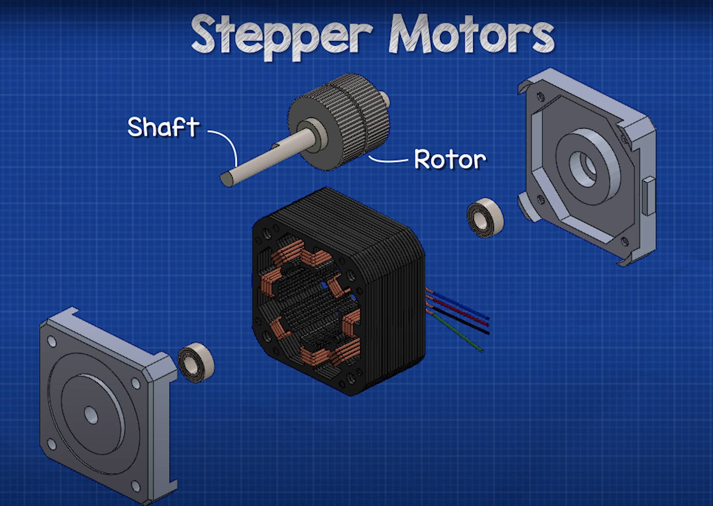

转子是永磁体，由前后两部分组成，一个是 N 极，另一个是 S 极。

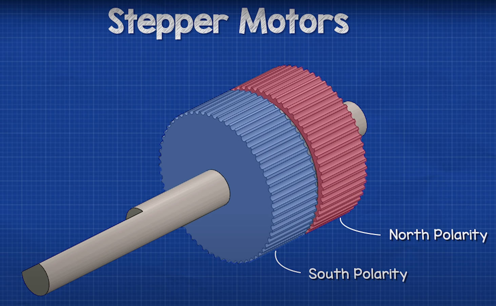

需要注意的是，前后两部分的齿不是一一对应的，而是刚好错开，这为后面的每一步的精确控制提供了基础。

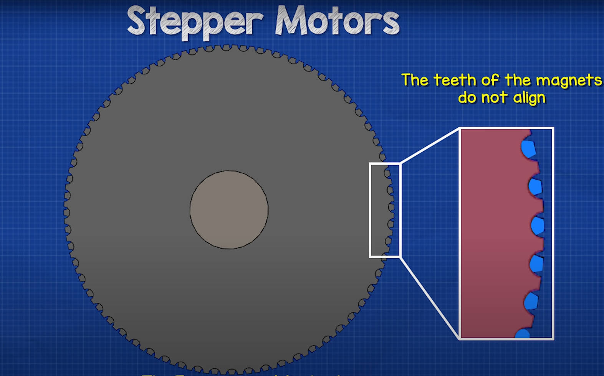

定子，就是包围在转子外面一圈的线圈组，总共 8 个线圈，分成两组。

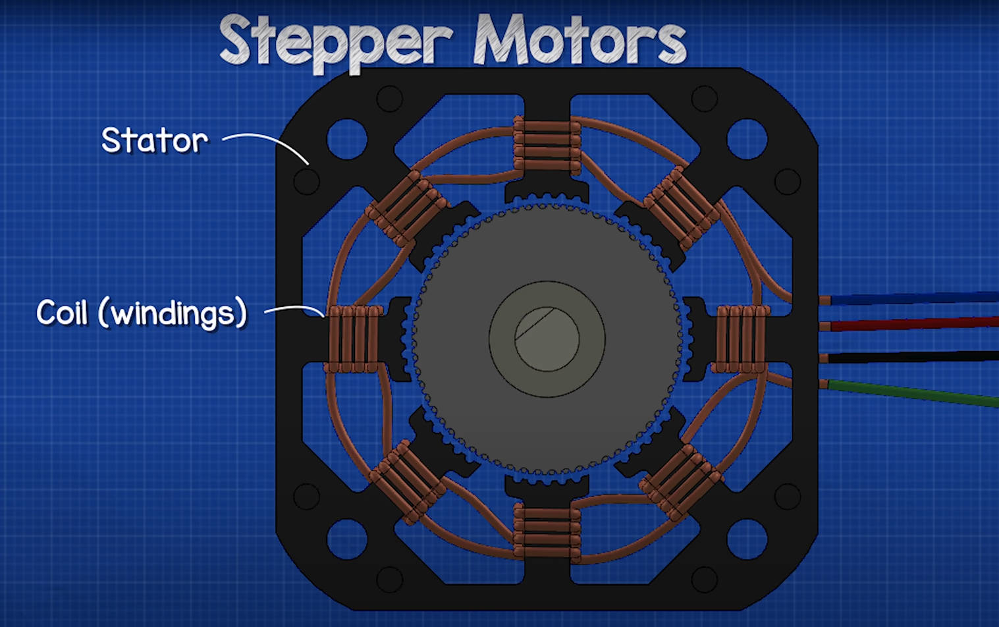

这也就是为什么步进电机有四根引线的原因，两根引线（正负极）控制一组（4个）线圈。

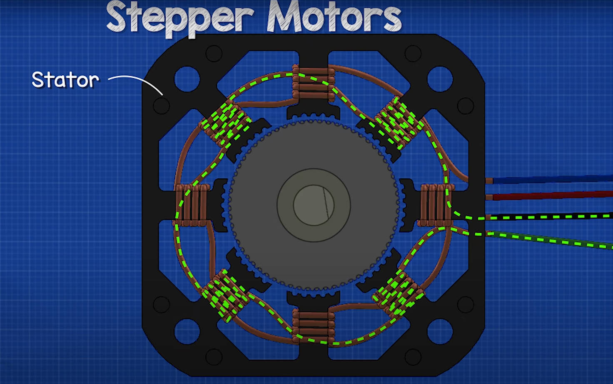

定子的齿数是和转子不匹配的，转自有 50 个齿，而定子只有 48 个齿。

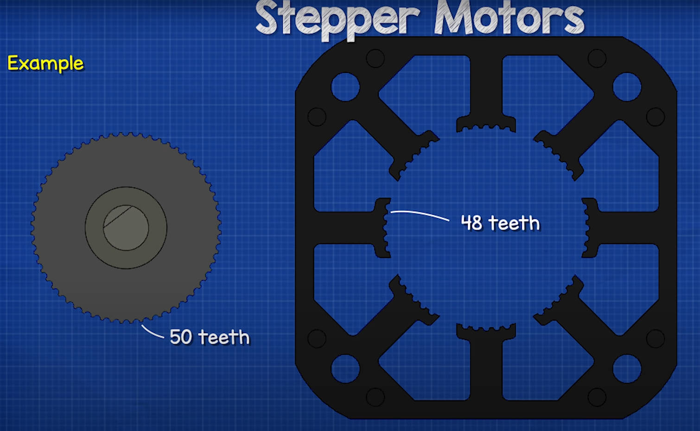

上面都是示意图，下面给出步进电机的实际拆解图片。

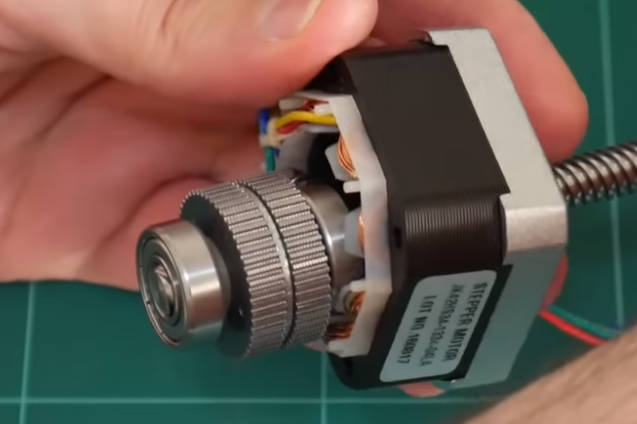

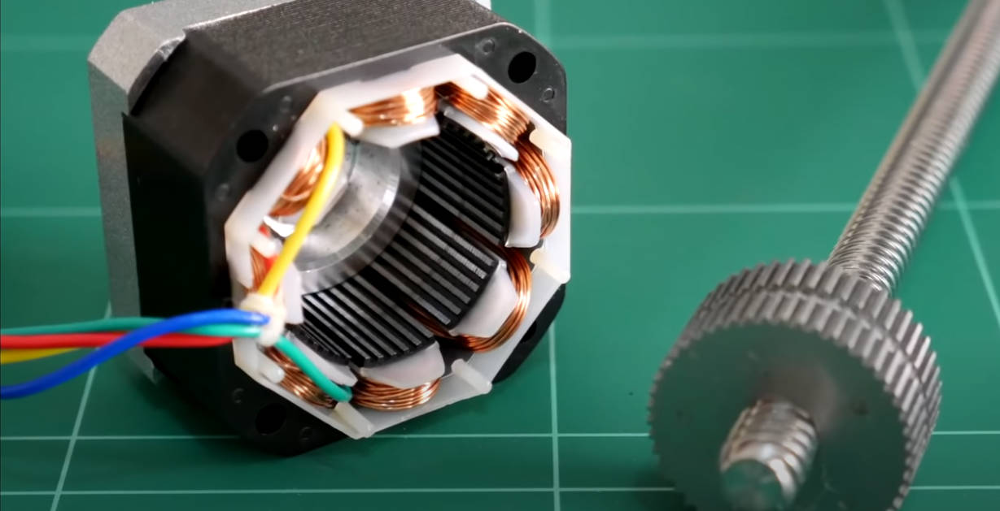

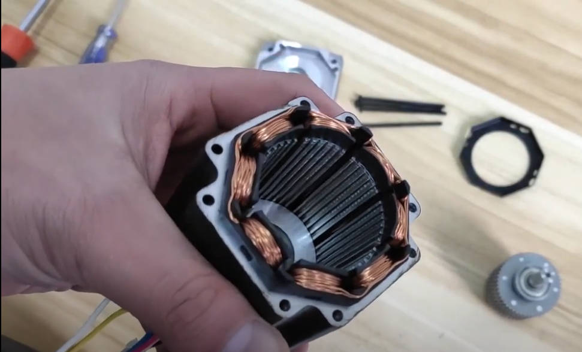

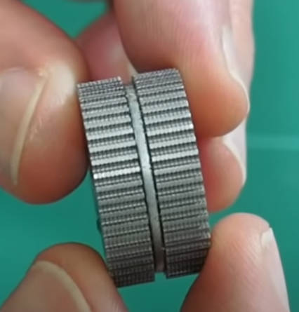

### 原理部分

步进电机的运行原理就是依靠中间的永磁体转子受到定子通电线圈不断变化的磁场影响下，精确控制转动角度。

单靠语言很难完美地描述它整个运行过程，动画讲解的方式更好：

* https://www.youtube.com/watch?v=eyqwLiowZiU
* https://www.youtube.com/watch?v=09Mpkjcr0bo

---

## A4988

### 技术规格

| Motor output voltage         | 8V – 35V                     |
| ---------------------------- | ---------------------------- |
| Logic input voltage          | 3V – 5.5V                    |
| Continuous current per phase | 1A                           |
| Maximum current per phase    | 2A                           |
| Microstep resolution         | full, 1/2, 1/4, 1/8 and 1/16 |

datasheet 下载：

https://www.allegromicro.com/-/media/files/datasheets/a4988-datasheet.pdf

A4988 引脚图：

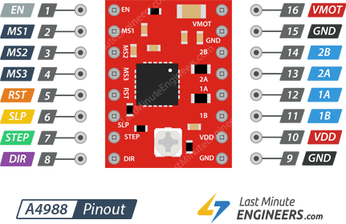

### 供电部分引脚

A4988 需要提供两部分的供电

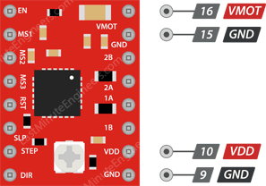

16号引脚 VMOT 和15号引脚 GND 是给步进电机供电用的，需要外接 8V-35V 之间的电源，另外为了保护驱动器免受电压尖峰影响，需要在电机电源引脚上放置一个 100μF 的大电解电容。

10号引脚 VDD 和9号引脚 GND 负责给内部逻辑电路供电，提供 3.3V - 5V 的电压即可。

### 微步细分选择引脚

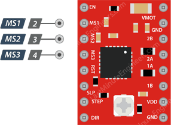

A4988 驱动支持微步进，这是通过用中等电流水平激励线圈来实现的。一般 42 步进电机的步距角都是 1.8°，也就是转一圈，需要 200 步（360°/1.8°=200），如果选择在四分之一步进模式下驱动电机，电机需要 800 步完成一圈。

A4988 驱动进程具有三个细分选择输入：MS1、MS2 和 MS3。通过为这些引脚设置适当的逻辑电平，我们可以将电机设置为五种不同的步进模式：

| MS1  | MS2  | MS3  | Microstep Resolution |
| ---- | ---- | ---- | -------------------- |
| Low  | Low  | Low  | Full step            |
| High | Low  | Low  | Half step            |
| Low  | High | Low  | Quarter step         |
| High | High | Low  | Eighth step          |
| High | High | High | Sixteenth step       |

大部分教程都是直接不连接这三个引脚，是因为这三个微步选择引脚由内部的下拉电阻拉低，因此如果保持它们未连接，电机默认将以全步进模式运行。

### 控制电机引脚

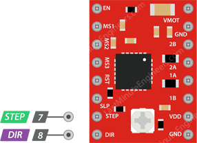

STEP 引脚控制电机的步进。发送到该引脚的每个高脉冲，将根据你上面选择微步控制模式来确定微步数驱动电机。脉冲频率越高，电机旋转得越快。

DIR 引脚控制电机的旋转方向。高电平使电机顺时针旋转，低电平使其逆时针旋转。

如果希望电机只向一个方向转动，可以将 DIR 引脚直接连接到 VCC 或 GND。

### 控制电源引脚

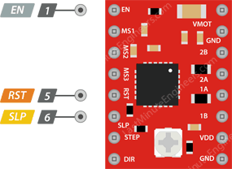

EN 是一个有源低输入引脚。当此引脚拉低时，A4988 驱动进程使能。默认情况下，此引脚被拉低，因此除非你手动将其拉高，否则驱动器始终处于启用状态。该引脚在实施急停或关断系统时特别有用。

SLP 是一个低电平有效输入引脚。将该引脚拉低可使驱动器进入睡眠模式，从而将功耗降至最低。您可以使用它来节省电力，尤其是在不使用电机时，一般直接和 RST 引脚相连接。

RST也是低电平有效输入。当该引脚被拉低时，所有步进输入将被忽略。它还通过将内部转换器设置为预定义的“Home”状态来重置驱动进程。Home 状态基本上是电机启动的初始位置，它根据微步分辨率（细分数）而变化。

### 输出引脚

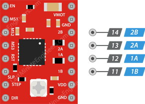

这四个引脚直接与步进电机的四个引脚链接，每个输出引脚可为电机提供高达 2A 的电流。但是，提供给电机的电流量由电源、冷却系统和系统的限流设置决定。

---

## 接线

接线示意图：

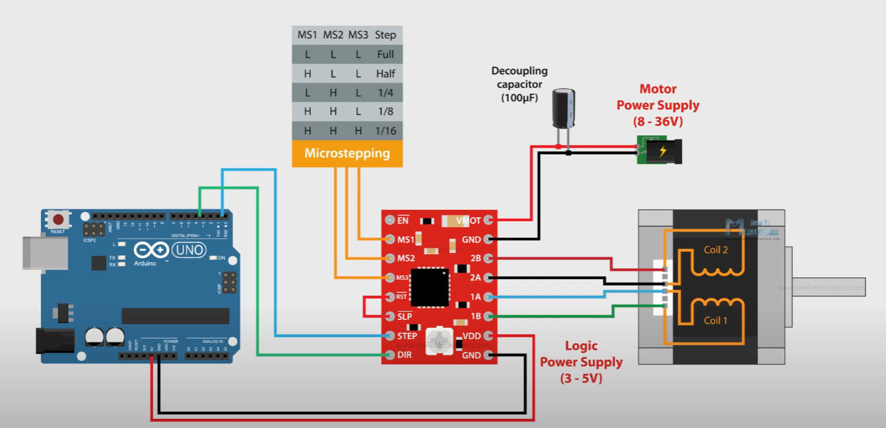

VDD 和 GND 直接连接 Arduino 的 5V 和 GND 引脚，STEP 和 DIR 这两个控制引脚可以连接到 Arduino 任意输出引脚。

RST 和 SLP 直接连接，如果不需要控制细分，MS1，MS2，MS3 可以不连接，因为内置下拉电阻，低电平，默认全步进模式。

EN 引脚可以不连接

实际接线图：

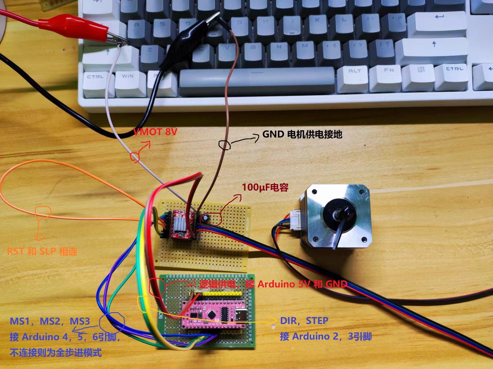

---

## 运行示例代码

### 不使用库

细分控制，根据表格给定高低电平：

```c
void fullStep() {
  digitalWrite(MS1, LOW);
  digitalWrite(MS2, LOW);
  digitalWrite(MS3, LOW);
}

void halfStep() {
  digitalWrite(MS1, HIGH);
  digitalWrite(MS2, LOW);
  digitalWrite(MS3, LOW);
}

void quarterStep() {
  digitalWrite(MS1, LOW);
  digitalWrite(MS2, HIGH);
  digitalWrite(MS3, LOW);
}

void eighthStep() {
  digitalWrite(MS1, HIGH);
  digitalWrite(MS2, HIGH);
  digitalWrite(MS3, LOW);
}

void sixteenthStep() {
  digitalWrite(MS1, HIGH);
  digitalWrite(MS2, HIGH);
  digitalWrite(MS3, HIGH);
}
```

旋转 N 圈，并且给定方向和速度：

```c
/**
 * 根据给定的方向和速度，旋转 N 圈
 * param dir: 方向，HIGH 为顺时针，LOW 为逆时针
 * param turn_num: 旋转的圈数
 * param speed: 延迟的时间，值越小，电机越快，范围一般在500-2000之间。
 * return void
 */
void rotateNLoop(bool dir, int turn_num, int speed) {
  digitalWrite(dir_pin, dir);
  for (int i = 0; i < STEPS_PER_REVOLUTION * turn_num; i++) {
    digitalWrite(step_pin, HIGH);
    delayMicroseconds(speed);
    digitalWrite(step_pin, LOW);
    delayMicroseconds(speed);
  }
}
```

这里的 STEPS_PER_REVOLUTION 是一个常量 200，因为 1.8° 的步距角，需要走两百步，才完成一圈的旋转。

完整示例：

```c
// 顺时针
#define CLOCKWISE       HIGH
// 逆时针
#define ANTI_CLOCKWISE  LOW

// 方向控制引脚
const int dir_pin  = 2;
// 步进控制引脚
const int step_pin = 3;

// 微步细分选择引脚
const int MS1      = 4;
const int MS2      = 5;
const int MS3      = 6;

// 一圈的步数
const int STEPS_PER_REVOLUTION = 200;


void setup() {
  pinMode(dir_pin, OUTPUT);
  pinMode(step_pin, OUTPUT);
  pinMode(MS1, OUTPUT);
  pinMode(MS2, OUTPUT);
  pinMode(MS3, OUTPUT);
  
  delay(3000);
}

void loop() {

  fullStep();
  // halfStep();
  // quarterStep();
  // eighthStep();
  // sixteenthStep();

  // rotatePersistent(CLOCKWISE, 1000);
  
  rotateNLoop(CLOCKWISE, 1, 700);
  delay(3000);

  rotateNLoop(ANTI_CLOCKWISE, 2, 1000);
  delay(3000);
}


/**
 * 根据给定的方向和速度，旋转 N 圈
 * param dir: 方向，HIGH 为顺时针，LOW 为逆时针
 * param turn_num: 旋转的圈数
 * param speed: 延迟的时间，值越小，电机越快，范围一般在500-2000之间。
 * return void
 */
void rotateNLoop(bool dir, int turn_num, int speed) {
  digitalWrite(dir_pin, dir);
  for (int i = 0; i < STEPS_PER_REVOLUTION * turn_num; i++) {
    digitalWrite(step_pin, HIGH);
    delayMicroseconds(speed);
    digitalWrite(step_pin, LOW);
    delayMicroseconds(speed);
  }
}

/**
 * 不停的转
 * param dir: 方向，HIGH 为顺时针，LOW 为逆时针
 * param speed: 延迟的时间，值越小，电机越快，范围一般在500-2000之间。
 * return void
 */
void rotatePersistent(bool dir, int speed) {
  while (1) {
    rotateNLoop(dir, 1, speed);
  }
}

void fullStep() {
  digitalWrite(MS1, LOW);
  digitalWrite(MS2, LOW);
  digitalWrite(MS3, LOW);
}

void halfStep() {
  digitalWrite(MS1, HIGH);
  digitalWrite(MS2, LOW);
  digitalWrite(MS3, LOW);
}

void quarterStep() {
  digitalWrite(MS1, LOW);
  digitalWrite(MS2, HIGH);
  digitalWrite(MS3, LOW);
}

void eighthStep() {
  digitalWrite(MS1, HIGH);
  digitalWrite(MS2, HIGH);
  digitalWrite(MS3, LOW);
}

void sixteenthStep() {
  digitalWrite(MS1, HIGH);
  digitalWrite(MS2, HIGH);
  digitalWrite(MS3, HIGH);
}
```

使用 AccelStepper 库：

```c
// Include the AccelStepper Library
#include <AccelStepper.h>

// Define pin connections
const int dirPin = 2;
const int stepPin = 3;

// Define motor interface type
#define motorInterfaceType 1

// Creates an instance
AccelStepper myStepper(motorInterfaceType, stepPin, dirPin);

void setup() {
	// set the maximum speed, acceleration factor,
	// initial speed and the target position
	myStepper.setMaxSpeed(2000);
	myStepper.setAcceleration(50);
	myStepper.setSpeed(500);
	myStepper.moveTo(200);
}

void loop() {
	// Change direction once the motor reaches target position
	if (myStepper.distanceToGo() == 0) 
		myStepper.moveTo(-myStepper.currentPosition());

	// Move the motor one step
	myStepper.run();
}
```

---

## 参考

1. https://lastminuteengineers.com/a4988-stepper-motor-driver-arduino-tutorial/
2. https://www.youtube.com/watch?v=eyqwLiowZiU
3. https://www.youtube.com/watch?v=09Mpkjcr0bo
4. https://www.youtube.com/watch?v=7spK_BkMJys
