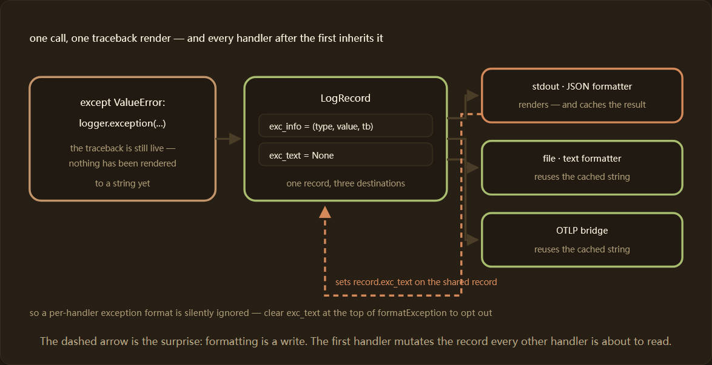
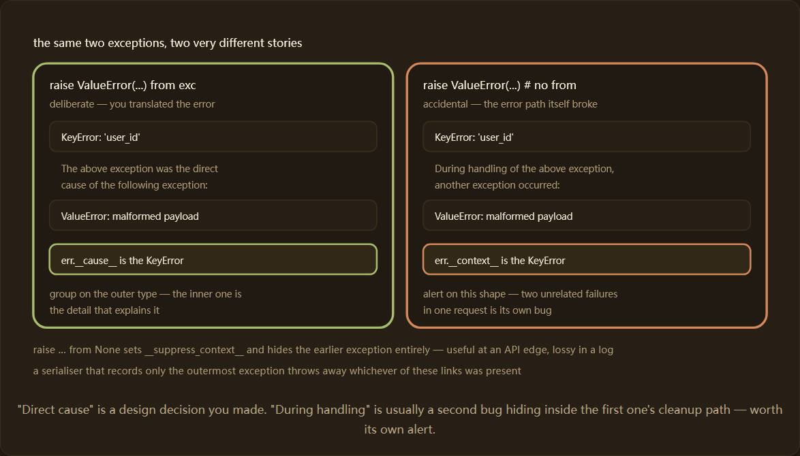

## 原文

https://python-observability.com/python-logging-fundamentals-and-structured-data/exception-and-traceback-logging/

---

## 前言

日志中出现的异常信息如果显示为“ERROR: something went wrong”，就会让值班工程师白白浪费一个小时的夜晚时间。本指南面向后端工程师和SRE，旨在帮助他们获取完整、分组且可查询的回溯信息，并帮助他们克服因格式化程序吞噬堆栈信息、队列剥离堆栈信息或消息字段泄露连接字符串而造成的损失。本指南是Python日志基础和结构化数据部分的一部分，并假设您已使用标准库实现了结构化日志记录。

三个机制几乎可以解释 Python 中所有异常日志记录的错误：记录携带的是一个实时的（类型-type、值-value、回溯-traceback）三元组，而不是一个字符串；第一个访问该记录的格式化程序会将渲染结果（formatter render）缓存起来供其他程序使用；任何复制或序列化该记录的操作都会丢弃这个三元组。搞清楚这三点，其余的问题——链式异常、异步逃逸路径、帧限制、数据脱敏——也就迎刃而解了。具体的操作步骤包括记录异常和回溯信息、捕获未处理的异常和警告，以及在日志记录中脱敏敏感数据。



---

## 概念和架构

Python 日志记录本身并不包含回溯信息。它包含 `exc_info`，这是一个包含异常类、异常实例和回溯对象的三元组——所有这些都是对解释器状态的实时引用。`logging.Formatter.format()` 通过调用 `formatException()` 将其转换为文本，而 `formatException()` 默认会调用 `traceback.print_exception()`。

容易引起误解的地方在于缓存机制。`Formatter.format()` 的执行顺序大致如下：首先渲染消息，然后，如果 `record.exc_info` 已设置而 `record.exc_text` 未设置，则调用 `formatException()` 并将结果存储到记录中。记录是共享对象——日志记录器会将同一条记录传递给所有匹配的处理程序——因此，哪个处理程序先运行，就决定了后续所有格式化程序看到的内容。一个发出结构化异常对象的 JSON 处理程序和一个需要经典缩进回溯信息的文件处理程序，除非其中一个清除缓存，否则无法同时满足它们的需求。

第二个结构性事实是 `exc_info` 无法在序列化后保留。回溯对象无法被序列化。任何需要在进程间移动记录的操作——例如使用 `multiprocessing.Queue` 的 `QueueHandler`、`SocketHandler` 或执行深度复制的自定义扇出——都必须先将回溯信息渲染成文本，然后丢弃三元组。`QueueHandler.prepare()` 正是如此，因此回溯信息会附加在消息末尾，而另一端的 `exc_info` 则被设置为 `None`。

第三个事实是链式异常。自 Python 3 起，在处理另一个异常时引发的每个异常都会带有指向它的链接：当异常隐式发生时，使用 `__context__`；当从 `exc` 中调用 `raise NewError` 时，使用 `__cause__`；当从 `None` 中调用 `__suppress_context__` 时，使用 `__suppress_context__`。默认的回溯渲染器会遍历这些链接并打印所有链接，链接之间用两个含义截然不同的句子之一连接。




## 逐步实现

步骤 1 — 只在处理异常的地方记录一次异常。`logger.exception()` 等同于 `logger.error()` 并设置 `exc_info=True`；两者都会附加当前正在处理的异常。在决定下一步操作的边界处调用它——例如请求处理程序、任务包装器或重试循环——而不是在流程的每一帧都调用它。如果您持有的是特定的异常对象而不是当前活动的异常对象，请直接传递它：`exc_info` 接受异常实例以及 `True` 参数。

```python
import logging

logger = logging.getLogger(__name__)

def handle_order(payload: dict) -> None:
    try:
        process(payload)
    except ValueError as exc:                       # translate, keep the link
        raise OrderRejected("payload failed validation") from exc

def request_boundary(payload: dict) -> int:
    try:
        handle_order(payload)
    except OrderRejected:
        logger.exception("order rejected", extra={"order_id": payload.get("id")})
        return 400
    except Exception as exc:                        # unexpected: log the object we hold
        logger.error("order failed", exc_info=exc, extra={"order_id": payload.get("id")})
        return 500
    return 202
```

除了 arm 之外，其他方法都会生成一条包含完整链的记录——OrderRejected，其 __cause__ 指向原始的 ValueError——因为链存在于异常对象中，而不是日志调用中。

步骤 2 — 将回溯信息转换为字段。默认渲染结果是一个多行字符串，日志后端将其存储为不透明的 blob：您无法按异常类型进行分面、按引发模块分组或在特定帧发出警报。重写 formatException() 方法以返回序列化对象，并首先清除 record.exc_text，以避免此格式化程序接收到其他处理程序的渲染结果。

```python
import json
import logging
import traceback

MAX_FRAMES = 20

def _serialise(exc: BaseException, depth: int = 0) -> dict:
    """One exception as fields; recurse into the chain, innermost link last."""
    frames = traceback.extract_tb(exc.__traceback__)[-MAX_FRAMES:]
    node = {
        "type": type(exc).__name__,
        "module": type(exc).__module__,
        "message": str(exc)[:512],
        "frames": [
            {"file": f.filename, "line": f.lineno, "func": f.name, "code": f.line}
            for f in frames
        ],
    }
    if depth < 3:                                   # bound the chain, not just the frames
        if exc.__cause__ is not None:
            node["cause"] = _serialise(exc.__cause__, depth + 1)
        elif exc.__context__ is not None and not exc.__suppress_context__:
            node["context"] = _serialise(exc.__context__, depth + 1)
    return node

class StructuredExceptionFormatter(logging.Formatter):
    def formatException(self, ei) -> str:
        return json.dumps(_serialise(ei[1]), default=str)

    def format(self, record: logging.LogRecord) -> str:
        record.exc_text = None                      # never inherit another handler's render
        payload = {
            "ts": self.formatTime(record, "%Y-%m-%dT%H:%M:%S%z"),
            "level": record.levelname,
            "logger": record.name,
            "message": record.getMessage(),
        }
        if record.exc_info:
            payload["exception"] = json.loads(self.formatException(record.exc_info))
        return json.dumps(payload, default=str)

```

有两个细节至关重要。`extract_tb(...)[-MAX_FRAMES:]` 保留了最内层的帧，也就是错误实际发生的地方——从前端切片只会得到 20 帧框架中间件，而不会包含任何你的代码。`str(exc)[:512]` 则限制了消息的大小，因为来自大型有效负载的 `ValidationError` 会毫不犹豫地抛出 50 KB 的文本。


步骤 3 — 序列化时区分两种链式关系。上面的代码特意将原因和上下文记录在不同的键下。原因链接是设计上的选择，应该放在分组键下：在 `OrderRejected` 上发出警报，并将下面的 `KeyError` 作为详细信息读取。上下文链接意味着在处理第一个异常时触发了第二个异常，这几乎总是它自身的错误——例如，引发异常的 `finally` 块，或者回滚失败。为它们使用不同的键名可以让你编写相应的警报。


步骤 4 — 限制有效负载的大小。一个 `RecursionError` 会携带上千帧；深度嵌套的链会使这个数字成倍增长。帧切片限制了一个例外，深度 < 3 限制了链，最终的大小检查限制了整个过程，因此单个记录无法单独填满有界队列。

```python
def _bounded(payload: dict, limit: int = 8192) -> str:
    body = json.dumps(payload, default=str)
    if len(body) <= limit:
        return body
    exc = payload.get("exception", {})
    exc["frames"] = exc.get("frames", [])[-3:]      # keep the innermost three
    exc["truncated"] = True
    return json.dumps(payload, default=str)[:limit]
```

步骤 5 — 关闭逃生通道。以上所有步骤都假设已执行 `except` 块。那些从未到达 `except` 块的异常——例如线程终止、无人等待的任务、工作线程中的 `SystemExit`——除非安装解释器的钩子，否则不会在日志中留下任何记录。这套机制正是捕获未处理异常和警告的目的所在；简而言之，它包含四个钩子，每个钩子对应一条不同的逃生路径。

步骤 6 — 在生成异常的线程上进行数据编辑。异常消息会携带失败调用中的所有内容：例如带有密码的 DSN、URL 中的令牌、一行客户数据。将数据编辑过滤器附加到日志记录器而不是处理程序，以便它在记录被排队、复制或发送之前运行。有关模式集及其失败模式，请参阅“在日志记录中编辑敏感数据”。

