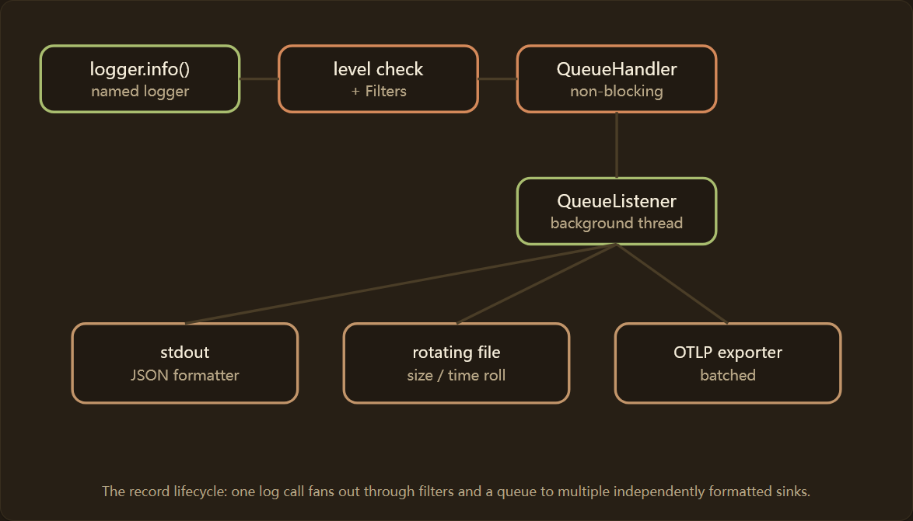
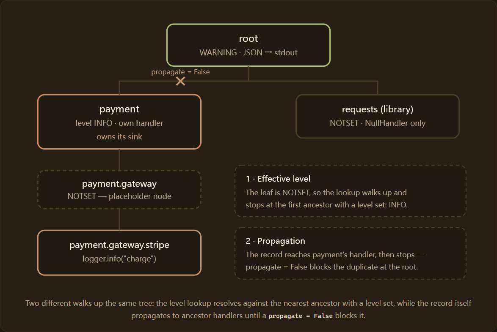
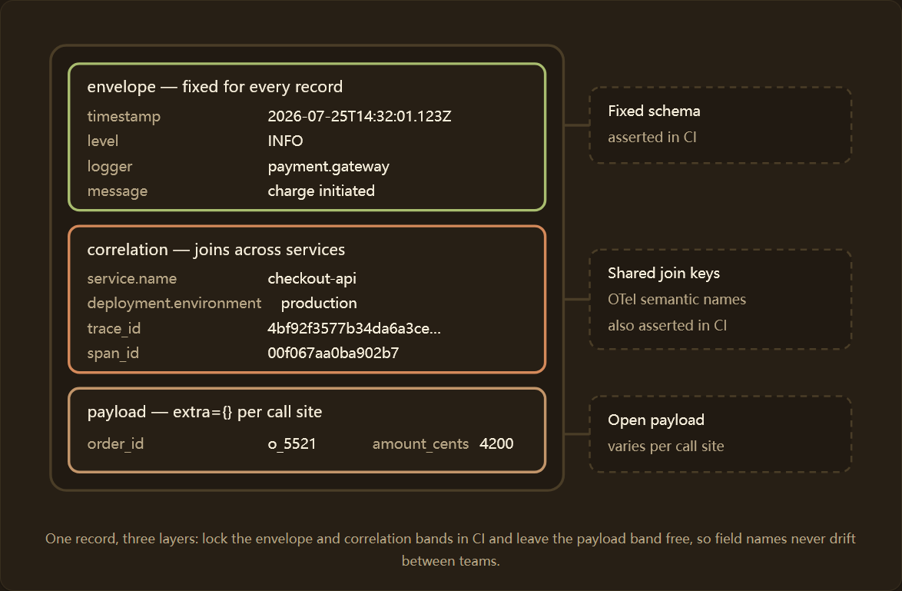
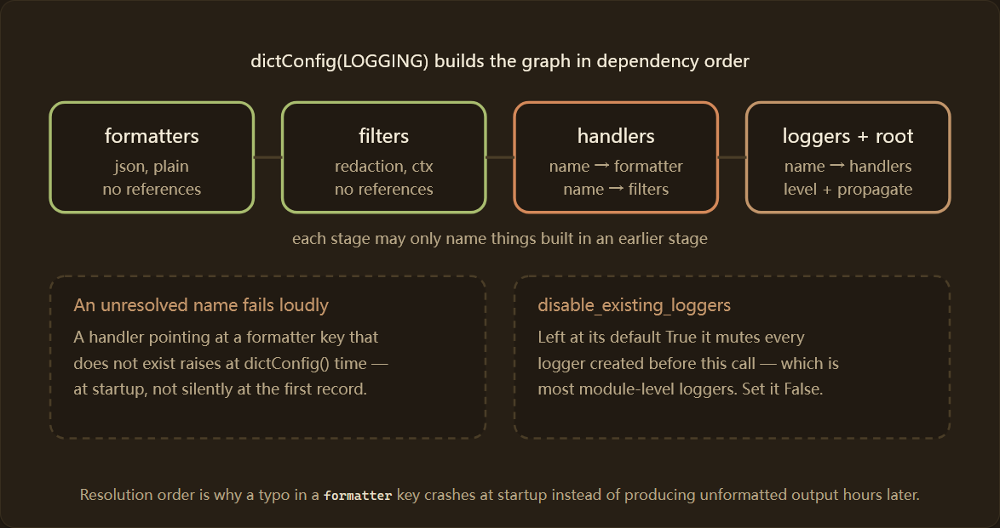
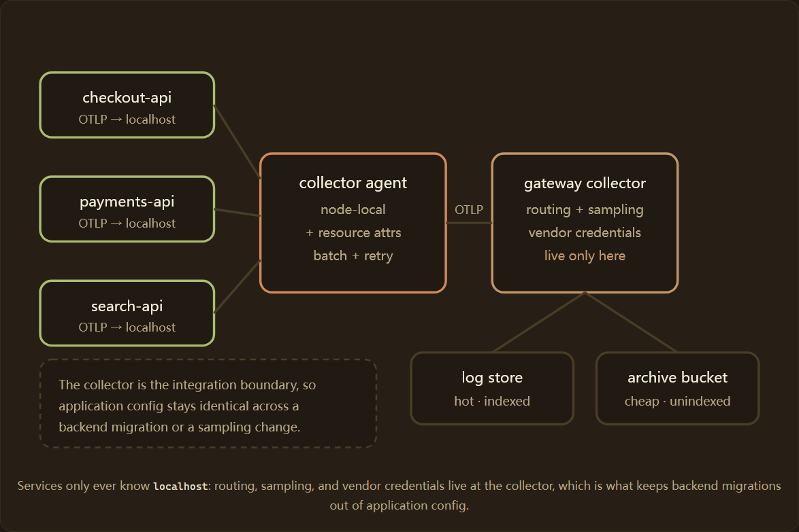
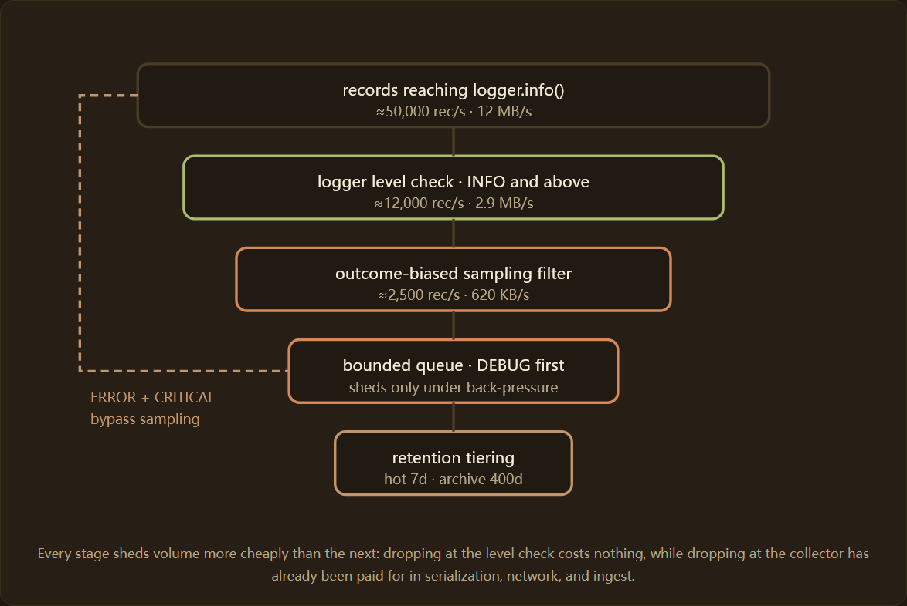
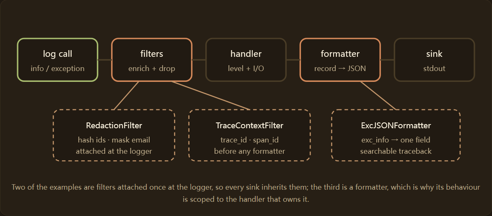

## 原文

https://python-observability.com/python-logging-fundamentals-and-structured-data/

---

## 前言

Python 的标准日志模块（logging）是所有生产服务下构建诊断的基础，而结构化的 JSON 输出，则将这些诊断信息转化为可查询的可观测数据。本指南面向负责生产环境服务的后端工程师（Backend Engineers）和 SRE（Site Reliability Engineer），涵盖日志记录器层级结构、结构化记录设计、处理程序和接收器拓扑结构、并发安全性以及 OpenTelemetry 对齐。

它重点介绍五个需要反复配置的实现领域：用于路由和非阻塞分发的处理程序架构、用于机器可解析输出的格式化程序配置、用于确保告警准确性的日志级别和严重性映射、用于跨异步边界进行请求关联的上下文变量和线程安全，以及使用 dictConfig 进行声明式、环境驱动的日志配置。



日志记录是更广泛的**可观测性技术栈**的基础，与 Python 中的分布式追踪和 OpenTelemetry 以及 Python 指标和检测功能共同构成该技术栈。日志以高基数细节回答“发生了什么以及为什么”，追踪回答“在哪里”，指标回答“有多少”。从一开始就正确设计日志层可以避免最昂贵的可观测性错误：发出后端无法查询的非结构化字符串。本页所有内容均仅使用标准库；关于与第三方替代方案的权衡，请参阅[现代 Python 日志库的深入探讨](https://python-observability.com/modern-python-logging-libraries-deep-dive/)。

关键架构原则：

- 将日志生成与 I/O 操作解耦，确保请求线程和事件循环不会因磁盘或网络写入而阻塞。
- 保持库代码中不包含处理程序配置；仅在应用程序入口点进行配置，且仅配置一次。
- 从一开始就发出机器可解析的结构化记录，并强制使用关联字段，且字段名称符合 OpenTelemetry 的语义约定。
- 显式地在线程、任务和进程边界之间传播请求范围的上下文，而不是依赖其继承。
- 以声明式方式集中配置，以便在无需修改代码或重新部署的情况下更改日志详细程度和路由。
- 在需要之前确定丢弃策略：限制每个队列，在发出边界进行采样，并优先丢弃低严重性记录。

---

## 基础架构和日志记录器层级结构

Python 的 logging 模块基于一个以点号分隔的层级式日志记录器实例树进行操作。例如，名为 payment.gateway.stripe 的日志记录器是 payment.gateway 的子实例，而 payment.gateway 又是 payment 的子实例，payment 又继承自根节点。除非被显式覆盖，否则每个日志器都会从其祖先继承有效的日志级别和处理程序集。在每个模块中调用 logging.getLogger(__name__) 会生成一个与包结构一致的命名空间，从而实现对每个子系统的控制，避免配置冲突。

日志记录器（Loggers）是进程全局单例：在进程中任何位置调用两次 getLogger("payment") 都会返回同一个对象。这使得配置树成为一个共享的、可变的配置层（configuration surface），也正是因为如此，配置必须在应用启动时只执行一次，而不是每次请求都重新推导或重新配置（re-derived）。此外，配置树采用懒加载机制——像 payment.gateway 这样的中间日志记录器会在首次请求其子节点时，作为占位符节点被创建出来，因此即使没有任何模块直接指定中间节点，层级结构也始终能够解析成功。



有效的日志级别解析值得深入理解，因为它决定了是否创建记录。当您以特定级别记录日志时，日志记录器会向上遍历日志树，直到找到显式设置了级别的祖先，并将其与自身进行比较。默认级别为 NOTSET 的日志记录器完全依赖于其父级。这意味着配置错误的根级别会静默地抑制进程中的所有记录；反之，即使根级别为 WARNING，设置为 DEBUG 的子记录器仍然会通过其自身的处理程序发出调试记录。级别检查发生在任何处理程序或过滤器运行之前，因此它是控制日志量的最经济的方式。日志级别解析规则和 OpenTelemetry 严重性转换在[日志级别和严重性映射](https://python-observability.com/python-logging-fundamentals-and-structured-data/log-levels-and-severity-mapping/)中有详细说明，而运行服务的级别布局在[如何为生产环境配置 Python 日志](https://python-observability.com/python-logging-fundamentals-and-structured-data/log-levels-and-severity-mapping/how-to-configure-python-logging-for-production/)中有端到端的详细阐述。

```python

# module: payment/gateway.py — Python 3.12 standard library only, no dependencies.
import logging

# Library code: get a named logger, never configure handlers here.
logger = logging.getLogger(__name__)  # "payment.gateway"


def charge(amount_cents: int, currency: str) -> None:
    # Structured fields travel in extra={}, never concatenated into the message.
    logger.info("charge initiated", extra={"amount_cents": amount_cents, "currency": currency})

```

预期输出：（当应用程序在根日志记录器上配置 JSON 处理程序时）

```json
{"level": "INFO", "logger": "payment.gateway", "message": "charge initiated", "amount_cents": 4200, "currency": "USD"}
```

### 日志记录作为数据模型

下游的所有组件——过滤器（filters）、格式化器（formatters）、处理器（handlers）、OpenTelemetry 桥接器——都操作同一个对象：LogRecord。将其视为事件数据模型而非实现细节，正是日志处理流水线（pipeline）的行为变得可预测的关键所在。每次发出调用时，记录都会被创建一次，它包含调用点、时间戳、严重级别、包含参数的未插值格式字符串，以及通过 extra={} 附加的任何属性。由于 msg 和 args 在调用 record.getMessage() 之前保持分离，因此当日志级别被禁用时，logger.debug("state %s", expensive) 的插值开销永远不会产生——这正是日志调用中的 f-string 会导致性能下降而非单纯的风格偏好的原因所在。

以下记录属性值得专门映射到您的结构化输出中。在格式化程序中使它们与 OpenTelemetry 语义约定保持一致，意味着相同的记录无需重新映射层即可从日志文件后端迁移到 OTLP 管道。

| 记录的属性 | 含义 | 结构化 |
| --- | --- | --- |
| created, msecs | 调用时的 Unix 时间戳 | RFC 3339 UTC timestamp |
| levelname, levelno | 严重等级的文本表示和对应的数字表示 | level, severity_number |
| name | 点号分隔的 logger 名称 | logger |
| msg, args | 格式化字符串以及懒加载参数 | message (after getMessage()) |
| exc_info | 异常类型、值、回溯信息 | exception.type, exception.stacktrace |

通过 extra={} 添加的任何东西都会成为与这些属性并列的普通属性，这就是为什么下面描述的保留名称冲突（reserved-name collision）是一个真正的危险，而不是理论上的危险。

---

## 处理器、格式化器以及过滤器的职责

这三个抽象概念经常被混淆，而区分它们的职责是构建可维护的流水线和构建难以阅读的流水线之间的关键。

处理程序（Handler）负责目标位置以及到达该位置所需的 I/O：StreamHandler 写入流，RotatingFileHandler 写入滚动文件，SocketHandler 写入 TCP 套接字。处理程序还有自己的级别，这是在日志记录器级别之后应用的第二道关卡，因此单个日志记录器可以将一条记录分发给 INFO 级别的控制台处理程序和 DEBUG 级别的文件处理程序。

格式化器（Formatter）纯粹是转换：它接收一个 LogRecord 对象并返回一个字符串，不涉及 I/O 操作，也不做任何路由决策。

过滤器（Filter）是一个谓词，返回真值表示允许记录，返回假值表示丢弃记录，而且至关重要的是它运行得足够早，因此过滤器也是在任何处理程序格式化记录之前，使用派生字段（例如跟踪标识符: trace identifier）丰富记录的正确位置。

顺序非常重要，只有日志调用通过 Logger 的有效日志级别检查之后，才会创建 LogRecord。然后经过 Logger 自己的 Filter，传播到各个 Handler，每个 Handler 有自己的有效日志级别，通过后经过 Handler 自己的 Filter，最后由该 Handler 的 Formatter 进行渲染。

由于过滤器可以就地修改记录，因此将增强过滤器附加到日志记录器会将其应用于每个下游接收器一次，而将其附加到单个处理程序则会将增强作用限定于该目标。精心选择附加点是保持编辑一致性和关联字段一致性的关键。

---

## 输出格式和结构化数据

最有效的改进莫过于将人类可读的文本转换为机器可解析的 JSON。结构化日志将日志行转换为可查询的事件：例如，对于自由文本来说，`level:ERROR AND service.name:checkout AND amount_cents:>10000` 这样的语句几乎不可能实现，但对于结构化记录来说却轻而易举。使用自定义的 `logging.Formatter` 将字典序列化为 JSON 是目前最基本的实现方式；字段模式至关重要，完整的实现方式将在[使用 Python 标准库的结构化日志记录文档](https://python-observability.com/python-logging-fundamentals-and-structured-data/formatter-configuration/structured-logging-with-python-standard-library/)中详细介绍。

精心设计的结构化数据策略将记录视为具有三个层次的类型化事件。

第一层是每个记录都包含的固定信息：时间戳、级别、日志记录器名称和消息。

第二层是关联层，包含连接不同服务记录的标识符：`service.name`、`deployment.environment`、`deployment.version` 以及请求或跟踪 ID。

第三层是通过 `extra={}` 传递的事件特定有效负载，该负载会因调用点而异。

明确定义这些层级，可以让你在持续集成 (CI) 中验证封装层和关联层，同时保持有效负载开放，并避免常见的用户 ID 不一致的情况，即一个团队的 userId 对应另一个团队的 user_id。从一开始就将字段名称与 OpenTelemetry 语义约定保持一致，这样相同的记录就能在 OTLP 桥接器中流畅传输而无需重新映射；格式化程序的编写和序列化器的选择机制在[格式化程序配置](https://python-observability.com/python-logging-fundamentals-and-structured-data/formatter-configuration/)部分有详细说明，而关联层则专门介绍了如何将[Trace ID 添加到日志记录](https://python-observability.com/python-logging-fundamentals-and-structured-data/formatter-configuration/adding-trace-ids-to-log-records/)中。



时间戳需要明确指定。默认的 %(asctime)s 会渲染本地时间，并以逗号分隔毫秒字段，但任何数据摄取管道都无法原生解析这种格式，一旦容器运行在不同的时区，这种格式就会变得模糊不清。因此，应使用格式化程序调用 `datetime.fromtimestamp(record.created, tz=timezone.utc)`，以 RFC 3339 格式（例如 2026-07-25T14:32:01.123Z）输出 UTC 时间。这是所有后端都会建立索引并进行查询排序的唯一字段，因此任何错误都会降低后续所有调查的准确性。

在序列化之前，应去除敏感有效负载和个人身份信息 (PII)。对用户标识符实施确定性哈希，以便在不存储原始值的情况下保持事件的可连接性。切勿记录原始身份验证令牌、完整的支付卡号或未屏蔽的财务数据。数据脱敏处理应在格式化程序之前运行的 `logging.Filter` 中进行，以便该规则在所有接收器上统一执行。

标准库日志记录中存在一个不易察觉的正确性陷阱，结构化日志输出依赖于对这个陷阱的正确处理：`extra={}` 字典键会成为 `LogRecord` 的属性，但它们会与 `message`、`args`、`levelname` 和 `name` 等保留记录字段发生致命冲突。传递 `extra={"message": ...}` 会在日志输出时引发 `KeyError`（KeyError: "Attempt to overwrite 'message' in LogRecord"）。为了完全避免与保留名称冲突，请为自定义字段命名空间，或将它们嵌套在单个键下，例如 `extra={"context": {...}}`。一个健壮的 JSON 格式化程序还会使用 `json.dumps(..., default=str)` 来防御性地处理不可序列化的值，因为通过 `extra` 附加的任意对象否则会在格式化程序内部引发异常，并且根据 `logging.raiseExceptions` 的触发情况，可能会导致调用崩溃或静默地丢弃该记录。

序列化成本是标准库暴露其不足之处的唯一地方。除了最简单的类型之外，`json.dumps` 几乎完全是纯 Python 实现，而每秒处理数万条记录时，其成本就会变得非常可观。两种缓解措施可以很好地结合起来：一是将序列化器完全从请求路径中移除（如下所述的队列模式），二是使用速度更快的编码器，但保持相同的格式化接口。如果您的团队更倾向于采用预编译好的库，那么可以参考 [structlog、Loguru 和标准库日志记录的对比](https://python-observability.com/modern-python-logging-libraries-deep-dive/structlog-vs-loguru-vs-stdlib-logging/)，了解各自的优缺点。

## 日志记录策略与配置

静态的、硬编码的日志记录配置会阻碍事件分类。使用 `logging.config.dictConfig()` 以声明式的方式集中配置，它会在一个字典中描述整个日志记录器、处理程序、格式化程序和过滤器之间的关系。这是生产服务的规范方法，在[日志记录配置和 dictConfig 文档](https://python-observability.com/python-logging-fundamentals-and-structured-data/logging-configuration-and-dictconfig/)中进行了端到端的介绍，并在[使用 dictConfig 配置日志记录的文档](https://python-observability.com/python-logging-fundamentals-and-structured-data/logging-configuration-and-dictconfig/configuring-logging-with-dictconfig/)中提供了带注释的参考配置。字典配置可以从 YAML 或环境变量设置中加载，进行版本控制，并在启动时原子性地应用。

dictConfig 不仅仅是一个便捷的包装器。它会按照依赖顺序解析整个关系图——首先是格式化程序，然后是过滤器，接着是按名称引用它们的处理程序，最后是引用处理程序的日志记录器——因此，即使处理程序的格式化程序键中存在一个拼写错误，也会在启动时发出明显的错误，而不是在之后默默地产生未格式化的输出。

disable_existing_loggers 字段是最常让团队感到意外的字段：如果保留默认值 `True`，它会禁用 `dictConfig` 运行之前创建的所有日志记录器，这会导致之前导入的任何模块级日志记录器都被静默禁用。生产服务几乎总是希望将其设置为 `False`。`ext://` 前缀允许字典引用诸如 `ext://sys.stdout` 之类的活动对象而无需导入它们，从而保持配置的声明性和可序列化性。



一套经得起生产环境实际考验的启动（bootstrap）流程并不复杂，而且值得严格按照顺序执行。第一步，先确定 LogRecord 的数据结构——包括 envelope（信封层）、correlation（关联信息层）和 payload（业务载荷层），因为后续的每一个决策都会依赖这些字段名。第二步，用一个 dictConfig 字典表达完整的日志处理图，并将 disable_existing_loggers 设置为 False；然后在应用入口处、任何请求开始处理之前，准确地调用一次配置函数。第三步，把 enrichment（字段补充）和 redaction（脱敏）Filter 挂载到 Logger 上，而不是分别挂载到各个 Handler 上，这样每个输出目标都会继承完全一致的字段。第四步，让 QueueHandler 成为应用 Logger 上唯一的 Handler，并让 QueueListener 负责管理真正的具体输出目标。第五步，注册关闭流程——在框架的 shutdown hook 中调用 listener.stop()，以及执行任何 exporter 的 flush 操作，因为程序退出时仍然缓存在队列中的那些日志记录，很可能正是你在事后复盘故障（postmortem）时最希望拥有的日志。

```python
# Python 3.12 standard library only — dictConfig ships with the interpreter.
import logging.config

LOGGING = {
    "version": 1,
    "disable_existing_loggers": False,  # keep module loggers imported before this call
    "formatters": {
        "json": {"format": '{"level":"%(levelname)s","logger":"%(name)s","msg":"%(message)s"}'},
    },
    "handlers": {
        # ext:// resolves the live object without importing it here.
        "stdout": {"class": "logging.StreamHandler", "formatter": "json", "stream": "ext://sys.stdout"},
    },
    "loggers": {
        # propagate=False because this logger owns its handler.
        "payment": {"level": "INFO", "handlers": ["stdout"], "propagate": False},
    },
    "root": {"level": "WARNING", "handlers": ["stdout"]},
}

logging.config.dictConfig(LOGGING)
logging.getLogger("payment.gateway").info("configured")
```

在意外事件发生期间，您通常需要在不重启子系统的情况下提高某个子系统的日志详细程度。您可以从受保护的管理端点调用 `logging.getLogger("payment").setLevel(logging.DEBUG)`，将其范围限定到特定租户或跟踪标识符，并使用定时器自动回滚以防止存储不受控制地增长。任何此类端点都应置于严格的身份验证之后，并记录每次配置更改以符合审计要求。

对于耗时的序列化操作，请在热路径上使用 `logger.isEnabledFor(level)` 检查进行保护。您选择的级别映射直接决定了警报的准确性，因此请将 Python 的默认值（DEBUG=10、INFO=20、WARNING=30、ERROR=40、CRITICAL=50）与日志级别和严重性映射中描述的警报约定保持一致。除非您拥有到每个下游系统的映射，否则请克制住创建自定义数值级别（例如 TRACE=5 或 NOTICE=25）的冲动——任何导出器都无法识别的自定义级别会坍缩到最近的标准频段，并悄悄地扭曲警报路由和仪表板。

---

## 异步和并发模式

标准日志调用是线程安全的：模块级锁会序列化处理程序的发出。然而，它们并不感知异步，并且自身不携带请求范围的上下文。正确的模式是将每个请求的元数据存储在 `contextvars.ContextVar` 对象中，并在发出日志时通过过滤器读取它们。上下文变量可以在任务内的 `await` 边界之间正确传播，并在创建新任务时被复制，这使得它们成为 asyncio 服务的理想原语。安全上下文传播的完整处理体现在上下文变量和线程安全中，而请求范围模式则具体应用于使用 `contextvars` 进行请求跟踪。

处理程序执行的序列化和 I/O 操作绝不能运行在事件循环或请求工作线程上。使用 `QueueHandler` 包装具体的处理程序，`QueueHandler` 只负责将记录入队，并通过专用的 `QueueListener` 消费者线程来清空队列。这样可以避免调用路径上的格式化和写入延迟。本教程专门介绍如何使用 QueueHandler 实现[非阻塞日志记录](https://python-observability.com/python-logging-fundamentals-and-structured-data/handler-architecture/non-blocking-logging-with-queuehandler/)。在跨越线程边界之前，务必显式复制上下文变量，因为工作线程不会继承创建任务的上下文。

在 asyncio 环境下，队列的重要性还有更深层次的原因：在事件处理程序中，对慢速文件或套接字的一次同步写入会阻塞整个事件循环，而不仅仅是记录日志的协程，因为循环是在单个线程上协作运行的。因此，哪怕 5 毫秒的磁盘延迟都会导致循环正在处理的所有并发请求停滞。将 I/O 操作移至 QueueListener 线程可以将生产者的开销限制在非阻塞入队操作的范围内，并将循环完全隔离于接收器的延迟之外。

进程边界比线程边界更容易打破既定假设。在 gunicorn、uvicorn --workers 或 multiprocessing.Pool 中，每个 worker 都是一个独立的解释器，拥有自己的日志树、处理程序和文件描述符。两个进程使用 RotatingFileHandler 向同一个文件追加内容最终会导致滚动更新失败，因为重命名操作没有协调。安全的拓扑结构是：每个进程使用一个输出接收器（使用不同的文件名，或者直接使用 stdout，由平台收集每个容器的输出流）；或者使用 multiprocessing.Queue，并由一个监听进程独占该输出接收器。上下文变量也不会在 fork 之间以任何有效的方式继承，因此 worker 初始化必须显式地重新建立资源属性，例如 service.instance.id。这些模式在[multiprocessing 的线程安全日志记录](https://python-observability.com/python-logging-fundamentals-and-structured-data/context-variables-and-thread-safety/thread-safe-logging-in-multiprocessing/)中得到了解决。

```python
# Python 3.12 standard library only — asyncio, contextvars, logging.handlers.
import asyncio
import json
import logging
import queue
from contextvars import ContextVar
from logging.handlers import QueueHandler, QueueListener

request_id_ctx: ContextVar[str | None] = ContextVar("request_id", default=None)


class RequestContextFilter(logging.Filter):
    """Attach request-scoped context read from contextvars to each record."""
    def filter(self, record: logging.LogRecord) -> bool:
        record.request_id = request_id_ctx.get()
        return True


class JSONFormatter(logging.Formatter):
    def format(self, record: logging.LogRecord) -> str:
        payload = {
            "timestamp": self.formatTime(record, self.datefmt),
            "level": record.levelname,
            "message": record.getMessage(),
            "request_id": getattr(record, "request_id", None),
            "logger": record.name,
        }
        if record.exc_info and record.exc_info[0] is not None:
            payload["exception"] = self.formatException(record.exc_info)
        return json.dumps(payload, default=str)


def setup_async_logger() -> tuple[logging.Logger, QueueListener]:
    log_queue: queue.Queue = queue.Queue(maxsize=10000)  # bounded to cap memory
    console = logging.StreamHandler()
    console.setFormatter(JSONFormatter())
    console.addFilter(RequestContextFilter())

    listener = QueueListener(log_queue, console, respect_handler_level=True)
    listener.start()  # background drain thread

    logger = logging.getLogger("app")
    logger.setLevel(logging.INFO)
    logger.addHandler(QueueHandler(log_queue))  # non-blocking enqueue only
    logger.propagate = False
    return logger, listener


async def process_request(logger: logging.Logger) -> None:
    token = request_id_ctx.set("req-8f3a-9c2b")
    try:
        logger.info("Processing payment workflow")
        await asyncio.sleep(0.01)
    finally:
        request_id_ctx.reset(token)


if __name__ == "__main__":
    app_logger, listener = setup_async_logger()
    asyncio.run(process_request(app_logger))
    listener.stop()  # flush and join the drain thread on shutdown
```

Expected Output: (Python 3.12, stdlib logging)

```json
{"timestamp": "2026-06-19 14:32:01,123", "level": "INFO", "message": "Processing payment workflow", "request_id": "req-8f3a-9c2b", "logger": "app"}
```

## 网络和协议集成

只有当日志到达后端时，它们才能成为可观测数据。在容器化部署中，云原生惯例是将 JSON 写入 sys.stdout，并让平台的收集器跟踪容器日志。禁用临时容器中的直接文件处理器；Pod 内部的 RotatingFileHandler 会与编排器自身的日志捕获竞争，并使轮换变得复杂。如果确实需要文件接收器（例如主机代理、虚拟机部署或具有自身保留规则的审计跟踪），则持久性和锁定问题已在[Python日志轮换的最佳实践](https://python-observability.com/python-logging-fundamentals-and-structured-data/handler-architecture/best-practices-for-log-rotation-in-python/)中得到解决。

要将 Python 日志桥接到 OpenTelemetry 管道，请使用 OTel Logs Bridge API。它将每个 LogRecord 映射到 OTel 语义约定，附加来自当前 span 上下文的活动 trace_id 和 span_id，并通过 OTLP gRPC 或 HTTP 导出到收集器。记录应由 BatchLogRecordProcessor 进行批量处理，以最大限度地减少网络往返次数，并且 W3C 跟踪上下文字段必须与跟踪层发出的跟踪标识符保持一致——与上下文传播和行李中描述的标识符相同。



将收集器视为集成边界，而不是将每个服务直接连接到供应商后端。服务将 OTLP 数据导出到本地收集器代理，收集器负责数据丰富和批处理，并且只有收集器持有供应商凭据和路由规则。这样可以确保应用程序的日志配置在后端迁移后保持稳定，并允许您集中更改采样或目标位置。

日志的级别严重性映射在此边界处至关重要，因为三种编号方案在此交汇。

Python 使用 10 到 50 的严重性等级，OpenTelemetry 使用 1 到 24 的 severity_number 等级，而 syslog 则使用 0 到 7 的等级（数值越低，严重性越高）。

桥接器会处理标准转换，但您定义的任何自定义级别都需要显式映射，否则它会被合并到最近的标准等级，从而导致告警失真。syslog 的映射方向具体是在将 Python 日志级别映射到 syslog 时确定的。

| Python level | levelno | OTel secerity_number | syslog severity | Typical production routing |
| --- | --- | --- | --- | --- |
| DEBUG | 10 | 5 | 7(debug) | 默认关闭；排查问题时针对特定子系统开启 |
| INFO | 20 | 9 | 6(informational) | 采样；占日志接入量的大多数 |
| WARNING | 30 | 13 | 4(warning) | 全量保留；主要用于 Dashboard |
| ERROR | 40 | 17 | 3(error) | 全量保留；如果错误率超过预算则触发 Pager |
| CRITICAL | 50 | 21 | 2(critical) | 全量保留；始终触发 Pager |

```python
# pip install "opentelemetry-sdk>=1.30.0,<2.0.0" \
#   "opentelemetry-instrumentation-logging>=0.51b0,<1.0.0"
import logging
from opentelemetry import trace
from opentelemetry.sdk.trace import TracerProvider
from opentelemetry.sdk._logs import LoggerProvider
from opentelemetry.sdk._logs.export import BatchLogRecordProcessor, ConsoleLogExporter
from opentelemetry.instrumentation.logging import LoggingInstrumentor

# Initialize the OTel providers once at startup, after any worker fork.
trace.set_tracer_provider(TracerProvider())
logger_provider = LoggerProvider()
# Batching amortizes the network round-trip across many records.
logger_provider.add_log_record_processor(BatchLogRecordProcessor(ConsoleLogExporter()))

# Bridge stdlib logging into the OTel Logs pipeline and inject trace ids.
LoggingInstrumentor().instrument(set_logging_format=True)

logger = logging.getLogger(__name__)
logger.setLevel(logging.INFO)

with trace.get_tracer("app").start_as_current_span("checkout_flow"):
    logger.info("Cart validation complete", extra={"cart_id": "c_9921"})
```

Expected Output: (representative OTLP log record, opentelemetry-sdk>=1.30.0,<2.0.0)

```json
{
  "body": "Cart validation complete",
  "severity_number": 9,
  "severity_text": "INFO",
  "attributes": {
    "cart_id": "c_9921",
    "code.function": "<module>",
    "trace_id": "0x8a3f3c12d4bf92f3577b34da6a3ce929",
    "span_id": "0x9b2ea41f00f067aa"
  }
}
```

---

## 数据量以及成本控制

日志量是可观测性成本的主要驱动因素，而其中大部分日志量都是 DEBUG 和 INFO 噪声，实际上没有人会去查询。生产环境默认将日志级别设置为 INFO 或 WARNING，并在需要时针对性地提高日志级别。对于高频事件，应当在日志产生的边界处进行采样，而不是等日志进入下游系统后再丢弃，因为到了下游，你已经为这些日志付出了采集和接入成本。

当有界队列在接收器中断期间饱和时，应首先丢弃 DEBUG 记录，以保留 ERROR 和 CRITICAL 级别的可见性。这种权衡优先考虑事件响应而非诊断完整性，并防止日志子系统因内存不足而终止服务。对于磁盘支持的接收器，应通过轮换来限制保留时间。最后，从记录模式中删除冗余字段。每个字段都会乘以事件速率，因此，对于每秒 50,000 个事件的服务，一个 200 字节的字段在压缩前每天大约会占用 800 GB 的空间。



成本控制（Cost control）也是一个采样设计问题，而不仅仅是级别阈值问题。对 INFO 类型进行 1% 的固定采样会丢弃你真正需要的那个慢请求；而结果偏向采样（始终保留带有错误标志或高延迟属性的记录）则可以在丢弃大部分数据的同时保留信号。在输出边界处使用过滤器来实现这一决策，这样被丢弃的记录就不会产生序列化成本，不会进入队列，也不会到达收集器。非阻塞队列及其丢弃策略是采样后剩余数据量的第二道安全网，详见[使用 QueueHandler 进行非阻塞日志记录](https://python-observability.com/python-logging-fundamentals-and-structured-data/handler-architecture/non-blocking-logging-with-queuehandler/)部分。

保留策略分层（Retention tiering）是最后一个可以发挥作用的杠杆，也是大多数团队没有真正利用起来的一个手段。并不是每条日志都需要保存相同的时间：保留 7 天的热数据、并进行完整索引，已经足以覆盖绝大多数故障排查场景；而合规和审计类记录则应该放到廉价的对象存储中，保留更长时间，并且完全不建立索引。

应该在 Collector 这一层，根据日志记录中的某个字段来进行路由——例如 audit: true 属性，或者使用专门的 logger name——而不是在应用程序中做路由，这样日志保留策略就仍然属于平台层面的决策。

如果某个信号本质上是一个“计数器”而不是一个“事件”，那么就应该彻底把它从日志中移出去：例如，每个请求打印一条 "cache hit" 日志，在 50,000 requests/s 的情况下，这实际上应该是一个 metric，而不是 log；使用 metric 表达它，成本会低几个数量级。

---

## 生产代码示例

以下三个示例并非独立的配方：每个配方都插入到同一记录管道的不同阶段，因此它们可以相互组合而不相互影响。



### 使用可重用过滤器对个人身份信息 (PII) 进行脱敏处理

强制执行数据保护规则的最佳方式是使用一个在所有处理程序中共享的 logging.Filter。它会在任何格式化程序之前运行，因此无论目标位置如何，脱敏处理都能统一应用。

```python
# Python 3.12 standard library only — hashlib, logging, re.
import hashlib
import logging
import re

EMAIL = re.compile(r"[\w.+-]+@[\w-]+\.[\w.-]+")


class RedactionFilter(logging.Filter):
    """Hash user ids and mask emails before any handler formats the record."""
    def filter(self, record: logging.LogRecord) -> bool:
        user_id = getattr(record, "user_id", None)
        if user_id is not None:
            # Deterministic hash keeps events joinable without storing the raw id.
            record.user_id = hashlib.sha256(str(user_id).encode()).hexdigest()[:16]
        record.msg = EMAIL.sub("[redacted-email]", str(record.msg))
        return True


logging.basicConfig(level=logging.INFO, format="%(levelname)s user=%(user_id)s %(message)s")
log = logging.getLogger("auth")
log.addFilter(RedactionFilter())  # attached at the logger, so every sink inherits it
log.info("login from alice@example.com", extra={"user_id": 100237})
```

### 将日志与活动跟踪关联起来

当日志记录在 span 内运行时，注入活动跟踪和 span 标识符可以让后端将日志行连接到生成该日志行的确切请求。

```python
# pip install "opentelemetry-api>=1.30.0,<2.0.0" "opentelemetry-sdk>=1.30.0,<2.0.0"
import logging
from opentelemetry import trace


class TraceContextFilter(logging.Filter):
    def filter(self, record: logging.LogRecord) -> bool:
        # Zero-filled ids keep the field present when no span is active.
        ctx = trace.get_current_span().get_span_context()
        record.trace_id = format(ctx.trace_id, "032x") if ctx.is_valid else "0" * 32
        record.span_id = format(ctx.span_id, "016x") if ctx.is_valid else "0" * 16
        return True


logging.basicConfig(
    level=logging.INFO,
    format='{"msg":"%(message)s","trace_id":"%(trace_id)s","span_id":"%(span_id)s"}',
)
log = logging.getLogger("checkout")
log.addFilter(TraceContextFilter())

with trace.get_tracer("app").start_as_current_span("place_order"):
    log.info("order accepted")
```

Expected Output: (with a configured TracerProvider)

```json
{"msg":"order accepted","trace_id":"4bf92f3577b34da6a3ce929d0e0e4736","span_id":"00f067aa0ba902b7"}
```

### 使用结构化回溯捕获异常

生产环境故障调试依赖于以结构化记录形式而非裸露的 stderr 转储形式传入的异常。在 except 代码块中，`logger.exception` 会附加 `exc_info`，而 JSON 格式化程序会将回溯信息渲染成一个可查询的字段，这样就可以在堆栈信息及其关联标识符旁边进行搜索。

```python
# Python 3.12 standard library only — json, logging, sys.
import json
import logging
import sys


class ExcJSONFormatter(logging.Formatter):
    def format(self, record: logging.LogRecord) -> str:
        payload = {
            "level": record.levelname,
            "logger": record.name,
            "message": record.getMessage(),
        }
        if record.exc_info:
            # Render the traceback into one field instead of multiple stderr lines.
            payload["exception"] = self.formatException(record.exc_info)
        return json.dumps(payload)


handler = logging.StreamHandler(sys.stdout)
handler.setFormatter(ExcJSONFormatter())
log = logging.getLogger("orders")
log.setLevel(logging.INFO)
log.addHandler(handler)
log.propagate = False  # this logger owns its handler, so do not re-emit at the root


def settle(order_id: str) -> None:
    try:
        raise ValueError("gateway declined")
    except ValueError:
        # exc_info=True is implied by logger.exception.
        log.exception("settlement failed", extra={"order_id": order_id})


if __name__ == "__main__":
    settle("o_5521")
```

Expected Output: (single JSON record; traceback abbreviated)

```json
{"level": "ERROR", "logger": "orders", "message": "settlement failed", "exception": "Traceback (most recent call last):\n  File \"app.py\", line 27, in settle\n    raise ValueError(\"gateway declined\")\nValueError: gateway declined"}
```

---

## 常见错误

- 使用 print() 函数进行生产诊断。它完全绕过了日志管道，因此没有级别过滤、结构化格式化，也无法进行集中式聚合。每个诊断语句都应该通过指定的日志记录器进行记录。
- 同步处理程序中的 I/O 阻塞。在请求线程上进行的文件或网络写入操作，在持续负载下会导致 P99 延迟峰值，并且在事件循环中，它们会阻塞所有并发请求。使用 QueueHandler 包装具体的处理程序，并从 QueueListener 后台线程中释放队列。
- 使用字符串拼接或 f-string 代替结构化字段。构建类似 f"user {uid} failed" 的消息会使下游解析器无法正常工作，即使禁用该级别，也会产生插值开销。通过 extra={} 传递结构化数据，并使用 JSON 格式化程序进行序列化，以确保字段可查询。
- 缺少关联标识符。如果每条记录都没有请求或跟踪 ID，则无法跨服务边界合并日志，分布式调试将变成猜测。
- 在库代码内部配置日志记录。调用 basicConfig() 或在导入的包中附加处理程序会劫持宿主应用程序的输出，并产生重复或错误路由的日志行。库负责输出；应用程序负责配置。
- 如果将拥有处理程序的日志记录器的 propagate 设置为 True，则子记录器会发出一次记录，根记录器又会发出一次记录，导致记录量翻倍，并破坏任何基于记录的指标。
- 保留 `disable_existing_loggers` 的默认值。如果调用 `dictConfig` 时该标志设置为 `True`，则会静默禁用配置运行之前创建的所有日志记录器，这通常意味着启动时导入的每个模块级日志记录器。对于应用程序服务，请将其设置为 `False`。
- 关闭时不刷新日志。如果进程在未调用 `listener.stop()` 并刷新 OTLP 日志记录处理器的情况下退出，则会丢弃导致其终止的故障期间所产生的所有记录。请将这两项操作都集成到框架的关闭钩子中。

---

## 相关阅读

- [Handler 架构](https://python-observability.com/python-logging-fundamentals-and-structured-data/handler-architecture/)：路由、多接收器扇出、基于队列的调度和轮换。
- [Formatter 配置](https://python-observability.com/python-logging-fundamentals-and-structured-data/formatter-configuration/)：编写 JSON 格式化程序、字段模式和跟踪 ID 注入。
- [日志级别和严重等级映射](https://python-observability.com/python-logging-fundamentals-and-structured-data/log-levels-and-severity-mapping/)：有效级别解析以及 OTel 和 syslog 转换。
- [上下文变量和线程安全](https://python-observability.com/python-logging-fundamentals-and-structured-data/context-variables-and-thread-safety/)：跨任务、线程和进程请求上下文。
- [日志配置和 dictConfig](https://python-observability.com/python-logging-fundamentals-and-structured-data/logging-configuration-and-dictconfig/)：启动时应用声明式、环境驱动的配置。
- [异常和回溯信息的日志](https://python-observability.com/python-logging-fundamentals-and-structured-data/exception-and-traceback-logging/)：exc_info、链式异常、捕获逃逸内容的钩子以及编辑。
- [Python日志性能和开销](https://python-observability.com/python-logging-fundamentals-and-structured-data/logging-performance-and-overhead/)：日志调用实际成本是多少，以及如何在不中断服务的情况下减少调用量。
- [现代Python日志库深度挖掘](https://python-observability.com/modern-python-logging-libraries-deep-dive/)：structlog 和 Loguru 会改变这些权衡取舍。
- [Python中的分布式追踪和OpenTelemetry](https://python-observability.com/distributed-tracing-and-opentelemetry-in-python/)：日志记录所关联的跟踪标识符。
- [Python指标和监测](https://python-observability.com/python-metrics-and-instrumentation/)：当某个事件实际上是一个 Counter 时，应该关注的信号。

---

## 常见问题

问：为什么生产环境中的 Python 服务应该使用结构化日志而不是纯文本日志？
答：结构化 JSON 支持跨分布式系统的自动解析、高效查询和可靠关联。这消除了手动日志扫描和脆弱的正则表达式解析器，从而缩短了事件发生时的平均解决时间。

问：如何在不锁定供应商的情况下将 Python 日志记录与 OpenTelemetry 集成？
答：OpenTelemetry 提供了一个标准化的日志桥接 API，该 API 将 Python 日志记录映射到 OTel 语义约定。记录可以通过 OTLP 协议导出到任何兼容的后端，因此您可以轻松切换供应商而无需重写检测代码。

问：在高吞吐量服务中，JSON 格式化会带来多大的性能开销？
答：将序列化延迟到后台线程进行时，开销极小。使用 QueueHandler 和 QueueListener 包装具体的处理程序，这样调用线程就不会因格式化或 I/O 操作而阻塞；并使用 isEnabledFor 来保护热点路径上的高开销日志调用。

问：如何在不泄露个人身份信息的情况下安全地记录敏感数据？
答：实现一个日志过滤器，在序列化之前对敏感字段进行脱敏或确定性哈希处理，并在格式化层验证模式合规性。切勿记录原始身份验证令牌、完整的支付卡号或未屏蔽的个人标识符。

问：库是否需要配置根日志记录器？
答：不需要。库代码应该只获取指定的日志记录器并发出记录，而将处理程序和级别配置留给应用程序。从库中配置根日志记录器会导致重复输出，并给下游使用者带来不便。

问：处理程序（Handler）、格式化程序（Formatter）和过滤器（Filter）之间有什么区别？
答：处理程序决定记录的去向并负责 I/O 操作；格式化程序决定如何将记录序列化为文本或 JSON；过滤器决定记录是否通过，并可添加额外字段来丰富记录。记录的流向为：日志记录器 - 过滤器 - 处理程序 - 格式化程序 - 接收器

问：在高并发情况下，GIL 是否会使日志记录成为吞吐量瓶颈？
答：模块级锁会串行化处理程序的日志输出，因此每个记录日志的线程都会争用同一个锁，而此时处理程序正在执行写入操作。这种争用仅在锁内的工作速度较慢时才会产生影响，这也是为什么把格式化和 I/O 操作要放到 QueueHandler 后台处理，让调用日志的线程只需要执行一次非阻塞的入队操作，就可以避免日志系统成为吞吐量的瓶颈。
