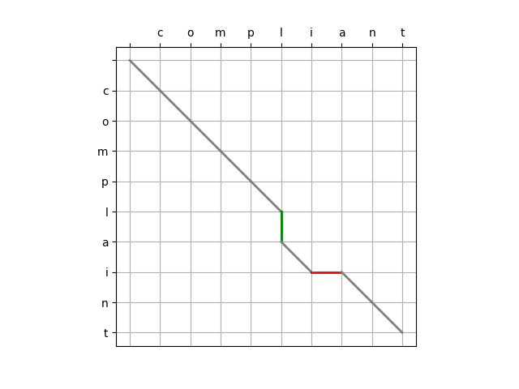

## 目录

[TOC]

---

## 前言

最近在编写一个小工具，文本对比工具，类似于 git diff 或者下面这些网站

- https://text-compare.com/zh-hans/
- https://www.jq22.com/textDifference
- https://www.diffchecker.com/zh-Hans/

但是 git diff 命令行没有网页看起来方便，而网站的话广告又太多了，所以就打算写一个客户端的小工具软件。

文本比较涉及到的一个著名的算法就是 Myers 算法，由 Eugene W. Myers 在 1986 年发表。本文详细介绍下该算法的原理和实现。

---

## 差异

对于两个文本有什么差异之前，我们必须要稍微定义下，什么是二者的差异。

在 Myers 算法中，差异大概可以这么描述：一个文本（序列 A）转换成另一个文本（序列 B）所需要的最少的编辑操作。

算法中对于编辑操作作了限制，允许三种操作：

- 删除，delete，从序列 A 中删除元素
- 插入，insert，向序列 A 中插入新的元素
- 匹配，match，序列 A 和序列 B 当前的元素相同时，无需操作，向前移动，检查下一个元素

算法没有定义替换的概念，替换被视为（删除+插入）。

举个简单的例子，假设序列 A = compliant，序列 B = complaint，从序列 A 转换到序列 B 这个过程，所用的所有操作就是我们所说的“差异”。

---

## 转换

A = compliant

B = complaint

在仅允许 delete，insert，match 三个操作的情况下，有多少种转换方式？

### 第一种

最简单直接的方式就是，对 A 的每一个字符执行 delete 操作，变成空字符串后，在执行 insert 操作，变成 B。

### 第二种

A 和 B 的前 5 个字符（compl）相等，所以可以对前 5 个字符执行 match 操作。

从第 6 个字符开始不一样了，所以我们可以删除第 6 及其之后的字符，然后再执行 insert 操作，变成 B。

### 第三种

和第二种类似，前面相同的字符执行 match 操作。

A(6)=i，B(6)=a，所以 A 在第 6 个字符插入 a，此时，A 变成 complaiant。

A(7)=i，B(7)=i，match。

A(8)=a，B(8)=n，执行删除操作，删除 A 的第 8 个字符，此时，A 变成 complaint。

A(9)=t，B(9)=t，match。

### 第四种

前面相同的字符执行 match 操作。

A(6)=i，B(6)=a，执行删除操作，此时，A 变成 complant。

A(6)=a，B(6)=a，match。

A(7)=空，B(7)=i，执行插入操作，插入字符 i，此时，A 变成 complaint。

A(8)=n，B(8)=n，match。

A(9)=t，B(9)=t，match。

可以看到，不止一种方式可以使用这三个操作，把序列 A 转换成序列 B，每一种的操作方式和步骤不尽相同，所以会存在好的解法和糟糕的解法，我们需要一种度量方式，来衡量执行步骤的好坏。

---

## 衡量标准

Myers 算法使用的标准是**最短编辑距离**，就是使用最少的编辑步骤完成转换，即最少的插入和删除次数。

---

## 编辑图

Myers 算法巧妙的将比较序列 A 和序列 B 差异的问题，转换成了序列 A 变成序列 B 的最少需要多少编辑步骤可以完成的问题。

同时，它使用了一个有向无环编辑图来表示序列 A 是如何变成序列 B 的，为了形成编辑图，Myers 沿 x 轴从左到右排列序列 A，然后，沿 y 轴从上到下排列序列 B，并从它们投影出水平和垂直的正交网格。从左上角开始，目标是走到右下角，左上角到右下角的每一次移动都对应于序列 A 上的编辑指令。

移动方向对应的编辑命令如下：

1. 水平向右移动表示从序列 A 中删除元素
2. 垂直移动表示向序列 A 插入新元素
3. 如果序列 A 和序列 B 元素等效，则允许对角线移动。

以图片的形式，展示以下上一节的四个转换方式。

方式一：

方式二：

方式三：

方式四：

---

## 参考

1. http://www.xmailserver.org/diff2.pdf
2. https://www.nathaniel.ai/myers-diff/
3. https://cloud.tencent.com/developer/article/2367282