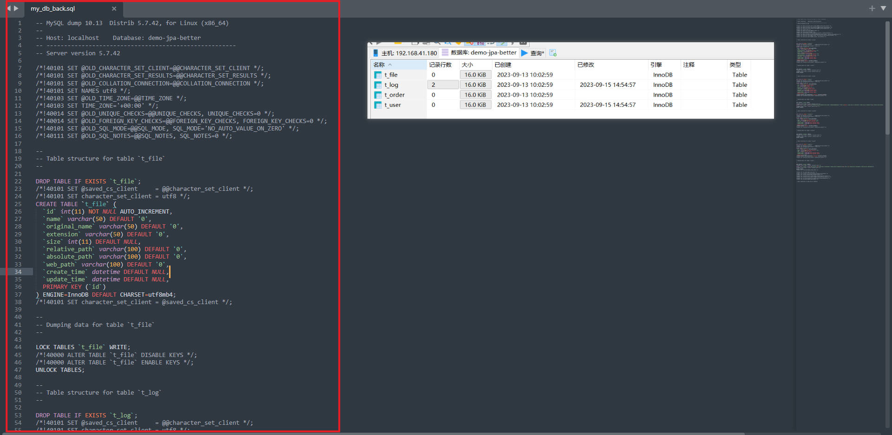

## 前言

对于软件而言，它可以不好用，交互稀碎，它也可以页面很丑陋，不堪入目。但用户绝对不能接受重要数据的丢失，尤其是在很多重要领域的数据，比如：金融，司法，工业生产，制造业等领域的专业软件。

MySQL 的数据定期备份就显得尤其重要，本片概述在简单场景下的备份策略。

---

## mysqldump

### 转储

MySQL 客户端自带一个备份工具——mysqldump，它可以生成实现备份和转储所需要的完整 SQL 文件。默认情况下，转储文件（dump file）包含了用于重建数据库和表的 SQL 语句，格式如下：

```shell
mysqldump -u [user] -p [database_name] > [filename].sql
```

* [user] 表示你数据库的用户名。
* [database_name] 表示你需要转储的数据库名字。
* [filename] 就是你希望保存的转储文件的具体路径。

例如，现在有一个数据库——demo-jpa-better，然后又四张表，如果我希望把 demo-jpa-better 这整个数据库备份下来，执行命令：

```shell
mysqldump -u root -p demo-jpa-better > ./my_db_back.sql
```

这样 demo-jpa-better 这个数据库的所有表结构和表中的数据，都以 SQL 语句的形式保存到了名为 my_db_back.sql 的文件中。



如果需要备份所有数据库，添加 --all-databases 参数即可：

```shell
mysqldump -uroot -p --all-databases > full_db_back.sql
```

如果需要备份个别的几个数据库，一一列出它们的名字即可：

```shell
mysqldump -uroot -p --databases db1 db2 db3 > three_db_back.sql
```

如果要备份某一个数据库的其中一个表，命令如下：

```shell
mysqldump -uroot -p demo-jpa-better t_user > user_back.sql
```

如果仅仅备份表结构，不需要备份数据，命令如下：

```shell
mysqldump -uroot -p --no-data demo-jpa-better t_user > user_no_data_bak.sql
```

如果仅仅备份数据，不需要备份表结构，命令如下：

```shell
mysqldump -uroot -p --no-create-info demo-jpa-better t_user > user_no_structure_bak.sql
```

### 恢复

得到了备份的 sql 文件，接下来需要做的就是恢复，比如，线上的数据库备份下来，恢复到本地的数据库。

首先新建一个数据库，比如叫 demo-jpa-better-bak：

```shell
mysql> create database `demo-jpa-better-bak`
```

然后将刚刚备份的 my_db_bak.sql 的表结构和数据恢复到这个新建的库中：

```shell
mysql -uroot -p demo-jpa-better-bak < my_db_back.sql
```

也可以在 mysql 交互模式下使用 source 指令：

```mysql
mysql> create database `demo-jpa-better-bak`;
mysql> use `demo-jpa-better-bak`;
mysql> source /data/my_db_back.sql
```

---

## 定时备份

将 mysqldump 的命令和参数写在一个 sh 文件中：

```shell
# 数据库 IP
db_host='127.0.0.1'
# 数据库 PORT
db_port='3306'
# 数据库用户名
db_user='root'
# 数据库密码
db_password='123456'
# 需要备份的数据库名称
db_name='demo-jpa-better'
# 备份时间
bak_time=`date +%FT%T`
# 备份数量
bak_num=2

# 备份存储目录的路径
bak_dir_path='/root/app/bak_sql'

echo "### ${bak_time} ###"
echo "### 开始备份 ###"

#如果文件夹不存在则创建
if [ ! -d ${bak_dir_path} ]
then     
    mkdir -p ${bak_dir_path};
fi

source=`mysqldump --host=${db_host} --port=${db_port} --user=${db_user} --password=${db_password} --databases ${db_name} > ${bak_dir_path}/${bak_time}.sql`

echo "### 开始删除过期的文件 ###"
del_file=`ls -l -crt ${bak_dir_path}/*.sql | awk '{print $9}' | head -1`
count=`ls -l -crt ${bak_dir_path}/*.sql | awk '{print $9}' | wc -l`

if [ ${count} -gt ${bak_num} ]
then
    # 删除最早的备份文件
    echo "${del_file} 已被删除"
    rm ${del_file}
fi
```

然后使用 crontab 编写定时任务：

```shell
crontab -e

# 比如每天 23 点 30 分备份一次
30 23 * * * sh /root/app/mysqlbak.sh
```

最好先执行一下脚本能不能跑通，进入备份目录查看一下有没有备份文件，如果有，则表示脚本执行成功，最后再写到 crontab 中，记得不要搞错了备份的用户和密码，或者可能需要填写 mysqldump 的绝对路径。

---

## 参考

1. https://cloud.tencent.com/developer/article/1935637
1. https://juejin.cn/post/6950164920100978702
