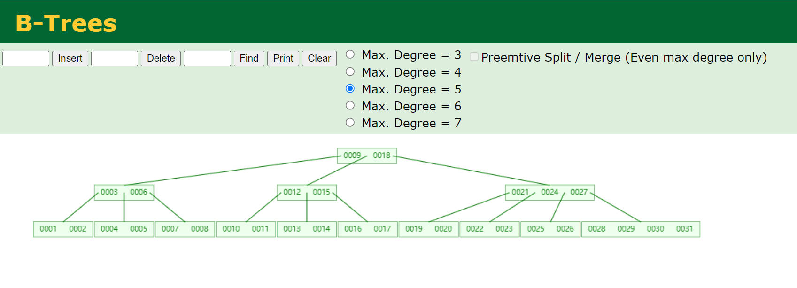

## 前言

谈到 MySQL 性能优化，索引是绕不开的话题，在数据量比较大的情况下，好的索引能够让查询语句的速度提升好几个数量级，B-tree 索引又是 MySQL 中最常用的索引类型，所以本文将从数据结构开始，扩展到 MySQL 建立索引的一些操作和细节，最后做一些性能测试。

---

## 二叉树

这里涉及的几种二叉树的概念，仅仅是为了给 B-tree 做些铺垫，所以不会写的很详细，更详细的内容参考其他网络资料。

### 普通二叉树

二叉树的每个节点，分别拥有左、右两个子节点，二叉树是最简单的一种树。

### 二叉搜索树

当仅仅只是一个简单的二叉树，并不能为搜索带来什么性能上的提升，因为左右的子节点和父节点之间的关系是无序的，所以引入了二分搜索的概念，就有了二叉搜索树（Binary Search Tree，BST），如下图：

它的平均搜索时间复杂度是 O(lgN)，但这是一般情况。假设碰到只有单边的二叉搜索树，那么性能就很糟糕了，因为它就等同于一个链表，比如下图，所有的子节点都在左边：

### 平衡二叉树

搜索，意味着比较，比较，意味着耗时，大部分搜索树的耗时，都与这棵树的高度成正比，树越高，耗时越多，所以二叉搜索树经常会失衡，就先上面一样，退化成了链表结构，所以需要某种机制，再对树进行插入，删除的时候，维持树的平衡。

AVL 树（名称取自它的发明者们：苏联的数学家 Adelson-Velsky 和 Landis），它是最先发明的自平衡二叉查找树。在AVL树中任何节点的两个子树的高度最大差别为1，所以它也被称为高度平衡树。增加和删除可能需要通过一次或多次树旋转来重新平衡这个树。

上图描述了，它是如何保持平衡的，AVL 树的优点是维持了树的平衡，但缺点是，通过旋转来保持平衡，而旋转是非常耗时的，由此我们可以知道 AVL 树适合用于插入与删除次数比较少，但查找多的情况。

### 红黑树

一种二叉查找树，但在每个节点增加一个存储位表示节点的颜色，可以是红或黑（非红即黑）。通过对任何一条从根到叶子的路径上各个节点着色的方式的限制，红黑树确保没有一条路径会比其它路径长出两倍（即同一父节点出发到叶子节点，所有路径上的黑色节点数目一样），因此，红黑树是一种弱平衡二叉树，在相同的节点情况下，AVL 树的高度低于红黑树，相对于要求严格的 AVL 树来说，它的旋转次数少，所以对于插入，删除操作较多的情况下，我们就用红黑树。

---

## B-tree

B-tree（Balanced Multiway Search Tree），即多路平衡搜索树。从上面来看，二叉树的单论查找效率，各种二叉平衡树已经是最快的了，但在实际的数据库系统上，我们的数据是存放在磁盘上的，所以不仅要考虑查找效率，还要考虑磁盘的寻址加载次数，每次的磁盘 IO 都需要消耗很多时间。

树的高度基本决定了磁盘的 IO 次数 ，所以使用 B-tree 性能要高很多。

同样插入 1-31 的节点，B-tree 的高度明显小很多。

与二叉搜索树不同的是，B-tree 的一个节点可以有 m (m 可以大于 2)个键/值对，按键顺序升序排列，所以是多路搜索树。

B-tree，有以下一些特性：

1. 有叶子节点必须出现在同一层。
2. 根节点可以有少于 m 个子节点，但必须至少有 2 个。
3. 为了保持树基本平衡，我们还说节点必须至少有 m/2 个子节点（向上舍入）。

## B+tree

B+tree 是 B-tree 的一种变体，读作（B Plus Tree）。
