## 前言

SQL 的各种表连接，是查询的精髓之一，本文用一种可视化的方式去理解这些连接。

---

## 理论

### 笛卡尔积

在数学中，两个集合 X 和 Y 的笛卡尔积，又称直积，在集合论中表示为 X × Y，是**所有**可能的**有序对**组成的集合，其中**有序对**的第一个对象是 X 的成员，第二个对象是 Y 的成员。

笛卡尔积得名于笛卡尔，因为这概念是由他建立的解析几何引申出来。

公示：X × Y = { (x, y) | x ∈ X ∧ y ∈ Y }

它们的笛卡尔积的个数 = (X 中元素个数) × (Y 中元素个数)

用扑克牌举例：

X 集合是 13 个点数的集合：{ A, 2, 3, 4, 5, 6, 7, 8, 9, 10, J, Q, K }

而 Y 集合是 4 个花色的集合：{ ♠, ♥, ♦, ♣ }

则两个集合的笛卡尔积将有 13×4=52 个元素的集合：{ (A, ♠), (A, ♥), (A, ♦), ... , (K, ♦), (K, ♣) }。

当然，上面的集合可以推广到多元素组成元组而构成的更复杂的集合中。

假设 R 集合是：{ (r1, m1), (r2, m2), (r3, m3) }，而 S 集合是：{ (s1, n1, p1), (s2, n2, p2) }

将上两个集合写的更清晰些，会看到其实每个集合就是 a 行 × b 列的表格：

```
R 集合，3 行 × 2 列
{ 
	(r1, m1), 
	(r2, m2), 
	(r3, m3) 
}

S 集合，2 行 × 3 列
{ 
	(s1, n1, p1), 
	(s2, n2, p2) 
}
```

用 Excel 绘制：

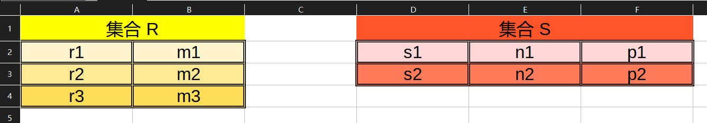

尽管增加了一个维度，但做笛卡尔积依然很简单，可以将集合中的一整行视为单个元素，比如 R 的第一行：(r1, m1) 作为 R 的一个元素和 S 的第一行：(s1, n1, p1) 也作为 S 的一个元素组合起来，变成了笛卡尔积中的第一个元素：( (r1, m2), (s1, n1, p1) )。

按照这个降低维度的方法，可以很快求出笛卡尔积的结果：

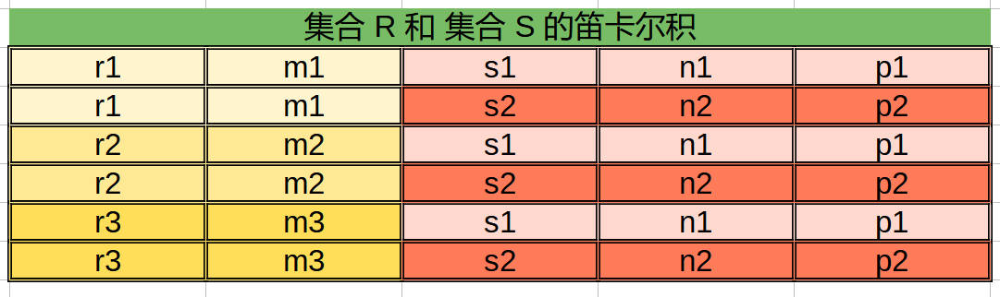

用文本表示：

```
R 集合和 S 集合的笛卡尔积
{
	( (r1, m1), (s1, n1, p1) ),
	( (r1, m1), (s2, n2, p2) ),
	( (r2, m2), (s1, n1, p1) ),
	( (r2, m2), (s2, n2, p2) ),
	( (r3, m3), (s1, n1, p1) ),
	( (r3, m3), (s2, n2, p2) )
}
```

---

## SQL 实践

示例表，一个是用户表（t_user），一个是订单表（t_order）

其中订单表的 user_id 字段表明了这个订单是哪个 id 的用户订购的。

t_user

```sql
create table demo.t_user
(
    id   int auto_increment
        primary key,
    name varchar(50) not null
);
```

t_order
```sql
create table demo.t_order
(
    id      int auto_increment
        primary key,
    item    varchar(50) null,
    user_id int         null
);
```

t_user 数据：

```
id    name
1     bob
2     alice
3     jack
4     tom
5     ada
6     linda
```

t_order 数据：

```
id    item     user_id
1     pen         1
2     pencil      3
3     book        5
4     eraser      7
```

### cross join

交叉连接，也叫做笛卡尔连接，返回两个或多个表中行的所有可能组合。它不需要像其他类型的连接那样基于匹配列的连接条件。相反，它生成的结果是所涉及表的笛卡尔积。

总共有 6 个用户，4 个订单，所以 cross join 的结果是 6 × 4 = 24 条数据：

```sql
写法一：
select *
from t_user, t_order;

写法二：
select *
from t_user cross join t_order;
```

结果集

```
1,bob,4,eraser,7
1,bob,3,book,5
1,bob,2,pencil,3
1,bob,1,pen,1
2,alice,4,eraser,7
2,alice,3,book,5
2,alice,2,pencil,3
2,alice,1,pen,1
3,jack,4,eraser,7
3,jack,3,book,5
3,jack,2,pencil,3
3,jack,1,pen,1
4,tom,4,eraser,7
4,tom,3,book,5
4,tom,2,pencil,3
4,tom,1,pen,1
5,ada,4,eraser,7
5,ada,3,book,5
5,ada,2,pencil,3
5,ada,1,pen,1
6,linda,4,eraser,7
6,linda,3,book,5
6,linda,2,pencil,3
6,linda,1,pen,1
```

cross join 返回的结果集，包含了两个表的数据，所能组成的所有可能性的集合。

---

### inner join

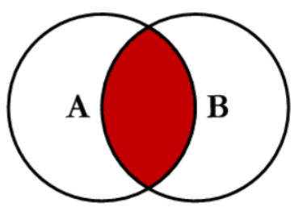

大多数时候，笛卡尔连接没什么大用处。比如，bob 只下了一个钢笔的订单，笛卡尔积却依然把他和其他三个订单给连接在了一起。

所以我们希望通过 t_order 的 user_id 字段来排除那些不符合关系的结果。

```
方法一：在笛卡尔连接上使用 where
select *
from t_user cross join t_order
where t_user.id = t_order.user_id;

方法二：使用 inner join ... on ... 句式
select *
from
    t_user inner join t_order
    on t_user.id = t_order.user_id;
```

方法二连接的关键，就在于 order 表的 user_id 和 user 表的 id 有关联关系，上面的查询语句将返回所有左表（t_user）和右表（t_order）在公共字段（t_user 的 id 和 t_order 的 user_id 的交集）匹配的记录。

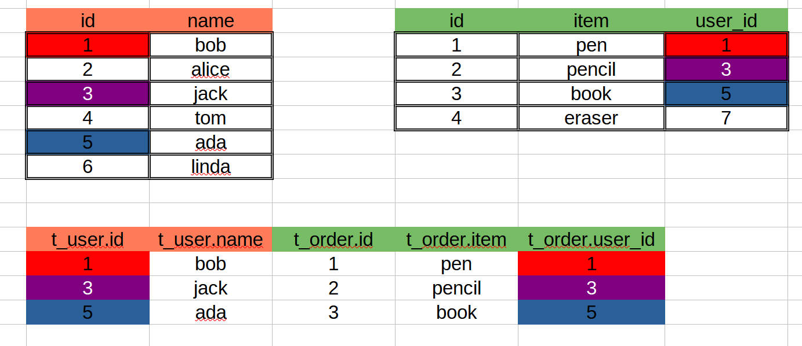

所以，inner join 就类似于数学集合中的交集，用文字简单的表述就是：

1. 根据 on 关键字后面的等值判断，找到两张表在这两个字段上的交集。
2. 将两张表对应行的数据结合起来，就是连接结果集。

我们依照刚刚的文字表述，来分析上面的 inner join 语句，尽可能地拆解成容易理解的小步骤：

```
inner join 语句：
select *
from
    t_user inner join t_order
    on t_user.id = t_order.user_id;
    
第一步：找到 on 语句中，两张表对应字段的集合 
t_user.id = {1, 2, 3, 4, 5, 6}
t_order.user_id = {1, 3, 5, 7}

第二步，求出交集
交集: t_user.id ∩ t_order.user_id = {1, 3, 5}

第三步，找到对应表的行记录
对于 t_user 表而言，行记录是：
id  name
1	bob
3	jack
5	ada

对于 t_order 表而言，行记录是：
id  item       user_id
1	pen        1
2	pencil     3
3	book       5

第四步，将各自筛选出来来的行记录一一对应，拼接起来，得到结果集
t_user.id	t_user.name	t_order.id	t_order.item	t_order.user_id
1                bob	     1	         pen               1
3                jack	     2	        pencil             3
5                ada	     3           book              5

```

---

### left join

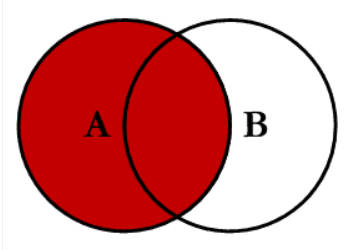

left join 是 left outer join 的简写，它的全称是左外连接，是外连接中的一种。

inner join 剔除了交集之外的部分，但有时候我们希望结果集中包含左表的所有元素，并且包含两表交集的元素。

比如，打印出所有用户的订单记录，inner join 会剔除 alice，tom 和 linda，因为他们并没有下过订单，这时候需要使用 left join：

```
select *
from
    t_user left join t_order
    on t_user.id = t_order.user_id;
```

和 inner join 不同的是，left join 的结果集，包含了那些没有下订单的用户：

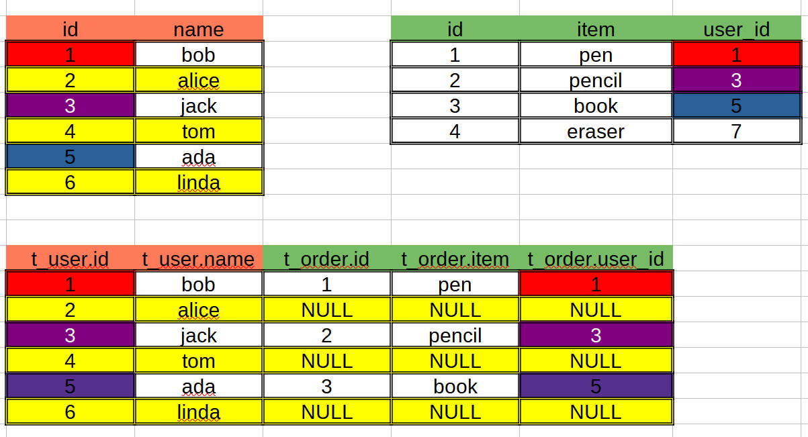

用文字阐述步骤：

1. 找到左表的全部记录。
2. 按照左表的每一条记录根据 on 语句中的字段，找到右表中对应的记录。
3. 如果碰到有交集的行，将右表对应的记录和左表的记录连接。
4. 如果碰到没有交集的行，仅仅保留左表的记录，右表的各项字段用 NULL 填充。

```
select *
from
    t_user left join t_order
    on t_user.id = t_order.user_id;
    
第一步，找到左表的全部记录：
这里左表是 t_user，所以集合是 t_user.id = {1, 2, 3, 4, 5, 6}

第二步，按照刚刚得到的左表的 id 的集合，找到右表匹配的记录
这里右表是 t_order，on 语句的字段是 user_id，匹配的记录是：
id  item       user_id
1	pen        1
2	pencil     3
3	book       5

第三步，将左表和右表的记录连接，匹配的话，直接连接，不匹配用 NULL 填充右表的字段，得到结果集
t_user.id	t_user.name	t_order.id	t_order.item	t_order.user_id
1               bob          1           pen                1
2               alice       NULL         NULL              NULL
3               jack         2           pencil             3
4               tom         NULL         NULL              NULL
5               ada          3           book               5
6               linda       NULL         NULL              NULL
```

---

### right join

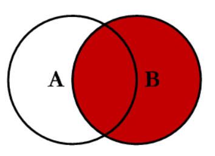

right join 是 right outer join 的简写，它的全称是右外连接，是外连接中的一种。

它和 left join 非常相似，但区别是，right join 保留的是右表的所有元素，以及左右两表交集的元素，和 left join 相反。

也就是说，结果集的记录数量就是右表的记录数量。

```sql
select *
from
    t_user right join t_order
    on t_user.id = t_order.user_id;
```

和 left join 相反，这里是以右表为基准，遍历右表每一行，和左表进行匹配。

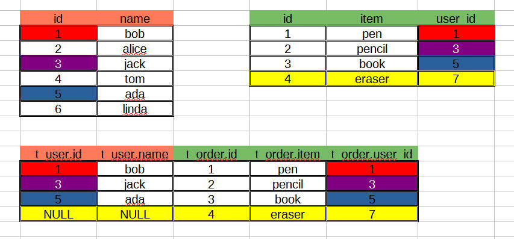

可以看到右表每一个元素都出现了，id 为 4 的订单的 user_id 是 7，但并没有存在于 user 表中，所以不存在的用户信息用 NULL 来表示。

用文字阐述步骤：

1. 找到右表的全部记录。
2. 按照右表的每一条记录根据 on 语句中的字段，找到左表中对应的记录。
3. 如果碰到有交集的行，将左表对应的记录和右表的记录连接。
4. 如果碰到没有交集的行，仅仅保留右表的记录，左表的各项字段用 NULL 填充。

```
select *
from
    t_user right join t_order
    on t_user.id = t_order.user_id;
    
第一步，找到右表的全部记录：
这里右表是 t_order，所以集合是 t_order.id = {1, 2, 3, 4}

第二步，按照刚刚得到的右表的 id 的集合，找到左表匹配的记录
这里左表是 t_user，on 语句的字段是 user_id，匹配的记录是：
id  item
1	bob
3	jack
5	ada

第三步，将左表和右表的记录连接，匹配的话，直接连接，不匹配用 NULL 填充右表的字段，得到结果集
t_user.id	t_user.name	t_order.id	t_order.item	t_order.user_id
1                bob         1            pen               1
3                jack        2            pencil            3
5                ada         3            book              5
NULL             NULL        4            eraser            7
```

可以看到 left join 和 right join 思路相反，结果完全不同，区别就在于，left join 以左表为基准，而 right join 是以右表为基准。

---

### outer join

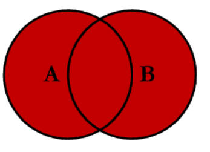

outer join 是 full outer join 的简写，它的全称是全外连接，是外连接中的一种。

全外连接将返回左表和右表的全部记录，没有匹配到的数据项用 NULL 填充。

MySQL 不支持全连接语句，所以用 union 实现：

```sql
select *
from
    t_user left join t_order
    on t_user.id = t_order.user_id
union 
select *
from
    t_user right join t_order
    on t_user.id = t_order.user_id;
```

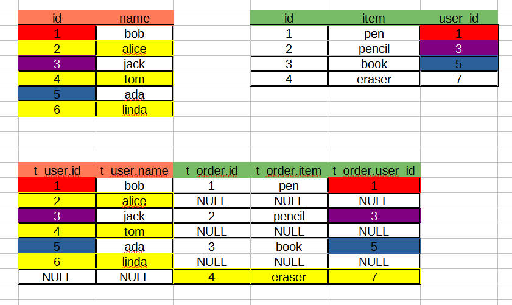

---

### left excluding join

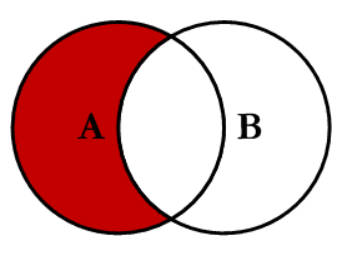

和 left join 不同的是，left join 会把左表所有数据都保留，但是 left excluding join 会剔除掉交集部分。

用 user 和 order 来举例子：

* left join：查出所有用户的，以及他们下过的订单的记录。
* left excluding join：查出所有没下过订单的用户的记录。

```sql
select *
from
    t_user left join t_order
    on t_user.id = t_order.user_id
where
    t_order.id is null;
```

因为使用了 where t_order.id is null，所以会将所有没有下过订单的用户筛选出来：

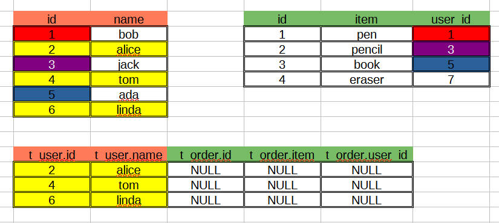

用文字描述：

1. 先做左外连接，得到结果集。
2. 筛选出订单 id 为 NULL 的记录。

---

### right excluding join

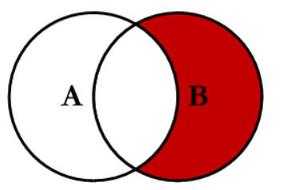

和 left excluding join 相反，会保留右表的元素，并且剔除交集部分。

```sql
select *
from
    t_user right join t_order
    on t_user.id = t_order.user_id
where
    t_user.id is null;
```

在这个例子中，会查询到所有订单记录，并且这个订单的用户不存在于 user 表中。

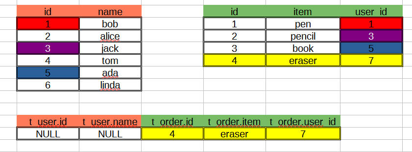

---

### outer excluding join

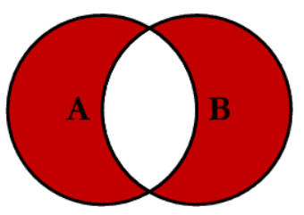

outer excluding join 相当于是 inner join 取反，在 outer join 的基础上剔除交集部分。

或者说是 left excluding join ∪ right excluding join。

```sql
select *
from (
    select
        t_user.id as user_id,
        t_user.name as user_name,
        t_order.id as order_id,
        t_order.item as item,
        t_order.user_id as order_user_id
    from
        t_user left join t_order
        on t_user.id = t_order.user_id
    union
    select
        t_user.id as user_id,
        t_user.name as user_name,
        t_order.id as order_id,
        t_order.item as item,
        t_order.user_id as order_user_id
    from
        t_user right join t_order
        on t_user.id = t_order.user_id
) as tmp
where
    tmp.user_id is null or tmp.order_user_id is null;
```

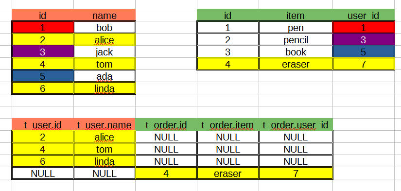

---

## 总结

记录了 8 种不同的连接方式，用图示的方式很清晰的记录了每一个连接的特点。

下面是网上搜索的全貌图：

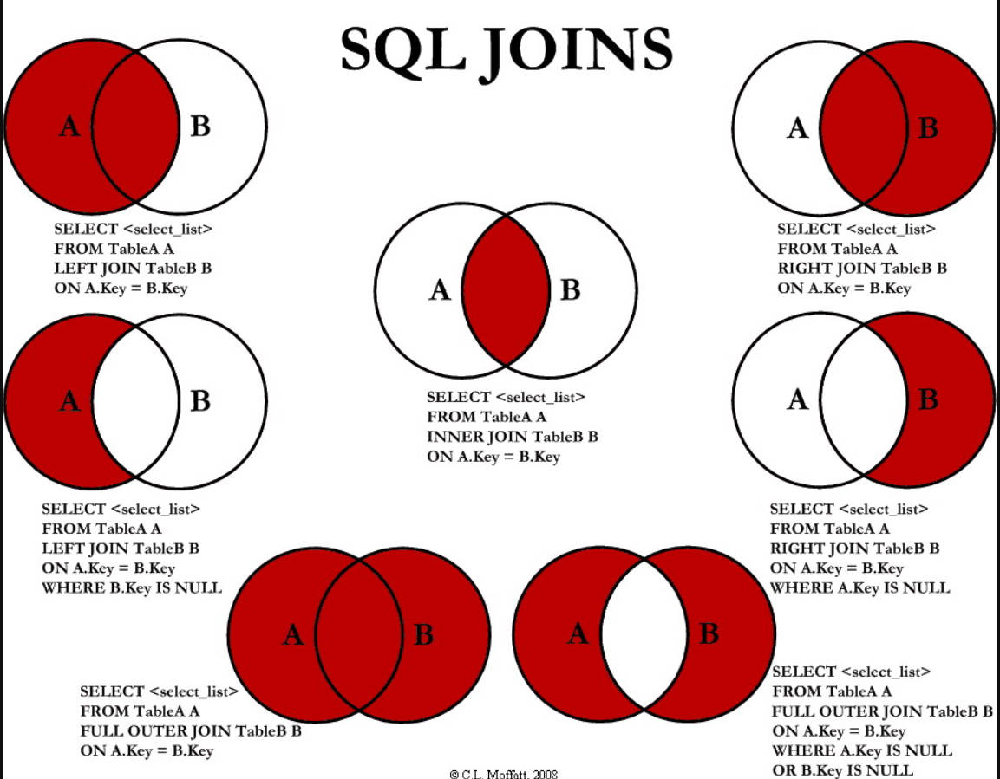

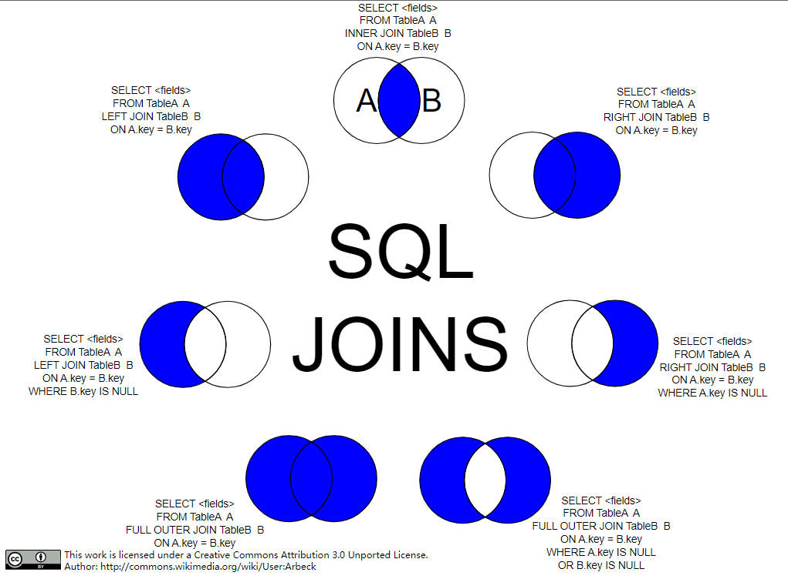

---

## 参考

1. https://www.codeproject.com/Articles/33052/Visual-Representation-of-SQL-Joins
