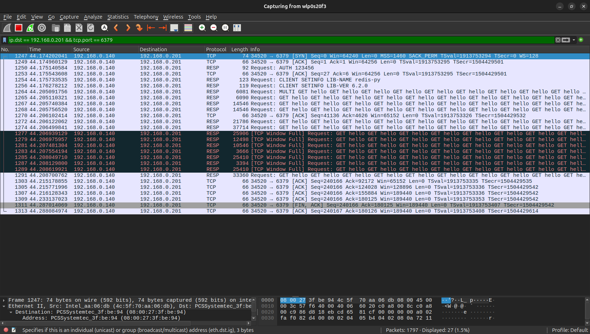

## 目录

[TOC]

---

## 版本

Redis Server: 7.0.15

Redis-Py: 6.2.0

---

## 连接池

对于 Server/Client 型应用（数据库、中间件）而言，相比命令的执行，创建网络连接的开销是巨大的，特别是在负载很高的应用或者服务器上，连接池能够复用有限的资源，大幅度提高性能，本文简述 redis-py 库如何使用连接池，并给出一些糟糕的或者正确的示例。

---

## 初始化连接池

redis-py 创建客户端的方式是实例化一个 Redis 对象（Redis 类存在于 client.py 中），构造器中的一个参数——connection_pool，就是用来指定连接池对象的，通过源码可以看到，如果不传递 connect_pool 对象，那么在构造函数中，会自动创建一个连接池对象。

也就是说，无论如何，只要创建了 Redis 实例对象，底层都会使用连接池。

当程序体量很小的时候，我们不需要精确控制多个 redis 客户端对象，也不需要指定最大连接数，那么按照以下写法使用即可：

```python
import redis

redis_client = redis.Redis(
    host='192.168.0.201',
    port=6379,
    password='123456',
    db=0,
)

# 之后的所有代码使用上面的这个模块级别的实例对象即可
```

但是，对于存在多个客户端对象，以及需要控制最大连接数的情况下，则需要显式创建 ConnectPool，然后把连接池实例传递给 connection_pool 参数，这里需要注意传参的正确性。

错误的写法，显式创建连接池对象的情况下，把参数传递给了 Redis 构造器：

```python
# 错误的写法
import redis

redis_pool = redis.ConnectionPool(
    max_connections=10
)
redis_client = redis.Redis(
    host='192.168.0.201',
    port=6379,
    password='123456',
    db=0,
    connection_pool=redis_pool,
)
```

正确的写法如下，所有连接信息参数放在 ConnectionPool 构造器：

```python
# 正确的写法
import redis

redis_pool = redis.ConnectionPool(
    host='192.168.0.201',
    port=6379,
    password='123456',
    db=0,
    max_connections=10
)
redis_client = redis.Redis(
    connection_pool=redis_pool,
)
```

---

## 性能对比

考虑一下函数：

```python
def get_some_data_1():
    conn = redis.Redis(
        host='192.168.0.201',
        port=6379,
        password='123456',
        db=0,
    )
    data = conn.get('hello')
    return data
```

多次调用该函数，底层并没有复用连接池，并且最大的问题在于，每调用一次该函数，就会完整的走一遍下面的流程：

1. TCP 协议，建立 TCP 连接
2. 建立 Redis 对象的同时，隐式创建 ConnectPool 对象
3. RESP 协议，发送 AUTH 123456 验证密码
4. RESP 协议，发送 get 指令
5. RESP 协议，接受指令结果
6. 返回 data，此时函数结束，conn 超过函数作用域，会被垃圾回收，底层的 ConnectPool 连接池相应销毁
7. TCP 协议，断开 TCP 连接

测试代码如下：

```python
def get_some_data_1():
    conn = redis.Redis(
        host='192.168.0.201',
        port=6379,
        password='123456',
        db=0,
    )
    data = conn.get('hello')
    return data

def main():
    start = int(time.time() * 1000)
    num = 10_000
    for i in range(num):
        print(get_some_data_1())
    end = int(time.time() * 1000)
    print(f'执行 {num} 次请求，耗时: {end - start} 毫秒')
```

最终结果是：

```
执行 10000 次请求，耗时: 84924 毫秒
```

通过 wireshark 抓包，可以更加清楚的看到网络底层的步骤：


可以看到，这种写法，导致 redis 客户端重复发送了密码验证，以及客户端信息，还有 TCP 的握手和挥手。

接下来，用复用连接池的方式，看一下性能差异：

```python
redis_pool = redis.ConnectionPool(
    host='192.168.0.201',
    port=6379,
    password='123456',
    db=0,
    max_connections=10
)
redis_client = redis.Redis(
    connection_pool=redis_pool,
)

def get_some_data_2():
    data = redis_client.get('hello')
    return data

def main():
    start = int(time.time() * 1000)
    num = 10_000
    for i in range(num):
        print(get_some_data_2())
    end = int(time.time() * 1000)
    print(f'执行 {num} 次请求，耗时: {end - start} 毫秒')
```

这里的执行步骤就变成了：

1. TCP 协议，建立 TCP 连接
2. 建立 Redis 对象的同时，隐式创建 ConnectPool 对象
3. RESP 协议，发送 AUTH 123456 验证密码
4. RESP 协议，发送 get 指令
5. RESP 协议，接受指令结果
6. 第 4, 5 两个步骤重复 10000 次
7. TCP 协议，断开 TCP 连接

执行结果：

```
执行 10000 次请求，耗时: 8283 毫秒
```

性能有了大幅度的提高，从 wireshark 也能看到，重复的步骤消失了：


还可以还种写法：

```python
redis_pool = redis.ConnectionPool(
    host='192.168.0.201',
    port=6379,
    password='123456',
    db=0,
    max_connections=10
)

def get_some_data_3():
    client = redis.Redis(connection_pool=redis_pool)
    return client.get('hello')
```

与第一种方式的差异在于，这里传入的 redis_pool 是模块级变量（全局变量），所以虽然每一次进入函数，都会创建新的 Redis 对象，但是每一个 Redis 对象底层复用的是同一个连接池。

所以，这种写法的性能和第二种是差不多的。

还有性能更好的方式，当前的流程是大批量读取，redis 提供了 pipeline 可以批量向 redis-server 传递命令，减少网络来回的开销。

```python
def get_some_data_4(num):
    data = None
    with redis_client.pipeline() as pipe:
        for i in range(num):
            data = pipe.execute()
    return data

def main():
    start = int(time.time() * 1000)
    num = 10_000
    data = get_some_data_4(num)
    for item in data:
        print(item)
    end = int(time.time() * 1000)
    print(f'执行 {num} 次请求，耗时: {end - start} 毫秒')
```

执行结果：

```
执行 10000 次请求，耗时: 108 毫秒
```

wireshark 抓包如下：



中间不再是像之前那样 10000 次的 get 命令需要 10000 次的 RESP 网络请求，而是在一个请求中大批量发送和接受。

---

## 多线程下的使用

首先需要明确，如果我们不指定连接池最大连接数大小，那么默认的最大连接数是 MAX_INT：

```python
max_connections = max_connections or 2**31
```

所以在生产环境下，尤其是多线程模式下，最好指定最大连接数（提前预估）。

### 归还连接


### 线程安全


---

## 参考

1. https://redis.io/docs/latest/develop/clients/pools-and-muxing/
1. https://fahadahammed.com/effective-use-of-redis-with-python-and-connection-pool/
1. https://redis.io/kb/doc/2c9kbsv6bi/should-connection-pooling-be-used