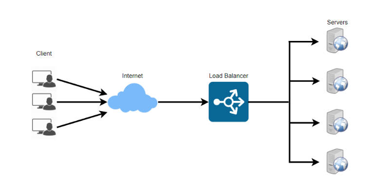

## 前言

Nginx是一个高性能的HTTP和反向代理服务器。

* 作为Web服务器，Nginx处理静态文件、索引文件，自动索引的效率非常高。
* 作为代理服务器，Nginx可以实现无缓存的反向代理加速，提高网站运行速度。
* 作为负载均衡服务器，Nginx既可以在内部直接支持Rails和PHP，也可以支持HTTP代理服务器对外进行服务，同时还支持简单的容错和利用算法进行负载均衡。
* 在性能方面，Nginx是专门为性能优化而开发的，实现上非常注重效率。它采用内核Poll模型，可以支持更多的并发连接，最大可以支持对5万个并发连接数的响应，而且只占用很低的内存资源。
* 在稳定性方面，Nginx采取了分阶段资源分配技术，使得CPU与内存的占用率非常低。Nginx官方表示，Nginx保持1万个没有活动的连接，而这些连接只占用2.5MB内存，因此，类似DOS这样的攻击对Nginx来说基本上是没有任何作用的。
* 在高可用性方面，Nginx支持热部署，启动速度特别迅速，因此可以在不间断服务的情况下，对软件版本或者配置进行升级，即使运行数月也无需重新启动，几乎可以做到7x24小时不间断地运行。

---

## 基础镜像使用

使用搜索命令可以找到官方的 Nginx 镜像

```shell
docker search nginx
# 返回结果
NAME                                              DESCRIPTION                                      STARS     OFFICIAL   AUTOMATED
nginx                                             Official build of Nginx.                         18447     [OK]
```

然后 docker run 即可

--name：指定容器的名称。

-p：指定端口映射，左侧的 80 指的是 Docker 主机的端口，右侧的 80 指的是容器暴露的端口。

-d：让容器后台运行，并且打印 container id。

```shell
docker run --name my_nginx -p 80:80 -d nginx
```

打开浏览器，输入 localhost:80，可以看到：


或者使用 curl：

```shell
curl.exe localhost:80

# 返回
<!DOCTYPE html>
<html>
<head>
<title>Welcome to nginx!</title>
<style>
html { color-scheme: light dark; }
body { width: 35em; margin: 0 auto;
font-family: Tahoma, Verdana, Arial, sans-serif; }
</style>
</head>
<body>
<h1>Welcome to nginx!</h1>
<p>If you see this page, the nginx web server is successfully installed and
working. Further configuration is required.</p>

<p>For online documentation and support please refer to
<a href="http://nginx.org/">nginx.org</a>.<br/>
Commercial support is available at
<a href="http://nginx.com/">nginx.com</a>.</p>

<p><em>Thank you for using nginx.</em></p>
</body>
</html>
```

---

## 部署一个简单的静态内容页面

现在我希望修改首页内容，将原来的欢迎页面改成以下的 html 页面：

```html
<h1>
    Hello, Nginx and Docker!
</h1>
```

### 方式一：进入容器后修改

```shell
docker exec -it my_nginx /bin/bash
```

进入容器后，修改 /usr/share/nginx/html 目录下的 index.html

```shell
echo "<h1>Hello, Nginx and Docker</h1>" > /usr/share/nginx/html/index.html
```

重新打开页面，发现页面已经变化了。

但是这种方式太麻烦，需要进入容器还要手动修改。

### 方式二：挂载目录

docker 的 -v 命令可以将 Docker 主机上的目录挂载到容器中的目录，这样我们在主机上的任何修改，就会同步到容器的内部目录中去。

创建第二个容器，测试一下，主机端口 81，映射到容器内部的 80，容器名称为 my_nginx_2

```shell
docker run --name my_nginx_2 -dp 81:80 -v C:\\users\\dingj\\desktop\\my_nginx\\web:/usr/share/nginx/html nginx
```

这里我将 Docker 主机上的 C:\\users\\dingj\\desktop\\my_nginx\\web 目录映射到了容器内部的 /usr/share/nginx/

这里的配置，是可以双向绑定的，我在主机上的文件修改会同步到容器的文件中

比如，在 C:\\users\\dingj\\desktop\\my_nginx\\web 下面创建一个 index.html

```html
<!DOCTYPE html>
<html>
<head>
	<meta charset="utf-8">
	<meta name="viewport" content="width=device-width, initial-scale=1">
	<title>hello</title>
</head>
<body>
	<h1 style="color: red;">hello nginx!</h1>
</body>
</html>
```

访问 localhost:81，可以看到红色字样的 hello nginx!，同时我们可以进入容器内部看下文件内容

```shell
# 进入容器
docker exec -it my_nginx_2 bash
# 进入 /usr/share/nginx/html 目录
cd /usr/share/nginx/html
# 查看文件内容
cat index.html
# 返回以下内容
<!DOCTYPE html>
<html>
<head>
        <meta charset="utf-8">
        <meta name="viewport" content="width=device-width, initial-scale=1">
        <title>hello</title>
</head>
<body>
        <h1 style="color: red;">hello nginx!</h1>
</body>
```

说明主机外的修改确实同步到了容器内部，那如果此时在容器内部，对 /usr/share/nginx/index.html 做出修改，会不会同步到主机外的文件呢？

```shell
# 在容器内部的 /usr/share/nginx/html 目录下执行
echo "<h1>Something from container</h1>" > index.html
```

重新刷新 localhost:81，发现内容变成了 Something from container，与此同时 C:\\users\\dingj\\desktop\\my_nginx\\web 目录下的 index.html 也发生了修改，说明 -v 将两个目录双向绑定到了一块，共享文件内容。

默认，容器内部的权限是 rw，也就是可以读（read）可写（write），如果不希望容器内部的目录被修改，可以把默认的 rw 改成 ro（read only）

重新启动一个容器，叫 my_nginx_3，测试以下

```shell
docker run --name my_nginx_3 -dp 82:80 -v C:\\users\\dingj\\desktop\\my_nginx\\web:/usr/share/nginx/html:ro nginx
```

仅仅比 my_nginx_2 多了一个`:ro`，我们再次进入容器，修改 index.html

```shell
docker exec -it my_nginx_3 bash
cd /usr/share/nginx/html/
echo "Cannot modify" > index.html
# 提示，无法修改，只读
bash: index.html: Read-only file system
```

这样，容器内部就无法修改目录内容，需要修改内容，只能从 Docker 主机上进行修改了。

---

## 配置文件

如果需要修改配置文件，我们除了通过 docker exec 进入容器，然后修改 /etc/nginx 目录下的内容之外，还可以和上面的静态内容页面一样，通过 docker -v 指令，绑定 Docker 主机下面的配置目录和容器内部的配置目录，这样只需要在 Docker 主机上修改配置文件，而不需要再进入容器内部做修改。

同样的，新开一个容器——my_nginx_4，换一个端口——83：

```shell
docker run --name my_nginx_4 -dp 83:80 -v C:\\users\\dingj\\desktop\\my_nginx\\web:/usr/share/nginx/html -v C:\\users\\dingj\\desktop\\my_nginx\\conf:/etc/nginx/conf nginx
```

这里指定了两个数据卷的映射，一个是静态文件目录，一个是配置目录

我们指定以下的一个 nginx server 配置，放在 c:\\users\\dingj\\desktop\\my_nginx\\conf 目录下，文件会同步到容器内部的 /etc/nginx/conf 目录下。

```shell
server {
    listen       80;
    listen  [::]:80;
    server_name  localhost;

    location / {
        root /usr/share/nginx/html;
        index index.html;
    }

    location /test {
        root /web;
        index my_web.html;
    }
}
```

第一个 nginx location，将请求 / 映射到了 /usr/share/nginx/html 下面，默认寻找目录下的 index.html 页面

第二个 nginx location，将请求 /test 映射到了 /web/test 下，默认寻找目录下的 my_web.html 页面

为了测试第二个 nginx location，我们进入容器后，创建 /web/test/my_web.html 页面。

```shell
mkdir -p /web/test
echo "web! web! web!" > /web/test/my_web.html
```

localhost:83 可以正常访问到 /usr/share/nginx/html 下面的 index.html，但是 localhost:83/test，却显示 404，进入容器后执行命令，查看容器内部 nginx 默认使用的配置文件路径：

```shell
# 查看 nginx 进程使用哪一个配置文件
nginx -t
# 返回结果
nginx: the configuration file /etc/nginx/nginx.conf syntax is ok
nginx: configuration file /etc/nginx/nginx.conf test is successful
```

可以看到此时 nginx 读取的是 /etc/nginx/nginx.conf，而我们的配置文件同步到了 /etc/nginx/conf/nginx.conf，所以没有被读取到配置内容。

cat 查看 /etc/nginx/nginx.conf 可以看到 nginx 默认配置文件的内容：

```nginx
user  nginx;
worker_processes  auto;

error_log  /var/log/nginx/error.log notice;
pid        /var/run/nginx.pid;


events {
    worker_connections  1024;
}


http {
    include       /etc/nginx/mime.types;
    default_type  application/octet-stream;

    log_format  main  '$remote_addr - $remote_user [$time_local] "$request" '
                      '$status $body_bytes_sent "$http_referer" '
                      '"$http_user_agent" "$http_x_forwarded_for"';

    access_log  /var/log/nginx/access.log  main;

    sendfile        on;
    #tcp_nopush     on;

    keepalive_timeout  65;

    #gzip  on;

    include /etc/nginx/conf.d/*.conf;
}
```

最后一行，include 命令读取了 /etc/nginx/conf.d/ 下的所有配置文件，所以我们可以把 /etc/nginx/conf.d/ 下的原先的默认配置文件——default.conf 删除，将 /etc/nginx/conf/nginx.conf 拷贝到 /etc/nginx/conf.d 目录下即可。

```bash
# 删除原先默认的配置文件
rm /etc/nginx/conf.d/default.conf
# 将同步的数据卷下的配置文件拷贝到 conf.d 下
cp /etc/nginx/conf/nginx.conf /etc/nginx/conf.d
# 重启 nginx
nginx -s reload
```

再访问 localhost:83/test 就正常显示 /web/test/my_web.html 的内容了。

---

## 反向代理

nginx 常用作反向代理服务器，所谓反向代理，就是客户端访问后端服务的时候，客户端访问的其实是 nginx 服务器，nginx 接收到来自客户端的请求后，根据配置文件，选择某个后端服务，将请求交给这个后端服务，后端服务处理完业务逻辑后，返回的数据也通过 nginx 再交给客户端，nginx 在客户端和后端服务中，充当了中间人的角色。

也就是说，nginx 作反向代理的时候，客户端其实是不知道自己的请求被 nginx 分发到了哪一个真正的后端服务上。

Nginx 作反向代理，主要是为了安全性，保护网站安全，不让客户端真正接触到后端服务器（中间隔了个 nginx 反向代理）。


上图还提到了一个正向代理，和反向代理刚好相反，正向代理主要作用是保护客户端，向服务提供商隐藏客户端的身份信息，不让服务提供商真正接触到客户端（中间隔了个客户端的正向代理）。

现在 Docker 主机的 IP 是 192.168.10.102。我在 IP 为 192.168.10.103 的机器上启动了一个 REST 服务，访问 103 机器的 API 会返回一个字符串：Hello spring boot!(server 1)。

我希望客户端访问 http://192.168.10.102/ 的时候，nginx 能帮我反向代理到 http://192.168.10.103:8080/hello 这个 REST API 上。

配置如下：

```nginx
server {
    listen       80;
    server_name  localhost;

    location / {
        proxy_pass http://192.168.10.103:8080/hello
    }
}
```

配置的意思就是，nginx 的这个 server 监听 80 端口，用户请求 / 的路径时候，会被反向代理到 http://192.168.10.103:8080/hello 上。

此时，我们访问 localhost:80/ 和 192.168.10.103:8080/hello 的效果就是一样的了。

---

## 负载均衡

在访问数量较多的情况下，反向代理的机器一般不止一台，这时候就需要做负载均衡：用于决定某一个请求被发送到哪一个服务中去。

流量大的时候，要么提升服务器的机器性能（纵向扩展），要么增大服务器集群的机器数量（横向扩展），负载均衡就用在后面那种情况。

Nginx 做负载均衡，主要是分配流量，从而提高服务提供者的响应速度和性能。



比如现在网络上有三台机器：

1. Nginx 服务器（192.168.10.102）
2. 后端服务 1 号机器（192.168.10.103）
3. 后端服务 2 号机器（192.169.10.104）

客户端请求 http://192.169.10.102/ 的时候，希望请求可以被分摊到后端服务的两台机器中去，我在这两台机器都启动了相同的 REST 接口。

为了测试方便，1 号机器返回字符串“Hello spring boot!(server 1)”，2 号机器返回字符串“Hello spring boot!(server 2)”。

配置如下：

```nginx
upstream backend-api {
    server 192.168.10.103:8080;
    server 192.168.10.104:8080;
}

server {
    listen       80;
    
    server_name  localhost;

    location / {
        proxy_pass http://backend-api/hello;
    }
}
```

upstream 设置了一组服务器群，用于反向代理，注意，backend-api 不能写成 back_api，因为 URL 不能有下划线。

现在，请求 192.168.10.102，nginx 就会将请求分发给 103 和 104 的机器上，我们可以编写一个 python 脚本来测试负载均衡的效果。

```python
import requests

api_url = 'http://192.168.10.102:80/'

for i in range(10):
    response = requests.get(api_url)
    print(f'response body: {response.text}')
```

返回结果：

```
response body: Hello spring boot!(server 1)
response body: Hello spring boot!(server 2)
response body: Hello spring boot!(server 1)
response body: Hello spring boot!(server 2)
response body: Hello spring boot!(server 1)
response body: Hello spring boot!(server 2)
response body: Hello spring boot!(server 1)
response body: Hello spring boot!(server 2)
response body: Hello spring boot!(server 1)
response body: Hello spring boot!(server 2)
```

可以看到，结果是 103 机器和 104 机器交替处理客户端请求，这里使用的是 Nginx 默认的负载均衡策略——轮询。

除了轮询之外，nginx 还提供了其他几种策略：

| 策略名称   | 说明                                                         |
| ---------- | ------------------------------------------------------------ |
| 轮询       | 默认方式，按时间顺序逐一分配到不同的后端服务器               |
| weight     | 权重方式，weight值越大，分配到的访问几率越高                 |
| ip_hash    | 依据 ip 分配方式，每个请求按访问IP的hash结果分配，这样来自同一个ip 的请求将访问同一个后端服务器，可以解决 session 一致性的问题 |
| least_conn | 依据最少连接方式，哪个后端服务器连接数少就分发到哪个后端服务器 |
| url_hash   | 依据URL分配方式，按照访问的 URL 的 hash 结果来分配请求，使每个 URL 定向到同一个后端服务器 |
| fair       | 依据响应时间方式，响应时间短的优先分配请求                   |

在这里，笔者仅额外测试一下 weight 方式：

```nginx
upstream backend-api {
    server 192.168.10.103:8080 weight=9;
    server 192.168.10.104:8080 weight=1;
}

server {
    listen       80;
    
    server_name  localhost;

    location / {
        proxy_pass http://backend-api/hello;
    }
}
```

修改配置文件，重启 nginx 后，再次执行刚才的 Python 脚本：

```
response body: Hello spring boot!(server 1)
response body: Hello spring boot!(server 1)
response body: Hello spring boot!(server 1)
response body: Hello spring boot!(server 1)
response body: Hello spring boot!(server 1)
response body: Hello spring boot!(server 1)
response body: Hello spring boot!(server 1)
response body: Hello spring boot!(server 1)
response body: Hello spring boot!(server 2)
response body: Hello spring boot!(server 1)
```

10 次请求中，仅有 1 次请求命中了 server 2。

---

## 参考

1. https://www.nginx.com/blog/deploying-nginx-nginx-plus-docker/
2. https://hub.docker.com/_/nginx
