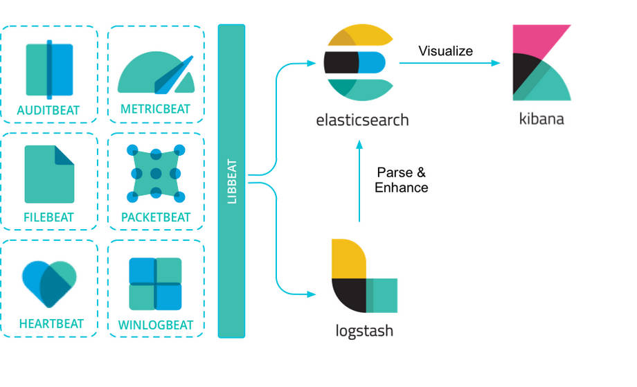
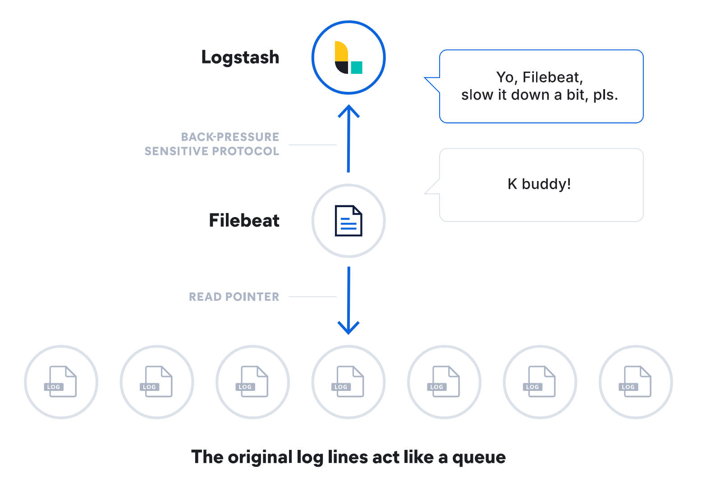
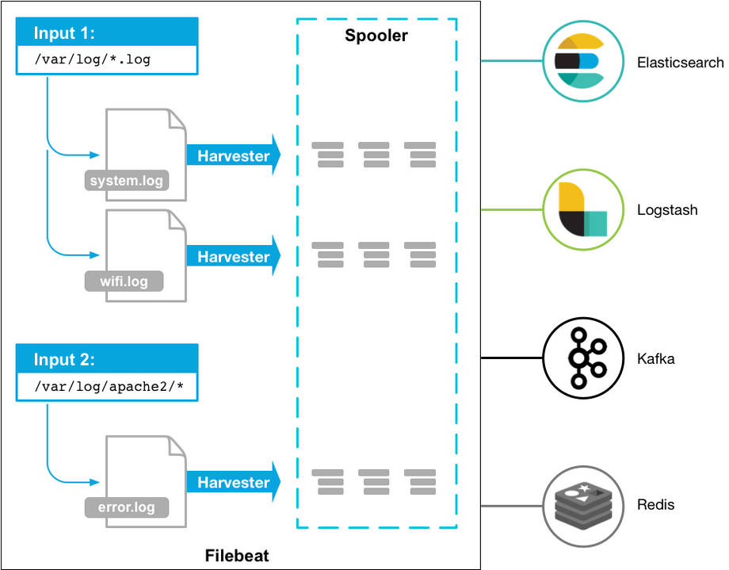

## 目录

[TOC]

---

## 前言

对于大型 Python 项目而言，logging 提供的存储到本地的日志服务可能会随着业务增长，逐渐变得不可观测，通过 less 或者 grep 等原始 Linux 工具查询日志会变得效率底下，所以本文以一个简单的分布式爬虫项目来介绍如果将 Python 项目日志进行 JSON 结构化，并且通过 filebeat 这个工具入库到 ELK 系统中。

---

## filebeat

filebeat 属于 Beats 家族的一员，Beats 由多个子项目组成，主要的功能是将成百上千的机器的信息输送到 ELK 系统里：



filebeat 是专门收集日志文件的轻量级工具，它在启动的时候，读取配置文件中的 filebeat.inputs 项，然后搜索匹配的日志文件，为每一个需要收集的日志文件启动一个采集器（harvester）。



harvester 负责打开文件，读取文件，每当 filebeat 找到一个日志文件要采集，filebeat 就会启动一个 harvester 去读取日志文件。

input 负责管理和配置，它告诉 filebeat 有哪些文件需要采集，并且提供了一个配置项。



filebeat 提供了非常多的 input 类型：https://www.elastic.co/docs/reference/beats/filebeat/configuration-filebeat-options#filebeat-input-types

但文本聚焦于磁盘日志文件的读取，因此这里仅介绍 filestream 类型的 input（旧版本7.x之前，用的是 log 类型，filestream 是对旧版 log 类型的重构，性能更好，且解决了旧版中一些顽固的 inode 重用等问题）。

---

## Python 日志

为了方便 ELK 解析日志，应用层面的日志可以做 JSON 格式化，传统的日志如下：

```
2025-07-09 16:25:43,148 - project-test-app - main.py - main - INFO :: main task start!
```

结构化后的日志如下：

```
{
	"timestamp": "2026-03-27 15:06:25,936", 
	"name": "app", 
	"filename": "json_log.py", 
	"funcName": "main", 
	"level": "INFO", 
	"message": "this logs the same additional fields as above", 
	"my_data": 1, 
	"other_stuff": false
}
```

JSON 结构化日志的好处在于 ELK 可以直接建立字段索引和聚合分析，把日志真正意义上的转换成了可以高效检索的数据。

Python 日志实现 JSON 格式化，有两种方式，一种是自己手动编写自定义的 json formatter：

```python

class JsonFormatter(logging.Formatter):
    def format(self, record):
        log_record = {
            "timestamp": datetime.utcfromtimestamp(record.created).isoformat(),
            "logger": record.name,
            "filename": record.filename,
            "funcName": record.funcName,
            "level": record.levelname,
            "message": record.getMessage(),
        }

        if record.exc_info:
            log_record["exception"] = self.formatException(record.exc_info)

        return json.dumps(log_record, ensure_ascii=False)
```

另一种是使用现成的轮子：https://pypi.org/project/python-json-logger/

logging 之需要配置一下就能直接使用：

```python
'formatters': {
    'json_formatter': {
        '()': 'pythonjsonlogger.jsonlogger.JsonFormatter',
        # 定义你想要包含在 JSON 中的字段
        'format': '%(asctime)s %(name)s %(filename)s %(funcName)s %(levelname)s %(message)s',
        'rename_fields': {
            'levelname': 'level',
            'asctime': 'timestamp'
        }
    }
}
```

使用时，参数可以是文本（json字段对应message），也可以是字典：

```python
logging.config.dictConfig(log_config)
app_logger = logging.getLogger('app')

app_logger.info('测试')
app_logger.info({'trace_id': 123, 'task_info': 'test'})
app_logger.info('test ok', extra={'trace_id': 123, 'task_info': 'test'})
```


---

## 参考

1. https://www.elastic.co/beats/filebeat
2. https://www.elastic.co/docs/reference/beats/filebeat
3. https://www.elastic.co/docs/reference/beats/filebeat/how-filebeat-works
4. https://nhairs.github.io/python-json-logger/latest/