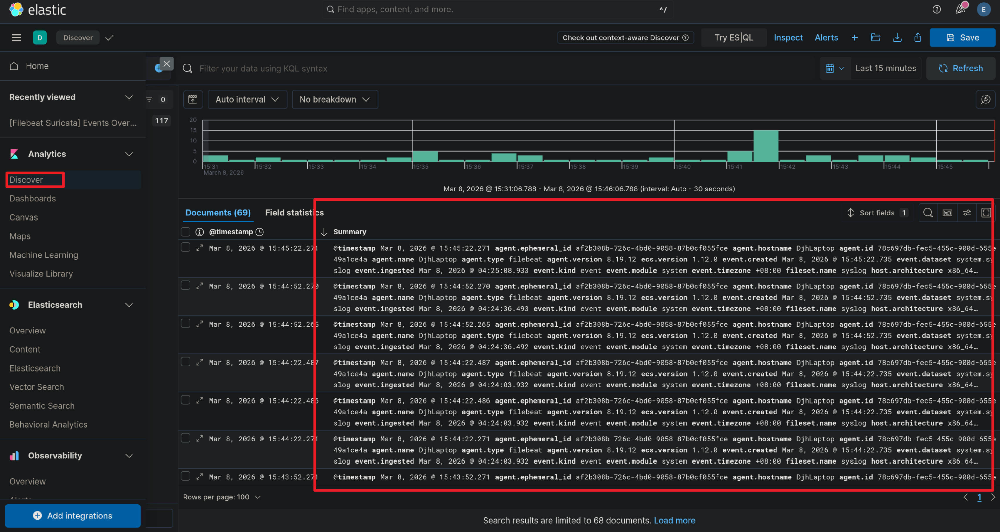

## 目录

[TOC]

---

## 前言


Filebeat 是 Elastic Stack  里专门用来采集日志，并发送到后端的轻量级日志采集器。

它的核心作用是：从服务器上读取日志文件，然后把日志发送到集中日志系统：

- 监控日志文件（如`/var/log/*.log`）
- 读取新增日志
- 进行简单解析
- 发送到日志系统

---

## 安装

添加 GPG key：

```shell
wget -qO - https://artifacts.elastic.co/GPG-KEY-elasticsearch | sudo gpg --dearmor -o /usr/share/keyrings/elastic-keyring.gpg
```

添加 apt 源：

```shell
echo "deb [signed-by=/usr/share/keyrings/elastic-keyring.gpg] https://artifacts.elastic.co/packages/8.x/apt stable main" | sudo tee /etc/apt/sources.list.d/elastic-8.x.list
```

安装：

```shell
sudo apt update
sudo apt install filebeat -y
```

启动：

```shell
sudo systemctl daemon-reload
sudo systemctl enable filebeat
sudo systemctl start filebeat
```

---

## 配置


---

## 内置模块

filebeat 内置了一些常见服务的模块，比如 system、nginx，可以通过以下命令查看：

```shell
sudo filebeat modules list
```

比如，启动 system 模块：

```shell
sudo filebeat modules enable system
```

配置 system module：

```shell
sudo vim /etc/filebeat/modules.d/system.yml
```

内容如下：

```yaml
- module: system
  # Syslog
  syslog:
    enabled: true

    # Set custom paths for the log files. If left empty,
    # Filebeat will choose the paths depending on your OS.
    #var.paths:

    # Use journald to collect system logs
    var.use_journald: true

  # Authorization logs
  auth:
    enabled: true

    # Set custom paths for the log files. If left empty,
    # Filebeat will choose the paths depending on your OS.
    #var.paths:

    # Use journald to collect auth logs
    var.use_journald: true
```

system module 默认采集：

- /var/log/syslog
- /var/log/auth.log

我用的是 debian13，使用的是 journald，所以这里`var.use_journald`要改为 true。

启动 nginx 模块步骤和 system 类似：

```shell
sudo filebeat modules enable nginx
```

配置 nginx 模块：

```yaml
- module: nginx
  # Access logs
  access:
    enabled: true

    # Set custom paths for the log files. If left empty,
    # Filebeat will choose the paths depending on your OS.
    #var.paths:

  # Error logs
  error:
    enabled: true

    # Set custom paths for the log files. If left empty,
    # Filebeat will choose the paths depending on your OS.
    #var.paths:

  # Ingress-nginx controller logs. This is disabled by default. It could be used in Kubernetes environments to parse ingress-nginx logs
  ingress_controller:
    enabled: false

    # Set custom paths for the log files. If left empty,
    # Filebeat will choose the paths depending on your OS.
    #var.paths:
```

配置好后，重启 filebeat 服务：

```shell
sudo systemctl restart filebeat
```

如果 system 和 nginx 的日志成功导入了 ES，那么可以看到 ES 应该是有 filebeat 的 datastream 的。

通过`/_cat/indices?v`可以看到：

```
yellow open   .ds-filebeat-8.19.12-2026.03.07-000001                             WmKwYxg2Q8KJ7rhqJOFJKQ   1   1    5120311            0    794.1mb        794.1mb      794.1mb
```

在 kibana 的 discover 页面可以开始检索和可视化日志记录。



---

## 

---

## 参考

1. https://www.elastic.co/guide/en/beats/filebeat/8.19/filebeat-overview.html
2. https://www.elastic.co/guide/en/beats/filebeat/8.19/how-filebeat-works.html
