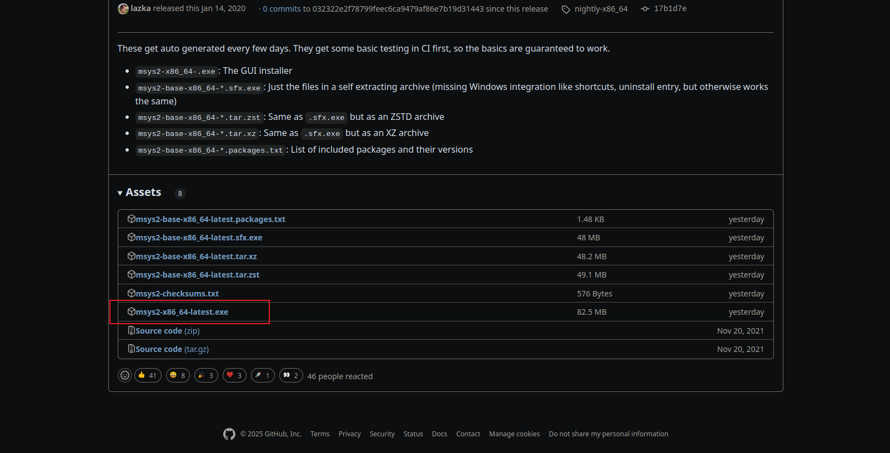

## 目录

[TOC]

---

## 前言

本文介绍了如何在 Linux（Ubuntu）和 Windows（Win10）下安装基本的 GTK4 开发环境，以及示例代码的运行。

---

## 示例代码

示例代码从官方文档获取：https://www.gtk.org/docs/getting-started/hello-world/

hello.c 代码如下：

```c
#include <gtk/gtk.h>

static void
print_hello (GtkWidget *widget,
             gpointer   data)
{
  g_print ("Hello World\n");
}

static void
activate (GtkApplication *app,
          gpointer        user_data)
{
  GtkWidget *window;
  GtkWidget *button;

  window = gtk_application_window_new (app);
  gtk_window_set_title (GTK_WINDOW (window), "Hello");
  gtk_window_set_default_size (GTK_WINDOW (window), 200, 200);

  button = gtk_button_new_with_label ("Hello World");
  g_signal_connect (button, "clicked", G_CALLBACK (print_hello), NULL);
  gtk_window_set_child (GTK_WINDOW (window), button);

  gtk_window_present (GTK_WINDOW (window));
}

int
main (int    argc,
      char **argv)
{
  GtkApplication *app;
  int status;

  app = gtk_application_new ("org.gtk.example", G_APPLICATION_DEFAULT_FLAGS);
  g_signal_connect (app, "activate", G_CALLBACK (activate), NULL);
  status = g_application_run (G_APPLICATION (app), argc, argv);
  g_object_unref (app);

  return status;
}
```

---

## Ubuntu

在 Ubuntu 下开发 GTK4，至少需要把编译工具链和 GTK4 安装好：

```sh
sudo apt update
sudo apt install build-essential
sudo apt install libgtk-4-dev
```

把示例代码保存，文件名为 hello.c，编译和运行：

```sh
# 编译
gcc $(pkg-config --cflags gtk4) hello.c $(pkg-config --libs gtk4)
# 运行
./a.out
```

效果如下：


---

## Windows

windows 下开发 GTK4 稍微麻烦些，根据官方推荐：https://www.gtk.org/docs/installations/windows/

这里使用 MSYS2 的开发环境，官方下载教程：https://www.msys2.org/docs/installer/

在 Github 上找到下载文件，https://github.com/msys2/msys2-installer/releases/tag/nightly-x86_64



安装好后，打开 UCRT64


pacman 安装编译工具链和 gtk4：

```sh
pacman -Syu
pacman -S mingw-w64-ucrt-x86_64-toolchain
pacman -S mingw-w64-ucrt-x86_64-pkgconf
pacman -S mingw-w64-ucrt-x86_64-gtk4
```

然后同样的编译和运行示例程序：

```sh
# 编译
gcc $(pkg-config --cflags gtk4) hello.c $(pkg-config --libs gtk4)
# 运行
./a.exe
```

效果如下：


