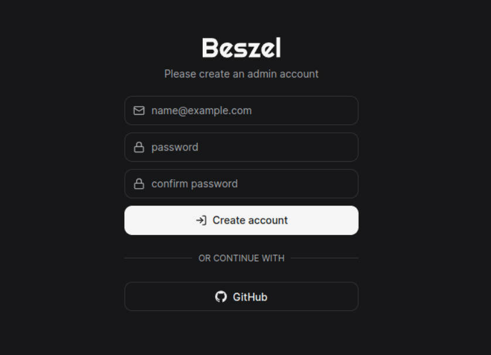
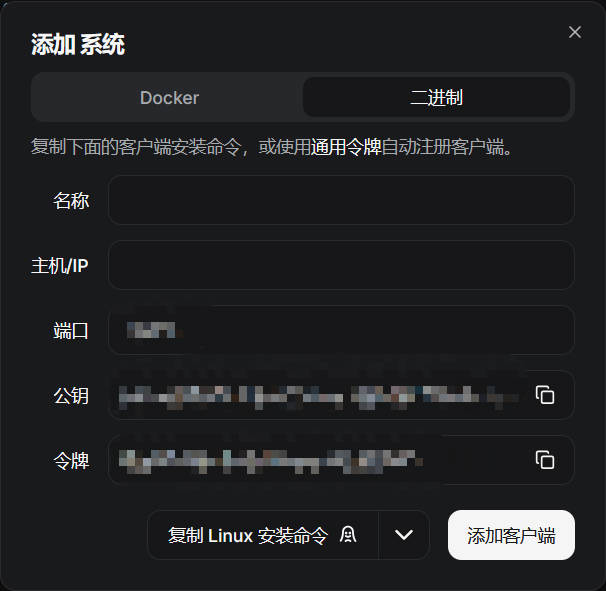
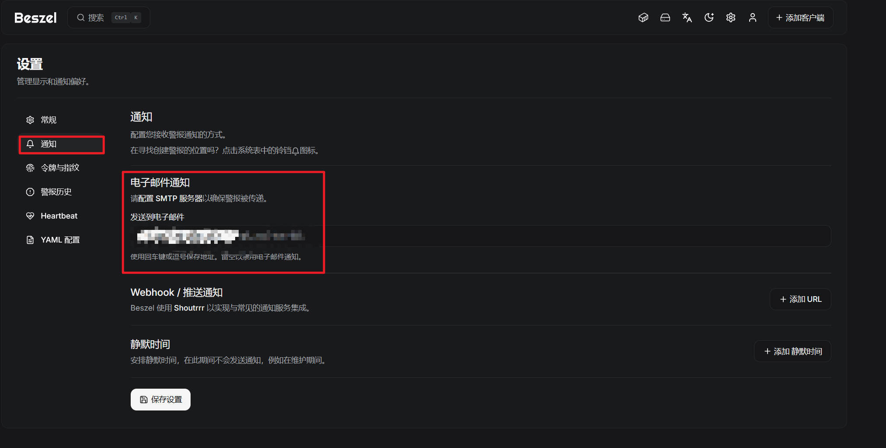
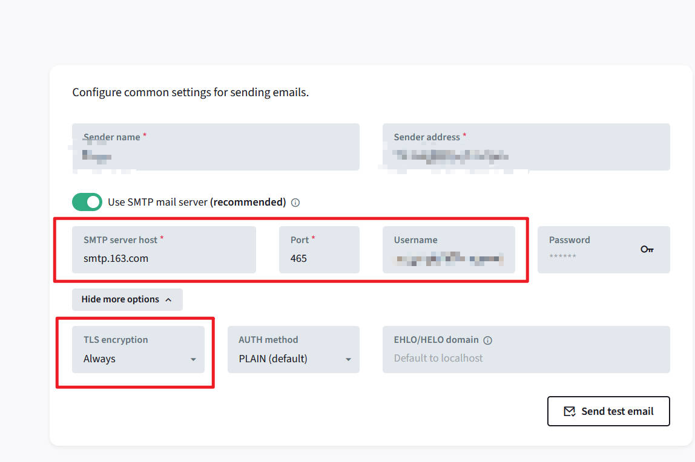
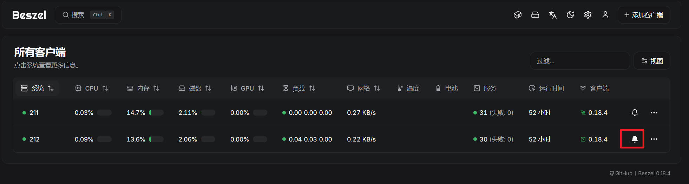
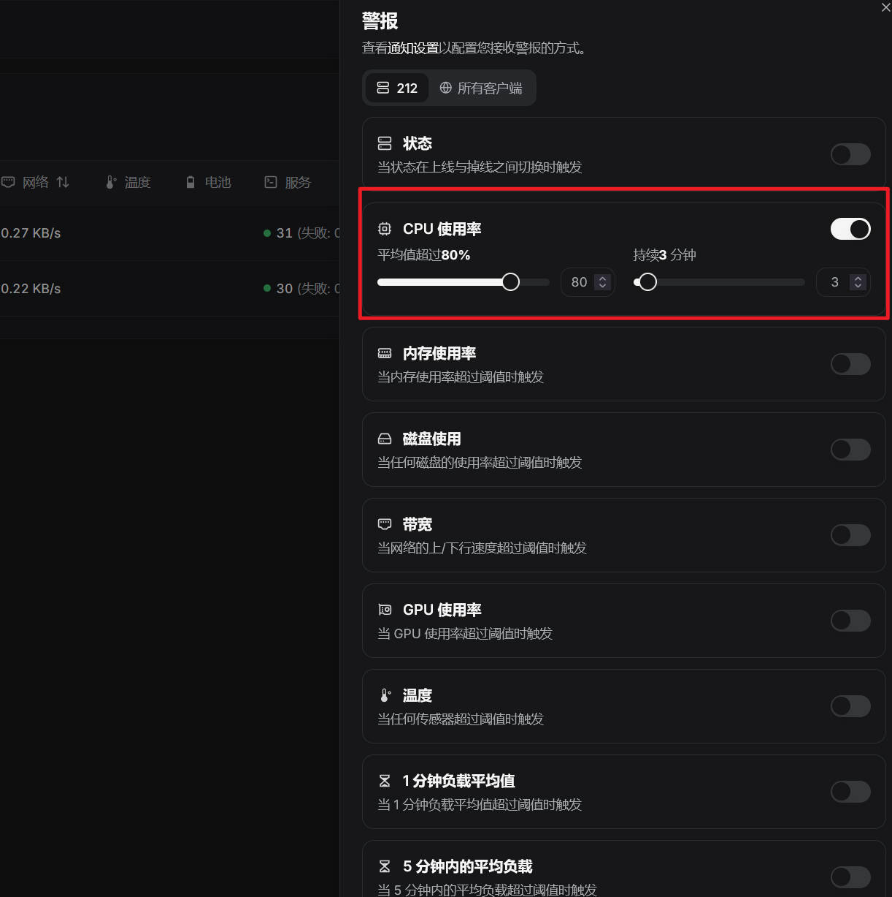

## Beszel

Beszel 是一个轻量级的服务器监控平台，包含 Docker 统计信息、历史数据和警报功能，使用 Go 开发，支持跨平台。

Beszel 主要有两个组件：

- 中心（Hub）：仪表盘，查看和管理系统
- 代理（Agent）：代理在要监控的每个系统上运行，并将系统指标传递给中心

---

## 安装

Beszel 支持 Docker 或者二进制安装，参考：

Hub：https://www.beszel.dev/zh/guide/hub-installation

Agent：https://www.beszel.dev/zh/guide/agent-installation

首先安装并启动 Hub，然后在 http://your_ip:8090 的 web 页面上创建第一个管理员账号：



进入系统后，右上角点击“添加客户端”：



把安装命令复制到需要监控的客户端服务器上运行，客户端执行完命令后，回到 Hub Web 页面，点击添加客户端。

---

## 告警

Beszel 支持邮件告警和 Webhook 推送通知，这里介绍下 SMTP 的配置和 Webhook 的使用。

### 配置 SMTP



把自己开通的 SMTP 服务器的地址，端口，用户名和密钥填写在 Mail setttings 中：



配置好后，回到首页，对需要进行告警配置的服务器，点击小铃铛：



可以对不同的指标进行告警配置：



### Webhook

Beszel 中的通知使用 Shoutrrr URL 模式定义，详细信息参考：https://beszel.dev/zh/guide/notifications/

Beszel 支持常见的推送目标（比如：telegram、ntfy、bark、discord等等），这里以通用通知（generic）为例。

> 通用服务可用于任何 Shoutrrr 未明确支持的目标，只要它支持通过 POST 请求接收消息即可。
> 有时这需要在接收端进行自定义以解析 payload，或使用中间代理来修改 payload。
> generic://example.com

这里准备一台可以接收到消息的服务器，然后通过（Spring Boot、Flask 之类的web框架）提供 webhook 接口：

```python
@app.post("/beszel-notify")
async def beszel_notify(request: Request):
    """
    接收 Beszel 发送的通知
    Body JSON:
    {
        "title": "通知标题",
        "message": "通知正文",
        "tags": ["tag1","tag2"],
        "level": "info"  // 或 error, warn, debug
    }
    """
    data = await request.json()
    title = data.get("title", "No Title")
    message = data.get("message", "No Message")
    level = data.get("level", "info")
    tags = data.get("tags", [])

    print(f"[{level.upper()}] {title}: {message} (tags: {tags})")

    return {"status": "ok"}
```

beszel hub 一旦触发告警，就会往这个 webhook 接口发送告警信息。

beszel hub 配置好 URL 即可：


---

## 参考

1. https://www.beszel.dev/zh/guide/getting-started
2. https://juejin.cn/post/7582479325284548671
3. https://www.cnblogs.com/minseo/p/18728811
4. https://blog.csdn.net/gitblog_00075/article/details/151310248