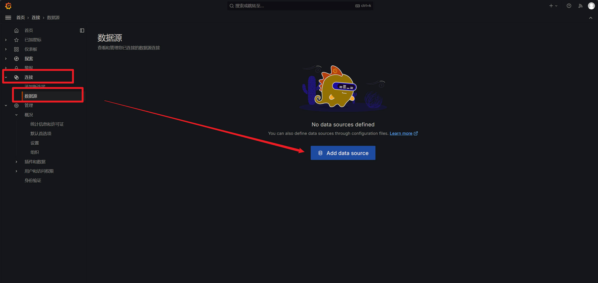

## 前言

之前很长一段时间，我对于 Linux 的监控仅仅停留在原始的命令当中（top，ss，du/df，free，ping，telnet），有些状况下，比如在内网环境中，这是最直接的方法，但是对于一些长期运行的服务器而言，监控和告警是必不可少的，尤其是告警，可以在定义的指标条件下，及时的反馈问题，消灭问题于萌芽之中，而不是当一个救火的队员。

有效的监控和图形界面，可以实时通过 web 端查看，当问题发生时，减少敲击命令的心智负担（是的，很多紧急情况下，很容易敲错命令），还可以收集数据，方便后续统计。

有过之前几家公司的惨痛经历，如果我未来再经手复杂且长期的项目，技术选型时，优先会调研监控，告警，日志等等的基础设施。

监控，告警方面，网上应用比较广泛的应该就是本文提到的 Prometheus 和 Grafana 了。

Prometheus 负责采集数据，通过目标机器上安装的 exporter，从远程采集数据并存储在本地的时序数据库中。

Grafana 负责查询，可视化，告警，Prometheus 采集的数据流入 Grafana，通过配置数据源和仪表盘展示各维度的数据。

除了这俩外，网上比较流行的还有 Zabbix 和 ELK。

Zabbix 应该对标 Prometheus + Grafana，生态似乎更大更老派些。

ELK 主要是日志收集和分析，类似的是 Prometheus 生态下的 Loki。

以后有机会，都研究下。

---

## Prometheus 的基本工作方式

Prometheus 的工作原理主要围绕着数据采集、存储、查询和告警四个方面进行。

它通过主动拉取（pull）的方式从目标机器获取监控数据，并将数据存储为时间序列，方便后续分析和告警。

核心组件有以下几个：

1. Prometheus Server：核心组件，负责定期从各个监控目标拉取数据，并将数据存储为时间序列。
2. Exporters：指标导出组件，如 Node Exporter（系统级指标），将目标机器上的数据暴露在 HTTP 接口上，供 Prometheus 主动的拉取。
3. Alertmanager：告警管理组件，接收 Prometheus 的告警事件并发送通知（如邮件、Slack 等）。
4. Data Storage：Prometheus 内置时间序列数据库，用于存储所有采集到的数据。

### 采集流程

Prometheus 主要使用 HTTP pull 的方式定期从各个监控目标获取数据。
每个监控目标（如服务器或服务）都需要暴露一个 HTTP 端点，例如：

```cmd
http://<target-ip>:9100/metrics
```

监控目标的 HTTP 端点返回的数据是 纯文本格式，每一行记录一个时间序列数据（指标名 + 标签 + 值）。示例如下：

node_cpu_seconds_total{cpu="0",mode="idle"} 12084.34
node_cpu_seconds_total{cpu="0",mode="user"} 5784.12

---

## 安装 Prometheus 和 Prometheus-node-exporter

本机操作系统是 Debian 12，确保权限和 apt 的更新后，开始安装 Prometheus 和 node exporter：

```bash
sudo apt install -y prometheus prometheus-node-exporter
```

systemctl 查看是否运行以及是否开机自启：

```bash
sudo systemctl status prometheus
sudo systemctl is-enabled prometheus

sudo systemctl status prometheus-node-exporter
sudo systemctl is-enabled prometheus-node-exporter
```

Prometheus 配置文件地址：/etc/prometheus/prometheus.yml

---

## 默认配置

9090 是 Prometheus 对外提供服务器的端口。

9100 是目标机器的 node exporter 对外提供的端口

```bash
curl localhost:9090/metrics
curl localhost:9100/metrics
```

---

## 安装 Grafana

依赖项

```shell
sudo apt install -y apt-transport-https software-properties-common wget
```

引入 Grafana 的 GPG key：

```shell
sudo mkdir -p /etc/apt/keyrings/
wget -q -O - https://apt.grafana.com/gpg.key | gpg --dearmor | sudo tee /etc/apt/keyrings/grafana.gpg > /dev/null
```

stable：

```shell
echo "deb [signed-by=/etc/apt/keyrings/grafana.gpg] https://apt.grafana.com stable main" | sudo tee -a /etc/apt/sources.list.d/grafana.list
```

beta：

```shell
echo "deb [signed-by=/etc/apt/keyrings/grafana.gpg] https://apt.grafana.com beta main" | sudo tee -a /etc/apt/sources.list.d/grafana.list
```

apt 更新：

```shell
sudo apt update
```

安装 Grafana OSS（开源社区版本）

```shell
sudo apt install -y grafana
```

systemctl 检查：

```bash
sudo systemctl status grafana-server
sudo systemctl is-enabled grafana-server
# 没启动的话，手动启动下
sudo systemctl start grafana-server
sudo systemctl enable grafana-server
```

Grafana 配置文件地址：/etc/grafana/grafana.ini

---

## Grafana web 界面

Grafana 默认的 web 端口是 3000，默认的账号和密码都是 admin


点击 Log in，会提示你设置一个新密码：


进入主界面后，可以设置语言为中文：


如果是内网服务器，到这一步就成功了，如果是公网服务器，想要通过 Nginx 代理路径的方式映射到 3000 端口，那么需要找到 Grafana 配置文件中的 root_url 中，修改路径：

```ini
root_url = %(protocol)s://%(domain)s:%(http_port)s/你自己设置的nginx代理路径/
```

nginx 的 server 块中，加上：

```nginx
# grafana
location /代理路径/ {
    proxy_set_header Host 你的域名;
    proxy_pass http://localhost:3000/;
}
```

比如，你的域名是 example.com，如果不进行 Nginx 代理，就需要开放端口，访问 Grafana 地址就是：

```
http://example.com:3000
```

如果进行 Nginx 代理，代理路径是 /monitor，那么就需要按以上的配置：

/etc/grafana/grafana.ini：

```ini
root_url = %(protocol)s://%(domain)s:%(http_port)s/monitor/
```

nginx.conf：

```nginx
# grafana
location /monitor/ {
    proxy_set_header Host example.com;
    proxy_pass http://localhost:3000/;
}
```

example.com 也可以用 Nginx 的变量——$host 来替代。此时，访问 Grafana 地址就是：

```cmd
http://example.com/monitor/
```

要配置 proxy_set_header 是为了解决跨域问题，nginx 代理后，host 会变成 localhost:3000，所以需要强制 Nginx 保持请求的 Host 头为浏览器的原始域名，使 Grafana 认为请求是从合法来源发出的。

---

## Node Exporter Dashboard

这里选择的是 [Node Exporter Full | Grafana Labs](https://grafana.com/grafana/dashboards/1860-node-exporter-full/)

Prometheus 默认安装就配置了一个 job_name 名为 node 的 job，所以直接配置数据源和仪表盘即可。

### 数据源




这里填的端口需要注意，是 9090，也就是 Prometheus 对外提供的服务端口，而不是 node exporter 的 9100 端口，原因是 Prometheus 负责通过 9100 端口向 Node Exporter 采集机器的指标数据，但这与 Grafana 无关。Grafana 无需直接访问 Node Exporter，它只需从 Prometheus 获取数据。

其他的不用填，点击 save&test 即可


出现以下内容表示成功：


### 仪表盘

回到数据源的界面


填入 id = 1860，然后点击加载


选择数据源


最后点击 import，完成。

## 效果


---

## 简单的测试

编写几个 Python 方法来打高 CPU、内存、磁盘的占用率，看看 Grafana 的仪表盘对应显示的效果。

该脚本写的极其随意，仅供测试环境参考。

```python
import os
import time
import psutil
from multiprocessing import Process

def gradual_increase(step_duration: int, total_duration: int, target_usage: float, func):
    """在总时间内逐步提高占用率，每步增加一定比例的资源使用。
    
    Args:
        step_duration: 每次增加占用率的时间间隔（秒）。
        total_duration: 总测试时间（秒）。
        target_usage: 最终目标占用率（0 ~ 1）。
        func: 要执行的资源占用函数。
    """
    steps = total_duration // step_duration
    for i in range(1, steps + 1):
        usage = min(i / steps * target_usage, target_usage)
        print(f"当前占用率: {usage * 100:.2f}%")
        func(step_duration, usage)

def consume_cpu(duration: int, usage: float):
    """占用指定比例的 CPU。"""
    def busy_loop():
        start = time.time()
        while time.time() - start < duration:
            end = time.time() + usage
            while time.time() < end:
                pass  # 忙等占用 CPU
            time.sleep(1 - usage)

    processes = [Process(target=busy_loop) for _ in range(os.cpu_count())]
    for p in processes:
        p.start()
    for p in processes:
        p.join()

def consume_memory(duration: int, usage: float):
    """占用指定比例的内存。"""
    total_memory = psutil.virtual_memory().total
    target_memory = int(total_memory * usage)

    data = []
    try:
        print(f"开始占用约 {target_memory / (1024 ** 3):.2f} GB 的内存...")
        while psutil.virtual_memory().used < target_memory:
            data.extend([0] * (10 ** 6))
        time.sleep(duration)
    except MemoryError:
        print("内存耗尽！")
    finally:
        del data

def consume_disk(duration: int, usage: float, path="/tmp/testfile"):
    """占用指定比例的磁盘空间。"""
    total_disk = psutil.disk_usage('/').total
    target_disk = int(total_disk * usage)

    print(f"开始占用约 {target_disk / (1024 ** 3):.2f} GB 的磁盘空间...")
    with open(path, "wb") as f:
        f.write(b"\0" * target_disk)

    time.sleep(duration)
    os.remove(path)

if __name__ == "__main__":
    # 示例：在 60 秒内，CPU 占用逐步增加到 90%
    gradual_increase(step_duration=1, total_duration=60, target_usage=0.9, func=consume_cpu)

    # 示例：在 60 秒内，内存占用逐步增加到 80%
    gradual_increase(step_duration=10, total_duration=60, target_usage=0.8, func=consume_memory)

    # 示例：在 60 秒内，磁盘占用逐步增加到 80%
    gradual_increase(step_duration=10, total_duration=60, target_usage=0.8, func=consume_disk)

```

运行脚本前：


整个测试总时间 3 分钟，CPU 先逐步增加到 90%，然后内存逐步增加到 80%，最后磁盘空间逐步增加到 80%，运行后：


grafana 的仪表盘相当直观，再也不用盯着黑框框里的数据了。
