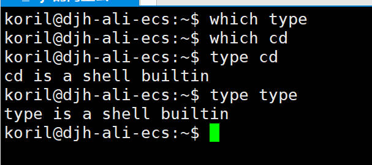

## 前言

在服务器运维的时候，我们不能寄希望于每个工程师都按照标准的目录结构存放特定类型的软件包或者文件。特别是当有些配置文件隐藏的目录层级很深，或者没有放到默认的目录下，如果不借助查找相关的命令，根本无从下手。

---

## which 和 type

which 用于查找并显示给定命令的绝对路径，环境变量 PATH 就是需要遍历的目录列表。使用 which 可以看到命令是否存在，以及存在的话，执行的是那个目录下的命令。


### 外部命令

PATH 中包含的 /bin、/user/bin 这些都是存储外部命令，外部命令存在于 bash shell 之外，开销较大。


### 内部命令

内部命令和 bash shell 编译成一体，which 只显示外部命令，诸如 cd 这种内部命令就无法显示。


与 which 不同，type 不仅可以显示外部命令，也可以显示内建命令。



有些命令存在多种实现，既有内建命令，也存在外部命令，可以使用 type -a 显示出命令的所有实现。


---

## whereis

和 which 类似，不过 whereis 除了可以搜索到命令的绝对路径，还可以搜到手册文件路径和源代码文件路径。


可以看到 which 命令路径是 /usr/bin/which，而手册路径是 /usr/share/man/man1/which.1.gz

---

## locate

大多数发行版没有安装 locate，所以需要使用 apt 或者 yum 自行安装。

```bash
# 安装 locate
sudo apt install mlocate
# 更新索引库
sudo updatedb
```

locate 速度很快，原因是它使用预先构建的索引数据库查询，数据库一般 24 小时更新一次，缺点就是无法搜到最新的文件。


---

## find

locate 并不会全盘扫描文件系统，而是在数据库搜索，如果想要实时搜索给定的目录，更好的选择是 find，find 命令按照指定的路径，递归子目录进行搜索，优点就是能找到最新的文件，缺点是不如 locate 搜索索引库来得那么快。

locate 和 find 的挑选看需求，毕竟一个是索引库搜索，一个是递归目录搜索，实时性和速度没法兼得。

find 搜索的功能是最强大的，所以用法比上面几个命令都要复杂一些。

基本语法格式如下：

```bash
find [location] [expression]
```

### 搜索路径

仅仅指定搜索路径，而不加任何其他参数的话，就会把该路径下的文件和目录都递归的列出来。


### 测试选项

-name 可以指定文件名称，支持 Linux 的通配符，? 匹配一个字符，* 匹配零个或多个字符，[] 匹配指定字符中的其中一个。另外，使用 -name 时，是不包含前缀目录的，所以 -name 参数中如果出现 /，该搜索是无意义的，换句话说，-name 只对文件名进行搜索，不包含文件的所属目录路径。

```bash
# 创建一些文件
touch cat bat fat soat
```

-name 的使用示例


-path 就可以弥补 -name 不能搜索路径的缺点


-type 可以指定类型，类型如下：

* b：block 块文件
* c：character 字符设备文件
* d：directory 目录
* p：pipe 命名管道文件
* f：regular file 普通文件
* l：link 符号链接文件
* s：socket 套接字文件

最常用的就是 f 和 d。


-size 可以限定文件的大小，加号代表大于，减号代表小于，大小前如果没有加号或者减号表示等于。

单位：

* b：512 字节（默认单位），512-byte blocks
* c：字节
* w：2 字节
* k：kibibytes (KiB, units of 1024 bytes)
* M：mebibytes (MiB, units of 1024 * 1024 = 1048576 bytes)
* G：gibibytes  (GiB,  units  of  1024  * 1024 * 1024 = 1073741824
                       bytes)

```bash
# 大于 20M
find . -size +20M

# 小于 30k
find . -size -30k

# 等于 100M
find . -size 100M
```

-name、-type、-size 用的最多，其他的还有：

* 关于权限的 -perm
* 关于时间的 -atime、-mtime
* -empy 表示空文件/目录，例如找到空文件：find /etc -type f -empty，找到空目录：find /etc -type d -empty

这里不再赘述。

### 操作符

如同其他的编程语言一样，find 可以连接多个条件得到一个布尔值结果，来对搜索文件进行过滤。

```
exp1 exp2：等同于 and 操作符
exp1 -a exp2：等同于 and 操作符
exp1 -and exp2：与连接

exp1 -o exp2：等同于 or 操作符
exp1 -or exp2：或连接

! exp：等同于 not
-not exp：非
```

结合之前的搜索选项，比如，查找文件类型为普通文件，并且大小超过 100 M 的文件：

```bash
find /data -type f -and +100M
```

### 执行操作

find 通过一系列的 test 找到了需要的文件或者目录，我们可以对结果列表做各种操作（action）。

下面仅列举常用的几个：

* -print：默认的 action，输出搜索到的文件全路径。
* -ls：以 ls 的格式打印文件。
* -delete：删除文件，效率比用 -exec rm 更好些。
* -exec：可以执行后面给定的任何命令。

-exec 最复杂，需要详细解释下，它的格式如下：

```bash
-exec command 参数 \;
```

command 后面的所有内容都会被当作 command 的参数，直到 ; 为止，其中如果使用了 {}，则表示 find 找到的文件列表，在执行命令时，{} 会被逐一替换成 find 找到的文件。

特别注意，末尾的分号需要转义，因为 find 需要分号（;）或者加号（+）来判断 -exec 所调用的命令的参数终止位置。

下面是正确的格式案例：

```bash
find . -exec echo {} \;
find . -exec echo {} ';'
find . -exec echo {} ";"
find . -exec echo {} \+
find . -exec echo {} +
```

find 的 -exec 的终止符有两个，分号和加号，其中分号会使得每一个 find 到的文件去执行一次 -exec 后跟的命令。而加号则会让 find 到的文件一次性执行完 -exec 后跟的命令。

举个直观的例子，假如 find 找到了三个文件：file1，file2，file3。

```bash
# 分号结尾
find . -exec echo {} \;
# 执行等同于三次 echo
echo file1
echo file2
echo file3

# 加号结尾
find . -exec echo {} +
# 执行等同于一次 echo
echo file1 file2 file3
```

---

## 小结

本文介绍了 5 种 Linux 中的查找命令，其中 which、type、whereis 可以归为一类，它们主要用来寻找系统命令。

locate 和 find 可以归为另一类，它们更加通用也更复杂，locate 效率高，检索预先构建的数据库，find 实时性更好，在指定的目录下递归搜索。

---

## 参考

1. [Guide to the Linux find Command | Baeldung on Linux](https://www.baeldung.com/linux/find-command)
2. [linux - Why are the backslash and semicolon required with the find command's -exec option? - Stack Overflow](https://stackoverflow.com/questions/20913198/why-are-the-backslash-and-semicolon-required-with-the-find-commands-exec-optio)
3. [Linux find运行机制详解 - 骏马金龙 - 博客园 (cnblogs.com)](https://www.cnblogs.com/f-ck-need-u/p/6995529.html)
4. [Linux Shell基础 多个命令中的分号(;)、与(&&) 、 或(||) - lizhouwei - 博客园 (cnblogs.com)](https://www.cnblogs.com/lizhouwei/p/9991635.html)
