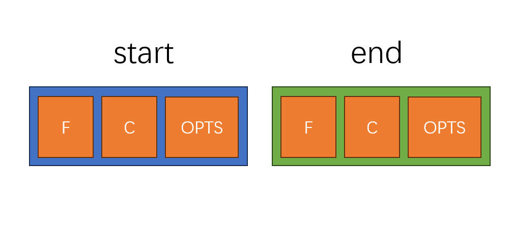
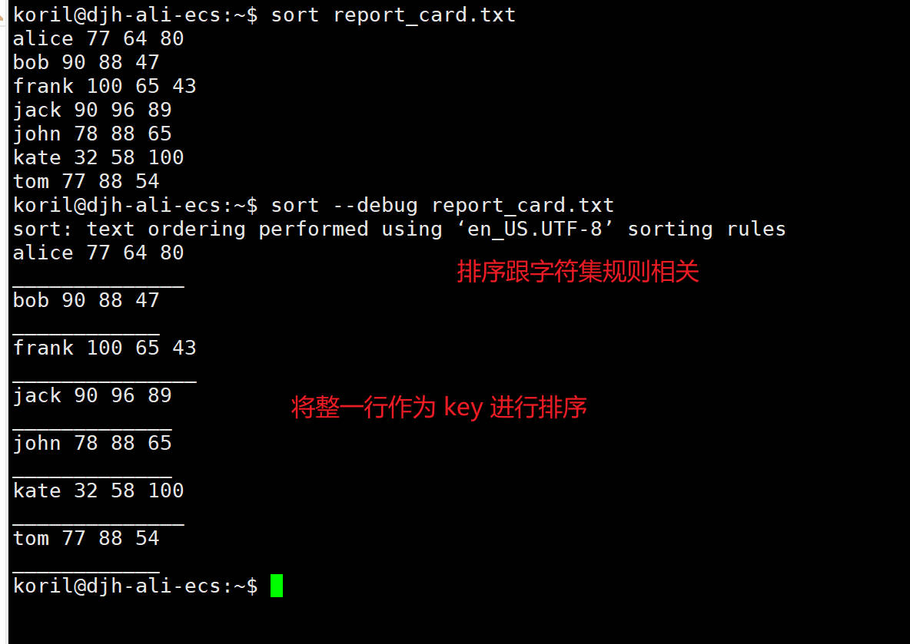
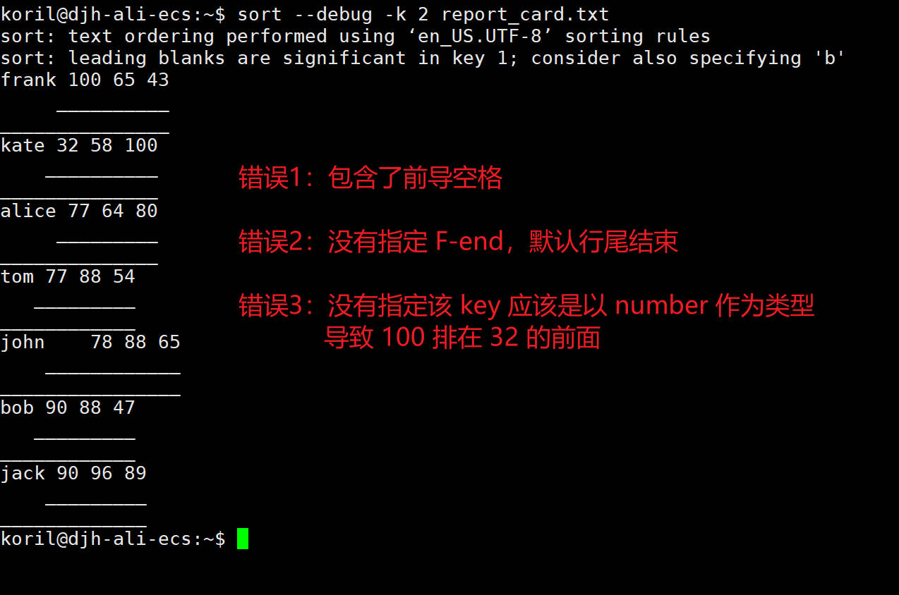
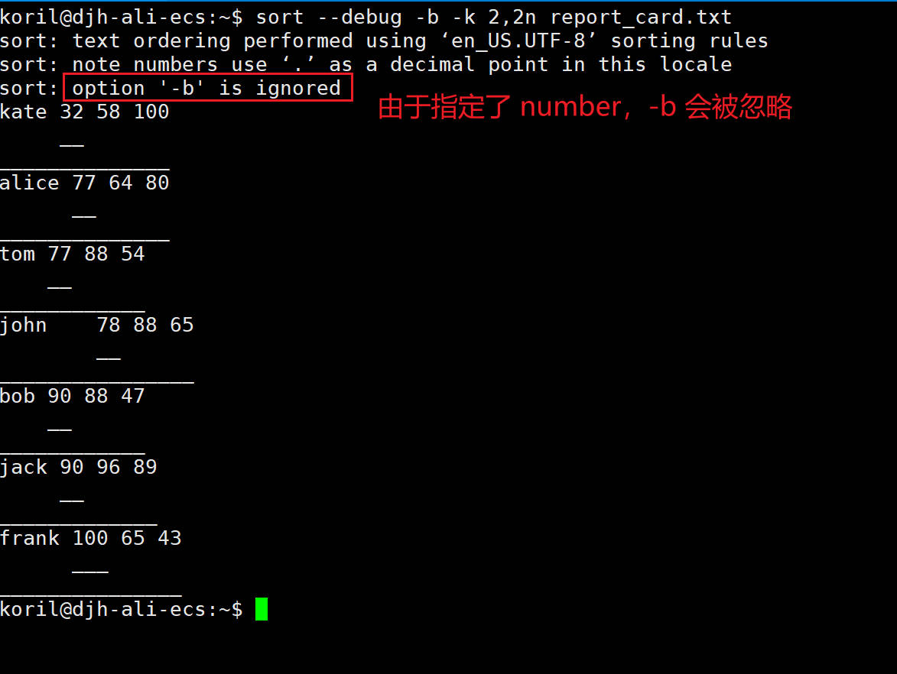
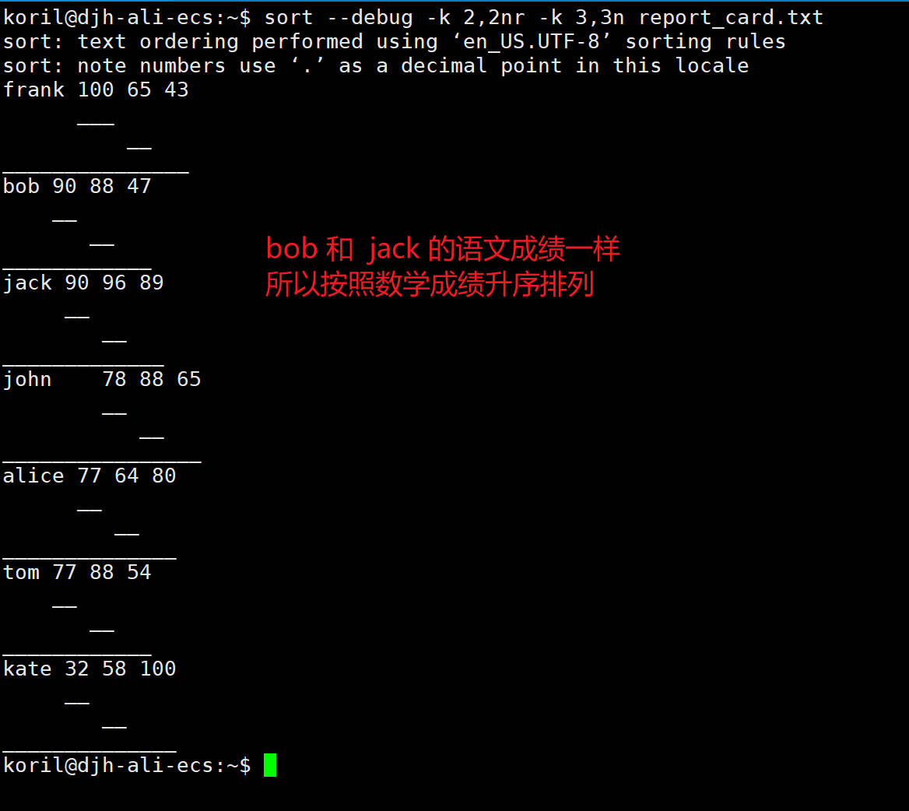
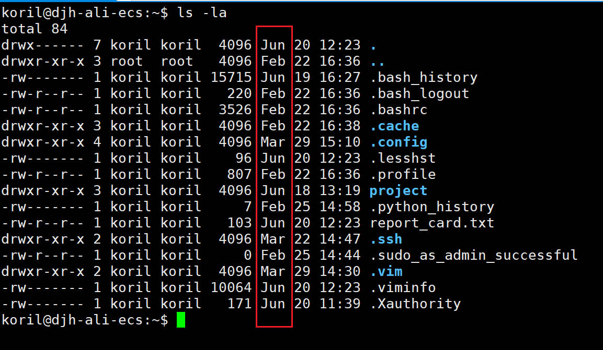
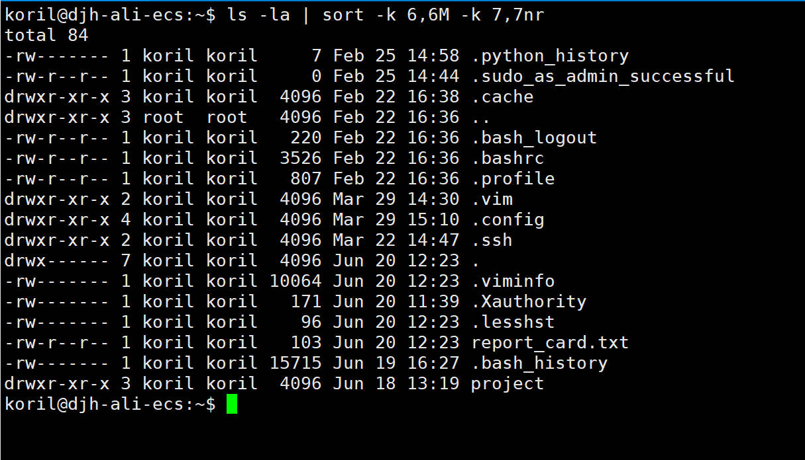
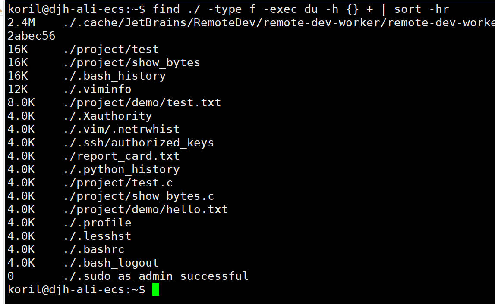
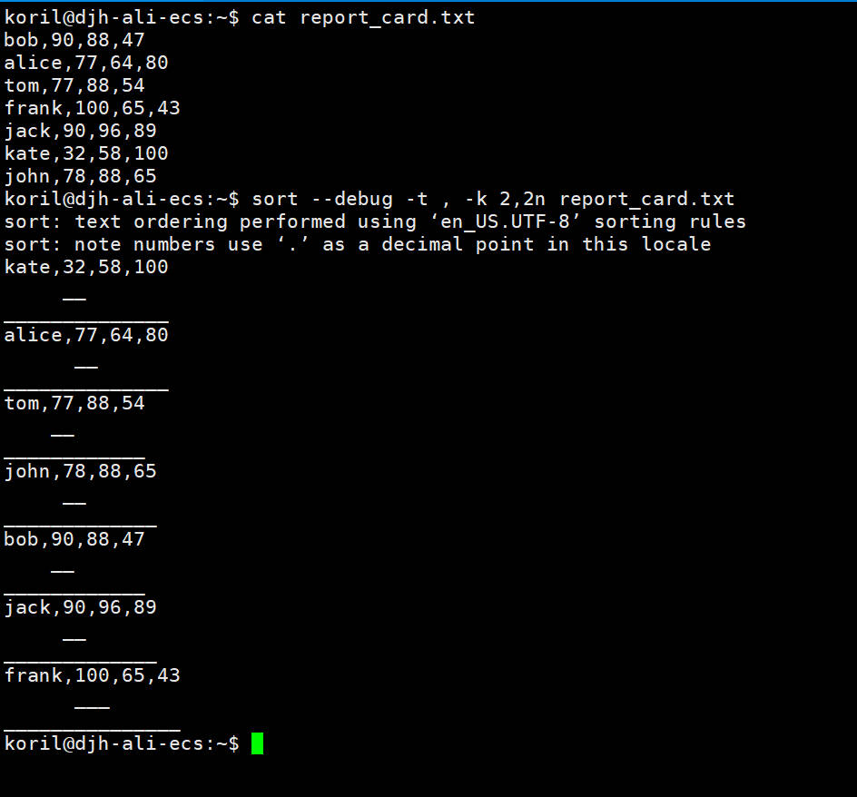

## 前言

对于文本文件，乱序往往是毫无意义的，我们可以借助排序工具，对一行行的文本按照某种规则排列，从有序中能获取到更加有用的信息。

---

## sort

### 默认排序

sort 的默认使用字母顺序来进行升序排列，如果 locale 命令看到 LC_COLLATE="en_US.UTF-8"，那就是按照 ASCII 来排序了。

```
# demo.txt 内容如下
go
dog
abandon
far
1kali
10demo
11far
01see
2book
```

sort demo.txt 排序后

```
01see
10demo
11far
1kali
2book
abandon
dog
far
go
```

### 反序

反转顺序，加上 -r 参数（reverse）即可：

```
sort -r demo.txt
# 结果如下
go
far
dog
abandon
2book
1kali
11far
10demo
01see
```

### 按照数字排序

很多文本行的开头是数字，加上 -n 参数，使用数字排序

```
# num.txt 内容如下
3. hello
9. world
1. demo
11. function
2. book
```

sort num.txt，不加 -n 的话，按照字典排：

```
11. function
1. demo
2. book
3. hello
9. world
```

sort -n num.txt，加上 -n 按照数字排序：

```
1. demo
2. book
3. hello
9. world
11. function
```

### 检查是否已排好序

-c 参数可以检查是否排好序，如果存在乱序，则会输出第一个乱序的信息。

### 去重

-u 参数在排完序之后，会去重。

### 保存结果

sort 仅仅会把排序好的内容显示在控制台上，不会修改原始文件的内容，如果需要保存可以使用 -o 参数指定存储文件，或者使用重定向（>）。

```bash
sort demo.txt -o sorted.txt
# 或者
sort demo.txt > sorted.txt
```

### 按照指定 key 排序

-k 这个参数，我觉得是 sort 里面所有参数里，最灵活和复杂的，但是该参数要实现的目标很好理解。

就像其他编程语言一样，-k 参数就是为了按照某个或者某几个字段进行排序，类似于 SQL 里面的 order by 多个字段，并且每个字段都可以定义升降序（desc，asc），python 中的 sort 函数的 key，Java 里的 stream().sorted(...).thenComparing(...) 都是实现了类似的多字段排序的效果。

节选 man sort 的 -k 参数解释：

> -k, --key=KEYDEF
>               sort via a key; KEYDEF gives location and type
>
> KEYDEF  is  F\[.C\]\[OPTS\][,F\[.C\]\[OPTS\]\] for start and stop position, where F is a
>        field number and C a character position in the field; both are origin 1, and the
>        stop  position  defaults  to the line's end.  If neither -t nor -b is in effect,
>        characters in a field are counted from the beginning  of  the  preceding  white‐
>        space.   OPTS is one or more single-letter ordering options [bdfgiMhnRrV], which
>        override global ordering options for that key.  If no key is given, use the  en‐
>        tire line as the key.  Use --debug to diagnose incorrect key usage.
>
> 译文：
>
> -k, --key=KEYDEF
>               通过一个 key 来排序，KEYDEF 给定了位置和类型
>
> KEYDEF 的格式为 F\[.C\]\[OPTS\][,F\[.C\]\[OPTS\]\] 定义了开始和结束的位置，F 表示字段编号，C 表示在这个字段中的字符位置，都是从 1 开始，默认的结束位置是行尾。如果 -t 和 -b 没效果，那么字符从前导空格开始数，OPTS 代表一个或多个选项 [bdfgiMhnRrV]，会在该 key 上覆盖全局排序选项的效果，如果没有给定 key'，那么默认以整行为 key。可以使用 --debug 去诊断错误的 key 的用法。

-k 由两部分组成，每一部分又分为三个内容。



相当于有 6 个参数，左半部分表示指定开始位置，右半部分表示指定结束位置。

* F-start：指定开始的字段编号
* C-start：在该字段内的第几个字符开始
* OPTS：一些选项
* F-end：指定结束的字段编号
* C-end：在该字段内第几个字符结束
* OPTS：一些选项

--debug 可以很好的看出 sort 命令是在用什么样的字段，进行排序。

一个简单的案例来说明 -k 的具体用法，下面是一张成绩单，第一个字段是 name，第二个到第四个字段，分别是语文、数学、英语的成绩：

```
# report_card.txt 内容如下
bob 90 88 47
alice 77 64 80
tom 77 88 54
frank 100 65 43
jack 90 96 89
kate 32 58 100
john 78 88 65
```

示例一：按照整行作为 key 排序



示例二：按照语文成绩（第二个字段）排序，sort 默认按照空白字符进行字段的分割。



我们可以看到如果不加 -t 和 -b 的话，字段开始是会把空格内容包含进去的，另外，-k 仅仅指定 2 的话，会把从第二个字段一直到行尾都看作一整个 key。

第一个错误，添加 -b 参数忽略前导空格即可，第二个错误，将 -k 2 改成 -k 2,2 同时指定开始和结尾的字段编号，第三个错误，添加 OPTS 的选项，指定该 key 的排序类型。

这里，还有一个需要注意的，如果我们指定了 key 的类型是 number，那么 -b 不加也是可以的，会自动去掉前导空格。

下面是正确的排序命令：



示例三：先按照语文成绩降序排列，若语文成绩相同，再按照数学成绩升序排列。



通过指定多个 -k 参数，可以对多个字段进行排序。

如果排序结果有任何疑问，--debug 参数很清楚的展示了排序所用的字段。

### 按照月份排序

在使用类似 ls -la 的命令时，我们会碰到月份字段，可以利用 sort 的 -M 参数来进行排序。



示例：先按照月份升序排列，再按照日期降序排列：



### 按照人类可读格式排序

在执行诸如 du -h 之类的指令时，会碰到 k，M，G 这种人类可读的大小单位，可以使用 sort 的 -h 参数，来进行排序。

示例：找到普通文件，按照占用空间的大小，降序排列。



### 指定分隔符

碰到类似 CSV 文件或者以非空白字符作为分隔符的文件，可以使用 sort 的 -t 参数指定字段的分隔符。

实例：分隔符为英文逗号的文件，按照第二个字段排序。



---

## 参考

1. [Linux sort命令简介 - 李理的博客 (fancyerii.github.io)](https://fancyerii.github.io/2019/06/15/sort/)
1. [Linux sort Command with Examples (phoenixnap.com)](https://phoenixnap.com/kb/linux-sort#ftoc-heading-6)
