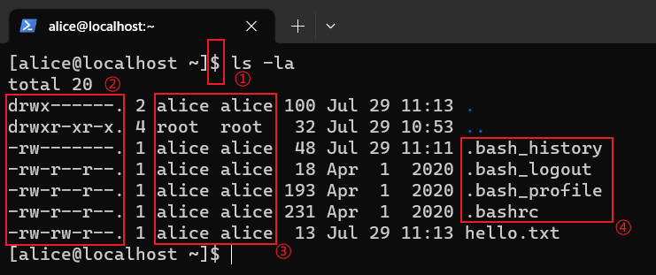
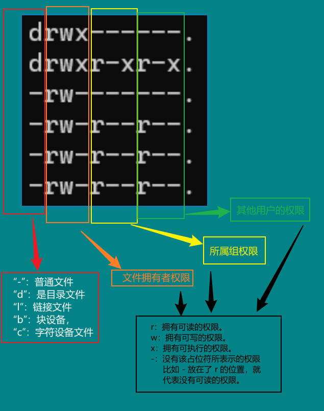
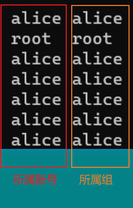
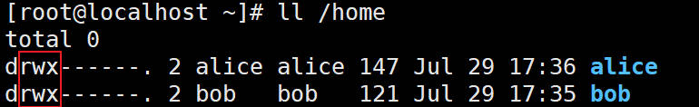
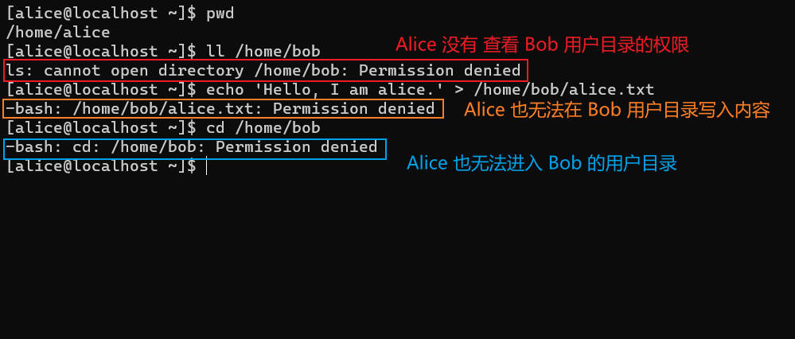
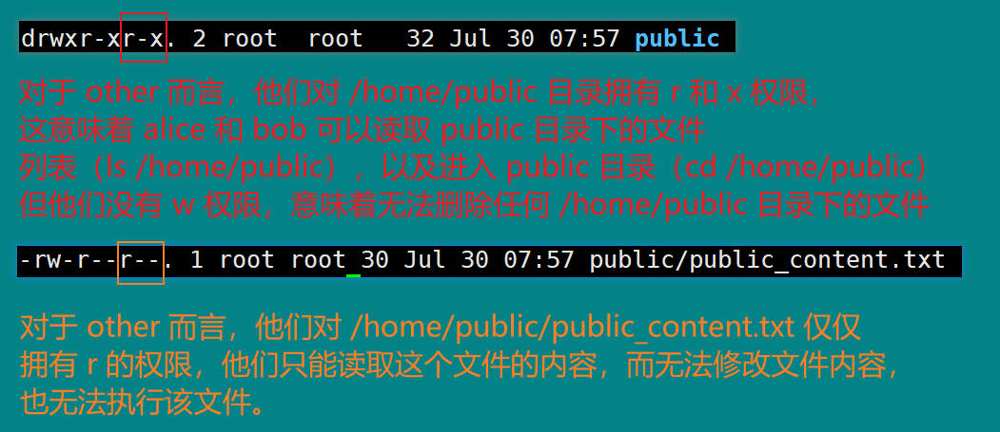
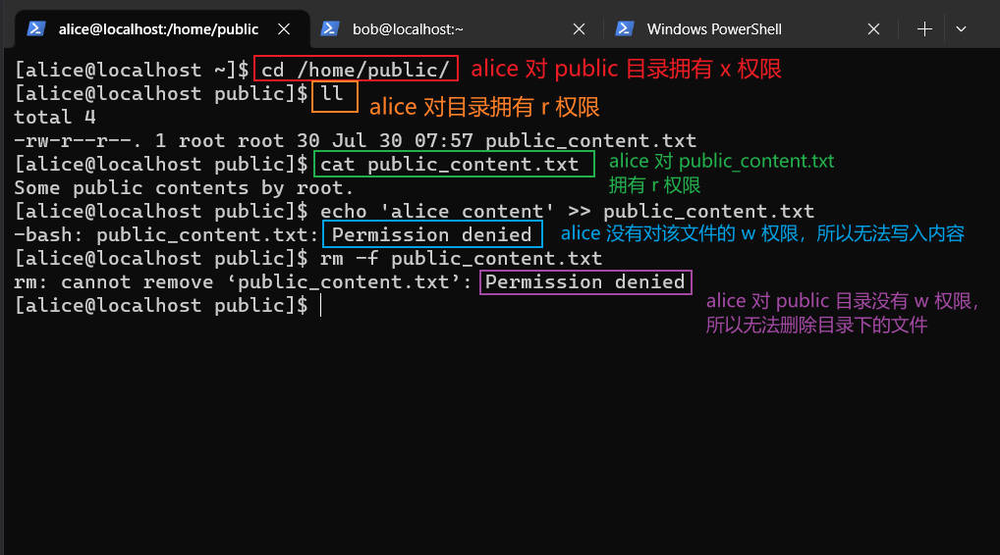

## 前言

Linux 作为大多数服务器上的操作系统，安全措施和访问控制是必要的，权限系统是其安全性的重要保障措施之一。

---

## 权限

什么是权限？权限就是：在多用户体系下，定义某一个用户（user）对于某一个资源（resource）可以执行的一系列操作（action）的集合。

打个比方，某个场馆举办演唱会，并不是所有人都能进去听，必须买票入场，手持门票的人才拥有了进入场馆的权限。

这个例子中，将用户分成两类，没有票的人和买了票的人，资源就是“演唱会场馆”，操作就是“进入”。

买票的人根据他们的票价分成几类，坐在前排的，坐在最外面的，可以拿到礼物的，这些都是不同的操作，一个人如果买了全价票，他的可能操作集合就是：

1. 进入场馆
2. 坐在第一排
3. 和明星握手拍照
4. 有免费的酒水
5. 礼物
6. ...

而买了最便宜的人，他的操作集合可能只有三个：

1. 进入场馆
2. 坐在最远的角落
3. 离开场馆

不同的票价对应了不同的人员分类，假设一个演唱会有 5000 个观众，我们不会像下面这样，一一列举从 1 号观众到  5000 号观众的权限范围：

* 1 号观众的权限：进入场馆，坐在第中间，离开场馆。
* 2 号观众的权限：进入场馆，免费的爆米花和可乐，坐在前排，离开场馆。
* ...
* 5000 号观众的权限：进入场馆，坐在外围，离开场馆。

这样非常麻烦，所以一般都会将用户分类（group），不同的类别包含了 1 个或者多个用户，对应着不同的权限。

* 100 元票价：aaa 的权限集合。
* 200 原票价：bbb 的权限集合。
* ...
* 2000 元票价：zzz 的权限集合。

上面的每个票价的分类包含了不同数量的购买用户，而用户根据他们所属的分类，来获取不同的权限。

---

## Linux 下的权限

Linux 是一个多用户操作系统（multi-user os），可能在某一时刻，有很多用户登陆同一个系统，对同一个资源要做出不同的操作，所以对于权限的管理非常重要。

通过上面演唱会的例子，很容易就能理解 Linux 下的权限概念，Linux 的被操作资源就是文件（file）。

文件有三个属性：

1. r：read，可读
2. w：write，可写
3. x：execute，可执行

这三个属性就是用户可以对一个文件进行的操作集合。

用户操作文件的权限，在 Linux 中是依靠身份（identity）来作为判断依据的。这个身份其实就是文件和用户之间的关系。

Linux 的 identity 有三类：

1. u：user，用户或者说是拥有该资源的属主
2. g：group，所属组
3. o：other，其他人，也就是除了 user 和 group 之外的用户

Linux 中的权限系统，大部分都是对这个 identity 对于 file 的是否可读，可写，可执行做各种限制和操作。

比如，Linux 有 10 个用户（user），2 个组（group），那么合理限制每个用户，每个组以及其他人对于某一个文件的操作权限，就是服务器管理员的职责。

---

## 用户管理

Linux 的用户可以划分成三大类：

1. 普通用户：通过 useradd 创建出来的用户。
2. 系统用户：通常用于执行一些服务器软件而创建的用户。
3. 超级用户：root，对服务器上的所有资源拥有所有的操作权限。

在实际中，不建议使用 root 账号登陆服务器，因为这意味着最高的权限，超级用户在计算机操作系统王国中，就是国王，国王可能带领国家走向繁荣，但也可能因为权力的滥用和操作的失误，让国家陷入困境。

早在上个世纪 70 年代，人们就意识到了计算机中过大的权限带来的灾难性的问题，Saltzer 与 Schroeder 的计算机系统信息保护中提出：*系统的每个程序或者用户应该使用完成工作所需的最小权限工作*。

### 创建用户

任何一个要使用操作系统资源的用户，都必须首先向系统管理员申请一个账号，然后以这个账号的身份进入系统。

我们先以 root 的身份进入系统，然后添加新的账号：

```shell
useradd alice
```

通过 useradd 命令，我们建立了一个新的账号：alice。

有些系统不会自动创建用户目录，可能需要执行以下命令：

```
useradd -m alice
```

执行`ls /home`可以看到 home 下多了一个 alice 目录，这是默认的用户主目录，alice 一登录系统，就进入到这个目录下。

有些系统默认用 sh 而不是 bash 作为用户默认的 shell（可以查看 /etc/default/useradd 里面的 SHELL 变量），可以通过 -s 指定 bash：

```
useradd -m -s /bin/bash alice
```

### 设置密码

添加了新账号下一步就是设置密码，不然没法使用这个账号登录：

```shell
passwd alice
```

设置密码就可以通过 ssh 登录这个账号：

```shell
ssh alice@192.168.0.180
```

超级用户可以使用 passwd 命令为自己和其他用户指定口令，普通用户只能用它修改自己的口令（passwd 不加任何参数，就代表给自己的账号修改密码）。

### 用户权限相关信息

登陆成功，自动进入了 alice 的主目录：/home/alice

```shell
# 建立一个文本文件
echo 'hello alice!' > hello.txt

# 查看文件详细信息
ls -la
```

打印出 /home/alice 下的所有文件信息，我们主要关注的是权限相关的信息。



一号方框：$ 符号开头的是非 root 用户，而 root 用户是以 # 符号开头。

二号方框：



在 Linux 中，有两种类型的文件：*普通文件*和*特殊文件*。

文件类型由文件模式的第一个字符（可以称之为：文件类型字段）来表示 。

普通文件可以通过其文件类型字段中的连字符来标识：`-`。普通文件可以包含数据或其他任何内容，它们被称为普通文件或常规文件，以区别于特殊文件。

特殊文件可以通过其文件类型字段中的非连字符（例如字母）来标识，并且操作系统的处理方式与普通文件不同。文件类型字段中出现的字符标志了文件的特殊文件类型。

例如，目录是最常见的特殊文件类型，由其文件类型字段中出现的字符来标识`d`（如上一个屏幕截图所示），还有其他几种特殊文件：

* l：链接文件。
* b：块设备文件，一般是硬盘。
* c：字符设备文件，字符设备文件以字节流的方式进行访问，由字符设备驱动程序来实现这种特性，这通常要用到 open、close、read、write 等系统调用。字符终端、串口和键盘等就是字符设备。
* p：管道文件，主要用于进程通信。
* s：套接字文件，用于网络通信。

第三个方框：



我们以刚刚新建的 hello.txt 文件为例：

```shell
-rw-rw-r--. 1 alice alice  13 Jul 29 11:13 hello.txt
# 逐个字符解释
"-": 代表 hello.txt 是一个普通文件
"rw-": 代表 hello.txt 的属主所拥有的权限，可读，可写，不可执行
"rw-": 代表 hello.txt 的属组所拥有的权限，可读，可写，不可执行
"r--": 代表其他用户对于 hello.txt 所拥有的权限，可读，不可写，不可执行
1: hello.txt 的硬链接数量
alice: 所属账号
alice: 所属组
13: 文件大小，单位是字节
Jul 29 11:13: 最后一次修改时间是 7 月 29 日 11 点 13 分
hello.txt: 文件名
```

第四个方框：

每个用户的根目录下都有的四个隐藏文件：

1. bash_history
   记录了用户执行的 bash 命令的历史。默认情况下，历史记录将命令存储在内存中，直到注销终端。
   注销后，这些命令将写入 ~/.bash_history 文档中的磁盘。
   历史记录缓冲区限制为 1000 个命令条目，历史记录文档限制为 2000 个条目。
2. .bash_logout: 
   在退出shell时被读取，所以可以把一些清理工作的命令放到这文件中。
3. .bash_profile: 
   用户登录时的初始化文件，设置环境变量，并且执行 .bashrc 文件的命令
4. .bashrc
   rc 表示 run command 或者 run control，用于用户自定义函数，命令别名，个性化设置。它是一个 shell 脚本，每当 Bash 以交互方式启动时都会运行。
   它初始化交互式 shell 会话，可以在该文档中放置可以在命令提示符下键入的任何命令。

每次用户登录时，都会执行 .bash_profile 和 .bashrc，这里的执行顺序如下：

```shell
/etc/profile
/etc/bashrc
~/.bashrc
~/.bash_profile
```

/etc/profile 和 /etc/bashrc 对所有用户生效，~/.bash_profile 和 ~/.bashrc 只对当前用户生效。

bash_profile 和 bashrc，主要有两个区别：

1. bash_profile 通常用于设置环境变量，bashrc 主要放置命令的别名，自定义函数等。
2. bash_profile 仅在用户每次新登陆时执行一次，而 baserc 会在每次 bash shell 时执行。

假设 alice 登陆了系统，然后连续执行了两次 /bin/bash，那么 /etc/profile 和 ~/.bash_profile 都仅会执行一次，而 /etc/bashrc 和 ~/.bashrc 都会各执行三次（一次登录，两次因为执行了 /bin/bash），执行顺序如下：

```shell
# 登录
/etc/profile
/etc/bashrc
/home/alice/.bashrc
/home/alice/.bash_profile
# 执行第一次 /bin/bash 命令
/etc/bashrc
/home/alice/.bashrc
# 执行第二次 /bin/bash 命令
/etc/bashrc
/home/alice/.bashrc
```

### 修改用户

添加完用户后，我们可以使用 usermod 来修改用户信息，

**语法格式：** usermod [参数] <用户名>

**常用参数：**

| 参数 | 作用                 |
| :--- | :------------------- |
| -u   | 修改用户UID          |
| -c   | 修改用户的说明/备注  |
| -g   | 修改用户的所属用户组 |
| -G   | 修改用户的附加组     |
| -L   | 锁定用户密码         |
| -U   | 解锁用户密码         |
| -s   | 修改用户的登录shell  |

### 删除用户

使用命令 userdel 删除用户，在删除之前确定用户没有登录。

**语法格式：** userdel [参数] [用户名]

**常用参数：**

| 参数 | 作用                 |
| :--- | :------------------- |
| -f   | 强制删除用户账号     |
| -r   | 同时删除用户的家目录 |

---

## 文件和目录的权限

### 权限字符的含义

文件有三种权限：r（read，可读），w（write，可写），x（execute，可执行）。

这里要特别区分，rwx 对于普通文件和目录的含义是不一样的。

对于普通文件而言，rwx 的含义：

* r（read file content）：读取文件内容的权限。
* w（write content to file）：写入内容到文件，修改文件的内容，但是不具备删除文件本身的权限。
* x（execute file）：执行文件的权限，Linux 下，判断一个文件是否可以被执行，就是根据 x 这个符号来确定的，而不像 Windows 一样根据后缀名来判定，所以说把 shell 脚本写入一个以 .txt 结尾的文件中，然后赋予它 x 的权限，它也可以执行。

对于目录而言，rwx 的含义：

* r（read list of files in directory）：浏览目录下的文件（ls some_dir），表示你可以查询该目录下的档案文件。
* w（modify contents of directory）：删除，移动（重命名）目录下的文件（rm，mv），在目录下创建新的文件。
* x（access directory）：进入该目录的权限（cd some_dir），将该目录作为工作目录。

所以，对于普通文件而言，rwx 面向的是普通文件里的内容，而对于目录而言，rwx 面向的是目录下的文件列表。

举个简单的例子：现在创建两个用户，alice 和 bob，他们都拥有自己的家目录（/home/alice 和 /home/bob），查看这两个目录的权限，可以看到，仅允许各自的 owner 拥有 rwx，所属组和其他用户没有任何执行权限。



alice 和 bob 之间互相为 other 的关系，所以 alice 无法进入 bob 的家目录，也无法创建文件，写入内容：



我们用 root 在 /home 下创建一个 public 目录，写入一个文件，pubic_content.txt，查看权限并分析：


执行一些命令来测试下：



如果 root 去掉了 other 的 x 权限，那么 alice 和 bob 仅仅拥有 r 权限，只能看看 public 目录下有什么文件，就连 ls -l 也无法正常执行了（因为文件的元数据依赖于 x 权限，ls 只能打印出文件名，大小，权限信息等这些元数据就无法获取了）。

### 更改文件或者目录的权限

变更文件或目录的权限使用 chmod 命令（change access mode of file or directory），既可以通过容易理解的字母参数更改，也可以通过数字来分配权限。

先讲字母的方式。

字符符号的解释如下：

```shell
u符号代表当前用户。
g符号代表和当前用户在同一个组的用户。
o符号代表其他用户。
a符号代表所有用户。
r符号代表读权限以及八进制数4。
w符号代表写权限以及八进制数2。
x符号代表执行权限以及八进制数1。
X符号代表如果目标文件是可执行文件或目录，可给其设置可执行权限。
s符号代表设置权限suid和sgid，使用权限组合u+s设定文件的用户的ID位，g+s设置组用户ID位。
t符号代表只有目录或文件的所有者才可以删除目录下的文件。
+符号代表添加目标用户相应的权限。
-符号代表删除目标用户相应的权限。
=符号代表添加目标用户相应的权限，删除未提到的权限。
```

举几个例子，就很容易理解了：

```shell
# 1. 给操作 /home/public 目录的所有用户（a）添加（+）执行权限（x）
chmod a+x /home/public

# 2. 移除（-）其他用户（o）对于 /home/public 目录的读权限（r）和写权限（w）
chmod o-rw /home/public

# 3. 添加（+）组用户（g）对于 /home/public 目录的执行权限（x）
chmod g+x /home/public

# 4. 设置其他用户对于 /home/public 目录获取所有权限（rwx）
chmod o=rwx /home/public

# 5. 设置其他用户删除对于 /home/public 目录的所有权限
chmod o= /home/public

# 6. 设置目录所属用户拥有可读可写可执行权限（rwx），组用户拥有可读可写权限（rw），其他用户拥有可读权限（r）
chmod u=rwx,g=rw,o=r /home/public

# 7. 递归设置 /home/pubic 及其子文件或目录，其他用户权限为（r）
chmod -R o=r /home/public
```

另外一种数字的方式，就是把 rwx 分别对应三个数字，然后通过求和得到最终的值代表不同的权限：

* r：4
* w：2
* x：1

求和：

```
0 = 0 + 0 + 0: 什么权限也没有
1 = 0 + 0 + x: 不可读，不可写，可执行
2 = 0 + w + 0: 不可读，可写，不可执行
3 = 0 + w + x: 不可读，可写，可执行
4 = r + 0 + 0: 可读，不可写，不可执行
5 = r + 0 + x: 可读，不可写，可执行
6 = r + w + 0: 可读，可写，不可执行
7 = r + w + x: 可读，可写，可执行
```

总共有 2 ^ 3 = 8 种可能性，下面举几个例子：

```shell
# 1. user 设置为 7（可读，可写，可执行），group设置为 5（可读，不可写，可执行），other 设置为 4 （可读，不可写，不可执行）
# 754: rwxr-xr--
chmod 754 /home/public

# 2. user 设置为 7（可读，可写，可执行），group 和 other 都为 0（不可读，不可写，不可执行）
# 700: rwx------
chmod 700 /home/public
```

### 改变文件或目录的所属用户和组

chown 可以改变文件的所属用户或者所属组

改变 /home/public 的所属用户为 bob：

```shell
chown bob /home/public
```

改变 /home/public 的所属组为 alice：

```shell
chown :alice /home/public
```

同时改变 /home/public 的用户为 alice，组为 bob：

```shell
chown alice:bob /home/public
```

---

## 用户组管理

每个用户都有一个用户组，系统可以对一个用户组中的所有用户进行集中管理。如果在创建用户的时候没有指定用户组，会自动创建同名的用户组。比如，创建了 alice 会同时创建一个名为 alice 的用户组。

用户组的管理涉及用户组的添加、删除和修改。组的增加、删除和修改实际上就是对/etc/group文件的更新。

用户和用户组属于多对多关系，一个用户可以从属于多个用户组，一个用户组也可以拥有多个用户。

用户组又分成两类：主要群组和附加群组。

一个用户必须且只能属于一个主要组群（primary group，或者称为初始群组 initial group），但是可以属于 0 个或者多个附加组群（secondary group），一个组群可以包含 0 个或者多个用户。

### 添加用户组

groupadd 命令可以创建新的用户组：

```shell
# 添加名为 science 的用户组
groupadd science

# 添加名为 math 的用户组
groupadd math
```

现在创建 science，math，english，music 四个群组，然后创建 koril，alice，bob，tom，jack 五个用户。

* science：koril，bob
* math：alice，bob
* english：bob，jack
* music：koril，tom，jack

将用户添加到每个附加群组使用 usermod -a -G 命令，-a 参数表示附加（append），只和 -G 参数一同使用，表示将用户增加到组中。

下面以将 koril 和 bob 两个用户添加到 science 群组中为例：

```shell
# 将 koril 和 bob 添加到 science 中
usermod -a -G science koril
usermod -a -G science bob

# 查看 koril 的群组
groups koril
# 返回：koril : koril science

# 查看 science 的群组拥有多少个用户，最后一个冒号后面就是包含的用户
cat /etc/group | grep "science"
# 返回：science:x:1003:koril,bob

# -a 和 -G 可以合并，这样写起来短一些，比如添加 koril 到 sudo 中
usermod -aG sudo koril
```

除了 usermod -a -G 之外，添加用户到某个组还可以使用 gpasswd -a 命令：

```shell
# 将 alice 和 bob 添加到 math 中
gpasswd -a alice math
gpassed -a bob math
```

经过上面的命令后，bob 的附加群组有两个：science 和 math，如果现在想把 bob 直接添加（移动）到 music 中，只需要将 -a 参数去掉即可：

```shell
# 将 bob 从原先的 science 和 math 移动到 music 中
usermod -G music bob

# 查看 bob 所属的群组
groups bob
# 返回：bob : bob music
```

### 有效群组和初始群组

查看 /etc/passwd 可以看到用户的 uid 和 gid，比如：

```shell
cat /etc/passwd | grep "jack"
jack:x:1004:1008::/home/jack:/bin/bash
# 解释每一栏
# 用户名:密码（用 x 表示）:uid:gid:用户描述信息:用户家目录:登录的shell
```

jack 的 gid 为 1008，我们通过 /etc/groups 可以看到 gid 为 1008 的就是 jack 的同名用户组：

```shell
cat /etc/group | grep "1008"
jack:x:1008:
```

这个 gid 就是初始群组（initial group），当用户一登陆系统，就默认就是拥有这个群组的权限。

而如果一个用户同属于多个群组，假设 koril 这个账号同属于 koril，science，english 三个组，其中 koril 的初始组是 koril，用户 koril 一登陆，创建文件默认所属用户和所属组都叫 koril，我们可以通过 newgrp 来切换 koril 的有效群组（也就是当前所属的组），newgrp 的前提是，这个组确实是该用户的主要组群或者附加群组：

```shell
# 查看 koril 所属的 groups
groups koril
# koril 属于三个组，主要组是 koril，附加组是 science 和 english
koril : koril science english

# 将 koril 的有效群组切换到 science
newgrp science

# 现在 koril 所属的当前组就切换到了 science
touch test
# test 文件的所属用户是 koril，所属组就是 science
```

