## 前言

Linux 的链接使用的命令是 ln，创建的链接文件分成两种：软链接（soft）和硬链接（hard），本文简述如何通过 ln 命令创建软/硬链接，以及二者的区别。

---

## 创建硬链接

硬链接实际上创建了一个原始文件的镜像副本，创建后即使删除了原始文件，镜像副本也不会受到影响，硬链接直接指向真实文件。

比如，比如现在文件系统上有个文件：books.txt

```
1. Introduction to Algorithms
2. Structure and Interpretation of Computer Programs
3. The Mythical Man-Month
4. Introduction to the Theory of Computation
```

想要创建一个硬链接，只需要使用 ln 命令，不需要指定额外的选项，给定第一个参数是原始文件，第二个参数是指定新的链接名字。

```bash
ln [OPTION]... [-T] TARGET LINK_NAME
```

比如，当前目录下创建一个 hard_link_books.txt：

```bash
ln ./books.txt ./hard_link_books.txt
```

查看一下文件的大小和文件的 inode 值，可以发现，book.txt 和 hard_link_books.txt 的文件大小和 inode 值完全一致：

```bash
ls -li

27278 -rw-r--r-- 2 koril koril 153 Feb 24 11:45 ./books.txt
27278 -rw-r--r-- 2 koril koril 153 Feb 24 11:45 ./hard_link_books.txt
```

inode 都是 27278，占用大小都是 153 字节。

---

## 文件存储和 inode

要解释硬链接的 inode 和 占用大小为什么都是一致的，需要理解 Unix/Linux 是如何存储文件以及在系统上表示文件的抽象概念。

### 物理层面的抽象

从现实世界的物理角度出发，数据存储在硬盘上，拿广泛使用的机械硬盘来说，一个机械硬盘的组成实际上就是多个盘面，垒叠在一起，通过电机驱动磁头（Read/Write Head）读写数据。

为了方便管理数据，在物理磁盘上又有了柱面、磁道、扇区等抽象的概念。

一个盘面（Platter）所有的同心圆可以被抽象成很多个磁道（Track），磁道就是无刷电机带动盘面旋转时，读写磁头经过一整个圆环（1 bit 宽）。

一个磁道按照圆弧分割，分成了多个扇区（Sector）：

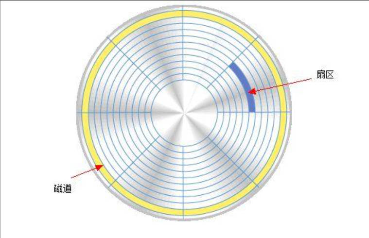

一个扇区的大小在 Linux 下可以通过 fdisk -l 命令来查看：

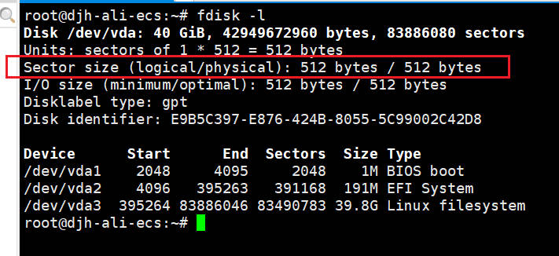

在 Windows 系统中，可以打开系统信息来看：

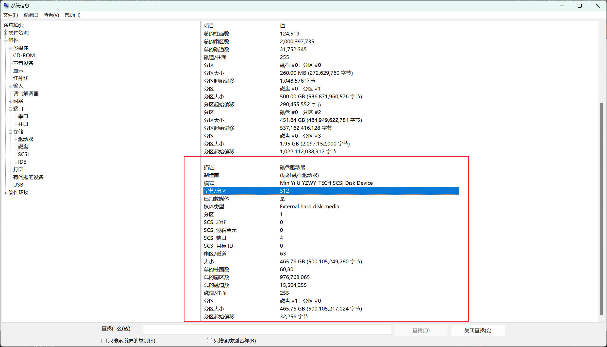

可以看到，基本都是 512 Bytes，传统上硬盘驱动器 （HDD） 为 512 字节，CD-ROM 和 DVD-ROM 为 2048 字节，而较新的 HDD 和 SSD 使用 4096 字节。

扇区的 512 字节并不是全部存储数据，而是包含了几个部分：

1. 扇区头标，扇区的地址号（柱面，磁头，扇区）
2. 扇区头标，尾部 CRC 校验码，保证头标的内容正确
3. 头标和数据区之间的间隔，为磁头读写切换保留时间，以防盘片旋转速度超过磁头响应时间
4. 数据区
5. ECC 纠错码
6. 扇区和扇区之间的间隔，作用和头标与数据区之间的间隔相同

而一个磁盘拥有多张盘面，每个盘面垂直方向的磁道又可以组成柱面（Cylinder）：

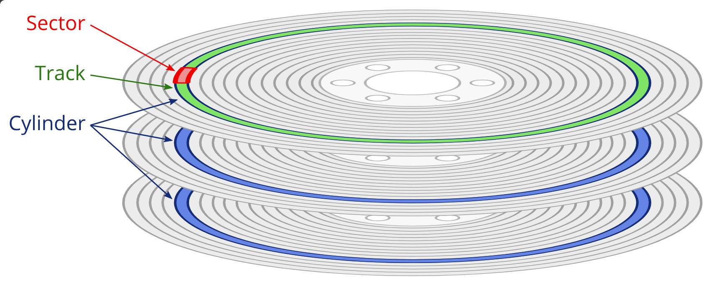

扇区是磁盘最小的物理存储单元，所以早期的时候，工程师们定位一个扇区在整个磁盘上的位置，需要使用一种叫 CHS（Cylinder-head-sector）的编址方式，用于为硬盘驱动器上的每个物理数据块提供地址。

柱面可以选择是垂直方向的哪一个磁道，磁头可以定位到具体是哪一个盘面（一个盘有两个面，两个读写磁头），而扇区则做出在这个磁道上的具体定位。

由于现代大容量的磁盘普及，以及低级格式化方式的改变，CHS 编址已经被淘汰，它存在大小上的限制。

计算一个磁盘容量的公式是：每扇区字节数 × 每个磁道的扇区数 × 柱面数（磁道数） × 磁头数（盘面数）

将以下值（最大值）带入：

* 每扇区字节数 = 512 Bytes

* 每个磁道的扇区数（8 位） = 63

* 柱面数（10 位） = 1023

* 磁头数（6 位） = 255

最后，计算得到：容量（max） = 512 Bytes × 63 × 1023 × 255 = 8414461440 Bytes ≈ 8 GB

受到磁盘容量大小的限制，CHS 很早就被淘汰了。但是，这里可以发现一个问题，磁头为什么是 255？很明显，一个磁盘不可能有 255 个磁头，这意味着一个磁盘要塞下一百多个盘面，但实际上市面的磁盘都是由 1，2，4 个盘片组成，对应着 2，4，8 个磁头（盘面）。

这里的 255 只是一个逻辑值而已，并非实际上真的有 255 个磁头，一个磁道上也不是仅仅有 64 个扇区的，实际上一个磁道上的扇区远远超过 64。

后来，LBA（Logical Block Address）取代了 CHS，和 CHS 的三维寻址不同，LBA 采用线性寻址的方式，它把硬盘所有的物理扇区的 C/H/S 编号通过一定的规则转变为一线性的编号，系统效率得到大大提高，避免了烦琐的磁头/柱面/扇区的寻址方式。在访问硬盘时，由硬盘控制器再将这种逻辑地址转换为实际硬盘的物理地址。

### 操作系统层面的抽象

上一小节提到的，柱面，磁道，扇区都是物理级别的抽象，而在操作系统中，对于数据的读写是基于另外一些抽象的概念。

扇区是磁盘最小的物理存储单元，操作系统将相邻的扇区组合在一起，形成一个块，对块进行管理。每个磁盘块可以包括 2、4、8、16、32 或 64 个扇区。磁盘块是操作系统所使用的逻辑概念，而非磁盘的物理概念。

对于文件系统的设计者而言，存储一个 n 个字节的文件，有两种选择：

* 分配一段连续的 n 字节大小的磁盘空间
* 将文件分割成很多的小块，存储在文件系统中

连续分配磁盘空间，有个问题是：当文件扩大时，有可能需要在磁盘上移动文件，而这对于普通的机械硬盘而言，效率是非常低下的。因此，几乎所有文件系统，都会把文件分割成固定的大小的块来存储，块之间不一定连续。

Windows 下把连续的扇区叫簇（Cluster），而 Linux 下叫做块（Block），实际上是一样的概念。

可以通过 stat 命令来查看磁盘块的大小：

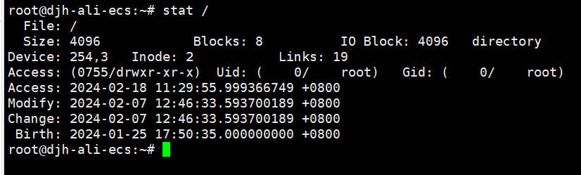

可以看到，磁盘块的大小是 4096 Bytes，也就是 4K，相当于 8 个扇区。一个文件，至少要占用一个数据块，一个数据块不能有两个或者以上的文件。

为什么一个块的大小是 4K，是有讲究的，如果设置太大，那么你存一个很小的文件，就要单独占用一个块，造成空间的浪费，如果设置的太小，意味着大多数的文件的读取，需要硬盘跨越多个不连续的块，才能读完。

换句话说，分配太大的块，浪费空间，分配太小的块，浪费时间。在计算机的世界中，空间和时间一直都是矛盾的关系，所以对于块大小的定义，本身就是一个很复杂的计算机科学的研究课题。

### 程序层面的抽象

对于程序而言，磁盘块的抽象还是有些偏于底层，我们编写程序更多的是面向实际的内容，有二进制的，也有面向字符的。所以，对于程序而言，操作系统做了另外的一个抽象——目录和文件。

目录用来表示，其下还有其他的文件或者子目录，文件则用来表示一个逻辑上的字节串，也就是程序真正操作的对象。

程序不再关心，用的是机械还是固态的硬盘，也不用担心磁盘，柱面，磁头，扇区的寻址问题，也不用操心一个大型的文件被分割成了多少个磁盘块，只需要简单的了解一些系统 API，就可以对文件进行读写操作。

### inode

inode 不存储文件的实际内容，但它们保存每个文件的各个块的位置以及其他元数据（或者叫文件的属性），更像是针对文件的一种数据结构。

Linux 下每一个目录或者文件都对应一个 inode，当操作系统对文件做操作时，先根据文件名去找到它的 inode，然后读取 inode 信息，从 inode 信息中获得数据块的所在位置，最后读取数据。

可以通过 ls -i 或者 stat 命令来查看一个文件的 inode 值：

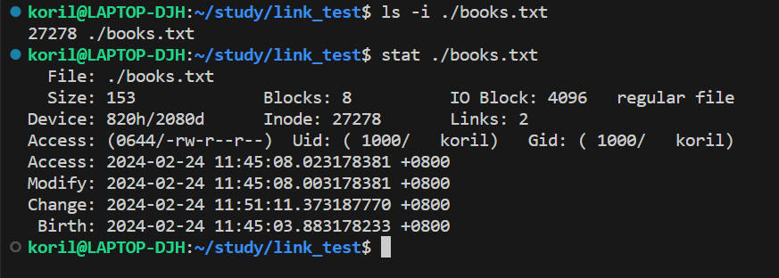

---

## 理解硬链接

操作系统找文件，不是认文件名的，而是通过 inode 来找文件的，一般来说，一个文件名对应一个 inode 值，但是也有多个文件名对应一个 inode 值，这就是硬链接。

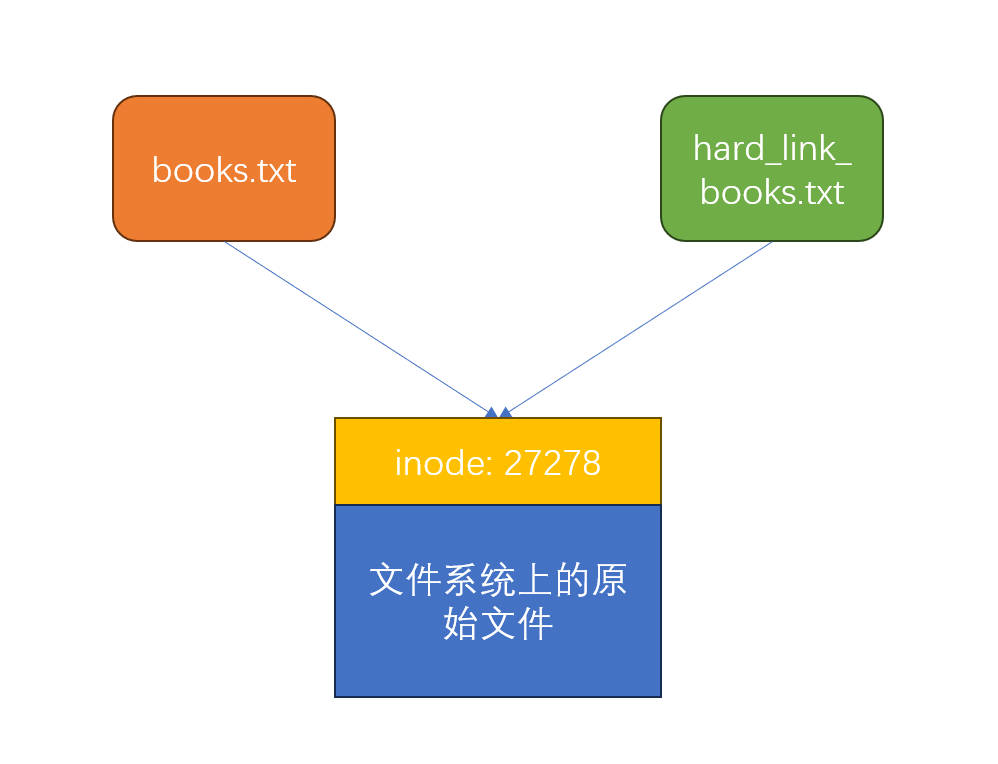

对于 inode 值指向的文件而言，文件名 books.tx 和 hard_link_books.txt 只是别名，只不过，这两个别名都指向了一个文件。

修改这个文件的内容，会同时反映到两个文件别名中：

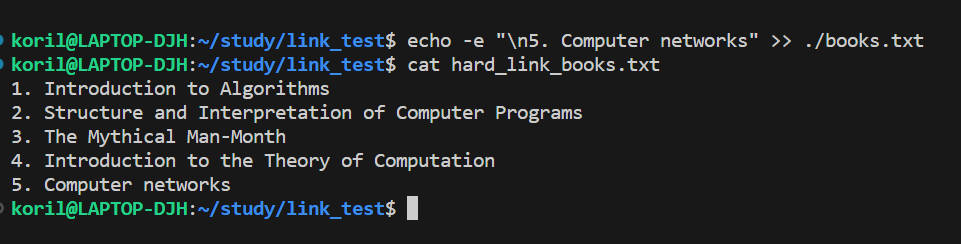

在 books.txt 追加一行，查看 hard_link_books.txt，发现内容是一致的。

我们删除 book.txt，并没有真正的删除原始文件，只是把 inode 的一个别名删除了而已，我们还可以通过别的别名来访问这个文件：

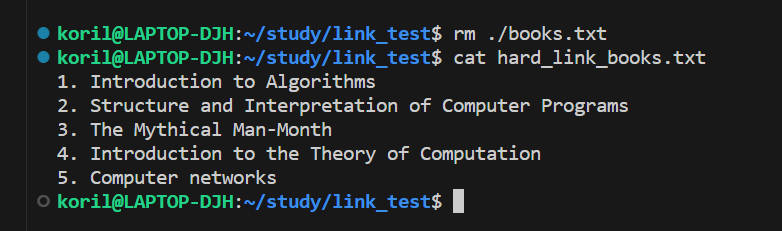

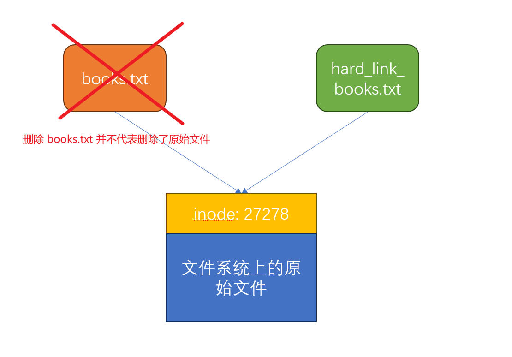

---

## 创建软链接

创建软链接很简单，仅仅多一个选项 -s，比如创建一个软链接文件叫 soft_link_books.txt 指向 books.txt：

```bash
ln -s ./books.txt ./soft_link_books.txt
```

查看两个文件的大小和 inode 值：

```bash
ls -li

 1460 -rw-r--r-- 1 koril koril 175 Feb 24 16:28 books.txt
29665 lrwxrwxrwx 1 koril koril  11 Feb 24 16:29 soft_link_books.txt -> ./books.txt
```

可以发现大小和 inode 值都不一样。

---

## 理解软链接

和硬链接不同，软链接并不指向真是文件的 inode，而是指向文件名路径，所以软链接也叫做符号链接（Symbolic link）。

所以软链接有点类似于 Windows 的快捷方式：

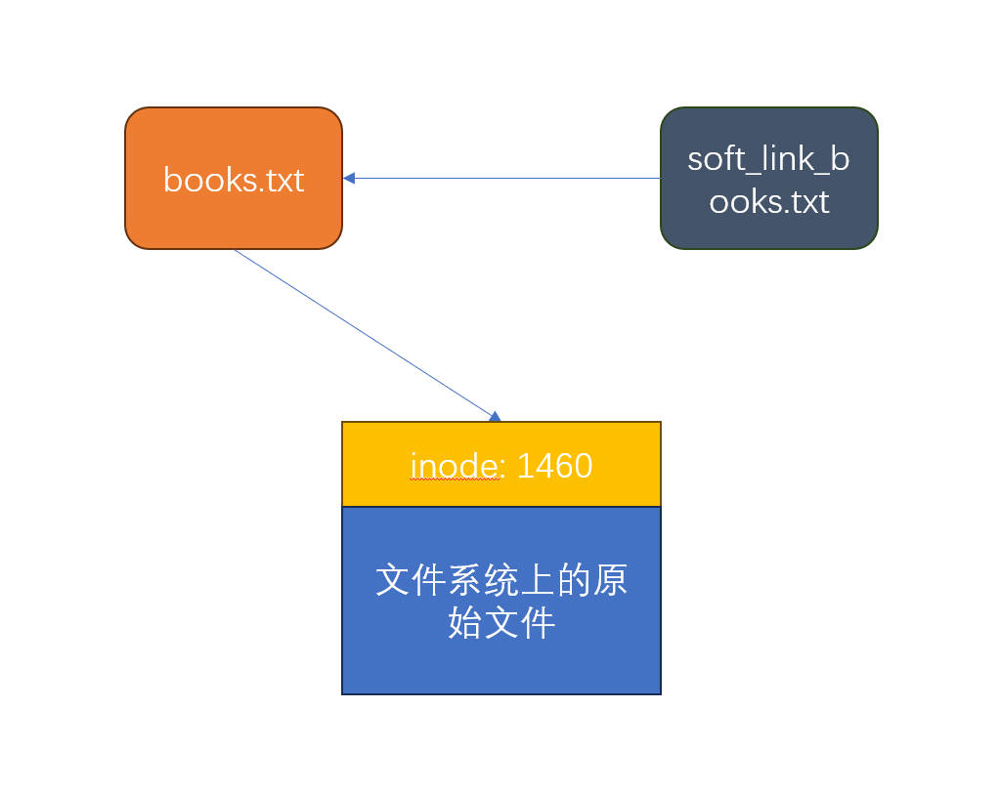

如果修改原始文件的内容，会同步反映到软链接文件中：

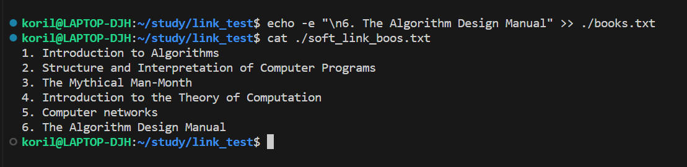

但是如果把原来的文件名删除了，软链接文件就会受到影响，这点和硬链接不同：

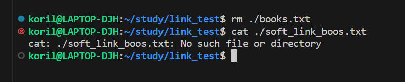

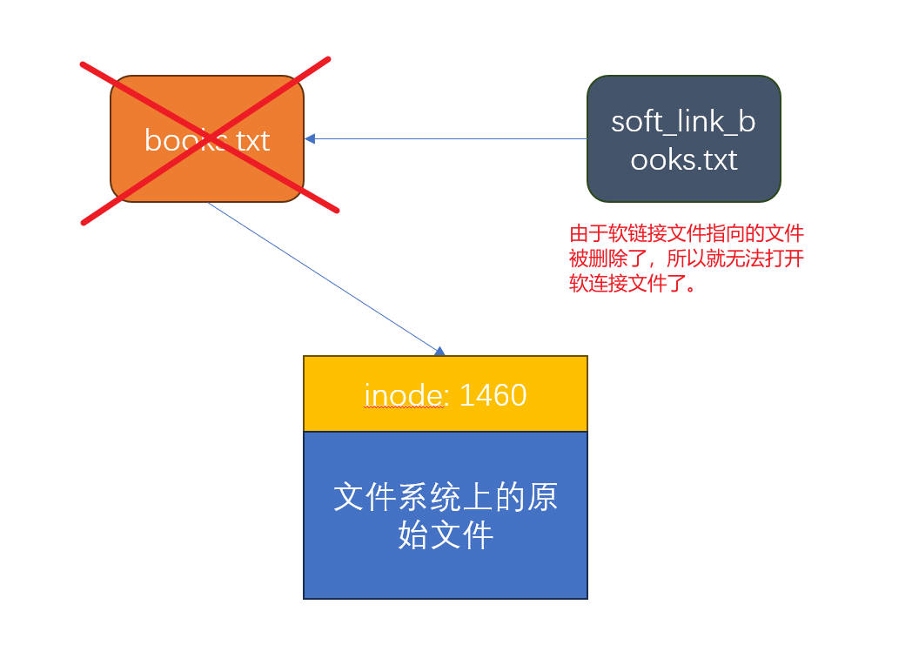

---

## 两者的区别和硬链接数量

软、硬链接的区别如下：

1. 创建一个硬链接文件，不会创建新的 inode 值，硬链接是指向原来存在的 inode，而创建一个软链接文件，会产生一个新的 inode 值，软链接本身相当于一个新文件。
2. 软链接可以跨文件系统，而硬链接不可以。
3. 软链接可以作用在目录上，而硬链接不可以。
4. 删除原来的文件（符号），硬链接文件不受影响，但是软链接会提示无法找到该文件。

ls -l 命令可以看到指向一个文件的硬链接数量：

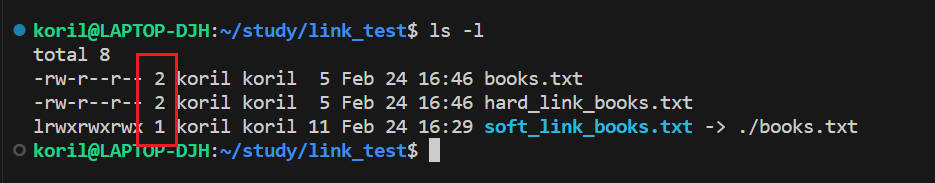

这个数字表示有几个硬链接指向原始文件，这里有两个，一个是 books.txt，另一个是 hard_link_books.txt，而软链接并不会增加这个数值，如果这个值减少为 0，说明没有硬链接指向原始文件了，那么系统就会回收这个数据块。

---

## 参考

1. https://blog.stuffedcow.net/2019/09/hard-disk-geometry-microbenchmarking/
2. https://ruanyifeng.com/blog/2011/12/inode.html
3. https://segmentfault.com/q/1010000000727128
4. https://zh.wikipedia.org/wiki/%E9%82%8F%E8%BC%AF%E5%8D%80%E5%A1%8A%E4%BD%8D%E5%9D%80
5. https://www.zhihu.com/question/50223526
6. https://blog.csdn.net/boazheng/article/details/127179389
