## 前言

在 Linux 中，当系统发生卡顿或者需要查看资源占用率的时候，一定离不开 top 命令的使用。尽管有很多可以替代它的程序（如 htop），但是 top 存在于每个主流发行版本中，开箱即用。很多人使用其他的程序来替代 top，大部分是因为它不够华丽，但实际上并没有真正了解去了解这个命令。

本文将从实践中，总结常用的一些操作，来最大化展现这个命令的强大之处。

---

## top 的作用

top（table of processes），可以实时展现 Linux 下的进程信息和任务占用资源，除此之外，top 还可以展示 CPU，内存的资源利用率。

---

## top 中各个指标的说明

输入 top 命令后，可以看到有上下两个部分：

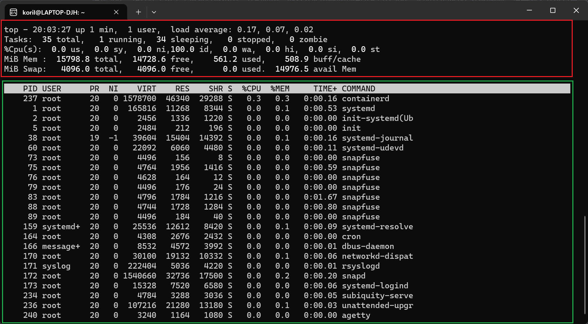

红色部分是摘要区，主要展示了系统资源的利用率，绿色部分是任务区，展示了各个进程/线程的详细信息。

下面详细讲下，每一个部分的含义。

### 第一行

top 的第一行和 uptime 这个命令一样，显示系统正常运行的时间和负载信息：

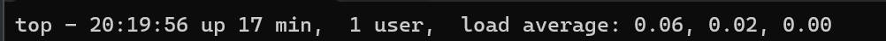

top - 后面的时间是系统当前时间，up 后面是系统正常运行的总时间，1 user 表示当前系统登陆的用户数量。

load average 有三个值，表示系统的负载，分别是最近 1 分钟，最近 5 分钟和最近 15 分钟的负载，值越大说明系统的负载越大。

### 第二行

第二行展示了进程（top 里面称为 task）的信息：


total：表示所有进程的总数量

running：显示有多少进程正在处理请求、正常执行并具有 CPU 访问权限。

sleeping：表示进程正在等待资源（等待 socket连接、等待信号量），大部分进程都处于 sleeping，这是正常状态。

zombie：僵尸进程，是指等待其父进程释放它的进程，如果父进程先退出，它可能会成为孤儿进程。僵尸进程通常意味着应用程序或服务没有正常退出。 长时间运行的系统上的一些僵尸进程通常不是什么大问题。

### 第三行

与处理器利用率相关的值显示在第三行：

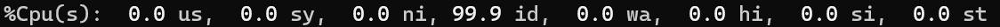

us：user processes，运行用户进程所花费的时间百分比。
sy：system，是运行内核所花费的时间百分比。
ni：nice value，是运行具有手动配置的好值的进程所花费的时间百分比。
id：idle time，是空闲时间的百分比（如果高，CPU 可能会过度工作）。
wa：wait time，是等待时间的百分比（如果高，则 CPU 正在等待 I/O 访问）。
hi：hardware interrupts，是管理硬件中断的时间百分比。
si：software interrupts，是管理软件中断的时间百分比。
st：等待访问物理 CPU 的虚拟 CPU 时间的百分比。

---

### 第四行和第五行

最后两行是与内存信息相关的：

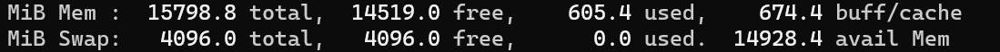

最左侧显示的 MiB 代表单位，MiB 指的是 mebibyte，也就是 2^20 Bytes。

第四行的 Mem 显示的是物理内存利用率，这里的大小取决于系统真实安装的 RAM 大小。

total：安装的内存总大小

free：可用的内存大小

used：已用的内存大小

buff/cache：缓冲区缓存和页面缓存的占用内存大小

第五行的 Swap 显示的是虚拟内存的利用率。

当物理内存空间被消耗时，Linux 可以通过从存储磁盘借用存储空间来利用虚拟内存缓解内存不足的问题。但在物理 RAM 和存储驱动器之间来回交换数据的过程非常耗时并占用系统资源，因此最好尽量减少虚拟内存的使用。

一般来说，Swap 利用率过大，表明系统没有为其运行的任务安装足够的内存。解决方案是增加物理 RAM 或者减少工作负载。

---

## 参数

进入 top 前，可以指定不同的参数来达到不同的功能。

### 获取帮助

使用 top -h 可以获取简单的帮助信息。

### 批处理模式

top -b （batch-mode）可以让 top 以批处理的方式运行，可以将 top 命令的输出结果发送到文件或其他程序进行处理。

批处理模式下 top 不接受用户的输入信息，并将一直运行直到被杀死（ctrl + c 或者 kill）或达到指定的次数限制。

### 指定最大刷新的次数

默认模式下，进入 top 后，top 将以指定的间隔时间刷新显示信息，并一直运行，直到用户主动关闭（按下 q 键）。

使用 top -n（Number-of-iterations） 可以指定最大的次数，比如：top -n 3，表示进入 top，刷新 3 次后，自动退出 top。

### 指定间隔时间

默认间隔时间是 3 秒，即每 3 秒，top 会刷新显示信息，可以通过 top -d （Delay-time）指定间隔时间，比如：top -d 1，表示每 1 秒刷新一次 top 的信息。

### 显示程序的完整命令行信息

默认模式下， 进入 top，top 的最后一列会显示应用程序的程序名称，但有时候我们想要看到完整的命令行信息，就需要使用 -c 参数，就可以切换到显示命令行信息的模式。

### 查看指定 pid 的进程

在很多时候，我们仅仅想要监控某个进程在某段时间下 CPU 和内存的占用率，如果知道该进程的 pid 值，那么就通过 -p 参数指定 pid，进入 top 后，就只会显示这单个进程的信息。

另外也可以指定多个 pid 值，通过英文逗号隔开：

```shell
# 监控 pid 值为 1 的进程
top -p 1

# 监控 pid 值为 1 和 2 的进程
top -p 1,2
```

以上，就是 top 命令可以指定的一些参数，但这并不是全部，还有很多命令参数可以指定，这里就不一一列出。

我平时最常用的是 -c、-d 以及 -p 这三个参数，-c 可以看到完整的进程命令行信息，-d 我一般会指定 1 秒的间隔刷新时间，-p 用来单独监控某个进程。

```shell
# 显示进程命令行信息，以及指定 top 刷新间隔时间为 1 秒
top -cd 1

# 指定某些 pid 的进程
top -cd 1 -p 1,2
```

---

## 进入 top 后的交互操作

这一小节，介绍进入 top 后的一些交互性的操作。

### 改变显示的单位

默认进入 top 后，内存显示的单位是 MiB，进程的 VIRT、RES、SHR 的单位是 KiB，想要改变它们的单位很简单，按下 E 改变顶部的 Mem 和 Swap 的单位，按下 e 改变进程列表的 VIRT、RES、SHR 的单位。

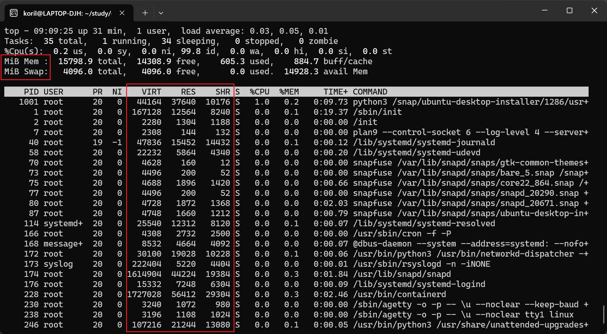

比如，可以将顶部的 Mem 和 Swap 显示的单位改为 GiB，进程列表的单位改成 MiB：

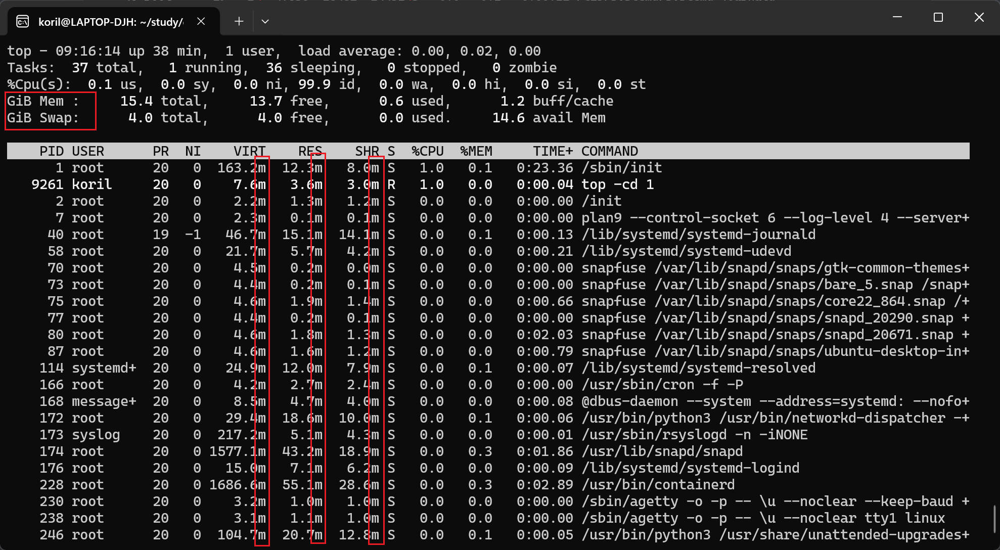

这是比较合理的单位设置，因为一般服务器的总内存大小都是以 GiB 为单位的，而分配给各个进程的内存大小一般都是以 MiB 为单位的。

### 改变 CPU 和内存的显示状态

除了改变单位之外，我们还可以让 CPU 和内存的信息显示的更加直观一些，比如图形化。

现在的处理器一般都是多核心，按下数字键 1 可以把所有逻辑核心罗列出来，我的电脑有 18 个逻辑核心数，所以是 %Cpu0-17：

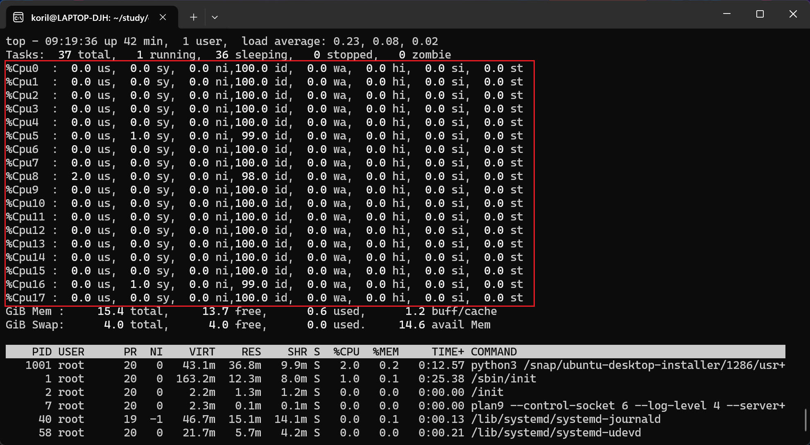

无论是 CPU 还是内存这里显示的都是一堆数字，让很多人选择 htop  的原因可能仅仅是因为大多数人觉得 htop 比 top 多个条形图：

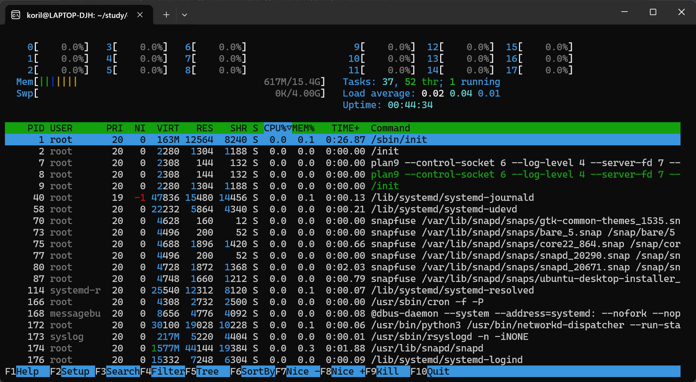

但实际上 top 也提供了条形图的功能，对于 CPU：

1. 按下 t 可以显示 CPU 的 ASCII 形式的条形图
2. 再按下 t，可以切换到实心的条形图
3. 再按下 t，隐藏 CPU 的信息显示
4. 再按下 t，切换回原来的 CPU 数字显示模式

对于内存：

1. 按下 m 可以显示内存信息的 ASCII 形式的条形图
2. 再按下 m，可以切换到实心的条形图
3. 再按下 m，隐藏内存的信息显示
4. 再按下 m，切换回原来的内存数字显示模式

### 改变颜色

top 的颜色默认就是黑底白字，很单调，可以通过按下 z 来改变显示的颜色，但是默认的是红色：

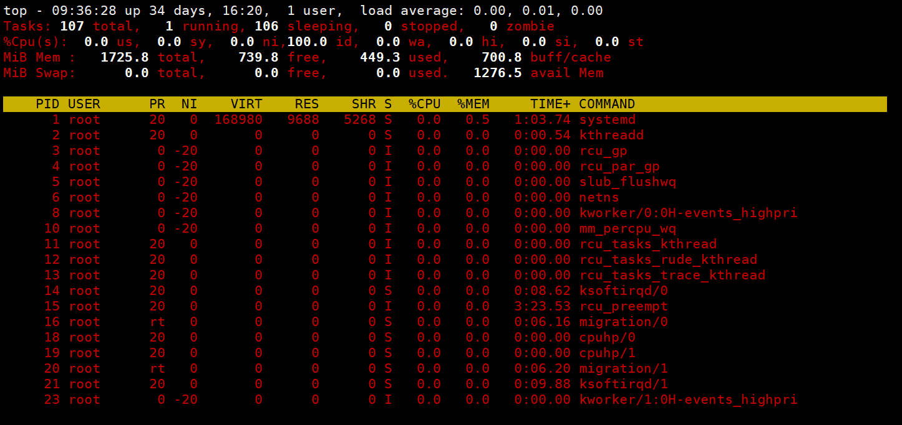

按下 Z 可以自定颜色，先选择要定义哪部分的颜色：

* S. Summary Data area.
* M. Messages and prompts.
* H. Column headings.
* T. Task information in the process list.

然后选择颜色：

* **0**. Black.
* **1**. Red.
* **2**. Green.
* **3**. Yellow.
* **4**. Blue.
* **5**. Magenta.
* **6**. Cyan.
* **7**. White.

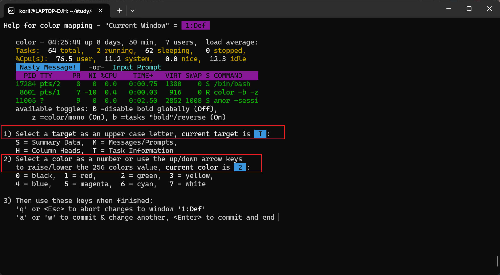

定义好颜色后，按下回车，就可以看到效果了：

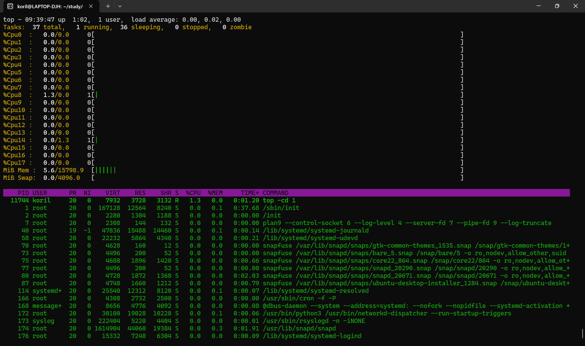

### 切换命令行信息和进程名称显示

按下 c 可以切换显示命令行信息或者进程名称，效果和上一些参数指定 -c 是一样的。

### 限制显示的进程列表数量

默认下，top 显示所有的进程信息，我们可以通过按下 n 来指定数量，限制显示的进程数：

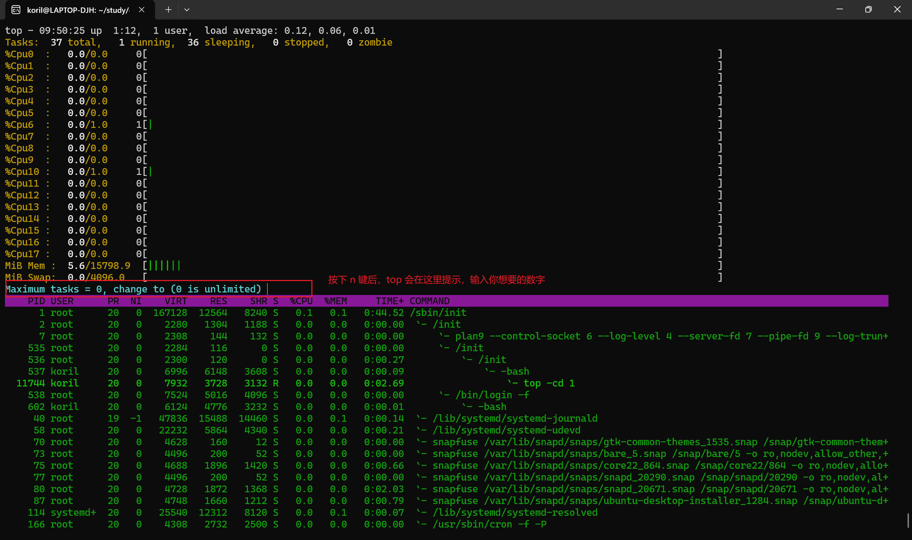

输入完数字后，按下回车，这里我输入的数字是 5：

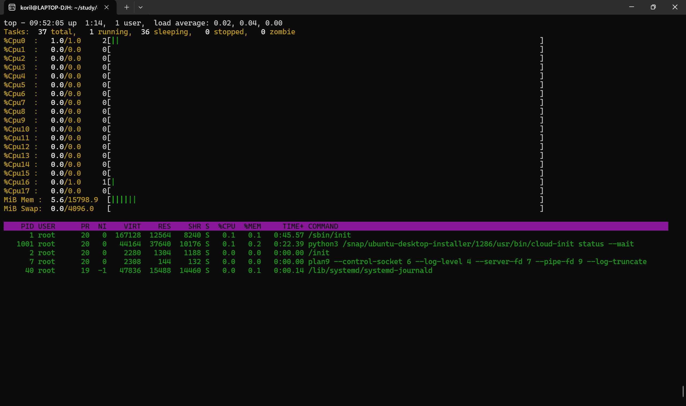

### 排序

很多场景下，都需要我们对进程的 CPU 使用程度，内存占用进行排序，top 也提供了这样的交互功能。

默认状态下，top 使用 %CPU 这个字段进行排序的，我们可以通过按下其他键，来对不同的字段排序：

* M：通过 %MEM 字段来排序
* N：通过 PID 字段来排序
* T：通过 TIME+ 字段来排序
* P：通过 %CPU 字段来排序

按下以上的键，可以对不同的字段进行排序，默认是倒序，也就是从大到小，想要反序，可以按下 R 键。

### 过滤

top 支持根据不同的条件过滤出进程列表。

按下 u 可以根据 USER 字段进行过滤，top 会提示你输入指定的用户：

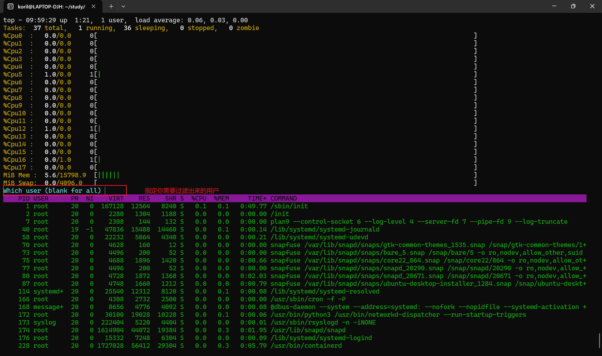

这里我输入自己的用户名，可以看到过滤出所有的进程信息：

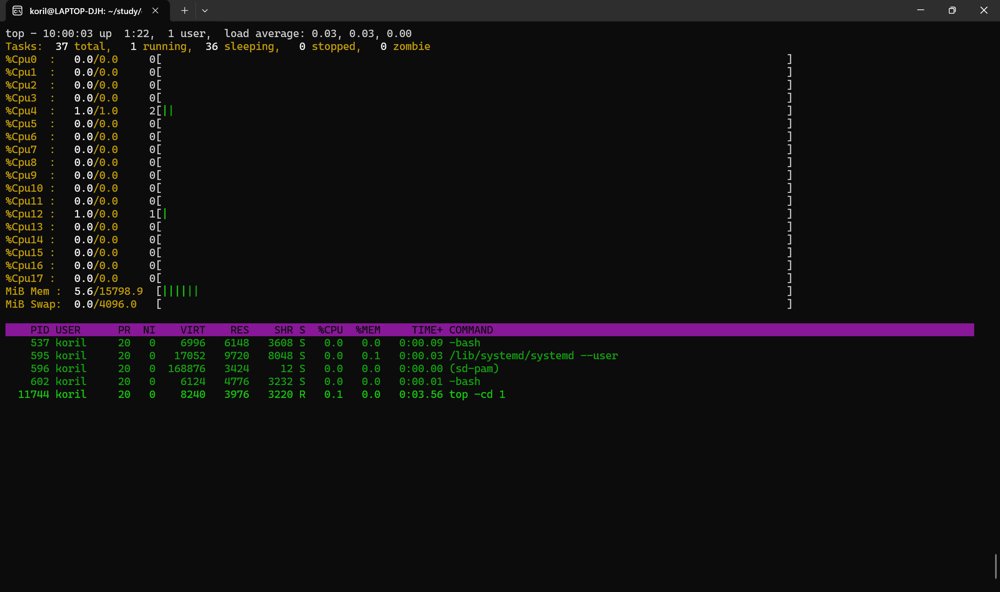

按下 o 键可以指定过滤条件，格式是：

```
[字段]比较符[值]
比如，字段 %MEM 的值，大于 2.0，写作：
%MEM>2.0
```

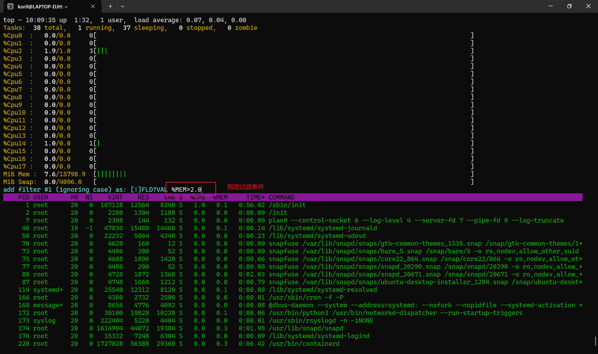

这里我指定的条件是 %MEM 的值超过 2.0 的进程，结果只有一个：

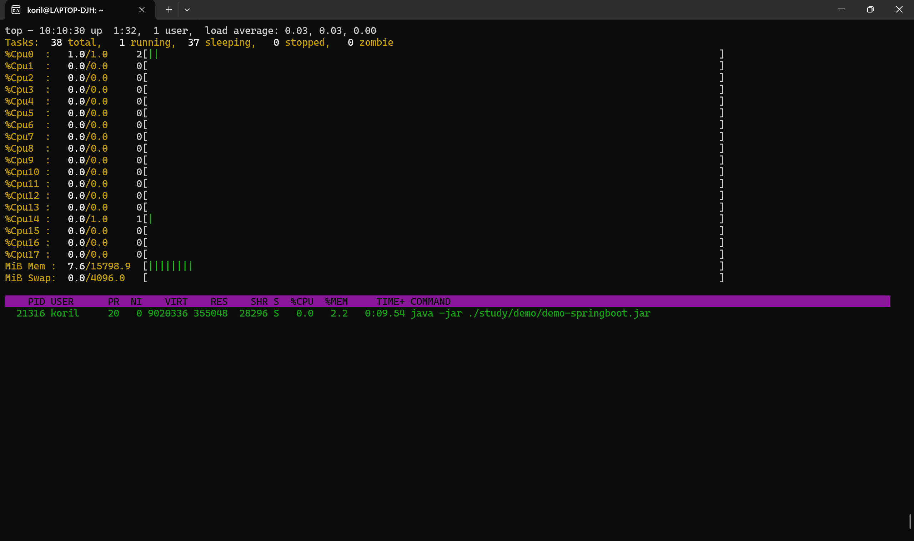

想要清除过滤的条件，按下 = 即可。

### 保存所有的配置信息

如果不进行任何操作，按下 q 就会退出 top 界面，再次进入 top 会发现，之前设置的所有颜色等配置信息都丢失了。

top 提供了持久化配置信息的操作，按下 W 键，可以将配置持久化，文件会写入当前用户的 Home 目录下的 .config/procps/toprc 目录中，比如我的 top 配置持久化文件保存的路径是：/home/koril/.config/procps/toprc

想要恢复默认的 top，把该文件删除即可。

---

## 参考

1. https://www.redhat.com/sysadmin/interpret-top-output
2. https://phoenixnap.com/kb/top-command-in-linux