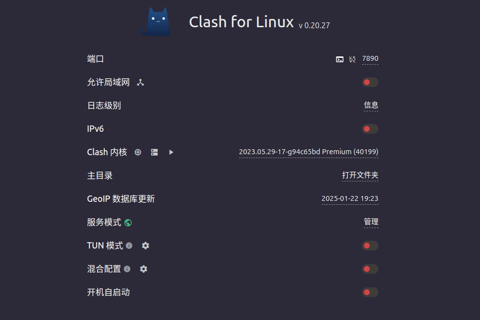
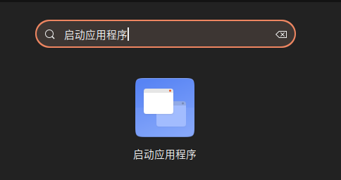

## 前言

本文主要介绍诸如微信，Clash之类的桌面软件如何添加到 Ubuntu 的开机自启动中。

---

## autostart

如果每次开机都要手动启动 Clash，未免太麻烦了些，我安装的 Clash For Linux 的虽然有一个开机自启动功能：



但是打开这个开关后，启动电脑后，会报错，暂时没有发现是什么原因导致的。

Ubuntu 的 autostart 提供了自启动的功能，设置也很简单，除了图形化设置，也可以直接编辑文件设置。

图形化的设置软件如下：



图形软件的使用方式很简单，不再赘述，这里主要讲解通过文本设置的方式（其实都是一样的，文本设置好后，图形软件也会识别到）。

### Clash

clash 需要注意启动要加上 --no-sandbox 参数，否则会爆出有关于 chrome sandbox 的错误，推测和编写GUI的框架有关（Electron？），编辑文件`~/.config/autostart/clash.desktop`，键入以下内容：

```

[Desktop Entry]
Type=Application
Exec=/opt/Clash.for.Linux-x64/cfw --no-sandbox
Hidden=false
NoDisplay=false
X-GNOME-Autostart-enabled=true
Name=Clash
Comment=Start Clash on login

```

### Wechat
 
微信也是类似，编辑文件`~/.config/autostart/wechat.desktop`

```

[Desktop Entry]
Type=Application
Exec=/opt/wechat/wechat
Hidden=false
NoDisplay=false
X-GNOME-Autostart-enabled=true
Name=Wechat
Comment=Start Wechat on login

```

如果想要不启动某个应用，把 Hidden 改为 true 即可。
