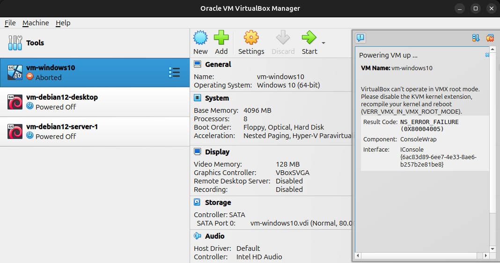

## 问题

Ubuntu 在一次更新后无法正常打开 Virtualbox 里的虚拟机，会爆出如下错误：



---

## 解决

在 Ubuntu 上，如果你同时装了 KVM（Kernel-based Virtual Machine） 和 VirtualBox，往往会出现 VirtualBox 打不开虚拟机的情况。原因主要在于 硬件虚拟化（Intel VT-x / AMD-V）的占用冲突。

查看当前是否加载了 kvm：

```sh
lsmod | grep kvm
```

方案 1：临时卸载 KVM 模块（不需要重启）

```sh
sudo rmmod kvm_intel
sudo rmmod kvm
```
方案 1 每次重启后都会失效，是临时的解决方案。

方案 2：开机时禁用 KVM 模块

编辑 /etc/modprobe.d/blacklist.conf，添加：

```sh
blacklist kvm
blacklist kvm_intel
```

