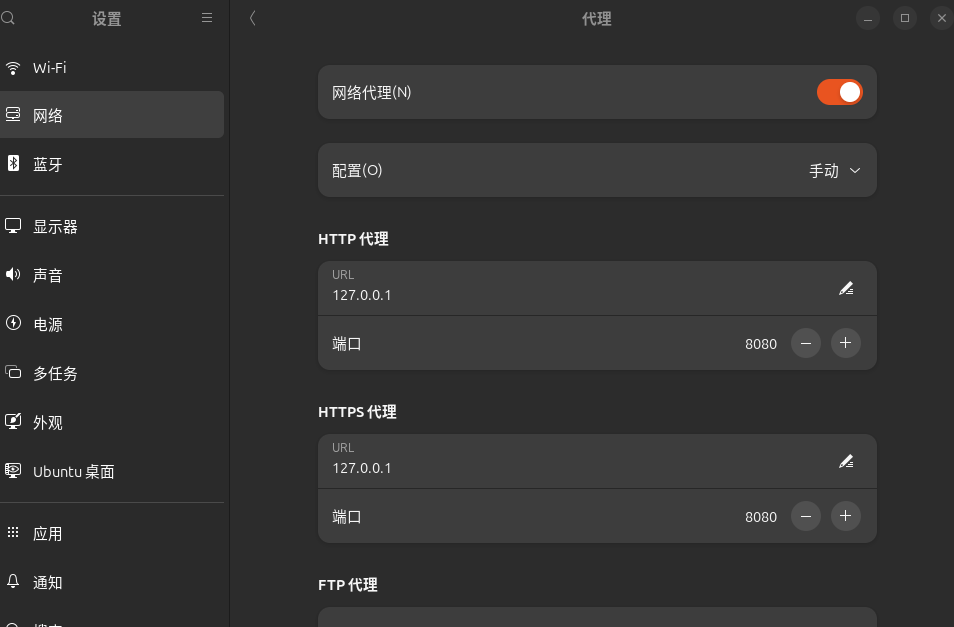
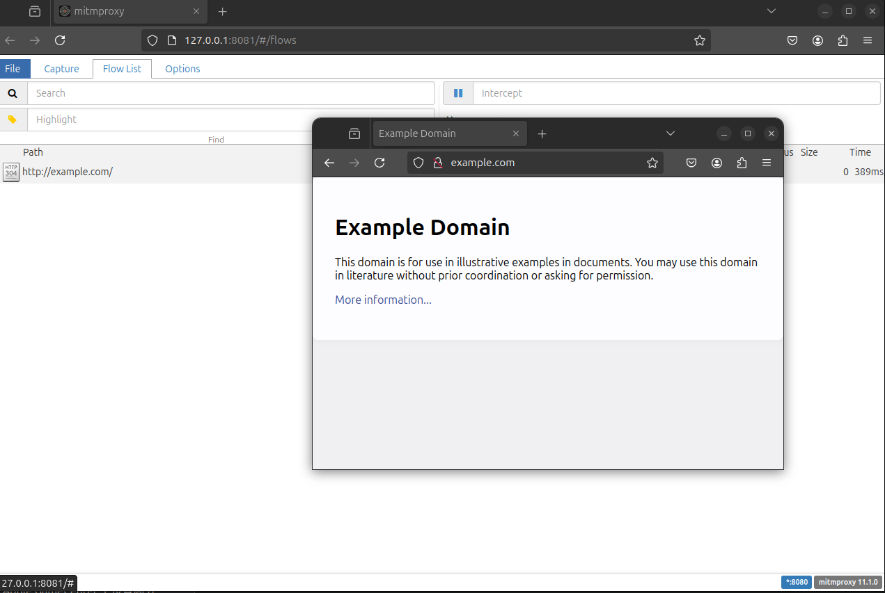
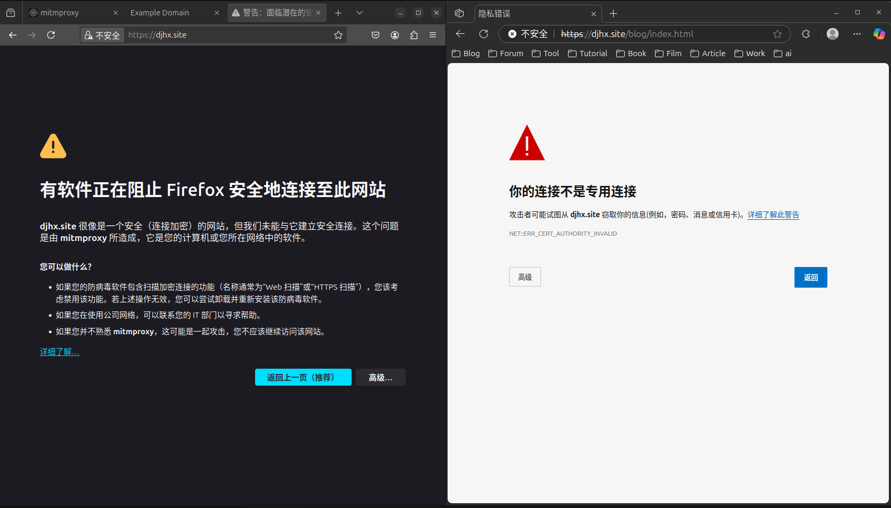
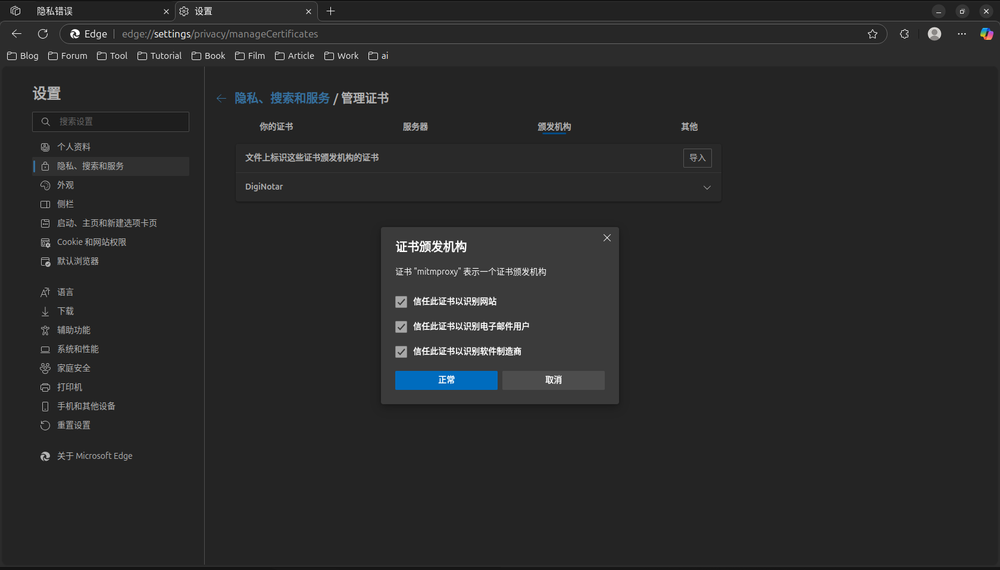
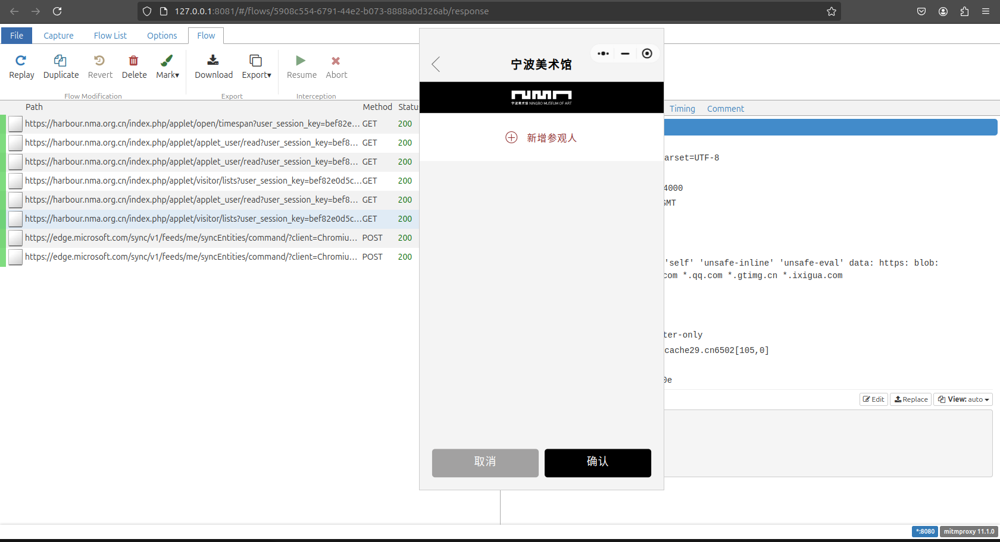

## 目录

[TOC]

---

## 前言

之前使用过 Windows 下的 fiddler，但是在 Ubuntu 下就不支持了（我看 fiddler everywhere 好像是支持的，不过收费）。
所以把目光放到了开源的抓包工具：[mimproxy](https://mitmproxy.org/)，支持命令行、web界面以及 Python API 调用。

---

## 安装

安装很简单，官方下载 tar.gz 的压缩包到本地，解压到 /opt（或者别的什么目录），就可以直接使用了。

包含三个工具：

- mitmdump: mitmproxy 的命令行版本，类似 tcpdump。
- mitmproxy: 一个交互式的、支持 SSL/TLS 的拦截代理，带有控制台 HTTP/1、HTTP/2 和 WebSockets 的接口。
- mitmweb: 基于 Web 的界面。

关于这些工具的详细信息，参考官网文档：https://docs.mitmproxy.org/stable/

三个工具都可以使用，我更喜欢图形界面，所以本文使用的是 mitmweb。

---

## 设置代理

为了使 HTTP 流量走 mitmproxy，要设置下网络的代理。默认的端口是 8080，Ubuntu 的网络代理在设置中进行配置：



设置好之后，请求一个 http 协议的网站：http://example.com/，就可以看到页面抓到数据了：



---

## 设置CA证书

上面设置好代理端口后，仅能正常访问 http 的网站，如果访问了 https 则会爆出“你的连接不是专用链接”之类的字样。



是因为 CA 证书没有配置到系统里，启动了三个工具中任意的一个，都会自动成 mitmproxy 的 CA 证书，路径是 `~/.mitmproxy/`。

我们要做的就是把这个目录下的 pem 文件配置到系统里，就两个命令：

```sh

# 把证书移动到特定的系统目录，并且把后缀的 pem 改称 crt
mv ~/.mitmproxy/mitmproxy-ca-cert.pem /usr/local/share/ca-certificates/mitmproxy.crt
# 更新系统证书
sudo update-ca-certificates

```

出现以下结果，说明安装成功了：

```

Updating certificates in /etc/ssl/certs...
rehash: warning: skipping ca-certificates.crt,it does not contain exactly one certificate or CRL
1 added, 0 removed; done.
Running hooks in /etc/ca-certificates/update.d...
done.

```

其他系统的 CA 证书文档，参考：http://mitm.it/

如果浏览器依然无法访问 https 的网站，那么浏览器需要额外的设置，一般都是在“安全、隐私”中，找到管理证书，然后在授权机构那一栏添加本地的 pem 文件。



---

## 微信小程序

我在 Ubuntu 安装了微信，打开桌面端的微信小程序，也可以抓包：



一开始加载不出来，后来我索性把 firefox、chrome、edge 全把证书添加到这些浏览器里，然后重启后，就能用了。暂时没搞清楚具体的原因。

---

## 手机

安卓上也是类似，保证安卓手机和电脑，在一个局域网下，电脑上开着 mitmproxy，然后在手机 wifi 配置中，配置代理，ip 就是电脑的 ip，端口默认是 8080。

设置好之后，手机打开浏览器，进入网站：mitm.it

下载好证书后，在手机的设置中，安装 CA 证书即可。
