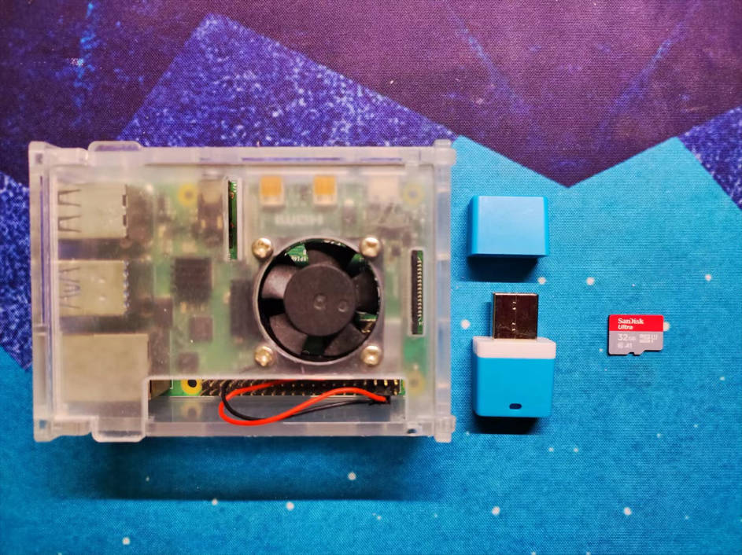
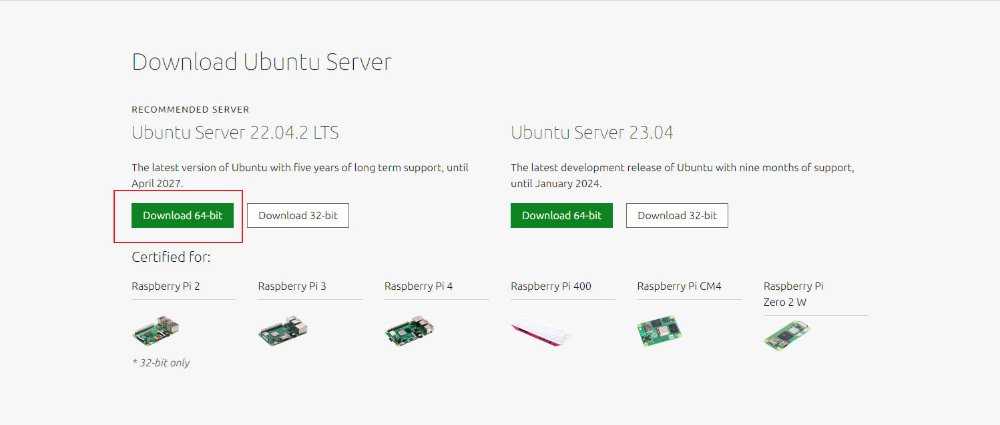
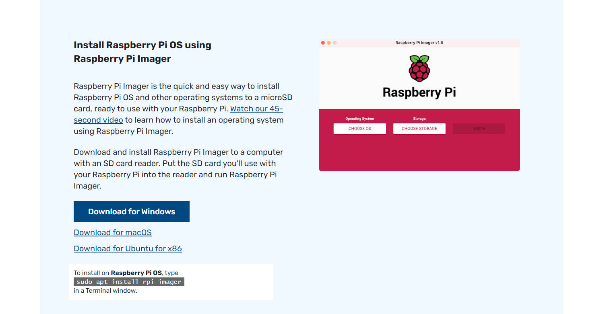
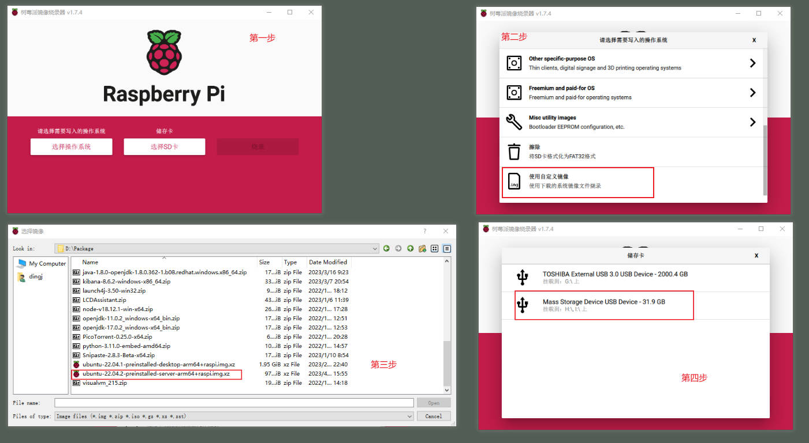
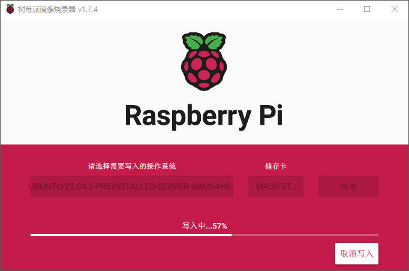
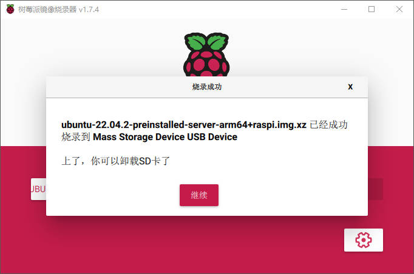

## 概述

本文详细记录了树莓派4B 安装 Ubuntu Server 22.04 LTS 系统的全过程。

包含以下几部分内容：

1. 烧录和安装系统
2. 连接网络（WIFI）
3. apt 换源
4. 安装 Java 8
5. 安装 Docker

---

## 烧录和安装系统

在树莓派上安装 Ubuntu 非常简单，官方已经准备好预安装的镜像：

https://ubuntu.com/download/raspberry-pi

考虑到后续的使用，我并不需要桌面，只是部署一些应用和服务，所以我选择的是 Server 版本，而且就实际使用而言，桌面版最好使用 8G + SSD 配置的树莓派，我的是 4G + 32GB 闪存的配置，安装桌面版稍显卡顿。

关于选择桌面版还是服务器版，除了参考官网之外，可以看看下面这篇文章：

https://www.makeuseof.com/tag/difference-ubuntu-desktop-ubuntu-server/

### 硬件

硬件只需要额外准本一个读卡器+闪存卡即可



### 软件

软件需要两个，一个是镜像文件，另一个是烧录软件。

镜像文件：



烧录软件：

https://www.raspberrypi.com/software/



### 烧录

将闪存卡插入读卡器，再将读卡器插入电脑的 USB 口，打开 Raspberry Pi Imager，按以下步骤操作：



最后点击烧录，等待完成。





### 安装

将闪存卡插入树莓派，并且需要外接一个显示器和一个键盘，完成初始的配置。

上电后，会提示键入用户名和密码，默认的用户名和密码都是：ubuntu，然后系统会提示修改默认的密码，修改成功后就进入系统了。

---

## WIFI 连网

第一步，最重要的就是连上家里的 wifi，后面才能下载网上的软件。

备份网络配置文件

```shell
sudo cp /etc/netplan/50-cloud-init.yaml /etc/netplan/50-cloud-init.yaml.bak
```

修改原来的网络配置文件

```shell
sudo vim /etc/netplan/50-cloud-init.yaml
```

在原始的配置下面添加 wifi 的配置信息

```yaml
# This file is generated from information provided by the datasource.  Changes
# to it will not persist across an instance reboot.  To disable cloud-init's
# network configuration capabilities, write a file
# /etc/cloud/cloud.cfg.d/99-disable-network-config.cfg with the following:
# network: {config: disabled}
network:
    ethernets:
        eth0:
            dhcp4: true
            optional: true
    version: 2

    wifis:
        wlan0:
            dhcp4: true
            optional: true
            access-points:
                "你的wifi名称":
                    password: 你的wifi密码
                    hidden: false
```

配置完成后，启动新的配置

```shell
sudo netplan apply
```

查看 ip 信息

```shell
ip addr show
```

如果没有连接成功，请检查用户名和密码，或者尝试重启

```shell
sudo reboot
```

连接成功后，记住树莓派的 ip 地址，就可以拔掉显示器，直接通过 SSH 连接了。

---

## apt 换源和更新

### 换源

国外的源下载速度较慢，需要更换国内的镜像源，这里我选择的是清华源：

https://mirrors.tuna.tsinghua.edu.cn/help/ubuntu-ports/

这里需要注意两点：

1. 树莓派是 ARM 架构，网上如果搜索 Ubuntu 更换源，里面的配置都是面向 X86 架构，树莓派应该选择 Ubuntu-ports 源。
2. Ubuntu 不同的版本有不同的代号，Ubuntu 22 的代号是 jammy。

备份原先的配置

```shell
sudo cp /etc/apt/sources.list  /etc/apt/sources.list.bak
```

修改 apt 源

```shell
sudo vim /etc/apt/sources.list
```

删除原先的内容，将以下内容写入文件：

```shell
# 默认注释了源码镜像以提高 apt update 速度，如有需要可自行取消注释
deb https://mirrors.tuna.tsinghua.edu.cn/ubuntu-ports/ jammy main restricted universe multiverse
# deb-src https://mirrors.tuna.tsinghua.edu.cn/ubuntu-ports/ jammy main restricted universe multiverse
deb https://mirrors.tuna.tsinghua.edu.cn/ubuntu-ports/ jammy-updates main restricted universe multiverse
# deb-src https://mirrors.tuna.tsinghua.edu.cn/ubuntu-ports/ jammy-updates main restricted universe multiverse
deb https://mirrors.tuna.tsinghua.edu.cn/ubuntu-ports/ jammy-backports main restricted universe multiverse
# deb-src https://mirrors.tuna.tsinghua.edu.cn/ubuntu-ports/ jammy-backports main restricted universe multiverse
deb https://mirrors.tuna.tsinghua.edu.cn/ubuntu-ports/ jammy-security main restricted universe multiverse
# # deb-src https://mirrors.tuna.tsinghua.edu.cn/ubuntu-ports/ jammy-security main restricted universe multiverse


# 预发布软件源，不建议启用
# deb https://mirrors.tuna.tsinghua.edu.cn/ubuntu-ports/ jammy-proposed main restricted universe multiverse
# # deb-src https://mirrors.tuna.tsinghua.edu.cn/ubuntu-ports/ jammy-proposed main restricted universe multiverse
```

### 更新

```shell
sudo apt update
sudo apt upgrade
# 或者直接一行命令
sudo apt update && sudo apt upgrade -y
```

---

## 安装 Java8

因为笔者是 Java/Python 程序员，所以需要安装 Java（Ubuntu 22 默认带了 Python3.10）。

安装 OpenJDK 8

```shell
sudo apt install openjdk-8-jdk
```

检查是否安装成功
```shell
java -version
# 出现一下信息，则安装成功
openjdk version "1.8.0_362"
OpenJDK Runtime Environment (build 1.8.0_362-8u362-ga-0ubuntu1~22.04-b09)
OpenJDK 64-Bit Server VM (build 25.362-b09, mixed mode)
```

---

## 安装 Docker

安装 Docker 可以直接参考以下两个文档

https://docs.docker.com/engine/install/ubuntu/

https://yeasy.gitbook.io/docker_practice/install/ubuntu

### Docker 换源

参考文档：

https://yeasy.gitbook.io/docker_practice/install/mirror

在 /etc/docker/daemon.json 中写入 mirror 信息：

```shell
sudo vim /etc/docker/daemon.json

# 写入
{
  "registry-mirrors": [
    "https://hub-mirror.c.163.com",
    "https://mirror.baidubce.com"
  ]
}
```

保存后，重启 Docker 服务

```shell
sudo systemctl daemon-reload
sudo systemctl restart docker
```

检查是否成功

```shell
sudo docker info
# 展示信息中如果有刚刚写入的信息，说明成功了
Registry Mirrors:
  https://hub-mirror.c.163.com/
  https://mirror.baidubce.com/
```

---

## 参考

1. https://ubuntu.com/tutorials/how-to-install-ubuntu-on-your-raspberry-pi#1-overview
