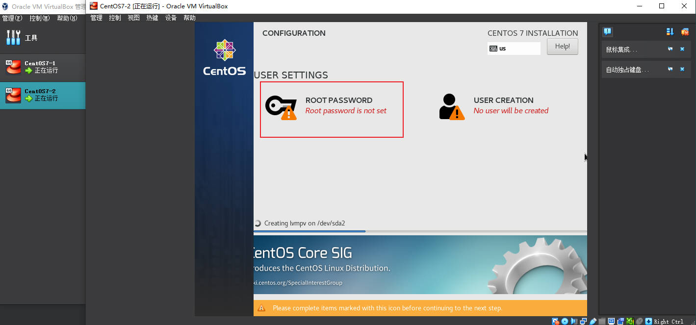

## 前言

CentOS（Community Enterprise Operating System，中文意思是社区企业操作系统）是Linux发行版之一，它是来自于 Red Hat Enterprise Linux 依照开放源代码规定释出的源代码所编译而成。由于出自同样的源代码，因此有些要求高度稳定性的服务器以 CentOS 替代商业版的Red Hat Enterprise Linux 使用。两者的不同，在于 CentOS 完全开源。

CentOS 7 是 CentOS 项目发布的开源类服务器操作系统，于 2014 年 7 月 7 日正式发布。

2020年11月12日，CentOS 7正式版推出该系列最终版本CentOS 7.9.2009。

平时各种项目的部署机器通常都是 CentOS7，所以为了避免每次重复查询，本文非常详细地描述了用 Virtual Box 7 创建 CentOS7 虚拟机的全过程，以及后续在离线环境下安装常用软件包的所有操作。

由于平时客户机大部分都是内网状态，无法连接到互联网，所以本文所有软件安装全部采用离线安装的方式（rpm 包安装或者编译安装），本文不涉及如何使用 yum 联网安装软件。

---

## 需要准备的软件

1. 安装好 Virtual Box 7：https://www.virtualbox.org/wiki/Downloads
2. 下载好 CentOS 7.9.2009：http://isoredirect.centos.org/centos/7/isos/x86_64/

---

## 创建虚拟机


设置好虚拟机名称，保存目录，以及刚刚下载好的 iso 文件，选择跳过自动安装，点击下一步。


内存我分配了 4 GB，处理器分配 2 个。


磁盘空间分配了 50 GB。


信息确认没有什么问题后，点击完成。


可以看到刚刚创建的 CentOS7-2 处于关闭状态，点击启动按钮。


这里默认就是 Test this media & install CentOS7，直接回车即可。

接下来就进入到了可视化的安装图形界面：


选择 English 作为系统语言。


点击 Continue 的时候，会提示 Vitual Box 会捕获鼠标，然后鼠标会驻留在虚拟机界面中，想要鼠标脱离虚拟机，默认的热键是 Right Ctrl。

接下来设置磁盘和时区：


磁盘选择刚刚创建的 50 GB


点击时区，设置成 Asia/Shanghai


最后，点击完成按钮，开始安装


在安装的过程中可以设置 root 账号和普通用户账号，这里是测试用的虚拟机，所以我仅设置了 root 账号



大概过 10 分钟左右安装完成，点击重启。


输入刚刚设置 root 账号和密码，进入系统：


---

## 设置网络

### 设置桥接网卡模式

创建完虚拟机后，第一步是设置网络，这里为了模拟平时局域网下的机器，我选择“桥接网卡”选项：


简单说下 NAT 模式和桥接网卡模式的区别：

* 桥接网卡模式：使虚拟机直接连接到物理网络，可以与外部设备直接通信，并获取唯一的 IP 地址，在外部的网络看来，虚拟机和宿主机在局域网内就像是两台独立的机器（拥有各自的 IP 地址），网络上的其他设备可以单独访问虚拟机。
* NAT 模式：虚拟机通过宿主机的网卡去通信，虚拟机依赖PC机上网，可以理解成虚拟机被包含在PC机中，对外还是只有宿主机一台电脑，网络上的其他设备无法直接访问虚拟机。

它们之间具体的差异和细节，可以参考以下文章：

1. https://superuser.com/questions/227505/what-is-the-difference-between-nat-bridged-host-only-networking
2. https://www.linkedin.com/advice/0/how-do-you-choose-between-nat-bridge-mode-your#:~:text=NAT%20mode%20is%20ideal%20if,network%2Dintensive%20applications%20or%20services.

### 设置网关

仅仅设置了桥接模式，是无法连接网络的


使用 `ip addr` 命令，发现只有 enp0s3 只有 MAC 地址：


因为这时候，虚拟机还没拿到局域网内的 IP 地址，既没有没有设置 DHCP 服务器来自动获取 IP 地址，也没有在本地设置静态 IP 地址，而 ping 不通 baidu.com 是因为没有设置 DNS 服务器，系统无法解析域名。

首先设置之前，需要知道，CentOS7 有两套 network 设置的服务——NetworkManager 和 network：


通过参考以下文章：

1. https://serverfault.com/questions/429014/what-is-the-relation-between-networkmanager-and-network-service-in-fedora-rhel-c
2. https://superuser.com/questions/482054/difference-between-etc-network-and-etc-networkmanager-in-ubuntu
3. https://forums.centos.org/viewtopic.php?t=47598
4. https://blog.csdn.net/wsyzxss/article/details/130596225

我决定关闭 NetworkManger，仅使用 network 来做网络的配置。

```shell
# 停止服务
systemctl stop NetworkManager
# 开机禁用
systemctl disable NetworkManager
```

接下来设置 network 的配置文件，通过 `ip addr` 可以看到只有一个网口——enp0s3

配置第一个文件：

```shell
vi /etc/sysconfig/network-scripts/ifcfg-enp0s3
```

查看宿主机的网络配置，我的机器是笔记本，Win10 系统，wifi 连接路由器


这里如果希望获取静态 IP，需要 BOOTPROTO 从 dhcp 改成 static：

```shell
# BOOTPROTO 共有 4 个选项
# none：引导时不使用协议
# static：静态分配ip
# bootp：bootp协议
# dhcp： DHCP协议
BOOTPROTO=static
```

然后按照宿主机的配置，写入网关，掩码，IP 地址等信息：

```shell
# IP 随便挑一个，只要不会和局域网内其他机器冲突就行
IPADDR=192.168.10.173
# 掩码
NETMASK=255.255.255.0
# 网关
GATEWAY=192.168.10.1
# 首选 DNS 服务器
DNS1=192.168.1.1
# 备用 DNS 服务器
DNS2=192.168.10.1
```

最后，将 ONBOOT 参数从 no 改成 yes：

```shell
ONBOOT=YES
```

以下红框内，是所有添加或修改的选项：


配置完后，保存，并执行 restart 指令：

```shell
systemctl restart network
```

再次执行 `ip addr` 可以看到刚刚设置的静态 ip 地址了


同时，/etc/resolv.conf 文件，也有了 DNS 服务器的信息：


然后，看下能否 ping 通网关：


最后，ping 通 www.baidu.com，网络设置完成。


---

## 安装常用软件

### 安装方式

在 CentOS 7上，有四种方法安装软件：

#### 方式一：yum安装软件

优点：

1. 可以解决软件包的依赖关系
2. 方便

缺点：

1. 无法定制化安装软件
2. 需要联网

安装软件：yum install -y 软件名称

#### 方式二：rpm 安装软件

优点：

1. 无需依赖网络安装软件

缺点：

1. 无法解决软件依赖
2. 需要手动安装各个依赖包

安装前提：需要准备好rpm软件包

安装软件：rpm -ivh 软件包名

i —-install 进行软件安装

v —-verbose 显示安装过程

h —-hash 显示hash标记信息

#### 方式三：编译安装软件

优点：

1. 可以实现定制化安装

缺点：

1. 无法解决软件依赖

安装前提：需要有变软软件源码包，以 Nginx 软件为例：

1、我们需要先下载编译安装软件包：

wget https://nginx.org/download/nginx-1.20.2.tar.gz

2、解压缩下载的软件包

tar -xf nginx-1.20.2.tar.gz

安装软件：三部曲

1、配置过程：配置命令位于软件解压缩目录下（以nginx为例）

 ./configure -参数

 基础参数如下

 --prefix=PATH set installation prefix #设置安装路径

 --with-xxxx #选择软件支持的功能

 --without-xxxx #取消软件默认支持的功能

例如：

```shell
./configure --prefix=/application/nginx --with-http_ssl_module --with-http_stub_status_module
```

2、编译过程：让系统识别源码信息

 make

3、安装过程：（编译安装）

 make install

#### 方式四：二进制包方式安装软件

优点：节省了安装过程

缺点：无法解决软件依赖

安装前提：需要具有二进制包

安装过程：进行解压，将解压后的目录保存到指定目录下，直接使用

参考：

1. https://blog.51cto.com/u_15127625/2731486
2. https://blog.csdn.net/shaoming314/article/details/123144325

---

### 安装 GCC

服务器上很多软件的编译安装都需要依赖 GCC，所以首先从安装 GCC 讲起。

GCC（GNU Compiler Collection，GNU编译器套件）是由GNU开发的编程语言编译器。

GNU 编译器套件包括C、C++、 Objective-C、 Fortran、Java、Ada和Go语言前端，也包括了这些语言的库（如libstdc++，libgcj等。）

GCC 是以 GPL 许可证所发行的自由软件，也是 GNU 计划的关键部分。GCC 的初衷是为 GNU 操作系统专门编写一款编译器，现已被大多数类 Unix 操作系统（如 Linux、BSD、MacOS X 等）采纳为标准的编译器，甚至在微软的 Windows 上也可以使用 GCC。GCC 支持多种计算机体系结构芯片，如 x86、ARM、MIPS 等，并已被移植到其他多种硬件平台。

最简单的安装方式就是连接互联网后，直接使用`yum install gcc`，但很多时候，需要在内网环境下安装 gcc，所以这里不再详细介绍 yum 的方式，而是记录在不联网环境下如何安装 gcc。

#### 检查是否安装过

```shell
gcc -v
```

显示，command not found ，说明未安装。

检查 rpm 包

```shell
rpm -q gcc
```

显示，package gcc is not installed，说明未安装

#### 下载依赖包

本文所有的 rpm 包，均从该网站下载：https://pkgs.org/

这里我打算安装的版本是 gcc-4.8.5，相关依赖：

目标安装包：[gcc-4.8.5-44.el7.x86_64.rpm](https://centos.pkgs.org/7/centos-x86_64/gcc-4.8.5-44.el7.x86_64.rpm.html)

依赖包：

1. [cpp-4.8.5-44.el7.x86_64.rpm](https://centos.pkgs.org/7/centos-x86_64/cpp-4.8.5-44.el7.x86_64.rpm.html)
2. [glibc-devel-2.17-317.el7.x86_64.rpm](https://centos.pkgs.org/7/centos-x86_64/glibc-devel-2.17-317.el7.x86_64.rpm.html)
3. [libmpc-1.0.1-3.el7.x86_64.rpm](https://centos.pkgs.org/7/centos-x86_64/libmpc-1.0.1-3.el7.x86_64.rpm.html)
4. [mpfr-3.1.1-4.el7.x86_64.rpm](https://centos.pkgs.org/7/centos-x86_64/mpfr-3.1.1-4.el7.x86_64.rpm.html)
5. [kernel-headers-3.10.0-1160.el7.x86_64.rpm](https://centos.pkgs.org/7/centos-x86_64/kernel-headers-3.10.0-1160.el7.x86_64.rpm.html)
6. [glibc-headers-2.17-317.el7.x86_64.rpm](https://centos.pkgs.org/7/centos-x86_64/glibc-headers-2.17-317.el7.x86_64.rpm.html)

用一台能联网的电脑下载这里依赖包，然后通过 U 盘，内网传输等方式，传到无法联网的内网机器上。

安装顺序：

1. rpm -ivh mpfr-3.1.1-4.el7.x86_64.rpm
2. rpm -ivh libmpc-1.0.1-3.el7.x86_64.rpm
3. rpm -ivh kernel-headers-3.10.0-1160.el7.x86_64.rpm
4. rpm -ivh glibc-headers-2.17-317.el7.x86_64.rpm
5. rpm -ivh glibc-devel-2.17-317.el7.x86_64.rpm
6. rpm -ivh cpp-4.8.5-44.el7.x86_64.rpm
7. rpm -ivh gcc-4.8.5-44.el7.x86_64.rpm

#### 检查安装结果

```shell
gcc -v
# 或者
gcc --version
```


到此为止，gcc-4.8.5 离线安装成功。

---

### 安装 MySQL

MySQL 常用的版本有 5.6，5.7，8.0，这里安装的是 5.7 版本。

下载地址：

https://dev.mysql.com/downloads/mysql/5.7.html#downloads


上传到虚拟机中，然后解压：

```shell
tar -xvf mysql-5.7.42-1.el7.x86_64.rpm-bundle.tar
```

总共有 10 个 rpm 包：


在安装前，先删除 mariadb-libs，不然会起冲突：

```shell
rpm -qa | grep "mariadb"
# 结果
mariadb-libs-5.5.68-1.el7.x86_64
```

这个 mariadb-libs 包，被 postfix 依赖，为了直接删除，需要加上 --nodeps 参数。

```
rpm -e --nodeps mariadb-libs-5.5.68-1.el7.x86_64
```


然后，按照以下顺序安装 rpm 包：

1. rpm -ivh mysql-community-common-5.7.42-1.el7.x86_64.rpm
2. rpm -ivh mysql-community-libs-5.7.42-1.el7.x86_64.rpm
3. rpm -ivh mysql-community-client-5.7.42-1.el7.x86_64.rpm
4. rpm -ivh mysql-community-server-5.7.42-1.el7.x86_64.rpm

安装前三个比较顺利，到第四个——mysql-community-server 的时候，爆出依赖缺失：


需要安装 perl 和 net-tools。

perl 的下载地址：https://rpmfind.net/linux/RPM/centos/7.9.2009/x86_64/Packages/perl-5.16.3-297.el7.x86_64.html

perl 需要的依赖很多：


依赖包可以从这个网站下载：http://mirror.centos.org/centos/7/os/x86_64/Packages/

将需要的依赖包全部下载下来

最后执行命令：

```shell
rpm -ivh perl-5.16.3-297.el7.x86_64.rpm perl-libs-5.16.3-297.el7.x86_64.rpm perl-macros-5.16.3-297.el7.x86_64.rpm perl-threads-shared-1.43-6.el7.x86_64.rpm perl-threads-1.87-4.el7.x86_64.rpm perl-constant-1.27-2.el7.noarch.rpm perl-Carp-1.26-244.el7.noarch.rpm perl-File-Temp-0.23.01-3.el7.noarch.rpm perl-File-Path-2.09-2.el7.noarch.rpm perl-PathTools-3.40-5.el7.x86_64.rpm perl-Exporter-5.68-3.el7.noarch.rpm perl-Socket-2.010-5.el7.x86_64.rpm perl-Storable-2.45-3.el7.x86_64.rpm perl-Scalar-List-Utils-1.27-248.el7.x86_64.rpm perl-Filter-1.49-3.el7.x86_64.rpm perl-Getopt-Long-2.40-3.el7.noarch.rpm perl-Pod-Simple-3.28-4.el7.noarch.rpm perl-Text-ParseWords-3.29-4.el7.noarch.rpm perl-Time-HiRes-1.9725-3.el7.x86_64.rpm perl-Time-Local-1.2300-2.el7.noarch.rpm perl-Pod-Escapes-1.04-297.el7.noarch.rpm perl-Pod-Usage-1.63-3.el7.noarch.rpm perl-Encode-2.51-7.el7.x86_64.rpm perl-Pod-Perldoc-3.20-4.el7.noarch.rpm perl-podlators-2.5.1-3.el7.noarch.rpm perl-HTTP-Tiny-0.033-3.el7.noarch.rpm perl-parent-0.225-244.el7.noarch.rpm
```

完成后，验证 perl 是否安装成功

```shell
perl -v
```

然后安装 net-tools，它只有一个包，安装很简单：

[net-tools-2.0-0.25.20131004git.el7.x86_64.rpm](https://centos.pkgs.org/7/centos-x86_64/net-tools-2.0-0.25.20131004git.el7.x86_64.rpm.html)

```shell
rpm -ivh net-tools-2.0-0.25.20131004git.el7.x86_64.rpm
```

回到刚刚的 MySQL 部分，重新执行命令：

```shell
rpm -ivh mysql-community-server-5.7.42-1.el7.x86_64.rpm
```

安装成功后，启动 MySQL：

```shell
systemctl start mysqld
systemctl enable mysqld
```

查看初始密码：

```shell
grep 'temporary password' /var/log/mysqld.log
# 返回
2023-07-08T07:16:29.101330Z 1 [Note] A temporary password is generated for root@localhost: cV5NpeZdst.h
```

登录 MySQL，密码就是刚刚的初始临时密码

```shell
mysql -u root -p
```

一般本地测试数据库都是设置 123456，MySQL 会验证密码强度，所以先要修改密码强度策略。

具体细节可以参考：https://www.xin3721.com/ArticleMySQL/mysql22645.html

```shell
# 允许弱密码
mysql> set global validate_password_policy=0;
Query OK, 0 rows affected (0.00 sec)
# 长度最短 4 位
mysql> set global validate_password_length=4;
Query OK, 0 rows affected (0.00 sec)
# 设置新的 root 密码
mysql> set password for root@localhost = password('123456');
Query OK, 0 rows affected, 1 warning (0.00 sec)
```

设置完密码后，还需要设置允许远程访问，先开启 3306 端口：

```shell
firewall-cmd --list-all
firewall-cmd --zone=public --add-port=3306/tcp --permanent
firewall-cmd --reload
```

```shell
grant all privileges on *.* to 'root'@'%' identified by '123456' with grant option;
flush privileges;
```

MySQL 的默认文件路径：

1. 配置文件：/etc/my.cnf
2. 数据目录：/var/lib/mysql
3. 日志文件：/var/log/mysqld.log
4. 套接字文件：/var/lib/mysql/mysql.sock
5. pid 文件：/var/run/mysqld/mysqld.pid

---

### 安装 Redis

因为 Redis 6.0 及以上版本需要较高的 gcc 版本，所以这里选择 redis-5.0.0，采用编译安装方式。

下载地址：https://download.redis.io/releases/redis-5.0.0.tar.gz

上传到虚拟机，然后解压：

```shell
tar -xvzf redis-5.0.0.tar.gz
```

进入目录进行编译：

```shell
cd redis-5.0.0

make
# 指定安装路径
make install PREFIX=/usr/local/redis
```

查看安装后的 redis-server 执行文件目录：


将安装包下的默认配置文件模板 redis-5.0.0/redis.conf，拷贝到 /usr/loacl/redis/ 下。

更改配置文件的几个参数：

```shell
# 允许所有 IP 连接
bind 0.0.0.0
# 以后台守护进程方式启动 redis server
daemonize yes
```

保存好配置文件后，配置系统环境变量，这样启动 redis-server 或者 redis-cli 就不用键入绝对路径了。

vi /etc/profile：

末尾加上

```shell
# Redis
export REDIS_HOME=/usr/local/redis
export PATH=$PATH:$REDIS_HOME/bin
```

更新环境变量

```shell
source /etc/profile
```

测试一下，是否能正常启动：

```shell
redis-server /usr/local/redis/redis.conf
# 打印结果
4423:C 10 Jul 2023 09:57:04.777 # oO0OoO0OoO0Oo Redis is starting oO0OoO0OoO0Oo
4423:C 10 Jul 2023 09:57:04.777 # Redis version=5.0.0, bits=64, commit=00000000, modified=0, pid=4423, just started
```

说明 redis 已经成功在后台启动。

下面开始配置 systemctl，在 /usr/lib/systemd/system 下创建 redisd.service 文件，内容如下：

```shell
[Unit]
Description=Redis persistent key-value database
After=network.target

[Service]
ExecStart=/usr/local/redis/bin/redis-server /usr/local/redis/redis.conf
ExecReload=/bin/kill -s HUP $MAINPID
ExecStop=/bin/kill -s QUIT $MAINPID
Type=forking
PrivateTmp=true

[Install]
WantedBy=multi-user.target
```

以上的路径全部写绝对路径。

重载 systemctl 配置：

```shell
systemctl daemon-reload
```

开机启动：

```shell
systemctl enable redisd
```

启动 redisd 服务：

```shell
systemctl start redisd
```

查看服务状态：

```shell
systemctl status redisd
```

开放 6379 端口

```shell
firewall-cmd --list-all
firewall-cmd --zone=public --add-port=6379/tcp --permanent
firewall-cmd --reload
```

---

### 安装 Nginx

Nginx 下载地址：https://nginx.org/download/

我下载的版本是 nginx-1.20.0。

Nginx 的 http rewrite 功能依赖于 PCRE 组件，所以要先安装 PCRE

PCRE rpm 包下载地址：[pcre-devel-8.32-17.el7.x86_64.rpm](https://centos.pkgs.org/7/centos-x86_64/pcre-devel-8.32-17.el7.x86_64.rpm.html)

```shell
rpm -ivh pcre-devel-8.32-17.el7.x86_64.rpm
```

Nginx 的 gzip 模块 需要依赖 zlib 组件，所以还要安装 zlib

zlib rpm 包下载地址：[zlib-devel-1.2.7-18.el7.x86_64.rpm](https://centos.pkgs.org/7/centos-x86_64/zlib-devel-1.2.7-18.el7.x86_64.rpm.html)

```shell
rpm -ivh zlib-devel-1.2.7-18.el7.x86_64.rpm
```

Nginx 的 ssl 模块需要依赖于 OpenSSL 组件，还要安装 OpenSSL：

openssl-devel 依赖于 krb5-devel

krb rpm 包下载地址：[krb5-devel-1.15.1-50.el7.x86_64.rpm](https://centos.pkgs.org/7/centos-x86_64/krb5-devel-1.15.1-50.el7.x86_64.rpm.html)

krb 依赖于以下几个包

[keyutils-libs-devel-1.5.8-3.el7.x86_64.rpm](https://centos.pkgs.org/7/centos-x86_64/keyutils-libs-devel-1.5.8-3.el7.x86_64.rpm.html)

[libcom_err-devel-1.42.9-19.el7.x86_64.rpm](https://centos.pkgs.org/7/centos-x86_64/libcom_err-devel-1.42.9-19.el7.x86_64.rpm.html)

[libkadm5-1.15.1-50.el7.x86_64.rpm](https://centos.pkgs.org/7/centos-x86_64/libkadm5-1.15.1-50.el7.x86_64.rpm.html)

[libselinux-devel-2.5-15.el7.x86_64.rpm](https://centos.pkgs.org/7/centos-x86_64/libselinux-devel-2.5-15.el7.x86_64.rpm.html)

[libsepol-devel-2.5-10.el7.x86_64.rpm](https://centos.pkgs.org/7/centos-x86_64/libsepol-devel-2.5-10.el7.x86_64.rpm.html)

[pkgconfig-0.27.1-4.el7.x86_64.rpm](https://centos.pkgs.org/7/centos-x86_64/pkgconfig-0.27.1-4.el7.x86_64.rpm.html)

[libverto-devel-0.2.5-4.el7.x86_64.rpm](https://centos.pkgs.org/7/centos-x86_64/libverto-devel-0.2.5-4.el7.x86_64.rpm.html)

最后，OpenSSL rpm 包下载地址：[openssl-devel-1.0.2k-19.el7.x86_64.rpm](https://centos.pkgs.org/7/centos-x86_64/openssl-devel-1.0.2k-19.el7.x86_64.rpm.html)

```shell
rpm -ivh keyutils-libs-devel-1.5.8-3.el7.x86_64.rpm
rpm -ivh libcom_err-devel-1.42.9-19.el7.x86_64.rpm
rpm -ivh libkadm5-1.15.1-50.el7.x86_64.rpm
rpm -ivh libsepol-devel-2.5-10.el7.x86_64.rpm
rpm -ivh pkgconfig-0.27.1-4.el7.x86_64.rpm
rpm -ivh libselinux-devel-2.5-15.el7.x86_64.rpm
rpm -ivh libverto-devel-0.2.5-4.el7.x86_64.rpm

rpm -ivh krb5-devel-1.15.1-50.el7.x86_64.rpm

rpm -ivh openssl-devel-1.0.2k-19.el7.x86_64.rpm
```

配置安装目录和需要安装的模块：

```shell
./configure --prefix=/usr/local/nginx --with-http_stub_status_module --with-http_ssl_module
```

编译和安装

```shell
make
make install
```

验证是否安装成功：

```shell
/usr/local/nginx/sbin/nginx -V
```

配置系统环境变量，这样启动 nginx 键入绝对路径了。

vi /etc/profile：

末尾加上

```shell
# Nginx
export NGINX_HOME=/usr/local/nginx
export PATH=$PATH:$NGINX_HOME/sbin
```

更新环境变量

```shell
source /etc/profile
```

测试一下，是否能正常启动：

```shell
# 查看版本
nginx -v
# 查看版本和编译参数
nginx -V
# 启动 Nginx
nginx
# 停止 Nginx
nginx -s stop
```

下面开始配置 systemctl，在 /usr/lib/systemd/system 下创建 nginxd.service 文件，内容如下：

```shell
[Unit]
Description=The NGINX HTTP and reverse proxy server
After=syslog.target network-online.target remote-fs.target nss-lookup.target
Wants=network-online.target

[Service]
Type=forking
ExecStartPre=/usr/local/nginx/sbin/nginx -t
ExecStart=/usr/local/nginx/sbin/nginx
ExecReload=/usr/local/nginx/sbin/nginx -s reload
ExecStop=/bin/kill -s QUIT $MAINPID
PrivateTmp=true

[Install]
WantedBy=multi-user.target
```

以上的路径全部写绝对路径。

重载 systemctl 配置：

```shell
systemctl daemon-reload
```

开机启动：

```shell
systemctl enable nginxd
```

启动 redisd 服务：

```shell
systemctl start nginxd
```

查看服务状态：

```shell
systemctl status nginxd
```

开放 80 端口：

```shell
firewall-cmd --list-all
firewall-cmd --zone=public --add-port=80/tcp --permanent
firewall-cmd --reload
```

---

### 安装 JDK 8

下载地址：

1. https://developers.redhat.com/products/openjdk/download
2. https://www.openlogic.com/openjdk-downloads
3. https://www.oracle.com/tw/java/technologies/javase/javase8-archive-downloads.html
4. https://www.oracle.com/java/technologies/downloads/

我这里选择的版本是 jdk-8u202-linux-x64

上传到虚拟机，解压缩：

```shell
tar -xzvf jdk-8u202-linux-x64.tar.gz
```

这是一个二进制包，也就是上面提到的安装方式四，直接可以用，只需要配置好环境变量即可。

现在 /usr/local/ 下新建一个 java 目录，把刚刚解压缩的 jdk 文件夹移到这个目录下：

```shell
mkdir /usr/local/java

cp -a ./jdk1.8.0_202 /usr/local/java/

ls /usr/local/java/jdk1.8.0_202/
```

配置环境变量

vi /etc/profile，末尾添加以下几行：

```shell
# JDK 8
export JAVA_HOME=/usr/local/java/jdk1.8.0_202
export JRE_HOME=$JAVA_HOME/jre
export CLASSPATH=.:$JAVA_HOME/lib:$JRE_HOME/lib
export PATH=$PATH:$JAVA_HOME/bin
```

更新环境变量

```shell
source /etc/profile
```

验证是否安装成功：

```shell
java -version
# 返回结果
java version "1.8.0_202"
Java(TM) SE Runtime Environment (build 1.8.0_202-b08)
Java HotSpot(TM) 64-Bit Server VM (build 25.202-b08, mixed mode)
```

---

### 安装 Python

下载地址：

https://python.org/downloads/source/

我这里选择的版本是 Python 3.8.0

上传到虚拟机，解压缩：

```shell
tar -xzvf Python-3.8.0.tgz
```

解压后的目录带有 configure 文件，所以需要采用上文提到的方式三——编译安装

先新建安装目标目录：

```shell
mkdir -p /usr/local/python/python3.8
```

编译需要依赖以下一些模块，由于本文之前已经安装了 gcc、MySQL、Nginx 等软件，部分依赖已经安装好了，没有安装的依赖也可以通过`rpm -q 依赖名称`来判断，然后在 https://pkgs.org/ 中搜索并安装相应的 rpm 包，所以这里不再赘述这些依赖的安装过程：

```shell
gcc make cmake
zlib-devel
bzip2 bzip2-devel
readline-devel
ncurses-devel
sqlite sqlite-devel
openssl-devel
xz xz-devel
libffi-devel
```

编译参数，生成 makefile 文件，很多文章会在参数中加上` --enable-optimizations`，但是在低版本的 gcc 会报错，所以这里去掉了该参数：

```shell
./configure --prefix=/usr/local/python/python3.8/
```

编译和安装：
```shell
make
make install
```

检查是否安装成功：

```shell
/usr/local/python/python3.8/bin/python3 --version
# 返回结果
Python 3.8.0
```

由于 CentOS7 自带的 Python 是 Python2.7.5，所以需要为刚刚安装的 Python3.8.0 创建软连接（和之前的添加系统环境变量的目的一样，都是为了方便敲命令，不需要再使用绝对路径执行命令）。

```shell
# 给 python3.8.0 创建 python3 的软连接
ln -s /usr/local/python/python3.8/bin/python3 /usr/bin/python3
# 给 pip3.8 创建 pip3 的软连接
ln -s /usr/local/python/python3.8/bin/pip3 /usr/bin/pip3
```

顺便把环境变量也加上

vi /etc/profile

```shell
export PYTHON_HOME=/usr/local/python/python3.8
export PATH=$PATH:$PYTHON_HOME/bin
```

更新环境变量

```shell
source /etc/profile
```

---

### 安装 Docker

Docker 下载地址：https://download.docker.com/linux/centos/7/x86_64/stable/Packages/

我下载的版本是 18.09.9-3，采用 rpm 安装：

[docker-ce-18.09.9-3.el7.x86_64.rpm](https://download.docker.com/linux/centos/7/x86_64/stable/Packages/docker-ce-18.09.9-3.el7.x86_64.rpm)

依赖包：

1. [policycoreutils-python-2.5-34.el7.x86_64.rpm](https://centos.pkgs.org/7/centos-x86_64/policycoreutils-python-2.5-34.el7.x86_64.rpm.html)
2. [audit-libs-python-2.8.5-4.el7.x86_64.rpm](https://centos.pkgs.org/7/centos-x86_64/audit-libs-python-2.8.5-4.el7.x86_64.rpm.html)
3. [checkpolicy-2.5-8.el7.x86_64.rpm](https://centos.pkgs.org/7/centos-x86_64/checkpolicy-2.5-8.el7.x86_64.rpm.html)
4. [setools-libs-3.3.8-4.el7.x86_64.rpm](https://rpmfind.net/linux/centos/7.9.2009/os/x86_64/Packages/setools-libs-3.3.8-4.el7.x86_64.rpm)
5. [libsemanage-python-2.5-14.el7.x86_64.rpm](https://centos.pkgs.org/7/centos-x86_64/libsemanage-python-2.5-14.el7.x86_64.rpm.html)
6. [python-IPy-0.75-6.el7.noarch.rpm](https://centos.pkgs.org/7/centos-x86_64/python-IPy-0.75-6.el7.noarch.rpm.html)
7. [container-selinux-2.107-3.el7.noarch.rpm](https://centos.pkgs.org/7/centos-extras-x86_64/container-selinux-2.107-3.el7.noarch.rpm.html)
8. [containerd.io-1.2.6-3.3.el7.x86_64.rpm](https://download.docker.com/linux/centos/7/x86_64/stable/Packages/containerd.io-1.2.6-3.3.el7.x86_64.rpm)
9. [docker-ce-cli-18.09.9-3.el7.x86_64.rpm](https://download.docker.com/linux/centos/7/x86_64/stable/Packages/docker-ce-cli-18.09.9-3.el7.x86_64.rpm)
10. [libcgroup-0.41-21.el7.x86_64.rpm](https://centos.pkgs.org/7/centos-x86_64/libcgroup-0.41-21.el7.x86_64.rpm.html)
11. [libcgroup-devel-0.41-21.el7.x86_64.rpm](https://centos.pkgs.org/7/centos-x86_64/libcgroup-devel-0.41-21.el7.x86_64.rpm.html)
12. [libcgroup-pam-0.41-21.el7.x86_64.rpm](https://centos.pkgs.org/7/centos-x86_64/libcgroup-pam-0.41-21.el7.x86_64.rpm.html)
13. [libcgroup-tools-0.41-21.el7.x86_64.rpm](https://centos.pkgs.org/7/centos-x86_64/libcgroup-tools-0.41-21.el7.x86_64.rpm.html)
14. [libseccomp-2.3.1-4.el7.x86_64.rpm](https://centos.pkgs.org/7/centos-x86_64/libseccomp-2.3.1-4.el7.x86_64.rpm.html)
15. [libseccomp-devel-2.3.1-4.el7.x86_64.rpm](https://centos.pkgs.org/7/centos-x86_64/libseccomp-devel-2.3.1-4.el7.x86_64.rpm.html)

安装顺序：

1. rpm -ivh libcgroup-0.41-21.el7.x86_64.rpm
2. rpm -ivh libcgroup-devel-0.41-21.el7.x86_64.rpm
3. rpm -ivh libcgroup-pam-0.41-21.el7.x86_64.rpm
4. rpm -ivh libcgroup-tools-0.41-21.el7.x86_64.rpm
5. rpm -ivh setools-libs-3.3.8-4.el7.x86_64.rpm
6. rpm -ivh audit-libs-python-2.8.5-4.el7.x86_64.rpm
7. rpm -ivh checkpolicy-2.5-8.el7.x86_64.rpm
8. rpm -ivh libsemanage-python-2.5-14.el7.x86_64.rpm
9. rpm -ivh python-IPy-0.75-6.el7.noarch.rpm
10. rpm -ivh policycoreutils-python-2.5-34.el7.x86_64.rpm
11. rpm -ivh container-selinux-2.107-3.el7.noarch.rpm
12. rpm -ivh containerd.io-1.2.6-3.3.el7.x86_64.rpm
13. rpm -ivh docker-ce-cli-18.09.9-3.el7.x86_64.rpm
14. rpm -ivh libseccomp-2.3.1-4.el7.x86_64.rpm
15. rpm -ivh libseccomp-devel-2.3.1-4.el7.x86_64.rpm
16. rpm -ivh docker-ce-18.09.9-3.el7.x86_64.rpm

开机自启

```shell
systemctl enable docker
```

启动 docker 服务

```shell
systemctl start docker
```

查看状态

```shell
systemctl status docker
```

查看是否启动成功

```shell
docker -v
# 返回
Docker version 18.09.9, build 039a7df9ba
```

---

### 安装 Vim

查看当前已安装的 Vim 相关的包：
```shell
rpm -qa | grep  vim
# 返回
vim-minimal-7.4.629-7.el7.x86_64
```

完整的 Vim 需要四个包，这里系统已经自带了一个，其他三个如下：

1. [vim-common-7.4.629-7.el7.x86_64.rpm](https://centos.pkgs.org/7/centos-x86_64/vim-common-7.4.629-7.el7.x86_64.rpm.html)
2. [vim-enhanced-7.4.629-7.el7.x86_64.rpm](https://centos.pkgs.org/7/centos-x86_64/vim-enhanced-7.4.629-7.el7.x86_64.rpm.html)
3. [vim-filesystem-7.4.629-7.el7.x86_64.rpm](https://centos.pkgs.org/7/centos-x86_64/vim-filesystem-7.4.629-7.el7.x86_64.rpm.html)

依赖包：

1. [gpm-libs-1.20.7-6.el7 RPM for x86_64](https://rpmfind.net/linux/centos/7.9.2009/os/x86_64/Packages/gpm-libs-1.20.7-6.el7.x86_64.rpm)

安装顺序如下：

1. rpm -ivh vim-filesystem-7.4.629-7.el7.x86_64.rpm
2. rpm -ivh vim-common-7.4.629-7.el7.x86_64.rpm
3. rpm -ivh gpm-libs-1.20.7-6.el7.x86_64.rpm
4. rpm -ivh vim-enhanced-7.4.629-7.el7.x86_64.rpm

查看是否安装成功：

```shell
vim --version
```

