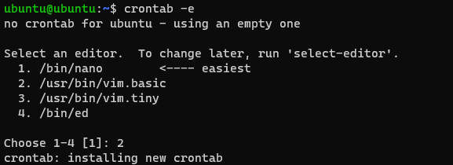
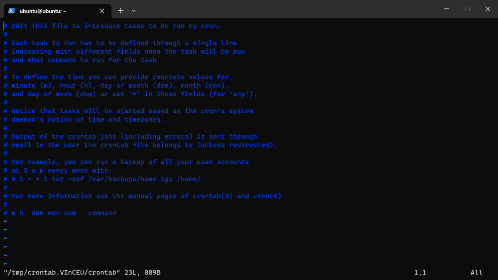
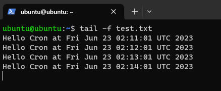

## 前言

在生活中，我们往往会碰到一些需要重复性执行的任务，执行的时间往往是固定的日期或者周期性的间隔。比如，我们会希望，热水器在晚上七点开始工作，这样回到家就可以洗澡，又或者每个周末自动将闹钟从工作日的早晨八点响铃切换成中午十一点响铃。

在计算机中，这种“定时”的任务有成千上万，我们就需要一些工具来完成作业任务，比如：Cron。

---

## Cron 是什么

Cron 是类 Unix 操作系统上的作业调度程序，用户通过配置文件来设定作业，以固定的时间、日期或者间隔时间来执行。

---

## 创建第一个任务

使用以下命令创建作业：

```shell
crontab -e
```

如果您是第一次创建 crontab，系统会要求您选择默认文本编辑器。选择您喜欢的编辑器 [1 – 4] 并按 ENTER 键以使用您选择的文本编辑器打开一个新的 crontab：



新创建的 crontab 中包含了一些有用的注释：



在最后一行，添加上我们的作业任务：

```shell
* * * * * echo "Hello Cron at $(date)" >> ~/test.txt
```

该任务会每一分钟执行一次 echo 指令，并写入 test.txt 文件中，稍等几分钟查看 test.txt 文件，会发现定时任务执行成功：



---

## Cron 表达式

简单的来说，每一个 Cron 任务都是使用 Cron 表达式编写的，包含两部分内容：作业时间+任务命令。任务命令就是平时在命令行环境下可以指定的任意命令或者脚本。而 Cron 时间表达式需要一些额外的解释，才能读懂。

详细的来说，Cron 任务语法由 6 个用空格分隔的参数组成。前 5 个参数描述执行时间（也就是时间表达式），最后一个参数是命令或将由默认 shell 执行的 shell 脚本的完整路径：

```shell
[minute] [hour] [day of month] [month] [day of week] [command]
```

当分钟、小时和月份字段与当前时间匹配，并且至少一个日期字段（每月的某一天或每周的某一天）与当前时间匹配时，Cron 将执行命令。接下来详细讲讲时间表达式的语法。

### 取值范围

五个参数都有各自的取值范围，比如，分钟参数是 0-59，而星期的参数是 0-6，参考下表：

|    参数名    | 取值范围 |     注释     |
| :----------: | :------: | :----------: |
|    minute    |   0-59   |    分钟数    |
|     hour     |   0-23   |    小时数    |
| day of month |   1-31   | 月份中的天数 |
|    month     |   1-12   |     月份     |
| day of week  |   0-6    |    星期几    |

通过以上的参数，可以指定特定的时间节点去指定任务，举例：

|  时间表达式  |                  解释                  |
| :----------: | :------------------------------------: |
|  0 0 1 1 ?   |         1 月 1 日的 0 时 0 分          |
| 59 6 15 5 ?  |        5 月 15 日的 6 时 59 分         |
| 30 15 ? 9 0  |     9 月的每个礼拜天的 15 点 30 分     |
| 30 19 ? 12 6 |    12 月的每个礼拜六的 19 点 30 分     |
| 23 22 3 11 3 | 11 月 3 日以及每个星期三的 22 点 23 分 |

### 特殊参数

除了指定特定时间点之外，还可以指定范围，间隔步长，特定取值等等。

- `,` 指的是在两个以上的时间点中都执行，如果我们在 “分” 这个域中定义为 `8,12,35` ，则表示分别在第8分，第12分 第35分执行该定时任务。
- `-` 指定在某个域的连续范围，如果我们在 “时” 这个域中定义 `1-6`，则表示在1到6点之间每小时都触发一次，用 `,` 表示为 `1,2,3,4,5,6`
- `*` 表示所有值，可解读为 “每”。 如果在“日”这个域中设置 `*`,表示每一天都会触发。
- `?` 表示不指定值。使用的场景为不需要关心当前设置这个字段的值。例如：要在每月的8号触发一个操作，但不关心是周几，我们可以这么设置 `0 0 0 8 * ?`
- `/` 在某个域上周期性触发，该符号将其所在域中的表达式分为两个部分，其中第一部分是起始值，除了秒以外都会降低一个单位，比如 在 “秒” 上定义 `5/10` 表示从 第 5 秒开始 每 10 秒执行一次，而在 “分” 上则表示从 第 5 秒开始 每 10 分钟执行一次。
- `L` 表示英文中的**LAST** 的意思，只能在 “日”和“周”中使用。在“日”中设置，表示当月的最后一天(依据当前月份，如果是二月还会依据是否是润年), 在“周”上表示周六，相当于”7”或”SAT”。如果在”L”前加上数字，则表示该数据的最后一个。例如在“周”上设置”7L”这样的格式,则表示“本月最后一个周六”
- `W` 表示离指定日期的最近那个工作日(周一至周五)触发，只能在 “日” 中使用且只能用在具体的数字之后。若在“日”上置”15W”，表示离每月15号最近的那个工作日触发。假如15号正好是周六，则找最近的周五(14号)触发, 如果15号是周未，则找最近的下周一(16号)触发.如果15号正好在工作日(周一至周五)，则就在该天触发。如果是 “1W” 就只能往本月的下一个最近的工作日推不能跨月往上一个月推。
- `#` 表示每月的第几个周几，只能作用于 “周” 上。例如 ”2#3” 表示在每月的第三个周二。

---

## Cron 的命令

- crontab -e：编辑当前用户的 crontab 文件
- crontab -l：显示 crontab 文件的内容
- crontab -u [用户名]：编辑任何其他用户的 crontab 文件
- crontab -r：删除当前用户的crontab文件
- crontab -i：在删除当前用户的 crontab 文件之前显示提示
