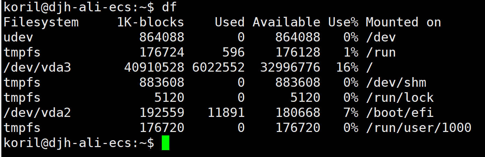
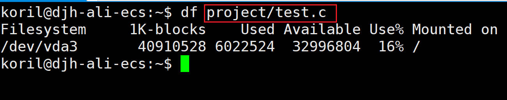
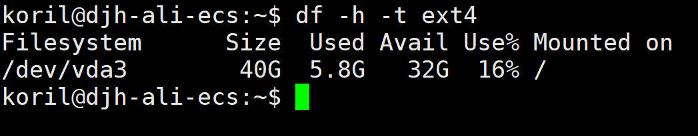
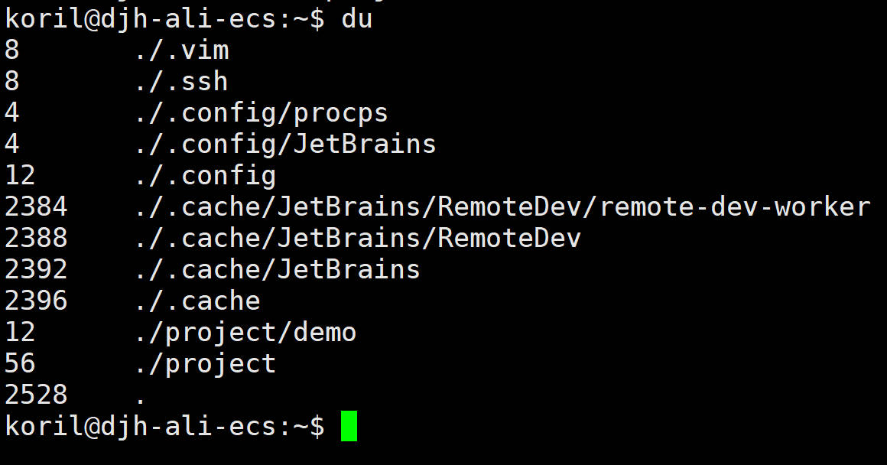
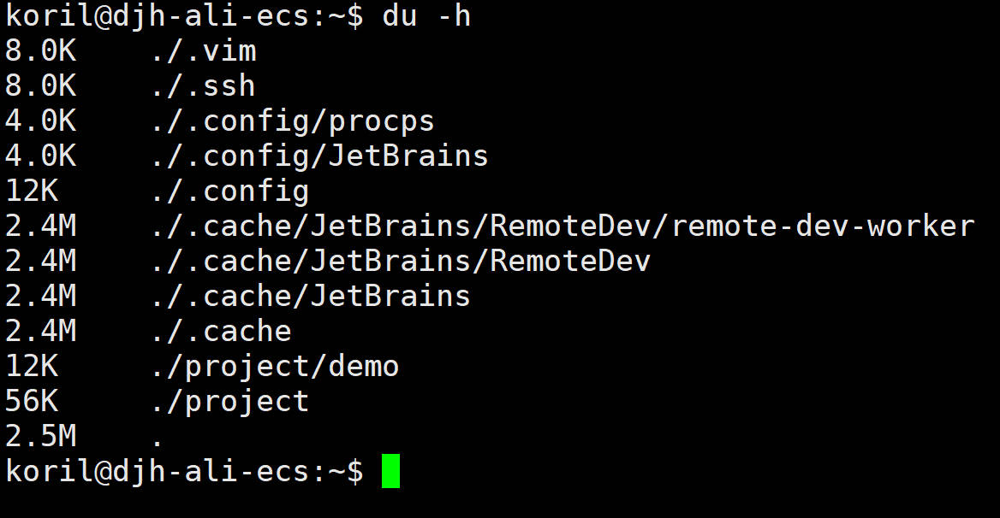
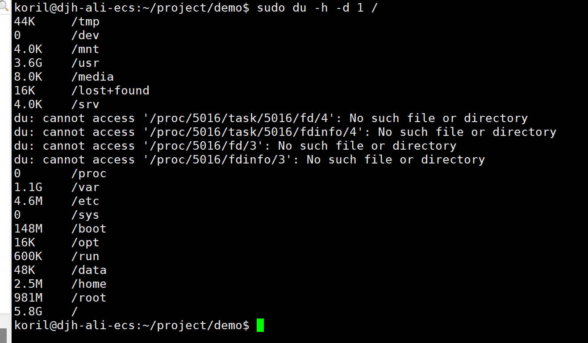

## 前言

运行在 Linux 中的一些诸如 Web 服务或者数据库服务突然出现了异常问题，有一种可能性，就是磁盘满了。

我们总是在不经意间，用一些垃圾文件或者没有经过压缩和滚动处理的日志文件塞满了整个磁盘，这时候 df 和 du 就派上用场了。

---

## df（Disk Free）

需要知道某一台设备，还有多少磁盘空间，df 可以方便的查看所有已挂载磁盘的使用情况。

df 从 /proc/mounts 和 /etc/mtab 获取磁盘信息。

df 的基本格式如下：

```
df [options] [file]
```

df 命令结果如下：



* Filesystem：挂载的存储设备的文件系统名。
* Size：Filesystem 的总大小。
* Used：已用空间。
* Avail：可用空间。
* Use%：使用率。
* Mounted on：挂载路径。

df 可以跟着一个特定的文件，结果是文件所在挂载文件系统的信息：



df 的默认结果显示是以 1024 字节为单位的块来显示，对人类而言更加友好的单位是 K（kilobytes），M（megabytes），G（gigabytes），所以有一个很常用的选项：-h，添加该选项后，结果会以人类易读的形式显示磁盘使用量和剩余空间。


使用选项 -t 可以指定文件系统类型，进行过滤：



---

## du（Disk Usage）

通过 df 命令可以看到挂载的文件系统，占用和可用的磁盘容量，接下来就要分析具体的目录或者文件占用的空间了。

du 如果不加任何参数，默认是打印当前目录下的占用情况：



左侧数字代表每个文件或者目录占用的磁盘块数，右侧是文件或者目录的名称。

打印的列表顺序，是从目录层级的最底部开始，沿着其包含的文件和子目录逐渐向上展示。

和 df 类似，可以添加 -h 使得结果更加易读：



-s 参数（summary）输出总大小，-a 参数（all）输出所有文件，-c 参数（total）会输出一个统计信息。

一般都会分别和 -h 结合使用。

```
du -sh
du -ah
du -ch
```

-d 参数（--max-depth）很有用，可以指定最大的层级数目（-d N，表示列出小于等于 N 层的文件或目录），不指定该参数 du 默认是会展示所有层级的文件。

例如，如果直接 du -h /，表示把根目录下所有层级的文件都统计出来，但是如果我们仅仅想知道根目录下一层级的文件，可以键入以下命令：



### df 和 du 的区别

df 显示有关已挂载文档系统的信息，du 专注于这些文档系统中的单个文档和目录。

一般是先用 df 查看哪一个文件系统占用过大，然后通过 du 来针对这一个文件系统挂载的目录进行查找，找到具体的大体积文件。

### 找到某目录下占用空间最大的文件

可以结合 find 命令，找到普通文件（仅仅用 du 的话，会把目录也包含进去），然后用 du 获取文件占用空间，最后使用 sort 和 head 进行排序和取前 N 个结果。

```bash
find /path -type f -exec du -h {} + | sort -rh | head -n 10
```

---

## 参考

1. [Check your disk space use with the Linux df command | Enable Sysadmin (redhat.com)](https://www.redhat.com/sysadmin/linux-df-command)
2. [du command in Linux with examples - GeeksforGeeks](https://www.geeksforgeeks.org/du-command-linux-examples/)
