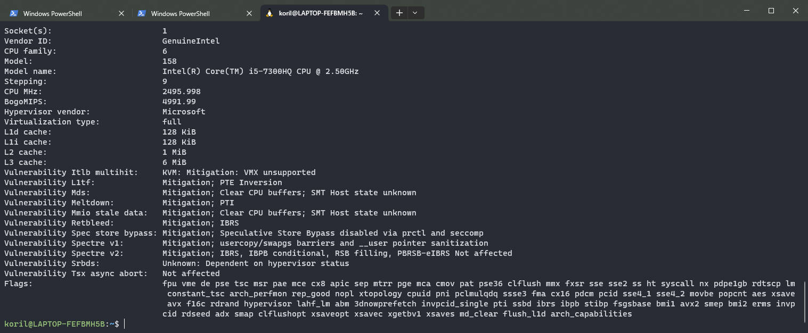
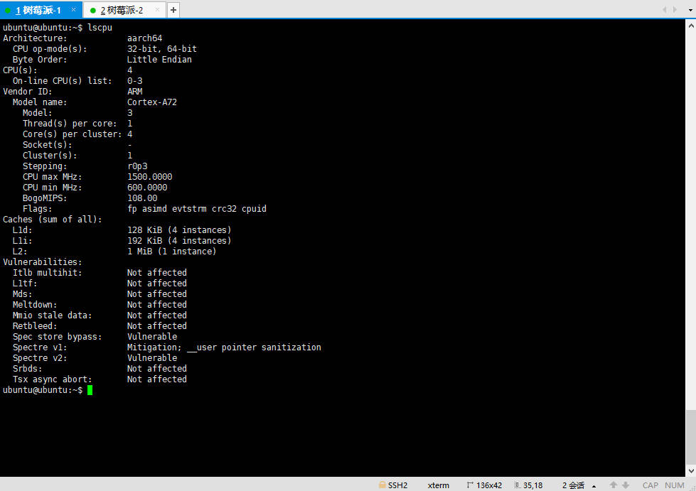
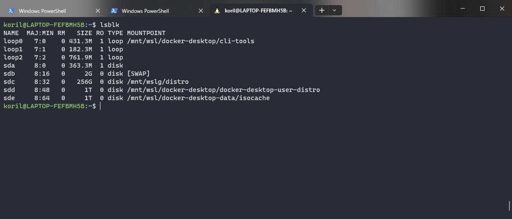
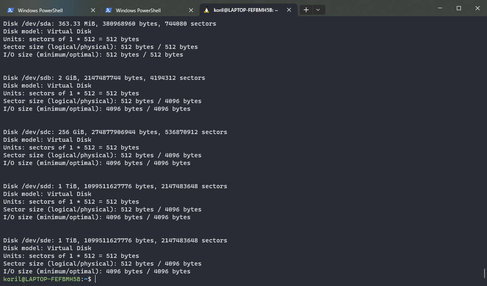

## 前言

在 Linux 服务器上部署或者维护应用程序的时候，少不了和性能打交道，而了解性能的第一步就是摸清楚面前这台机器的各种硬件配置如何。

本文概述了如果通过各种命令查看机器的硬件配置和参数。

---

## CPU

### lscpu

查看 CPU 信息可以使用 lscpu，该命令从 sysfs 和 /proc/cpuinfo 文档中获取CPU架构信息，并将其显示在终端中。

```shell
$ lscpu
```

下图是我在 Windows 10 下 WSL 的执行结果：



下图是我在树莓派 4B 下的执行结果



参数解释：

* Architecture：CPU 架构，我的笔记本是 X86_64，而树莓派是 aarch64（就是 ARM64）。
* CPU op-mode(s)：这里两张图都显示，CPU 同时支持 32 位和 64 位指令。
* Byte Order：大小端字节序，这里两个都是 Little Endian，即小端字节序。
* CPU(s)：逻辑 CPU 的个数
* On-line CPU(s) list：
* Vendor ID：厂家标识
* Model name：型号名称
* Model：型号
* Thread(s) per core：每个核心线程数量
* Core(s) per cluster: 4
* Socket(s)：CPU 插槽数，即物理核心数
* Cluster(s)：
* Stepping：r0p3
* CPU max MHz：最大主频
* CPU min MHz：最小主频
* BogoMIPS：
* Flags：指令集

### /proc/cpuinfo

既然 lscpu 是从 /proc/cpuinfo 中获取的信息，我们也可以直接查看这个文件的内容：

```shell
$ cat /proc/cpuinfo
```

返回内容更加详细，这里不再赘述。

---

## 内存

### top

top 命令经常用来监控 linux 的系统状况，是常用的性能分析工具，能够实时显示系统中各个进程的资源占用情况。

top 的命令很简单，但是显示信息很多，具体的信息解释，可以参考：

* https://blog.csdn.net/yaomingyang/article/details/78968573
* https://blog.csdn.net/xp178171640/article/details/123633732

top 中可以看到内存信息，但是除了内存之外，top 还展示了 CPU 的负载信息，运行时间，用户数，进程数等等有用的信息。

top 可以按照 CPU 和内存占用排序显示进程：

* 按P – 以 CPU 占用率大小的顺序排列进程列表
* 按M – 以内存占用率大小的顺序排列进程列表

### free

相对于信息繁多的 top，free 命令更加精简的显示了内存信息：

```shell
$ free -h
              total        used        free      shared  buff/cache   available
Mem:          7.7Gi       1.3Gi       3.7Gi       8.0Mi       2.7Gi       6.1Gi
Swap:         2.0Gi          0B       2.0Gi
```

Mem 表示物理内存，Swap 表示交换内存。

### /proc/meminfo

上面的命令都是从 /proc/meminfo 获取信息的，所以我们可以直接查看 /proc/meminfo 的内容

```shell
$ cat /proc/meminfo
```

---

## 硬盘

### lsblk

lsblk命令 用于列出所有可用块设备的信息，而且还能显示他们之间的依赖关系，但是它不会列出RAM盘的信息。块设备有硬盘，闪存盘，cd-ROM等等。

```shell
$ lsblk -f
```



### fdisk

fdisk 用于观察硬盘实体使用情况，也可对硬盘分区。

```shell
$ fdisk -l
```



### df

`df`报告文件系统正在使用多少磁盘空间。

该命令显示文件系统上可用的磁盘空间量以及每个文件名的参数。

如果您想df 以人类可读的格式运行，请使用`--human-readable （-h 简称）`选项：

```shell
$ df -h
```

### du

该`du`命令允许用户快速获取磁盘使用信息。它最适合应用于特定目录。

如果您想df 以人类可读的格式运行，请使用`--human-readable （-h 简称）`选项：

```shell
$ du -h
```

### 文件数量

查看当前目录下的文件数量（不包含子目录下的文件，非递归）

```shell
ls -l | grep "^-" | wc -l
```

查看当前目录下的目录数量（不包含子目录下的目录，非递归）

```shell
ls -l | grep "^d" | wc -l
```

查看当前目录下的文件数量（包含子目录下的文件，递归）

```shell
ls -lR | grep "^-" | wc -l
```

查看当前目录下的目录数量（包含子目录下的目录，递归）

```shell
ls -lR | grep "^d" | wc -l
```

查看当前目录下的文件加目录的数量（不包含子目录中的文件或目录，非递归）

```shell
ls -l | grep "^[-,d]" | wc -l
```

查看当前目录下的文件加目录的数量（包含子目录中的文件或目录，递归）

```shell
ls -lR | grep "^[-,d]" | wc -l
```


---

## 性能测试

### CPU

sysbench 是一款开源的多线程性能测试工具，可以执行CPU/内存/线程/IO/数据库等方面的性能测试。

Ubuntu 下安装 sysbench：

```shell
$ sudo apt install sysbench
```

先使用一个 thread 执行一次 cpu 性能测试，该指令会生成 10000 个素数，根据消耗的时间来衡量 cpu 的性能

```shell
$ sysbench cpu run
```

结果如下：

```
sysbench 1.0.18 (using system LuaJIT 2.1.0-beta3)

Running the test with following options:
# 默认，线程数是 1
Number of threads: 1
Initializing random number generator from current time

# 生成 10000 个素数
Prime numbers limit: 10000

Initializing worker threads...

Threads started!

CPU speed:
	# 每秒钟处理的事件个数
    events per second:   978.44

General statistics:
	# 总花费时间
    total time:                          10.0001s
    # 共产生的事件数量
    total number of events:              9786

Latency (ms):
		# 每个事件最小处理时间
         min:                                    0.86
         # 每个事件平均处理时间
         avg:                                    1.02
         # 每个事件最大处理时间
         max:                                   10.62
         # 95%的事件的处理时间
         95th percentile:                        1.39
         # 总共的处理时间
         sum:                                 9991.21

Threads fairness:
	# 每个线程处理的总事件
    events (avg/stddev):           9786.0000/0.00
    # 每个线程处理的总时间
    execution time (avg/stddev):   9.9912/0.00
```

通过 --threads 参数，可以增加线程数量

```shell
sysbench --threads=2 cpu run
```

结果如下：

```
sysbench 1.0.18 (using system LuaJIT 2.1.0-beta3)

Running the test with following options:
Number of threads: 2
Initializing random number generator from current time


Prime numbers limit: 10000

Initializing worker threads...

Threads started!

CPU speed:
    events per second:  2006.06

General statistics:
    total time:                          10.0005s
    total number of events:              20065

Latency (ms):
         min:                                    0.91
         avg:                                    1.00
         max:                                   11.29
         95th percentile:                        1.10
         sum:                                19986.98

Threads fairness:
    events (avg/stddev):           10032.5000/3.50
    execution time (avg/stddev):   9.9935/0.00
```

events per second 从原先的 978.44 提高到了 2006.06，说明多加一个线程确实性能可以提高 1 倍。

### File IO

sysbench 还可以测试文件 IO 读写速度，sysbench 测试文件读写需要做 prepare，run，cleanup 这三步，分别是：准备数据，跑测试，删除数据。

在准备阶段创建测试所需数据，在清理阶段删除这些数据。

```shell
# 线程数=32 每隔4s输出一次结果 测试时间=60s
# 文件数=10 文件总大小=10G 文件操作模式=随机读写
# 准备测试数据
sysbench --threads=32 --report-interval=4 --time=60 --test=fileio --file-num=10 --file-total-size=10G --file-test-mode=rndrw prepare

# 运行
sysbench --threads=32 --report-interval=4 --time=60 --test=fileio --file-num=10 --file-total-size=10G --file-test-mode=rndrw run

# 清理测试数据
sysbench --threads=32 --report-interval=4 --time=60 --test=fileio --file-num=10 --file-total-size=10G --file-test-mode=rndrw cleanup
```

