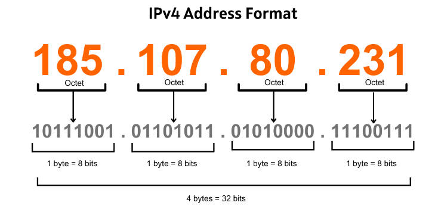
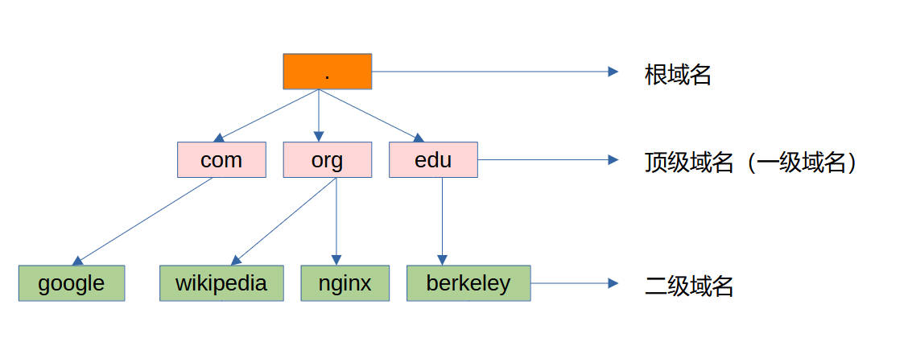
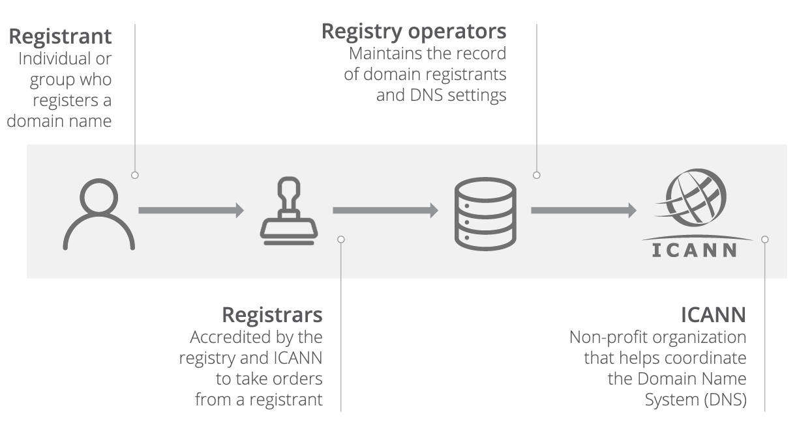
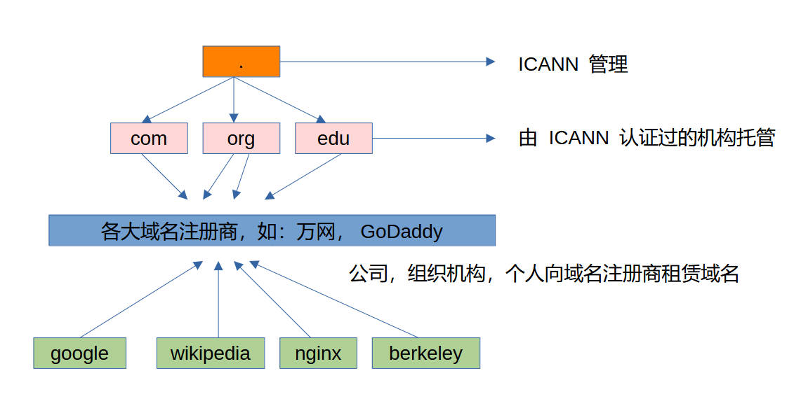
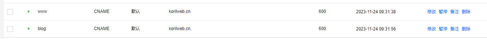

## DNS 是什么

互联网上的每台主机的逻辑地址使用的是 IPv4 地址，它由一串 32 位的二进制数表示，每 8 位划为一组，再转换成十进制，就是我们平时看到的点分十进制格式：a.b.c.d，例如：192.168.0.1，IP 地址对于人类而言，很难记忆，我们更擅长记住有意义的文字符号，而非数字。

DNS 应运而生，它的全称是 Domain Name System，即域名系统，将域名和 IP 地址进行映射，能够让人更加方便的使用互联网。

----

## DNS history

互联网的历史是从美苏冷战开始的，美国国防高级研究计划局开发了阿帕网，也就是后来互联网的鼻祖，阿帕网一开始就是为了应对苏联核打击而设计的分布式指挥系统，分散的节点之间通过网络连接通讯，所以就诞生了网络传输协议 TCP，UDP 等，网络节点之间通讯需要知道节点的地址，就衍生出了 IP 地址的概念，用来标志一个网络节点的逻辑地址，而人类很难记住每个节点的 IP 地址，所以自然而然的希望给每个节点起个英文名，这样访问别的节点的时候，只要输入英文的别名就行了，但是底层的计算机网络系统依然是使用 32 位二进制数来找到对应的网络节点。

起初，斯坦福大学维护了一个名为 HOSTS.txt 的文本文件，该文件将 APRANET 上的主机名映射到数字地址，地址一开始是手动分配的，后来，Feinler 在 NIC 中的服务器上设置了WHOIS目录，用于检索有关资源、联系人和实体的信息。她和她的团队提出了域的概念。Feinler 建议域应该基于计算机物理地址的位置。例如，教育机构的计算机具有 edu 域。她和她的团队从 1972 年到 1989 年管理着主机命名注册表。

到 20 世纪 80 年代初，维护单个集中式主机表变得缓慢且笨拙，新兴的网络需要一种系统，来自动命名，以解决技术和人员问题。

1984 年，四位加州大学伯克利分校的学生 Douglas Terry、Mark Painter、David Riggle 和 Songnian Zhou 为伯克利互联网名称域编写了第一个Unix 名称服务器实现，通常称为 BIND。

1985 年，DEC 的 Kevin Dunlap 对 DNS 的实现进行了大幅修改。

随后， Mike Karels、Phil Almquist 和 Paul Vixie 接管了 BIND 的维护工作。Internet Systems Consortium 由Rick Adams、Paul Vixie和Carl Malamud于 1994 年创立，专门为 BIND 开发和维护提供场所。

DNS 作为一种主机名映射到 IP 地址的分布式数据库系统就诞生了。

---

## IPv4

IPv4，全程 Internet Protocol version 4，是互联网和其他分组交换网络中的核心协议，它使用逻辑寻址系统进行路由，将一个数据包从源主机转发到距离目标主机更近的下一个路由器。

它的格式如下：



IPv4 地址是一个 32 位二进制地址，用于标识网络上的设备。

IPv4 地址有公共和私有之分。在封闭的专用网络上，你的设备需要拥有一个专用 IP 地址，你的设备可以使用该地址，通过网络连接到该专用网络上的其他设备。

在客户端，如果需要访问互联网，你的设备同样需要有一个 IP 地址，这个公共 IP 地址通常是互联网服务商提供（例如国内的电信，联通，移动）。

而在互联网的服务端，服务器也需要有一个公共的 IP 地址，以便成千上万的客户端们都能找到该服务器。

---

## 域名

现在当我们需要访问搜索引擎的时候，可以很熟练的敲下，google.com 或者 baidu.com 的网址，这意味我们将向谷歌公司或者百度公司的搜索引擎服务器建立 TCP 连接发起 HTTP 请求，这比直接输入由数字组成 IP 地址来的更轻松。

google.com 和 baidu.com 就是域名，域名用于识别互联网资源，例如计算机、网络和服务，其基于文本的内容比 IP 协议中使用的数字地址更容易记住。

域名可以代表一类资源的整个集合或单个实例。各个互联网主机使用域名作为主机标识符，也称为主机名。如果域名等同于主机名时，表示该域下通常没有进一步的从属域名空间。

如今，互联网名称与数字地址分配机构（ICANN）负责管理互联网域名空间的顶层开发和架构。它授权域名注册商，通过域名注册商可以注册和重新分配域名（后面的“域名注册”一节会再次提到）。

由于域名非常非常多，如果都存放在一台域名服务器中，那么不仅查询速度慢，服务器压力大，而且难以保证服务的可靠性。因此，DNS 采用了分布式的设计方案，大量的域名服务器之间通过层次方式组织，分布在全世界范围内。

域名空间由域名树组成。树中的每个节点都保存与域名相关的信息。该树从DNS 根区域开始细分为多个区域。

从最右边开始，越靠近右边的节点，则表示越靠近整个域名树的根，而越靠近左边的节点，则越靠近整个域名树的叶子。

既然域名空间是一个树，那就有根节点，所以接下来从根域名开始讲起。

### 根域名

之前举例的 google.com 其实是一种域名简略的写法，它的**完全限定域名**（FQDN，Fully qualified domain name）是：

```
www.google.com.
```

需要注意的是，最右边的点，就是整个树的根，表示根域名，最左边的 www 表示 goog.com. 这个域下的某个主机，主机的名字叫 www。



该层次结构的顶部是根域。根域没有正式名称，其在 DNS 层次结构中的标签是空字符串。Internet 上的所有完全限定域名(FQDN) 都可以被视为以该根域的空字符串结尾，因此以句号字符（标签分隔符）结尾，例如“ www.example.com. ”。为了方便，现代的客户端都不要求输入最后一个句点。

根域包含互联网的所有顶级域，是互联网域名解析系统（DNS）中最高级别的域名服务器，负责返回顶级域的权威域名服务器地址。

根域名服务器，在全球范围内共有 13 台（以英文字母 A 到 M 依序命名），但这个数字指的是逻辑上的（就是说有 13 个独立的 IP 地址），并不是说物理上只有 13 台服务器，DNS 使用 UDP 协议传输报文信息，会受到 MTU 的限制，详细信息，可以参考以下解答：

1. https://serverfault.com/questions/587625/why-dns-through-udp-has-a-512-bytes-limit）
2. https://lists.isc.org/pipermail/bind-users/2011-November/085653.html

随着技术进步，使用任播寻址技术（Anycast）使得根服务器实例的实际数量要大得多，截至 2023-11-25T03:29:56Z，根服务器系统由 12 个独立根服务器运营商运营的 1769 个实例组成。

可以通过 https://root-servers.org/，查看所有根域名服务器的信息。

### 顶级域名

根域名服务器管理着所有的顶级域名，我们常见的 .com，.net，.cn，.edu 等等都是顶级域名。

顶级域（TLD，Top Level Domain）是互联网分层域名系统中仅次于根域的最高级别域之一。顶级域名存在于名称空间的根域下。

对于所有较低级别的域，它是域名的最后一部分，即完全限定域名的最后一个非空标签。例如，在域名 www.example.com 中，顶级域为.com。

顶级域名，有上千个，显然由一个 ICANN 机构是管理不过来的，所以大多数顶级域名的管理职责由 ICANN 委托给特定组织。比如 .com 由 VeriSign 公司维护，.xyz 由 XYZ.COM 维护，.cn 由中国互联网络信息中心（CNNIC）维护。

互联网名称与数字地址分配机构（ICANN）是一个互联网多利益相关方社区，负责运营互联网号码分配机构（IANA），并负责维护DNS 根域。

以下是一些常见顶级域名代表的含义：

* .com：商业机构
* .org：非营利性组织
* .edu：教育机构
* .net：网络服务机构

### 二级域名

在域名系统层次结构中，二级域（SLD 或 2LD）是直接位于顶级域（TLD）之下的域。例如，在 example.com 中，example 是 .com 下的二级域名。

通常，各个公司，学校，机构或者个人会向域名注册管理机构申请注册二级域名，来在互联网上标识自己的网站或者服务。二级域名可以说就是一个企业在虚拟网络世界中的独一无二的电子招牌，围绕着二级域名的抢注和投资而引发的事件数不胜数。

### 三级域名

三级域名是形如“www.example.com”的域名，可以当做是二级域名的子域名，特征为域名包含两个“.”(dot)。对于域名所有者/使用者而言，三级域名都是二级域名的附属物而无需单独费用。通常三级域名表示公司的某个主机或者某种服务。

例如，google.com 这个二级域名下就有很多三级域名，代指不同的服务：

```
1. search.google.com     -> 搜索服务
2. mail.google.com       -> 邮件服务
3. map.google.com        -> 地图服务
4. translate.google.com  -> 翻译服务
```

如果你成功申请了一个二级域名，那么意味着你可以开通很多三级域名，不需要额外的花销和申请，只需要在 DNS 解析配置增加一些记录即可。

### 域名注册

想要申请自己的域名，需要向域名注册商提交申请，注册管理机构将域名注册的商业销售委托给注册商。例如，当注册商将“hello.com”域名注册出售给最终用户（或“注册人”）时，注册商必须通知 VeriSign——“.com”域名的注册管理机构。注册商还必须向 VeriSign 支付费用，该费用计入注册商向最终用户收取的价格中。



这里出现了几个概念，注册人，注册商，注册管理结构。

1. 注册人，毫无疑问就是申请域名的用户。
2. 注册管理机构，是相应域名后缀/顶级域的运营/管理机构，即该域的拥有者，也就是源头。
3. 注册商，夹在注册人和注册管理机构中间，注册商就像是中介，从注册管理机构那里获得分销的权限，直接面向注册人。



国内的一些域名注册商：

* 万网（阿里云）：https://wanwang.aliyun.com
* 腾讯云（DNSPod）：https://cloud.tencent.com
* 爱名网：https://www.22.cn/

国外的一些域名注册商：

* GoDaddy：https://www.godaddy.com
* NameSilo：https://www.namesilo.com
* Domain.com：https://www.domain.com

查看其他的注册商可以访问该网址：https://www.icann.org/en/accredited-registrars

查看其他的注册管理机构可以访问该网址：https://www.iana.org/domains/root/db

### 域名解析配置和原理

所有域名解析都要先从根域开始，根域的维护者是 ICANN，顶级域的维护者是各个域名注册管理机构，所以用大白话来说，我想通过 DNS 知道 www.google.com 的 IP 地址是什么，DNS 会先从根域开始找起，ICANN 的服务器并不知道 www.google.com 的 IP 地址，但它能告诉程序，.com 的顶级域去哪里找，然后程序就会跑去 .com 的维护者，也就是 VeriSign 公司的服务器去找，VeriSign 就会告诉程序 google.com 对应的 IP 地址是什么。

域名的解析工作由 DNS 服务器完成。由DNS构建起的域名与IP地址之间的对应关系，称之为 DNS 记录。通过设置不同的解析记录，可以实现对主机名不同的解析效果，从而满足不同场景下的域名解析需求。

一般而言，域名服务器可以分为以下四类：

* 根域名服务器：每个根域名服务器都知道所有顶级域名服务器的 IP 地址。
* 顶级域名服务器：对于每个顶级域名，如 com、org、edu 等，都有对应的顶级域名服务器。顶级域名服务器知道其所管理的所有权威域名服务器的 IP 地址。
* 权威域名服务器：一个网站需要将其域名和 IP 地址注册到相应的权威域名服务器中。
* 本地域名服务器：本地域名服务器不属于上述域名服务器的层次结构，但是它对域名系统非常重要。每个 ISP（如一个大学、一个公司）都有一个本地域名服务器（也叫默认域名服务器）。

常见的有以下几种记录类型：

1. A：Address，地址记录，是最常用的一种，用来指定一个域名对应的 IPv4 地址。
2. CNAME：Canonical Name，别名记录，用来指定一个域名指向到另外一个域名上，再由另外一个域名提供 IPv4 记录。
3. MX：Mail Exchanger，邮件交换器，MX记录是邮件交换记录，主要用于邮箱解析，在发送邮件时根据收件人的地址后缀进行邮件服务器的定位。MX记录的权重对邮件服务非常重要，发送邮件时，会先对域名进行解析，查找MX记录，按照权重从小到大的顺序联通服务器进行邮件发送。
4. NS：Name Server，域名服务器记录，NS 记录用于将子域名交给其他 DNS 服务商解析时使用，从某种意义上来讲NS记录相当于设置子域名解析服务器的A记录，用于在解析请求时确定该服务器的IP地址。大多数域名注册商默认使用自己的NS记录来解析用户的域名，但用户也可以设置NS记录指向更专业安全的域名解析厂商。
5. AAAA：Address，地址记录，与A记录相对的是，AAAA 记录是用于将域名解析到IPv6地址的一种DNS记录类型。

例如现在购买了一台服务器，IPv4 的地址是 114.21.115.8，而域名是 korilweb.cn

可以在页面上配置一条 A 记录：


主机记录 @ 表示，直接解析主域名，除了 @ 之外，还可以自定义各种主机名，比如：blog，fun，map 之类的都可以，通常有些固定的叫法，www 作为主机名表示提供 web 网页，mail 作为主机名表示提供邮件服务。

如果，希望将其他三级域名，比如 blog，www 之类的也解析到同样的主机上，除了直接使用 A 记录，也可以添加 CNAME 记录，并将其指向主域名：



这样做有一个好处就是，如果全部都是 A 记录，有一天服务器的 IPv4 地址换了，就得一条一条修改，而是用 CNAME 记录，只需要修改一条记录。

## nginx 的 server_name 配置

如果有多个三级域名，比如，上面举例的 www.korilweb.cn，blog.korilweb.cn，现在都已经在 DNS 解析配置中配好了 CNAME 或者 A 记录，指向服务器，那么如何使用 Nginx 来区分不同的服务，然后转发到不同的地方呢？

答案就是 Nginx 的 server_name 参数，假设这两个三级域名都使用 80 端口，但是希望提供不同的页面展示，可以在 Nginx 配置文件中配置以下参数：

```nginx
server {
    listen 80;
    listen [::]:80;

    server_name www.korilweb.cn;

    location / {
        root /data/vhost/www;
        index index.html;
    }
}

server {
    listen 80;
    listen [::]:80;

    server_name blog.korilweb.cn;

    location / {
        root /data/vhost/blog;
        index index.html;
    }
}
```

尽管我们对 www.korilweb.cn 和 blog.korilweb.cn 这两个域名（也可由叫做主机名）的 DNS 都指向了一个服务器，但 Nginx 依然能够分辨出它们对应的是不同的主机名，这是因为当我们使用域名访问服务器的时候，客户端软件，比如 Chrome 会在请求头里加上一个参数——Host，该参数的 value 正是主机名，Nginx 也是拿这个参数来和 server_name 进行匹配，可以用 curl 做个简单的实验：

```
curl.exe 114.21.115.8:80
curl.exe -H "host: www.korilweb.cn" 114.21.115.8:80
curl.exe -H "host: blog.korilweb.cn" 114.21.115.8:80
```

观察结果可以发现，如果配置文件有 server_name 正好完全匹配 HTTP 请求中的 Host header，则定义这个完整字符串的server block 就被选择处理请求。

---

## 参考

1. https://en.wikipedia.org/wiki/Root_name_server
2. https://en.wikipedia.org/wiki/ICANN
3. https://en.wikipedia.org/wiki/Jon_Postel
4. https://www.ruanyifeng.com/blog/2018/05/root-domain.html
5. https://en.wikipedia.org/wiki/Domain_Name_System
6. https://ruanyifeng.com/blog/2016/06/dns.html
