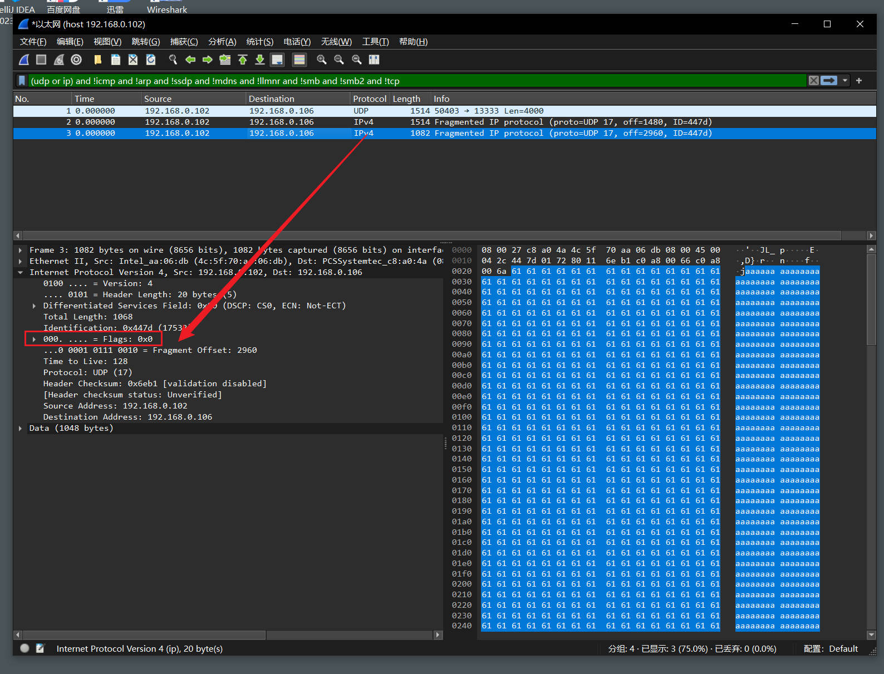

## 前言

在通过 IP 协议进行通信时，会在上层数据前，添加 IP 首部，包含了关于 IP 协议控制的各个信息。

由于受到数据链路层的 MTU（Maximum Transmission Unit，最大传输单元）的限制，IP 数据包是有最大的长度的。

本文简述 IPv4 首部字段含义以及 IP 报文的分片和重组。

---

## IPv4 首部


### 版本（Version）

表示 IP 首部的版本号，由 4 bit 组成，一般都是 IPv4，版本四，所以为 0100。

### 首部长度（IHL，Internet Header Length）

表示 IP 首部的大小，由 4 bit 组成，其表示长度大小的单位为 4 字节，对于没有选项（Options）的 IP 报文而言，其长度是固定的 20 字节，20 / 4 = 5，所以首部长度一般都是 5，即 0101。

### 区分服务（Type  Of  Service）

用来表示服务的质量，由 8 bit 组成，用来表示优先度，延迟，吞吐，可靠性，由于 TOS 的实现控制非常复杂，导致其几乎没有被投入使用，后来 TOS 被拆分成两个段——DSCP（Differential Services Codepoint，差分服务代码点）以及ECN（Explicit Congestion Notification，显示拥塞通告）。

DSCP 用来进行质量控制，ECN 用来报告网络拥堵情况。

### 总长度（Total Length）

这里的长度，表示 IP 首部与上层数据合起来的总字节数。该字段长 16 bit，意味着 IP 数据包最大理论长度为 2 ^ 16 - 1 = 65535 字节。

但是实际上 IP 所依赖的下层的数据链路层是有 MTU，很少有超过 1500 字节的。

### 标识（ID，Identification）

用于分片重组，由 16 bit 组成，分片中用于确定哪些片属于同一个 IP 数据报。

### 标志（Flags）

用于分片重组，由 3 bit 组成。

第一个 bit 未使用，始终为 0。

第二个 bit 表示是否进行分片（DF，don't fragment），0 表示可以分片，1 表示不能分片。

第三个 bit 表示是否为最后一个包（MF，more fragment），0 表示最后一个分片，1 表示非最后一个分片。

### 片偏移（FO，Fragment Offset）

用于分片重组，由 13 个 bit 组成，用于重组时，标识每一个分段相对于原始数据的位置，第一个分片对应的值是 0，对应的长度单位是 8 字节。

例如，1480 的偏移量，其字段置为 1480 / 8 = 185，即 0 0000 1011 1001。

### 生存时间（TTL，Time To Live）

用来定义一个报文在网络上的生存时间，由 8 bit 组成，最初是用秒为单位，但实际上变成了，每经过一台路由器处理该数据报时，TTL 的值减去 1，若 TTL 为 0 时，该数据报被丢弃。

### 协议（Protocol）

不同层的报文中都会出现这种类似的字段，表示上层的协议（这里是运输层），由 8 bit 组成，该字段仅在 IP 数据报到达了目的地时才会使用，它告诉程序应该将该报文交给哪一个运输层协议，例如，值为 6 表示交给 TCP，值为 17 则交给 UDP。

该字段在 IP 数据报的作用类似于运输层的端口号，也类似于数据链路层的类型字段。它们都是为了将当前层协议和上层协议结合起来。

### 首部校验和（Header Checksum）

该字段仅用于校验 IP 首部，不校验数据部分，由 16 bit 组成，主要是确保 IP 数据报不被破坏。

### 源地址（Source Address）

32 bit 的发送端的 IP 地址

### 目标地址（Destination Address）

32 bit 的接收端的 IP 地址

### 可选项（Options）

长度可变，仅在实验中使用，由于长度的可变性，导致处理性能下降，复杂度上升，故在实践中几乎不使用。

### 数据（Data）

IP 数据报承载的上层协议的内容

---

## 分片和重组

数据链路层的 MTU，也就是最大传输单元，决定了 IP 数据报的大小是有限的，不同的数据链路层协议的 MTU 都不同，以最广泛使用的数据链路层协议——以太网协议为例，它的 MTU 是 1500 字节（不考虑巨型帧）。

例如，我们发送一个 4000 字节数据的 UDP 包，传输层会在数据前加上 UDP 首部（8 字节），也就是说最终放到 IP 报文的数据有 8 + 4000 = 4008 字节。

显然，4008 字节无法在 MTU 为 1500 的以太网中一次性传输，所以为分为 3 个片段（fragment），这些片最终到达目的地主机后会再重组成完整的 UDP 报文，最后交给运输层。

通过已下代码发送包含 4000 字节数据的 UDP 包，然后在目标主机上通过 wireshark 抓包，来直观的看 IP 如何分片的。

```python
import socket

def main():
    ip = '192.168.0.106'
    port = 13333

    len = 4000
    data = 'a' * len

    udp_socket = socket.socket(socket.AF_INET, socket.SOCK_DGRAM)
    udp_socket.sendto(data.encode("utf-8"), (ip, port))
    
    udp_socket.close()

if __name__ == "__main__":
    main()

```

### Wireshark 抓包

运行以上代码，从本机向目标主机发送 UDP 包，目标主机的抓包结果如下：


这里本应该有三个 IP 分片，但只发现了两个 IP 分片，并且它们的 Flags 的第三个 bit （MF）都是 1，说明这两个 IP 分片都是中间分片，结果分片被 Wireshark 自动替换成了重组后的 UDP 完整的包。

想要看到真实的情况，我们可以关闭这个自动重组显示的功能。


去掉之后，就是正常的三个 IP 分片了：



可以看到，最后一个分片的 MF 标记为 0。

### 分析

第一个分片，由于 IP 首部和 UDP 的首部分别占去了 20 个字节和 8 个字节，所以仅能承载 1500 - 20 - 8 = 1472 字节的数据。


可以注意到，第一个分片的偏移量为 0。

第二个分片，由于 IP 首部占去 20 字节，所以能承载 1500 - 20 = 1480 字节的数据：


通过第二个分片，我们可以认识到，一个 IP 被拆分成多个 IP 分片，每个 IP 分片还是一个 IP 数据报，因为它们都有一个 IP 首部。

第二个分片没有 UDP 首部，因为 UDP 首部（8 字节）和数据（4000 字节）被 IP 视为完整的一串数据（4008 字节），它存在于第一个分片中，所以第二个分片包含的数据是 1500 - 20 = 1480 字节。

第三个分片，仅剩下最后的一些数据，长度为：4000（总数据量） - 1472（第一个分片携带的数据量）- 1480（第二个分片携带的数据量） = 1048 字节。


需要注意的是，路由器仅仅负责分片，重组是由主机完成的，这样做的目的如下：

* 现实中，无法保证所有分片经过同一路径，但是可以确定这些分片的目的地是同一个，所以在终点进行重组。
* 将重组的性能损耗放到端点主机上，减轻中间链路的路由器们的负担。
* 如果在某个路由器中进行重组，那么到之后的其他路由器可能还会分片，带来不必要的开销。
