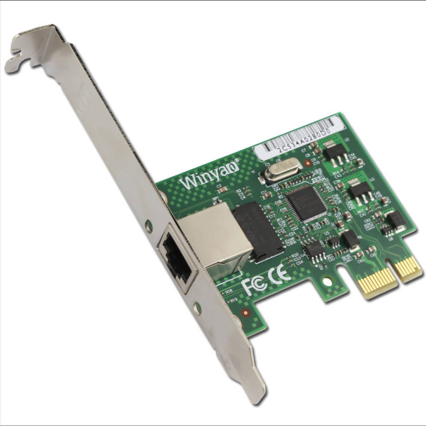
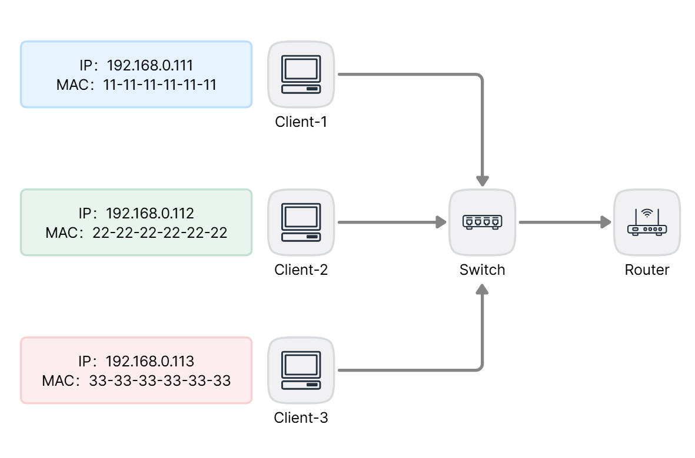
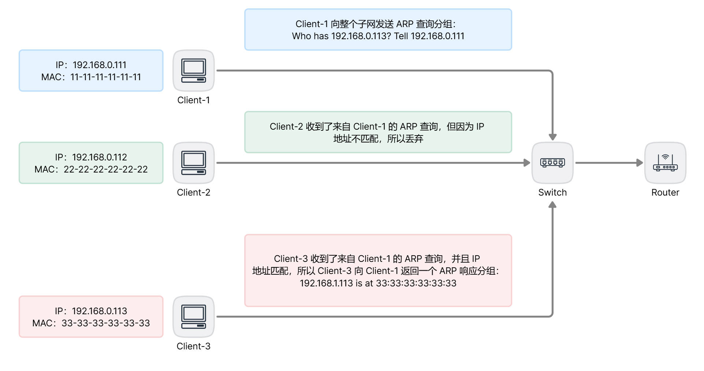
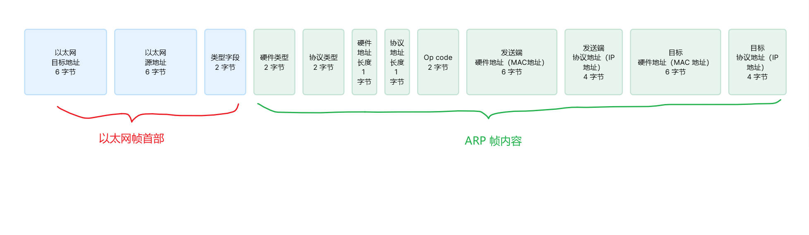
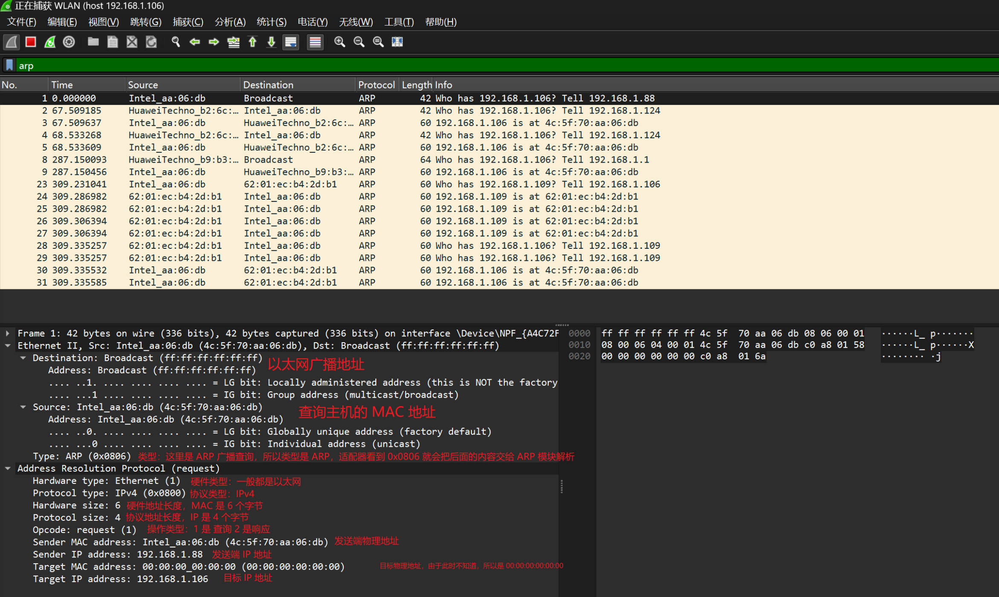

## 前言

在最初接触链路层寻址的时候，对于 MAC 地址还是有些疑惑，关于它和上层协议（网络层）的 IP 地址之间的关系和作用不甚了解，文本意欲理清它们的概念。

---

## MAC 地址

有了 IP 地址后，为什么网络节点还需要 MAC 地址，其实最好的一个比喻就是人的身份证号和收件地址。

网络层的 IP 地址其实相当于一个人的收件地址，主机在接入不同的网络的时候 IP 地址会随之变化，就好比人的收件地址会随着工作单位，家庭地址的变化而变化一样。

而 MAC 地址类似人的身份证号，是永远不变的，不管你到哪里，身份证号都是一样的，同样的，当我们在说 MAC 地址的时候，其实指的是主机的网络适配器（网卡）的地址，如果一个主机有多个适配器，则存在多个 MAC 地址。

MAC 地址（Media Access Control Address），也可以称为 LAN 地址或物理地址，与 IP 地址拥有层次性的概念不同，MAC 地址的结构是扁平化的，它的地址长度是 48 位（6 字节）。并且它是不变的，即在网卡生产时，网络设备制造商会将一个唯一的 MAC 地址烧录到网卡的 EPROM （一种闪存芯片）中。



MAC 地址的前三个字节，由 IEEE 分配给不同的网络设备制造商（当然，厂商申请需要付费），而后三个字节，则由制造商自己生成一个唯一的组合。

### 不可修改和唯一性

从概念上来说，MAC 地址是不可修改且全球唯一的，但是它本质上也是厂商烧录到硬件的一串比特，所以通过一些方式也是可以修改的，只不过没有 IP 地址修改来得那么容易。

现在的手机连接 Wifi 往往会使用随机 MAC 接入局域网，避免被获取到真实的 MAC 地址，防止个人信息泄露。

另外，如果 MAC 地址重复了，只要不是在同一个局域网内重复，关系也不大。如果真的在一个局域网内存在重复的 MAC 地址，只需要把其中一个改成不同的就行了。

---

## 为什么需要 MAC

局域网是为任何网络层协议而设计的，这就意味着它并不仅仅支持 IP 协议，所以为了解耦分层，我们需要一个中立的物理地址，也就是 MAC 地址，这样就能够方便的支持不同的上层协议。

IP 地址是逻辑地址，MAC 地址是物理地址，不同的层次需要不同的寻址方案，另外在应用层还有主机名作为一种地址。

---

## 地址解析协议

既然存在网络层的 IP 地址以及链路层的 MAC 地址，那么就存在它们之间的一种转换方式，类似于 DNS 用来转换主机名和 IP 地址，对于因特网而言，这是地址解析协议（ARP，Address Resolution Protocol）的任务。

### 子网内的解析原理

为了说明子网内，不同主机是如何利用 ARP 来完成 IP 地址到 MAC 地址转换的，用以下的网络结构说明：



假如 IP 地址为192.168.0.111 的 Client-1 要向 IP 地址为 192.168.0.113 的 Client-3 发送 IP 数据报，两台主机位于同一子网内。

为了发送数据包，源主机（Client-1）需要向它自己的网络适配器提供目标主机（Client-3）的 IP 地址以及 MAC 地址。

适配器一旦有了目标主机的这两个地址，就会生成链路层帧，发送到局域网中。

核心的问题就是，Client-1 如何拿到 IP 为 192.168.0.113 的 MAC 地址。

主机中有一个 ARP 模块，输入参数是相同局域网内的任何 IP 地址，返回结果是 MAC 地址。这也是 ARP 和 DNS 的一个不同点，DNS 是为整个因特网的任何地方解析主机名，而 ARP 仅仅限制在同一个局域网内解析 IP 地址。

每台主机和路由器在内存中都维护着一个 ARP 表，这张表是一个缓存，缓存了 IP 地址到 MAC 地址的映射关系。

|    IP 地址    |     MAC 地址      |
| :-----------: | :---------------: |
| 192.168.0.112 | 22-22-22-22-22-22 |
| 192.168.0.113 | 33-33-33-33-33-33 |

在 Windows 和 Linux 下，都可以使用命令查看 ARP 表：

```cmd
# 查看所有 ARP 缓存项
arp -a

# 查看某个缓存项
arp -a 192.168.0.112

# 删除某个缓存项
arp -d 192.168.0.112

# 设置某个缓存项
arp -s 192.168.0.112 22-22-22-22-22-22
```

ARP 表的缓存项是有生存时间的，一般从 30 秒到 20 分钟不等。

所以 ARP 将 IP 转换成 MAC 的第一步自然是从缓存表中寻找，如果找到了，就返回 MAC 地址。

如果源主机没有在在缓存表中找到目标主机的记录，源主机则需要发起一次 ARP 查询。

Client-1 发现缓存项中并没有 192.168.0.113 的记录，所以它向适配器发送了 ARP 查询分组，并且目标 MAC 地址是使用以太网的广播地址（FF-FF-FF-FF-FF-FF），这样在整个子网的其他主机，都会收到这个包。

每个主机的适配器都会收到该 ARP 查询包，并且该帧的 ARP 分组向上传递给 ARP 模块，ARP 模块检查其中的目标 IP 地址是否与本机 IP 地址匹配，不匹配的会丢弃帧，而 IP 地址匹配的主机则会向查询主机返回一个 ARP 响应分组。

Client-1 一旦收到了来自 Client-3 的 ARP 响应分组后，就会更新自己的 ARP 缓存表，接着就可以发送 IP 数据包了，该 IP 数据包的目标 MAC 地址，正是来自于之前的 Client-3 的 ARP 响应中的 MAC 地址。



### ARP 帧格式

在转换 IP 地址到 MAC 地址的 ARP 查询/响应的帧中，前 14 个字节是标准的以太网首部。

如果是 ARP 查询帧，以太网首部的目标地址就是 FF-FF-FF-FF-FF-FF，源地址就是查询主机的 MAC 地址。

如果是 ARP 响应帧，以太网首部的目标地址就是查询主机的 MAC 地址，源地址就是响应主机的 MAC 地址。



后 28 字节则是 ARP 查询或响应的帧内容。

需要注意的是，如果是 ARP 查询帧，由于此时目标的 MAC 地址未知，所以帧内容的目标 MAC 地址为 00-00-00-00-00-00。



以上是一个 wireshark 中的 ARP 查询抓包分析，ARP 的响应类似，不过以太网首部目标地址不再是广播地址，而是单独发送给查询主机。

---

## 参考

1. [RFC 1180 - TCP/IP tutorial (ietf.org)](https://datatracker.ietf.org/doc/html/rfc1180#page-9)