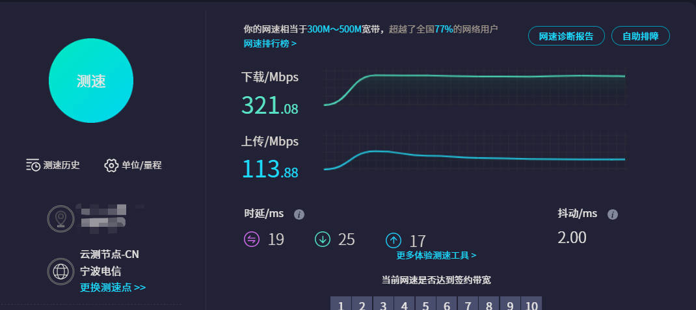

## 前言

网站的访问速度依赖于服务器的带宽，而人们又常常将带宽、宽带、上下行速率、吞吐率之类的词汇混淆，本篇简单的描述这些名词的区别，仅供参考。

---

## 带宽

在聊宽带之前，我们得先有带宽的概念。带宽（Bandwidth）是用来描述网速的大小，就是对网络的速度进行定量的描述，说的再专业一些：带宽是用来描述网络的通信线路传送数据的能力，它表示在单位时间内从网络中的某一节点到另一节点所能通过的最高数据率。

我们描述物体运动的速率用的是距离（单位：米）除以时间（单位：秒），得到速率的单位是米每秒（m/s），在计算机网络中描述数据传输的速率，则用的是数据大小（单位：比特）除以时间（单位：秒），得到数据传输速率的单位是比特每秒（bit/s）。

所以，平时说的带宽有 1Mbps，指的是数据传输速率为 1 兆 bit 每秒，即一秒钟传输 1048576 个比特位。

带宽越大，意味着每秒能通过的比特数量就越多，文件传输所需要耗费的时间就越少。

需要注意的是，带宽的数值，表示的是一种上限，意味着当你确定带宽是 1Mbps 的时候，实际网络传输速率绝不会大于该值，由于网线和设备的物理性损耗和信号干扰，真实传输速率往往会比带宽的数值偏小。

---

## 宽带和窄带

宽带是一个名词，指的是带宽比较宽，因为还有一个概念——窄带，从2010年世界电信日(5.17)开始，带宽不到 4M 一概称为窄带，只有 4M 或以上才能被称为宽带。

---

## 运营商的宽带

我们每个家庭基本上都要办理宽带，于是发生了以下对话：

甲：你家有安装宽带吗？

乙：安装了。

甲：那你安装的宽带的带宽是多少，什么套餐？

乙：我办理的套餐是 500M。

问题来了，乙所说的 500M 指的是什么？

这里的 500M，指的是带宽，既然是带宽，那么单位就是 bit/s，所以运营商套餐里的 500M 指的是带宽为 500Mbps（bps 指的是 bit per second，即 bit/s）。

但是有时候，上传下载，显示的单位并不是 bps，而是 Bps，即 Byte per second，bit 和 Byte 之间的关系是：1 Byte = 8 bits。

所以，如果 500Mbps 转换成 Bps 作为单位的话，数值需要除以 8，500Mbps = 62.5MBps。

---

## 吞吐量

吞吐量（Throughput），系统在单位时间内处理请求的数量，单位是请求数每秒（req/s）。通常我们倾向于用“吞吐量”一词来表示一个系统的测试性能。

### 带宽和吞吐量的区别

带宽决定了网络连接所能承载的最大数据量，而吞吐量则取决于网络连接的实际使用情况和网络拥塞程度。

也就是说，这是两个指标，一个带宽不大的服务器，由于各方面优化的很到位，也可以拥有比较大的吞吐量（但不会超过带宽这个硬性的上限）。

当网络连接的带宽较高时，吞吐量通常也会相应提高，但如果网络拥塞严重或出现其他性能问题，吞吐量可能会受到影响，即使带宽很高也无法达到最大的传输效率。

因此，要维护高效的网络连接，需要同时考虑带宽和吞吐量这两个指标。

---

## 上行和下行带宽

我们在访问互联网的时候，存在两种行为，一个是上传数据，另一个是下载数据。不光是我们的客户机，服务器也存在上传和下载的行为。

场景一：我们上传文件到服务器，我们的客户机向服务器上传数据，服务器从客户端下载数据。

场景二：我们从服务器下载文件，我们的客户机从服务器下载数据，服务器向客户端上传数据。

上传数据的最大速率叫上行带宽，下载数据的最大速率就叫下行带宽。

上行带宽和下行带宽通常是不一样的，对于家庭用户而言，下行带宽往往大于上行带宽，那是因为家庭网络的使用当中，下载的场景多于上传，访问页面（下载）往往多过上传文件（上传）。

对于我自己办理的 500M 的套餐，下行带宽明显大于上行带宽：

我租的阿里云服务器的带宽为 3M，这里的 3M 指的是上行带宽（出网带宽）为 3Mbps，而服务器的下行带宽可以通过客户端向服务器上传一个大文件来粗略估计：

这里上传一个 3GB 的电影文件，上传到服务器的速率大约是 10MB/s，相当于 80Mbps。

服务器的上行带宽，可以通过客户端下载服务器上的文件的速率粗略估计，下载刚刚上传到服务器的电影，发现速率明显小很多：

455KBps = 3640Kbps = 3.55Mbps

一般来讲，服务器的上行带宽很贵（出网流量），而下行带宽不收费（入网流量），内网流量也不收费。

---

## iperf

---

## 参考

1. https://mp.weixin.qq.com/s/QUfee69vzJJ4r5woWSP4sw?poc_token=HLDGwGWj7FB8A7_eEQD33WNv15iyAAepZpvSo8_2
2. https://www.baeldung.com/linux/iperf-measure-network-performance
3. https://www.linode.com/docs/guides/install-iperf-to-diagnose-network-speed-in-linux/
4. https://developer.aliyun.com/article/946308
5. https://help.aliyun.com/zh/ecs/user-guide/network-bandwidth
