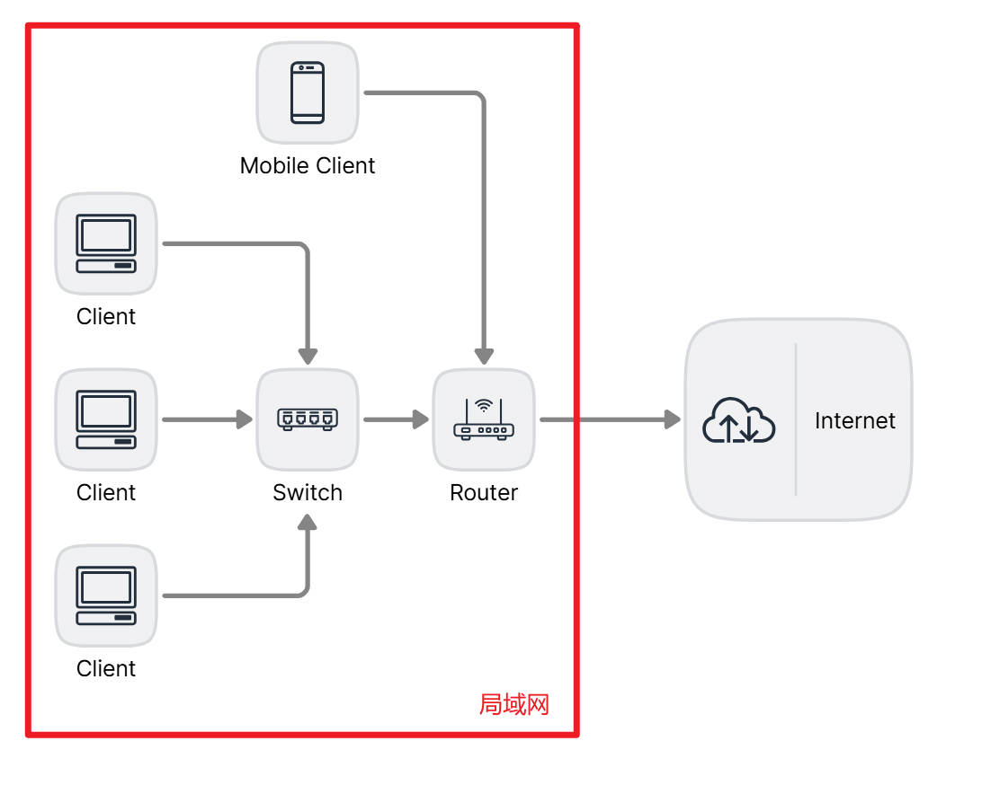
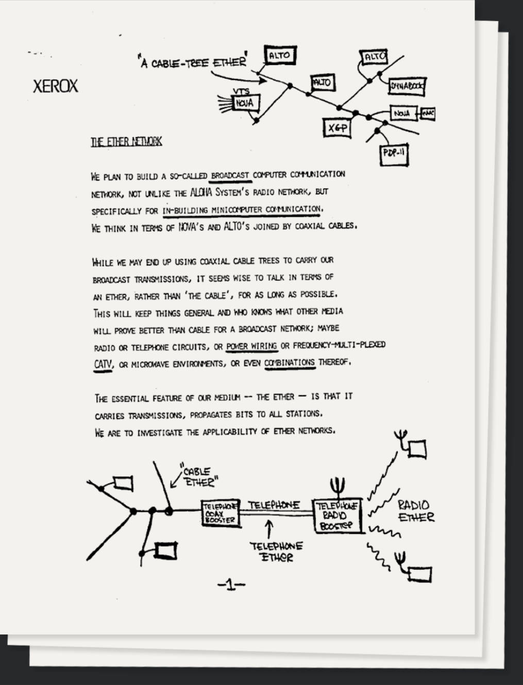
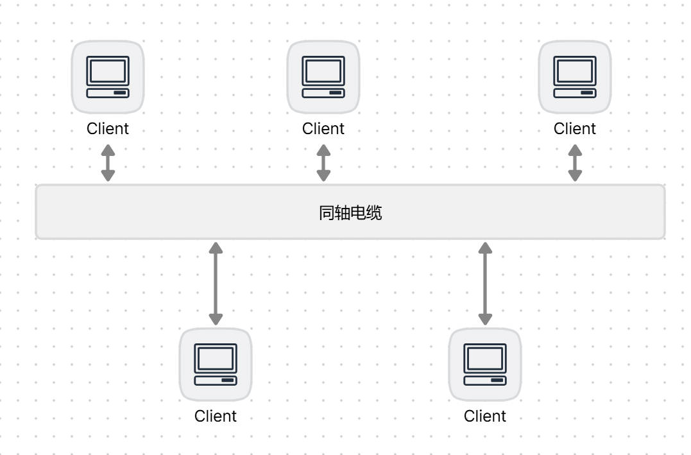
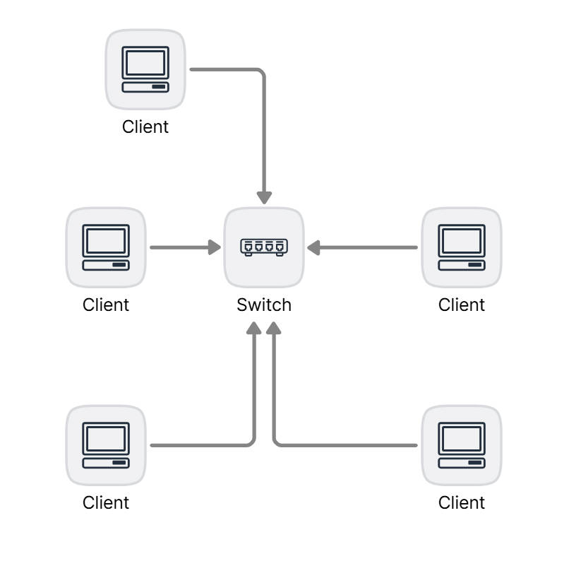

## 局域网

最初，计算机是以单机形式存在的，一个超大型的中央系统，连接多个终端。随着计算机的数量不断增多，自然需要在多个计算机之间构建一种相互通信的模式。

在一个范围较小（如：办公室，家庭，学校）的地方中，可能存在两台或者两台以上的设备（如：电脑，手机，服务器），当它们依赖某些物理介质，遵循一些通信协议来完成相互之间的通讯的时候，这些设备的集合，可以被称为局域网。

局域网的范围可大可小，两台计算机通过网线连接就可以组成一个简单的局域网。

除了局域网（LAN，Local Area Network），还存在城域网（MAN，Metropolitan Area Network）和广域网（WAN，Wide Area Network）。局域网一般局限在大楼中，城域网的范围则能扩大到整个城市，而广域网更大，能跨域城市或者国家进行通信。

除了局域网、城域网、广域网之外，还有一个互联网（Internet），它连接全球商业网络和个人电脑。

---

## 以太网

能够实现以上描述的局域网的技术不止一个，而其中最广泛使用的技术是以太网。除了以太网之外，实现局域网技术的规范还有很多，例如：ATM、FDDI、令牌环网。

以太网和Wi-Fi（无线网络连接）是现今局域网最常用的两项技术。

---

## 以太网的历史

### 以太网的诞生

以太网起源于施乐公司（Xerox）所成立的帕罗奥图研究中心（PARC，Palo Alto Research Center）中的一个研究项目，PARC 是美国一个重要的科研机构，它成立于 1970 年。

除了以太网之外，该研究中心还产出了许多重要的研究项目，比如图形界面。在1980年代初，乔布斯是最早看到帕罗奥图中心的鼠标驱动图形用户界面的商业潜力的人，并将其应用于 Apple Lisa 及一年后的麦金塔电脑，苹果引入这项技术后大大加强了电脑的易用性和普及 。

在以太网诞生中扮演重要角色的人是罗伯特·梅兰克顿·梅特卡夫（Robert Melancton Metcalf）。

1970 年早期，梅特卡夫作为一名哈佛大学的博士生，在 MIT 从事 ARPANET 的研究，期间还受到了 ALOHA 和随机接入协议工作的影响，完成了博士学位后，开始在施乐公司的 PARC 工作。

1972 年末，梅特卡夫和他在帕洛阿尔托研究所的同事共同研发了第一个实验性的“以太网”网络系统。这个系统将若干个节点互相连接起来，并连接着服务器和激光打印机。其数据传输速率达到了 2.94 Mbit/s 。

1973 年，梅特卡夫在帕罗奥图研究中心工作时，给 PARC 的老板写了一篇有关以太网潜力的备忘录，由此发明了以太网，一个可以在短矩离使得电脑可以互相连通的标准。

1973 年，梅特卡夫的第一个实验网络叫阿尔托 Aloha 网，后来他将其更名为“以太网”，以表明这个网络不仅可以连接阿尔托设备，还可以连接任何计算机，同时也表明这个新的网络机制已经远远超越了 Aloha 系统。他用“以太”一词描述这个系统的本质特征：物理介质（如网线）将数据传给基站，这个过程类似于人们曾经设想的“光以太”在空间传递电磁波的过程。至此，以太网诞生。

1887 年，物理学家迈克尔逊和爱德华·莫立证明了以太并不存在，但梅特卡夫认为以太这个名字很适合描述这个可以传递信号给计算机的新网络系统。

1976 年，梅特卡夫和他的助手 David Boggs 发表了一篇名为《以太网：区域计算机网络的分布式数据包交换技术》的文章。

1979 年，梅特卡夫为了开发个人电脑和局域网离开了施乐（Xerox），成立了 3Com 公司。3Com 对 DEC、英特尔和施乐进行游说，希望与他们一起将以太网标准化、规范化。

1980 年 2 月，IEEE 802 委员会成立，它的任务是制定局域网和城域网标准。IEEE 802 中定义的服务和协议限定在 OSI 模型的最低两层（即物理层和数据链路层）。

1980 年，美国 DEC 公司、英特尔公司和施乐公司组成的 DIX 联盟（以三家公司的首字母命名）发布了第一个 10 Mbit/s 的以太网标准。

### 网络拓扑的传输介质的改变

早期的以太网网络拓扑是总线拓扑，所有设备连接在一条同轴电缆上。

20 世纪 80 年代到 20 世纪 90 年代，这种总线型拓扑一直保持不变，使用总线拓扑的以太网是广播局域网，即传输的帧会传送到连接到该总线的所有设备的适配器上，并被处理。

这就会产生多路访问问题，多个客户端在同时发送帧会产生冲突，后来人们提出了一个名为 CSMA/CD（Carrier-sense multiple access/Collision Detection）的解决方案。

20 世纪 90 年代后期，大多数公司和学校开始采用一种基于集线器（Hub）的星型网络拓扑的结构来代替总线的结构，并且将同轴电联更换为双绞线。

集线器只是一个转发设备，将所有的帧转发给其他的接口，所以这种基于集线器的星型拓扑以太网还是广播以太网。

21 世纪初，以太网经历了一次大的变革，人们将集线器更换成了交换机（Switch），保留星型拓扑结构，交换机具有地址学习的功能，能够记住每个端口连接的适配器地址，所以这种基于交换机的星型拓扑以太网就变成了交换以太网。

现代交换机是全双工的，并且每个端口的帧会被交换机准确的发送到目的地，所以并不会产生碰撞，也就没有必要再使用 MAC 协议了（Multiple Access Control，多路访问控制）。

---

## 参考

1. [以太网发明者鲍勃·梅特卡夫获图灵奖，称人类现在已紧密连接 (thepaper.cn)](https://m.thepaper.cn/newsDetail_forward_22404759)
2. [以太网 - 维基百科，自由的百科全书 (wikipedia.org)](https://zh.wikipedia.org/zh-cn/以太网)
3. [罗伯特·梅特卡夫 - 维基百科，自由的百科全书 (wikipedia.org)](https://zh.wikipedia.org/wiki/罗伯特·梅特卡夫)
4. [帕罗奥图研究中心 - 维基百科，自由的百科全书 (wikipedia.org)](https://zh.wikipedia.org/wiki/帕羅奧多研究中心)
5. [图灵社区 (ituring.com.cn)](https://m.ituring.com.cn/book/tupubarticle/8234)
