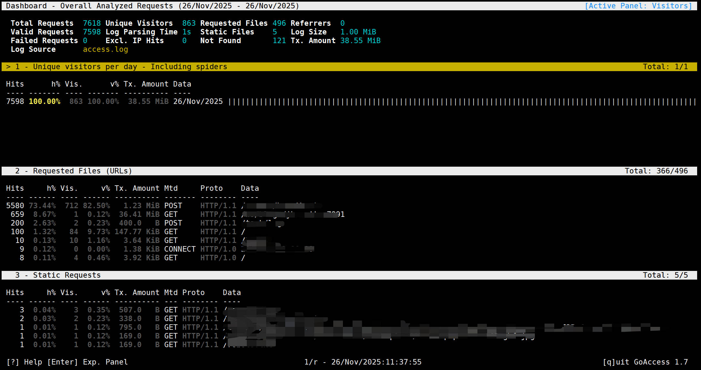
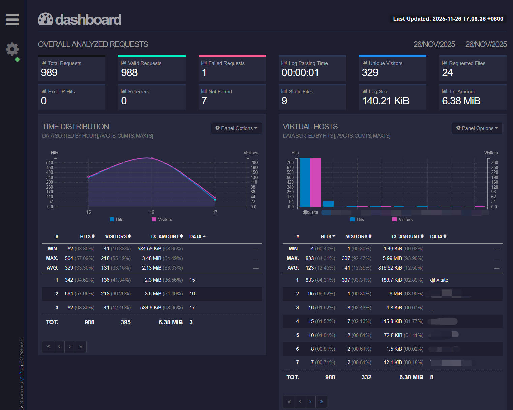

## 目录

[TOC]

---

## 前言

Nginx 一般作为整个服务器的前置反向代理，负载均衡，承载了服务器的大部分流量转发，如果希望准确的知道一些关键指标，就需要工具对 Nginx 的流量日志（access.log）进行分析。

网上有非常多个工具可以选择，从最简单的 Shell/Python 脚本，到企业级别自托管的 ELK 或者 Grafana+Loki+Promtail，又或者是商业付费方案。

越简单的运维成本越低，对应的功能也就越少，适用于小微项目，对于大型企业而言，选择 ELK 或者付费的商业产品可能是更好的选择。

本文选用的 GoAccess 相对折中，部署难度低，界面 UI 中规中矩，自托管，免费开源的项目，底层是 C 写的，性能不错，可以通过命令行使用，也可以通过它自带的 websocket 服务器，实现实时的 Dashboard 浏览。

---

## 安装

参考：https://goaccess.io/download

我的服务器都是 Debian，所以直接 `sudo apt install goaccess`即可。

---

## Nginx日志

默认安装下的 Nginx 日志分为两个文件：

1. access.log: 记录了客户端请求的 IP，时间，URL 路径，设备 UA 等信息。
2. error.log: 记录 Nginx 在处理请求过程中碰到的错误，比如，转发的后端服务挂了，权限不足无法访问某文件，后端请求超时等等。

access 主要是看客户端的流量，也就是看别人（其他能访问你服务器的客户端）在什么时候，用哪个 IP 地址，访问了你服务器的哪个 URL。

error 则是看网站是否异常，或者转发的上游服务是不是挂了，如果服务器出问题了（不管是 Nginx 服务器还是上游服务器），就需要查看 error.log。

GoAccess 主要是看网站流量的，所以分析的也是 access.log，access.log 的日志格式是 NCSA 通用日志格式。

NCSA 是 National Center for Supercomputing Applications 的缩写，NCSA 是美国伊利诺伊大学厄巴纳—香槟分校 (英语：University of Illinois Urbana-Champaign, 简称：U of I 或 UIUC）下的一个科研机构，NCSA 开发人员于 1993 年推出了 NCSA HTTPd，是最早的网络服务器之一（比 Apache 和 Nginx 都要早）。

当时 NCSA 定义了一种标准的访问日志格式，后来被大量服务器继承，Nginx 的日志格式就使用了 NCSA 日志格式（NCSA Combined Format）：

```
23.215.0.138 - - [26/Nov/2025:11:08:28 +0800] "POST /demo HTTP/1.1" 200 302 "-" "python-requests/2.32.5"
```

解释一下这里的日志格式：

| index | value | 解释 |
| :---: | :---: | :---: |
| 1 | 23.215.0.138 | 客户端 IP 地址 |
| 2 | - | ident 字段，参考 RFC 1413，这里没有提供，所以是一个横杠 |
| 3 | - | HTTP Auth 的用户名，这里没有提供，所以是一个横杠 |
| 4 | [26/Nov/2025:11:08:28 +0800] | 客户端访问时间，格式：%d/%b/%Y:%H:%M:%S %z |
| 5 | "POST /demo HTTP/1.1" | HTTP 请求行，包含请求方法，URL，协议版本 |
| 6 | 200 | HTTP 响应状态码 |
| 7 | 302 | 响应大小，单位：字节 |
| 8 | "-" | Refer 字段，请求未携带，所以是一个横杠 |
| 9 | "python-requests/2.32.5" | User-Agent 字段，这里客户端使用的是 Python requests 库 |

---

## 命令行使用

分析 /var/log/nginx/access.log 只需要使用命令：

```shell
goaccess /var/log/nginx/access.log -c
```

-c(--config-dialog) 表示命令行工具会提示设置日志格式对话框：


因为 Nginx 的日志格式默认就是 NCSA 日志格式，所以直接选择第一个即可。

选择后，就出现了分析结果展示信息：



---

## 输出成静态HTML

```shell
goaccess /var/log/nginx/access.log -o /var/www/html/report.html --log-format=COMBINED
```

这里把输出结果以静态 HTML 文件的方式输出到了`/var/www/html/report.html`，并通过命令行的`--log-format`指定了日志分析格式。

---

## 实时输出成静态 HTML

```shell
goaccess /var/log/nginx/access.log -o /var/www/html/report.html --log-format=COMBINED --real-time-html
```

增加`--real-time-html`参数，实时输出 HTML，goaccess 会绑定一个端口（默认是7890，可以通过命令行的`--port`或者配置文件修改），启动一个 WebSocket 服务器，实时输出数据。

goaccess 提供了 WebSocket 服务，但是没有提供访问该 HTML 文件的 Web 服务，所以如果需要在浏览器上访问这个实时的 HTML 页面，需要自己配置 HTTP 服务器（比如 Nginx）。

---

## systemd管理

可以把 goaccess 配置成 systemd 服务进行管理，这里给出一个简单的 service 文件：

```
[Unit]
Description=GoAccess Nginx Log parser
After=network-online.target
Wants=network-online.target
StartLimitIntervalSec=60s
StartLimitBurst=3

[Service]
Type=simple
User=root
Group=root
ExecStart=/usr/bin/goaccess /var/log/nginx/access.log -o /var/www/goaccess/report.html --log-format=COMBINED --real-time-html --port 7890
ExecStop=/bin/kill -s TERM $MAINPID
Restart=on-failure
RestartSec=5

[Install]
WantedBy=multi-user.target
```

---

## 虚拟站点

Nginx 可能代理了多个虚拟站点（Virtual Host），目前我找到两种方式去展示多个虚拟站点的数据。

### 方式一：写入同一个 access.log

默认情况下，nginx 配置的所有站点的日志文件都是写入到同一个 access.log 中，由于默认日志格式不包含虚拟站点域名，所以是无法区分某一条日志记录是属于哪一个虚拟站点的。

解决方法就是修改 nginx 的日志格式：

```
log_format vhost '$server_name:$server_port $remote_addr - $remote_user [$time_local] '
                         '"$request" $status $body_bytes_sent '
                         '"$http_referer" "$http_user_agent"';

access_log /var/log/nginx/access.log vhost;
```

这里开头多加了一个`$server_name:$server_port`，然后 goaccess 在命令行参数中的`--log-format=COMBINED`改成`--log-format=VCOMBINED`。

这种方式，会在面板中，多一栏 VIRTUAL HOSTS：



### 方式二：单独的日志文件

方式一是把所有站点的日志写入到了一个日志文件，看起来很方便，但是我个人更加倾向于第二种方法，就是给每一个站点建立一个日志文件，然后启动多个 systemd service。

比如 djhx.site 这个站点的 nginx 配置：

```
server {
  listen 443 ssl;
  server_name djhx.site;

  access_log /var/log/nginx/djhx.site.access.log;
  error_log /var/log/nginx/djhx.site.error.log;
}

```

在 server 块中直接指定 access_log 和 error_log，这样日志就会单独写入到指定的日志文件里。

假设有多个虚拟站点，比如：foo.djhx.site、bar.djhx.site，就给每个 server 块配置单独的日志文件。


同时，需要建立多个 service，这些 service 命令行读取的 access.log，输出的 report.html 以及 websocket 端口都要单独指定：

```
# djhx.site
ExecStart=/usr/bin/goaccess /var/log/nginx/djhx.site.access.log -o /var/www/goaccess/report-djhx.site.html --log-format=COMBINED --real-time-html --port 7890 --ws-url=wss://monitor.djhx.site/ws/djhx-site

# foo.djhx.site
ExecStart=/usr/bin/goaccess /var/log/nginx/foo.djhx.site.access.log -o /var/www/goaccess/report-foo.djhx.site.html --log-format=COMBINED --real-time-html --port 7891 --ws-url=wss://monitor.djhx.site/ws/foo-djhx-site

# bar.djhx.site
ExecStart=/usr/bin/goaccess /var/log/nginx/bar.djhx.site.access.log -o /var/www/goaccess/report-bar.djhx.site.html --log-format=COMBINED --real-time-html --port 7892 --ws-url=wss://monitor.djhx.site/ws/bar-djhx-site
```

最后，通过 nginx 给每个站点的 dashboard 配置一个路径：

```

# djhx.site

location /nginx/djhx-site {
	alias /var/www/goaccess/;
	try_files /report-djhx.site.html =404;
}

location /ws/djhx-site {
	proxy_pass http://localhost:7890;
	proxy_http_version 1.1;
	proxy_set_header Upgrade $http_upgrade;
	proxy_set_header Connection "upgrade";
}


# foo.djhx.site

location /nginx/foo-djhx-site {
	alias /var/www/goaccess/;
	try_files /report-djhx.site.html =404;
}

location /ws/foo-djhx-site {
	proxy_pass http://localhost:7891;
	proxy_http_version 1.1;
	proxy_set_header Upgrade $http_upgrade;
	proxy_set_header Connection "upgrade";
}

# bar.djhx.site

location /nginx/bar-djhx-site {
	alias /var/www/goaccess/;
	try_files /report-djhx.site.html =404;
}

location /ws/bar-djhx-site {
	proxy_pass http://localhost:7892;
	proxy_http_version 1.1;
	proxy_set_header Upgrade $http_upgrade;
	proxy_set_header Connection "upgrade";
}

```


这样，就可以通过访问以下的 URL 获取不同虚拟站点的 dashboard：

1. https://example.com/nginx/djhx-site
2. https://example.com/nginx/foo-djhx-site
3. https://example.com/nginx/bar-djhx-site

---

## 参考

1. https://goaccess.io/