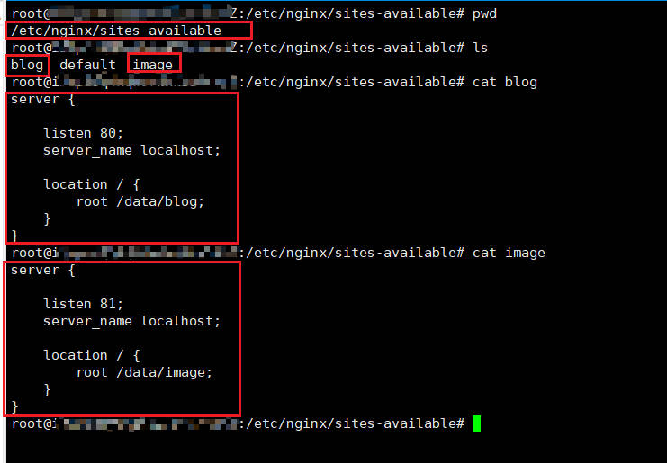

## 前言

在 Debian/Ubuntu 下安装 Nginx 后，我发现配置文件（/etc/nginx/nginx.conf）中，有两行是：

```
include /etc/nginx/conf.d/*.conf;
include /etc/nginx/sites-enabled/*;
```

尽管我知道 Nginx 的 include 语法，但是大部分时候都是写在一个配置文件中，这显然不是最佳的实践，本文根据搜集的资料，简述下 Nginx 的多站点配置机制。

---

## include 语法

include 类似于 C 语言中的 #include，作用是将 Nginx 的配置文件，分割成一系列的更小的，可重用的部分。很多时候，随着 nginx.conf 文件的不断修改和增加，配置文件会越来越大，多达几百行甚至上千行，这对想要在该文件中找到某个站点的端口配置或者其他什么信息的人来说，是很头大的。

所以 include 可以将不同配置拆分，放到一个个子配置文件中，然后在 nginx.conf 这个主配置文件中引用这些子文件。

include 的语法如下：

```
include path/to/file;
```

其中，path/to/file 可以是相对路径，也可以是绝对路径。

如果想要在某个目录下，引入以 .conf 结尾的子配置文件，可以使用 * 通配符：

```
include /etc/nginx/conf.d/*.conf
```

---

## sites-available

sites-available 文件的作用是存放不同站点的配置文件，比如服务器有两个站点，一个叫 blog 存放博客文件，一个叫 image 存放图片文件，blog 站点监听 80 端口，image 站点监听 81 端口。

可以在 sites-available 目录下创建 blog 和 image，然后将 server 配置块分别存放在对应的文件中：



尽管我们配置好了 sites-available 下的两个文件，但观察 nginx.conf 这个主配置文件可以发现，include 并没有引用 sites-available 文件下的所有文件，而是 sites-enabled 下的所有文件。

---

## sites-enabled

sites-available 目录表示你配置了多少个站点，但大部分时候，你可能不想启用所有站点，配置了 100 个虚拟站点，但是仅仅想启用其中一个，比如上面一节，我们配置了两个站点：blog 和 image，但是我只想启用 blog，那么在 sites-enabled 中使用软链接（ln -s）命令，将 sites-available 对应的站点配置文件，软链接到 sites-enabled 目录下即可。

启用 blog 站点：

```
ln -s /etc/nginx/sites-available/blog /etc/nginx/sites-enabled/blog
```

然后重新加载配置文件

```
nginx -s reload
```

可以打开浏览器，访问 80 端口，出现了 blog 站点的内容，而 81 端口的 image，由于并没有在 sites-enabled 中建立软链接，所有并没有 include 到主配置文件中。

想要关闭刚刚的 blog 站点，不需要删除 sites-available 目录下的文件，只需要删除 sites-enabled 下的软链接即可：

```
rm /etc/nginx/sites-enabled/blog
```

想要生效，同样需要重新加载配置文件：

```
nginx -s reload
```

---

## conf.d

可以看到在 Debian/Ubuntu 中编译的 Nginx 除了 include 了 sites-enabled/ 目录下的所有软链接，还 include 了 conf.d/ 目录下所有以 .conf 结尾的配置文件。

conf.d 下的配置文件更多的是倾向于全局配置，sites-available 和 sites-enabled 更多的表示，每一个不同的虚拟主机有着不同的配置文件，但如果，所有虚拟主机公用某些配置项的话，就可以将这些共有的配置项放在 conf.d 目录下。

其实，无论是 conf.d 还是 sites-enabled，都只是用了 include 语法，只是一种约定，而非固定的模式。

如果不用 sites-enabled 来管理不同的虚拟主机，你也可以直接将 sites-available 下的 image 和 blog 移动到 conf.d 下，然后，后缀改为 .conf，如果要禁用某个站点，例如，禁用 blog，那么把 conf.d 下的 blog.conf 改成其他的后缀，比如 blog.disable 就行。

---

## conf.d 还是 sites-enabled

对于这两种的争论，可以参考：https://serverfault.com/questions/527630/difference-in-sites-available-vs-sites-enabled-vs-conf-d-directories-nginx

一些人认为，sites-* 提供了比较清晰的管理约定，一些人认为，还不如直接在 conf.d 中改改后缀来的简单。

我个人认为，使用 conf.d 更好：

1. 通用性，sites-* 似乎仅仅在 Debian/Ubuntu 的版本中才会出现。
2. 启用某个站点，不需要创建软链接。
3. 禁用某个站点，不需要删除软链接，而是直接改后缀名。

---

## 参考

1. https://serverfault.com/questions/527630/difference-in-sites-available-vs-sites-enabled-vs-conf-d-directories-nginx
2. https://blog.csdn.net/hanziyuan08/article/details/104031959
3. https://www.idczone.net/news/3185.html/
