## 前言

Nginx 是一个性能优异、事件驱动的 HTTP 和反向代理服务器。

Nginx 使用时的核心是配置文件，本文介绍了 Nginx 在几个常用的工作模式下的配置项设置。

---

## Web Server VS Application Server

关于什么是 Web Server 和 Application Server 以及它们之间的区别，可以参考之前的文章：
https://korilweb.cn/backend/servlet%E5%88%9D%E6%8E%A2/

这里再简单的概述下，Web Server 是面向 HTTP 协议的服务器软件（如：Apache、Nginx），早期的网络只是单纯的将服务器某个路径下的文件（通常是 HTML 文件，图片，JS，CSS 文件）如实的返回给客户端。如下图所示：

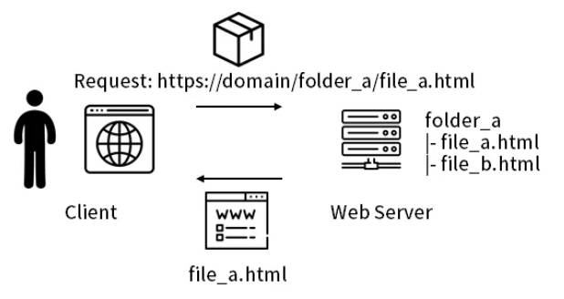

所以早期网络中的服务器更像是一个文件存储系统，客户端单纯的发起请求，获取某个文档。

所以 Web Server 就是根据 HTTP 协议编写的，接收客户端的 HTTP Request 请求，忠实的返回 HTTP Response 响应。

后来，随着网络的发展，人们更多地需要的不仅仅是静态资源文件，而是能够动态生成的页面（比如，购物车表单的提交），Web Server 就力不从心了，解决这种动态生成的内容，正是各种编程语言的拿手好戏，Application Server （各种语言都有实现）就诞生了，它更多的是面向业务逻辑，将用户的请求（包含一些参数）经过处理和数据持久化（与数据库产生交互），然后生成 HTTP 响应。

换句话说，原本的 Web Server 单纯的从服务器读取文件流，然后放在 HTTP 的 Body 中返回，现在是经过 Application Server 进行业务处理后，获得到 HTTP Response 返回给客户端。如下图：


Client 和 Web Server 的交互信息是基于 HTTP 协议，那么 Web Server 和 Application Server 的交互也拥有自己的协议，最早的是叫 CGI（Common Gateway Interface），后来的改进版 FastCGI，基于 Java 的 Servlet（Server Applet），基于 Python 的 WSGI（Web Server Gateway Interface）。

---

## Nginx 简单介绍

本文不再赘述如何安装 Nginx，先简单介绍下 Nginx 的配置文件路径和几个常用命令。

### 配置文件

Nginx 的大部分运行时的状态都是基于配置文件来设置的，配置文件默认叫 nginx.conf，一般有以下几个路径可以找到该配置文件：

1. /usr/local/nginx/conf
2. /etc/nginx
3. /usr/local/etc/nginx

Nginx 的配置文件就是由数个指令组成的，指令分成两种：简单指令和块指令。

简单指令包含一个参数名称（name）和参数值（parameter），两者用空格隔开，末尾以分号结尾。

块指令就是简单指令的集合，但是在外层使用大括号包裹起来，如果一个块指令中包含其他的指令，我们就称之为上下文（context）。

文件中不在任何块指令中的指令，属于主上下文（main context），events 和 http 指令块包含在 main context 中，server 指令块包含在 http context 中，location 指令块包含在 server context 中。

另外，配置文件中的注释和 Python 类似，使用 # 来标志注释内容。

一图胜千言：

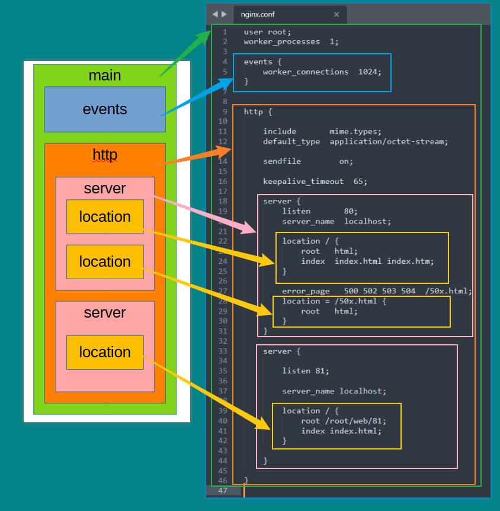

### 命令

常用的 Nginx 命令如下：

1. 启动 Nginx：直接执行 nginx 二进制文件
2. 快速关闭 Nginx：nginx -s stop
3. 优雅关闭 Nginx：nginx -s quit，会等待 workers 处理完请求，再关闭。
4. 重启加载 Nginx 的配置文件：nginx -s reload，配置文件发生了更改，调用此命令。
5. 重新打开 Nginx 的日志文件：nginx -s reopen，该命令的作用是：当 nginx 默认的日志文件没有的时候（被人挪走或改了名字），该命令会重新创建一个默认的nginx日志文件，后续日志会写的刚创建的默认日志路径中。因此当nginx默认的日志文件存在的时候，该命令没有起做用。

---

## 静态内容服务

静态内容的请求响应是 Web Server 的一个最基本的功能，本节简单介绍 Nginx 如何配置以提供静态内容的服务。

通常，配置文档可以包括几个服务器块（server block），这些块由它们侦听的端口（listen port）和服务器名称（server name）区分。

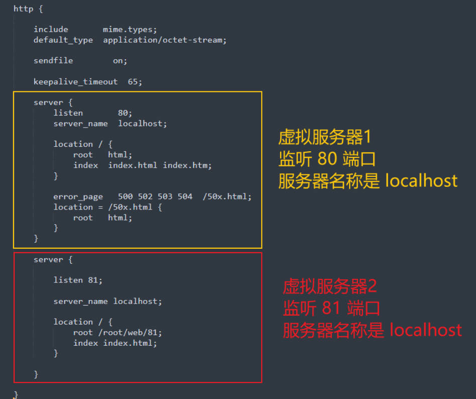

一旦 nginx 决定哪个虚拟服务器处理请求，它就会根据服务器块内定义的 location 指令的参数来匹配请求标头（request header）中指定的 URI 。

就像最早的网站一样，Nginx 可以为静态内容提供服务，可以根据不同的请求路径映射到不同的文件夹下的文件。

现在需要为一个虚拟 Server 配置静态资源服务。比如：服务器本地有两个目录，一个是 /data/www/，存储 HTML 文件，另一个是 /data/images/，存储图片文件，只需要在 server 块中，配置两个 location 即可：

```nginx
http {
    server {
        listen 80;
        
        location / {
            root /data/www;
        }
        
        location /images/ {
            root /data;
        }
    }
}
```

这里示例的 http 块中，只有一个 server，监听的是 80 端口，并且有两个 location 块。

第一个 location 匹配的路径是 /，如果 ip 是 192.168.41.180，那么用户的某些请求，例如：

* http://192.168.41.180:80/test.html
* http://192.168.41.180:80/index.html
* http://192.168.41.180.80/linux/tutorial.html

这些请求就被第一个 location 块捕获到，并处理，返回给用户结果，处理的步骤就是根据 root 参数的值，拼接 location 匹配到的路径，成为完整路径。

比如 http://192.168.41.180:80/test.html 这个请求地址，Nginx 就会在 /data/www 目录下寻找 test.html 文件，如果找到就返回给用户：

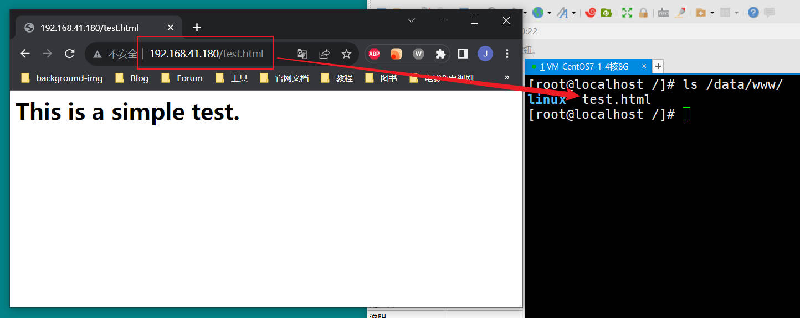

没有找到的话，就返回 404 Not Found 页面，比如随便输入一个不存在于服务器上的文件：

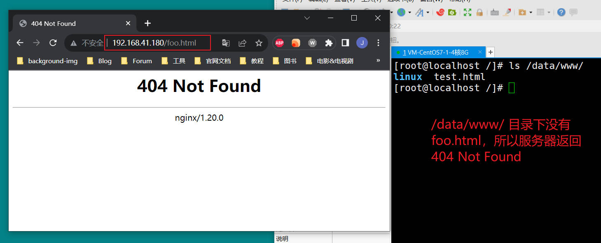

如果什么文件也不输入，Nginx 会自动寻找该目录下的 index.html 返回给客户端：

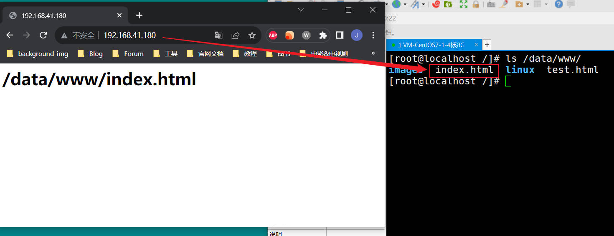

如果有多层级目录，也可以匹配到：

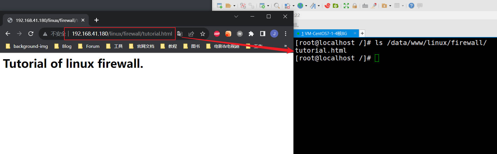

第二个 location 块表示匹配到 /images/ 请求的路径的话，就到 /data/images/ 目录下寻找文件。

我们将 1.jpg，2.jpg，3.jpg 放在 /data/images/ 目录下，然后发起请求：

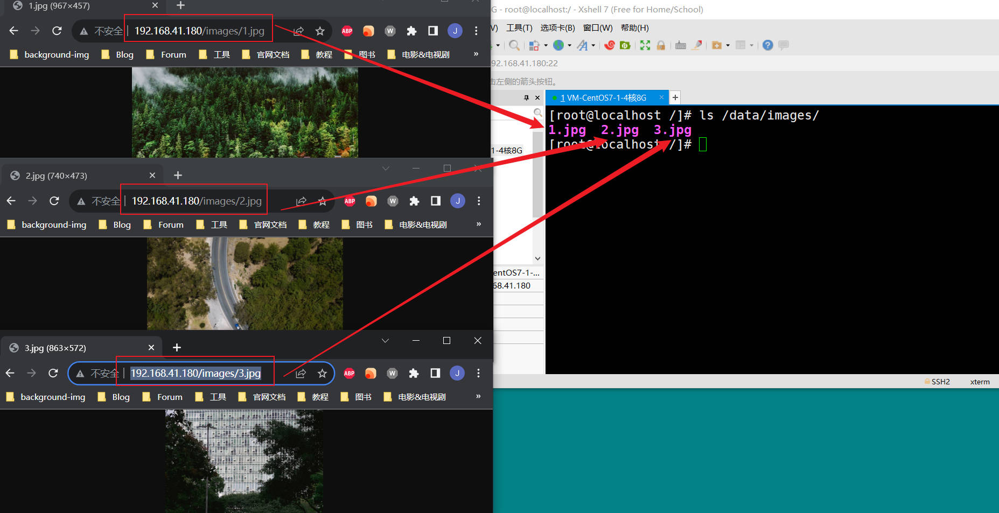

这里有两个 location 块，/ 和 /images 其实都能匹配 http://192.168.41.180:80/images/1.jpg，但是默认 Nginx 会寻找匹配项前缀最长的 location 块，越长意味着匹配越精确，这里 /images/ 就比 / 要长，所以 /images/ 的 location 块优先被匹配。

换句话说，如果 server 中，有某个 location 的路径是单个 /，那么它就是用来保底的，Nginx 先会去匹配那些前缀较长的 location，如果都匹配不到，就会尝试去匹配单个 / 的 location 块。

刚才提到了，如果客户端请求的路径是个目录，比如 / 或者 images/ 这样的路径，Nginx 会把请求作为对目录的请求，进入映射的本地目录下，默认寻找 index.html，如果目录下有 index.html 就返回，反之会返回 403 Forbidden。

比如，下面的配置：

```nginx
server {
    listen 80;

    location / {
        root /data/www;
    }

    location /images/ {
        root /data/;
    }
}
```

如果 /data/www/ 下有 index.html，请求 http://192.168.0.180:80/ 会返回 /data/www/index.html，如果删除了 index.html，再次请求：

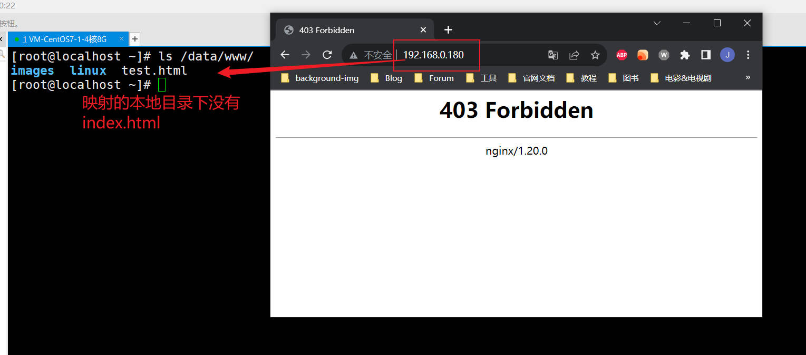

如果希望 Nginx 以其他页面（比如这里的 /data/www/test.html 作为默认返回页），可以使用 index 参数：

```nginx
server {
    listen 80;

    location / {
        root /data/www;
        # index 参数指明了以那些文件作为默认返回页
        index test.html;
    }

    location /images/ {
        root /data/;
    }
}
```

这样，nginx 就会去目录下寻找 test.html 作为该目录的默认返回页：

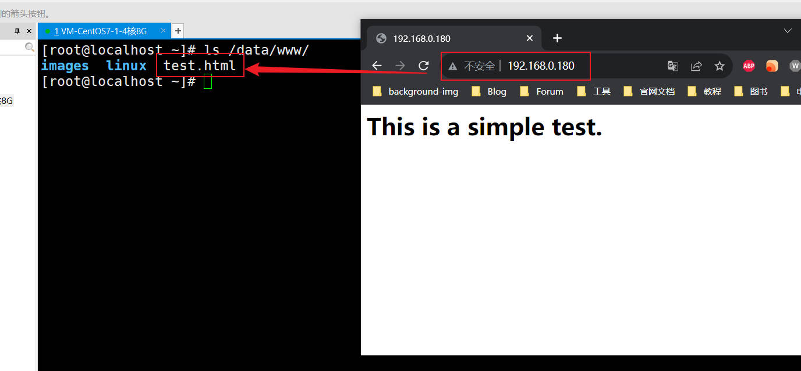

除了通过 index 设置 index 页面，还可以通过 autoindex 参数，打开站点目录浏览功能，比如给 images/ 路径开启目录浏览功能

```nginx
server {
    listen 80;

    location / {
        root /data/www;
        index test.html;
    }

    location /images/ {
        # 开启目录浏览功能
        autoindex on;
        root /data/;
    }
}
```

访问 imags/ 目录，会自动生成该目录的浏览页面：

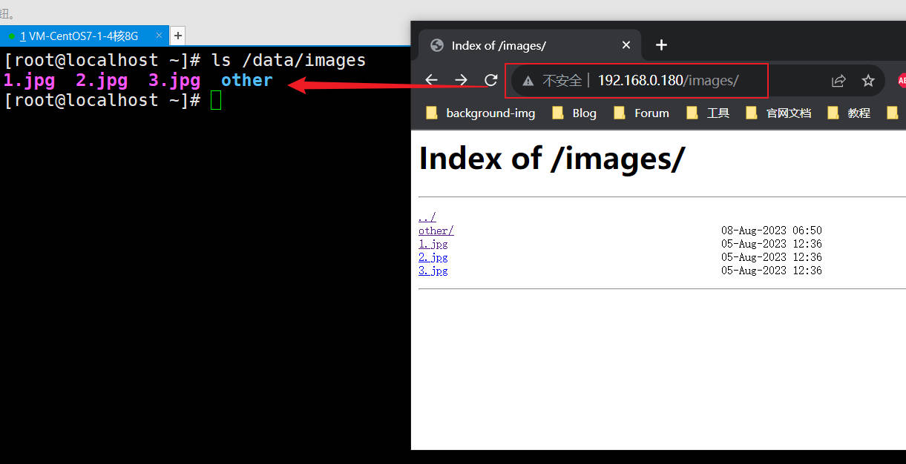

---

## 反向代理

Nginx 的另一个常用的功能是反向代理，既然有反向代理，就有正向代理，正向代理面向的是用户，一个经典实例就是常用的浏览器，浏览器帮助我们解决 HTTP 协议的编解码，以及收到响应后的页面渲染，浏览器就是我们用户的正向代理，是架设在我们和网络内容之间的桥梁。

相反，反向代理更多的是面向服务器端，很多时候为了出于安全考虑，不希望让上网的用户知道提供服务的服务器具体的地址和端口，就会在用户和服务器之间，架设一台反向代理服务器，用户将请求发给反向代理服务器，然后由这个反向代理服务器转发请求给具体业务服务器来处理，最终的响应结果也由反向代理服务器亲手交给用户。

所以有了反向代理服务器，用户就无法知道，自己的请求真正是由哪台机器去来处理，从而保障了企业服务器的安全性。

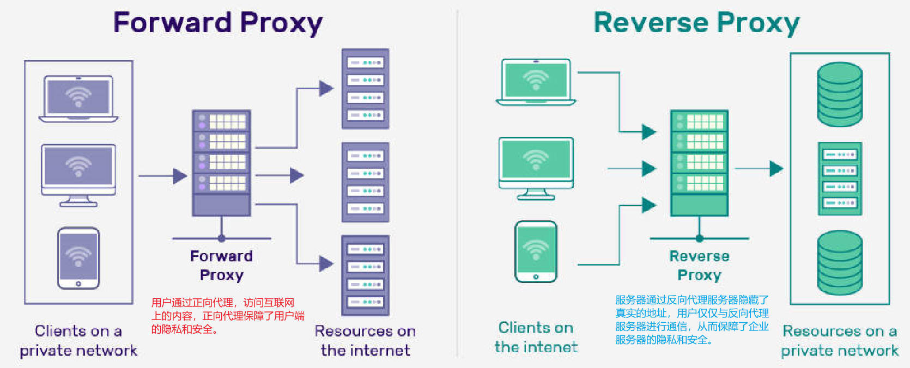

下面编写两个 server 块，来演示反向代理，一个 server 块，监听 80 端口，并提供两个 location：

```nginx
server {
    listen 80;
    
    # 第一个 location 提供反向代理，80 端口的请求代理到 8080 端口
    location / {
        proxy_pass http://localhost:8080;
    }
    
    # 第二个 location 提供静态图片目录的服务
    location /images/ {
        root /data;
    }
}
```

第二个 server 块，就是被代理服务器的配置：

```nginx
server {
    listen 8080;
    # 如果该 server 块中的某些 location 没有指定 root 参数
    # 那这些 location 将默认使用 server 中指定的 root 参数
    root /data/business;
    
    location / {
        # 没有指定 root，默认使用 server 的 root 参数
    }
}
```

请求 http://192.168.41.180:80/ 的时候，就会被 Nginx 代理到服务器本地端口为 8080 的服务：

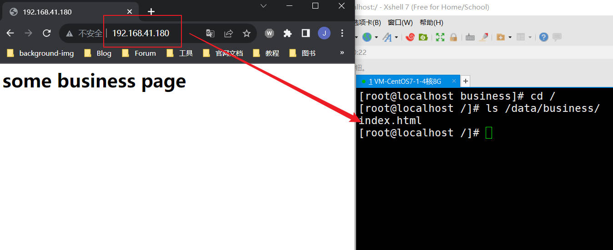

所以现在用户访问 80 端口的服务，实际上是在访问 8080 端口的服务，由于 Nginx 的代理，用户并不知道自己的请求被哪个应用处理了，所以工作中一般采用 Nginx 代理 Application Server 的形式，隐藏真正的服务器地址和端口。

---

## 负载均衡

负载均衡是提高应用服务的性能，吞吐量的常用技术架构。

负载均衡和反向代理有点像，都是将请求转发到应用服务器上，用户端并不直接与应用服务器通信，而是通过了 Nginx 这个中间代理。但是区别在于，负载均衡更多的是将请求分发到多台服务器上，实现水平扩展（垂直扩展就是给一台机器提高CPU性能，加大内存，而水平扩展是将很多台低配服务器组成集群来达到更高的性能），提高了性能和可靠性（一台挂了，就把请求分发给其他正常的服务器）。

在 Nginx 上实现负载均衡，首先需要指定 upstream，里面填写服务器列表信息。

比如：我有三台服务器：

1. 192.168.0.180：安装 Nginx 用于负载均衡的请求分发
2. 192.168.0.181 和 192.168.0.182：这两台机器部署了相同的业务系统，可以监听不同的端口。

当请求进入到 Nginx 时，就会按照负载均衡策略（后面会介绍），将请求分发给这两台服务器进行处理，upstream 配置如下：

```nginx
http {
    # upstream 放在 http 块中
    # upstream group 名字为 backend
    upstream backend {
        # 1 号服务器
        server 192.168.0.181:8080;
        # 2 号服务器
        server 192.168.0.182:8081;
    }
}
```

定义好服务器组之后，就可以配置 server 块，将请求转发到这个 upstream group 中，下面是完整的配置：

```nginx
http {

    upstream backend {
        server 192.168.0.181:8080;
        server 192.168.0.182:8081;
    }

    server {
        listen 80;
        location / {
            proxy_pass http://backend;
        }
    }
}

```

192.168.0.180 这台机器，监听 80 端口，一旦有请求进入，就会转发请求给 181 和 182 两台机器。

这里写一个简单的 SpringBoot 项目部署在这两台机器上，Controller 如下：

```java
@RestController
@RequestMapping("/api")
public class AppController {

    @Value("${instance-name}")
    public String instanceName;

    @GetMapping("/load-balance")
    public String loadBalance() {
        return instanceName;
    }

}
```

这里为了返回结果能够明显区分不同的机器，配置文件加个参数——instance-name。

181 的 application.properties 如下：

```properties
server.port=8080
instance-name=instance-1
```

182 的 application.properties 如下：

```properties
server.port=8081
instance-name=instance-2
```

分别部署到两台应用服务器上，然后请求 http://192.168.0.180:80/api/load-balance 接口：

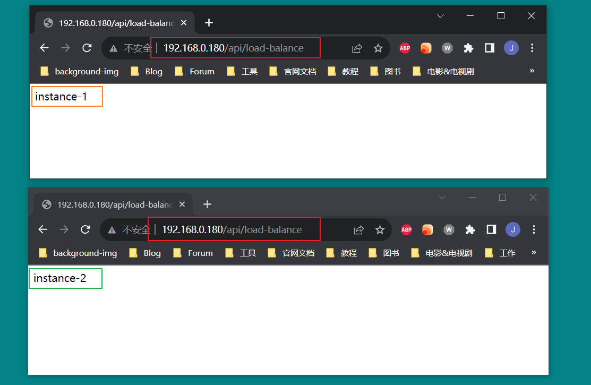

可以看到，请求被 180 分发到了 181 和 182 两台机器的服务上。

### 负载均衡策略

Nginx 提供了四种负载均衡策略：

1. 轮询（Round Robin）
2. 最少连接数（Least Connections）
3. ip 地址哈希（IP Hash）
4. 通用哈希（Generic Hash）

轮询——如果没有进行任何配置（就像之前的示例一样）默认使用轮询策略，请求在服务器之间均匀分布，并考虑服务器权重。

```nginx
upstream backend {
   # 不执行任何参数，默认使用轮询策略
   server backend1.example.com;
   server backend2.example.com;
}
```

最少连接数——Nginx 自动将请求发送到活动连接数最少的服务器，并再次考虑服务器权重。

```nginx
upstream backend {
    least_conn;
    server backend1.example.com;
    server backend2.example.com;
}
```

ip 地址哈希——Nginx 将根据客户端 IP 地址的哈希值来确定该将请求发送到哪台服务器。在这种情况下，IPv4 地址的前三个八位字节或整个 IPv6 地址用于计算哈希值。

使用轮循机制或最少连接的负载平衡策略，每个后续客户端的请求可能会分发到不同的服务器。

前两种方法不能保证同一客户端将始终定向到同一服务器。ip 地址哈希策略，能够保证来自同一地址的请求到达同一服务器。

```nginx
upstream backend {
    ip_hash;
    server backend1.example.com;
    server backend2.example.com;
}
```

通用哈希——向其发送请求的服务器由用户定义的键来确定，该键可以是文本字符串、变量或组合。例如，密钥可以是配对的源 IP 地址和端口，也可以是 URI，如以下示例所示：

```nginx
upstream backend {
    hash $request_uri consistent;
    server backend1.example.com;
    server backend2.example.com;
}
```

### 权重

我们可以为每个服务器设置 weight 参数，如果没有指定权重，Nginx 将平等的对待每台机器，指定权重后，权重将作为负载平衡决策的一部分进行核算。

```nginx
upstream backend {
    # 181 服务器的权重为 3
    # 意味着 4 次请求，大约有 3 次请求会分发给 181，仅有 1 次请求会分发给 182
    server 192.168.0.181:8080 weight=3;
    server 192.168.0.182:8081;
}
```

---

## 黑名单和白名单

暂略

---

## 日志文件

暂略
