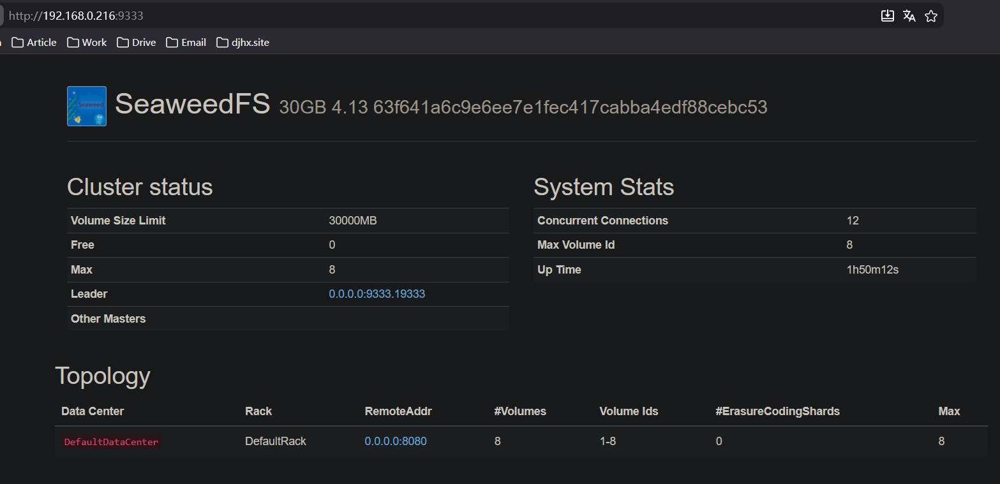
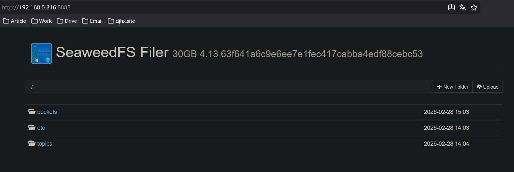

## 目录

[TOC]

---

## 安装

官方提供了二进制文件：https://github.com/seaweedfs/seaweedfs/releases

比如目前最新版本的：https://github.com/seaweedfs/seaweedfs/releases/download/4.13/linux_amd64.tar.gz

下载解压后，得到 weed 二进制可执行文件，移动到 /usr/local/bin/，通过以下命令查看是否安装成功：

```shell
test@debian-elk:~$ weed version
version 30GB 4.13 63f641a6c9e6ee7e1fec417cabba4edf88cebc53 linux amd64

For enterprise users, please visit https://seaweedfs.com for SeaweedFS Enterprise Edition,
which has a self-healing storage format with better data protection.

```

---

## 服务

weed 的服务有几个部分组成：

- master：管理整个集群拓扑，作为调度中心，端口：9333
- volume：负责控制文件存储，端口：8080
- filer：提供文件路径、目录结构等抽象功能，端口：8888
- s3：提供 AWS S3 的支持，端口：8333

每个服务可以单独启动，也就是多个 service 文件，这样的好处是方便横向扩展，一个服务挂了不影响另外一个服务，具体步骤和 service 文件可以参考：https://blog.csdn.net/weixin_51476622/article/details/148948939

我这里作为演示，以上几个服务都放在一个 service 中启动：

/etc/systemd/system/seaweedfs.service

```
[Unit]
Description=SeaweedFS Server
After=network.target

[Service]
Type=simple
User=test
Group=test

ExecStart=/usr/local/bin/weed server \
  -dir=/data/seaweedfs \
  -ip=0.0.0.0 \
  -master.port=9333 \
  -volume.port=8080 \
  -filer=true \
  -filer.port=8888 \
  -s3 \
  -s3.port=8333 \
  -s3.config=/etc/seaweedfs/s3.json

Restart=always
RestartSec=5
LimitNOFILE=65536

[Install]
WantedBy=multi-user.target
```

这里我通过 -s3.config 指定了 s3 的配置文件

/etc/seaweedfs/s3.json

```json
{
  "identities": [
    {
      "name": "admin_user",
      "credentials": [
        {
          "accessKey": "admin",
          "secretKey": "admin"
        }
      ],
      "actions": [
        "Admin",
        "Read",
        "Write",
        "List",
        "Tagging"
      ]
    },
    {
      "name": "readonly_user",
      "credentials": [
        {
          "accessKey": "readkey1",
          "secretKey": "readsecret1"
        }
      ],
      "actions": [
        "Read",
        "List"
      ]
    }
  ]
}
```

启动

```shell
sudo systemctl daemon-reload
sudo systemctl enable seaweedfs.service
sudo systemctl start seaweedfs.service
sudo systemctl status seaweedfs.service
```

启动成功后，可以访问对应服务端口的 web 页面：

master：



filer：



---

## 使用

### blob api

seaweedfs 提供了一套 http api 用来管理对象，这里以上传、查看、删除一个图片文件为例。

第一步，通过 HTTP GET（或者 PUT、POST）请求 master 服务的`/dir/assign`接口获取 fid：

```shell
curl http://localhost:9333/dir/assign
{"count":1,"fid":"3,01637037d6","url":"127.0.0.1:8080","publicUrl":"localhost:8080"}
```

第二步，上传，通过 HTTP POST（multipart/form-data）到 volume 服务的`url + '/' + fid`接口，就上传成功了：

```shell
curl -F file=@/home/chris/myphoto.jpg http://127.0.0.1:8080/3,01637037d6
{"name":"myphoto.jpg","size":43234,"eTag":"1cc0118e"}
```

第三步，查看，通过 HTTP GET volume 服务的`url + '/' + fid`接口：

```shell
curl http://127.0.0.1:8080/3,01637037d6
```

第四步，删除，通过 HTTP DELETE volume 服务的`url + '/' + fid`接口：

```shell
curl -X DELETE http://127.0.0.1:8080/3,01637037d6
```

### S3

seaweedfs 支持 S3 接口，这里用 aws cli 演示，首先确保安装好 aws cli：

```shell
curl "https://awscli.amazonaws.com/awscli-exe-linux-x86_64.zip" -o "awscliv2.zip"
unzip awscliv2.zip
sudo ./aws/install
```

aws 配置用户名和密码，就是刚刚的 s3.json 里配置的用户：

```shell
aws configure

AWS Access Key ID [None]: admin
AWS Secret Access Key [None]: admin
Default region name [None]: us-east-1
Default output format [None]: json
```

列出 bucket：

```shell
aws --endpoint-url http://localhost:8333 s3 ls
```

创建 bucket：

```shell
aws --endpoint-url http://localhost:8333 s3 mb s3://docs
```

列出某个 bucket 中的文件：

```shell
aws --endpoint-url http://localhost:8333 s3 ls docs
```

上传文件：

```shell
aws --endpoint-url http://localhost:8333 s3 cp ./test.jpg s3://docs/images/test.jpg
```

下载文件：

```shell
aws --endpoint-url http://localhost:8333 s3 cp s3://docs/images/test.jpg ./download.jpg
```

删除文件：

```shell
aws --endpoint-url http://localhost:8333 s3 rm s3://docs/images/test.jpg
```

---

## 参考

1. https://github.com/seaweedfs/seaweedfs/wiki/Components
2. https://blog.csdn.net/weixin_51476622/article/details/148948939
3. https://github.com/seaweedfs/seaweedfs/wiki/Amazon-S3-API