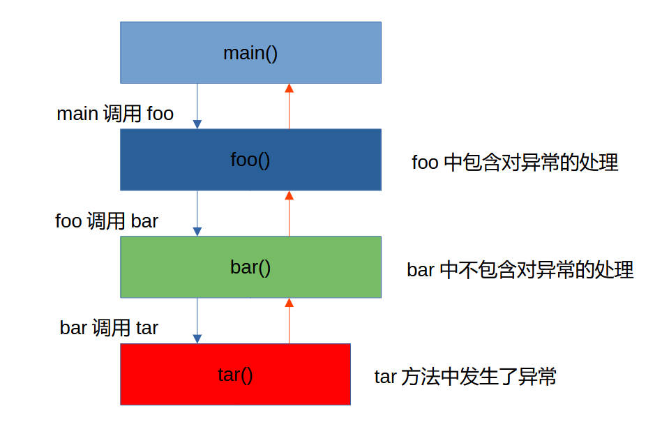
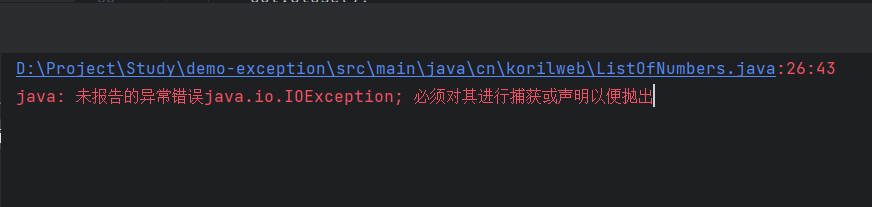
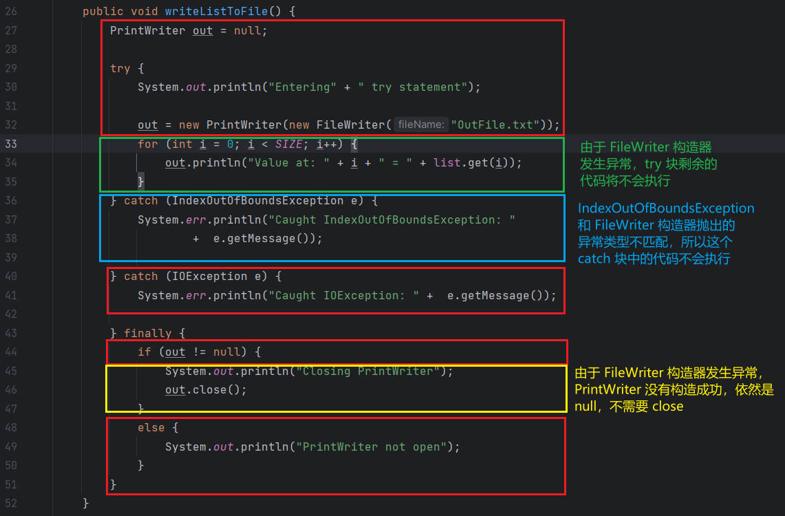
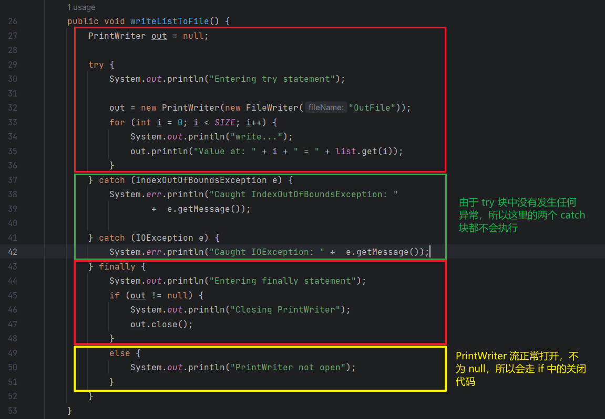
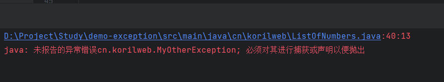
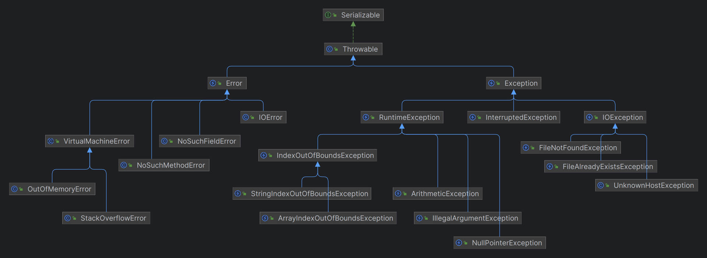
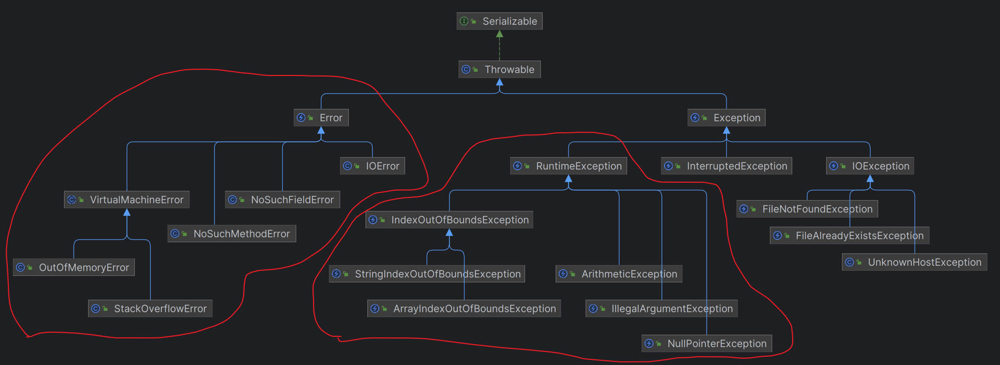
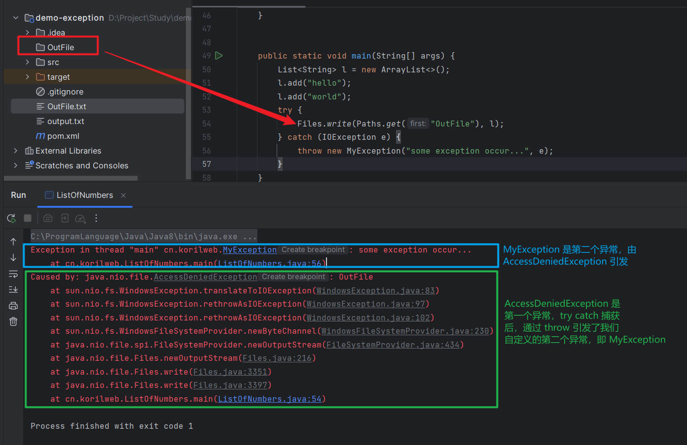
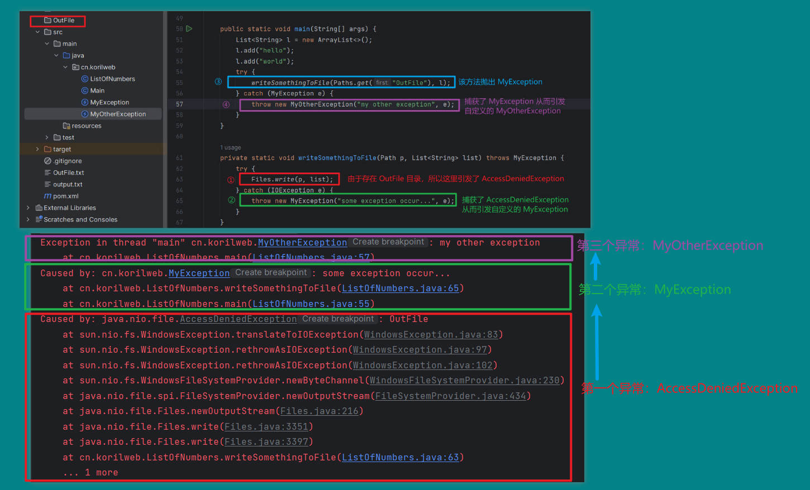
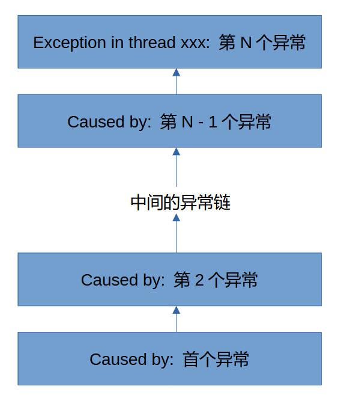

*人应当赶紧地、充分地生活，因为意外的疾病或悲惨的事故随时都可以突然结束他的生命*。——奥斯特洛夫斯基

## 前言

异常（Exception）和异常的处理在计算机中相当常见，通常是在某个规划好的执行流中，因为外部或程序内部的一些问题，而产生的偏离执行流的异常问题，往往需要程序员编写异常处理代码（Exception Handler）去尽可能的从异常中恢复或者告知用户程序错误原因。

---

## 生活的示例

编程源于生活，所以我们也可以通过日常的琐事来描述异常。

想象一下，风和日丽的一个周日，约上了三五好友，准备一起去打羽毛球,看电影，喝酒吃烤串，我们设想的计划如下：

```
13:30 球场集合，分队，轮流上场打球
15:30 打球结束，到电影院看电影
18:00 电影结束，去隔壁的烧烤店吃烤串，喝啤酒
19:30 回家
```

编写成程序大概是这样：

```java
public static void main(String[] args) {
    playBadminton();
    watchMovie();
    eatAndDrink();
    goHome();
}
```

如同面向过程的编程语言一般，描述出几件事情，然后按时间排序，就是大部分人能够想到的计划，但是实际上，简单只是人们的一厢情愿，大部分的生活都被异常和混乱充斥着。

例如，可能出现的异常情况：

1. 本来计划 6 个人，就能分成 3 个队伍，轮流上场，突然有个人不来了，就变成了 5 个人，该如何分配队伍呢？
2. 5 个人都没有带羽毛球，光带了球拍，该如何解决呢？
3. 打球结束了，去电影院的过程中下了大雨，坐公交车还是打车呢？
4. 看电影的过程中，前面的小孩超级吵闹，影响了大家的观影体验，该如何沟通呢？
5. 大家计划去的烧烤店，临时关门了，是准备回家，还是换一家饭店吃呢？

这是很容易想到的一些可能会发生的状况，所以异常并不陌生，而是常常发生，只不过因为大家都熟悉这些的异常，形成了某种生活上的经验，久而久之，就会固化一些常见的异常处理机制：

1. 5 个人，可以 4 个人上场打球，一个人场下休息，打完一局，场上的一个人和场下的人交换，轮流进行。
2. 先去前台问是否有球卖，如果有则购买，没有则搜索附近的球店去购买，或者向隔壁场地的人购买。
3. 如果公交车站足够近，可以坐公交，否则打两辆出租车去电影院。
4. 先和家长沟通，若不顺利则联系工作人员处理。
5. 发起投票，如果准备换一家饭店吃饭，票选一个大家都想去的店面。

以上就是所谓的异常处理机制。

另外异常也分为我们可处理的异常，和不可处理的异常，还可以分成由我们失误所造成的异常和外界不可抗力因素导致的异常。

可以处理的异常，指的是经过处理后，这个流程依然能够继续下去，比如：上学迟到了，交份检讨书，就可以继续一天的上课。

不可处理的异常通常比较严重，比如：国家爆发了战争，原本生活的计划完全被打乱，无法维系下去。

因为我们自己失误早上的异常，比如打电话，电话号码拨错了，这个异常就像是后面将要介绍的 RuntimeException，通常发生在 API 调用错误，或者参数错误，由程序员个人的编码不细致和粗心造成的。

不可抗力的异常，比如打电话，电线电路，无线基站因为地震或是其他因素被破坏了，这个异常就像是 Java 中的 IOException，我们可以预知，但完全不可预测什么时候将要发生，能做的就是尽可能的告知用户错误信息和保存堆栈信息。

---

## Java 中的异常

### 什么是异常

异常是一个事件，它发生在程序的执行过程当中，它打断了正常程序流执行的过程。

当一个方法当中发生了异常，该方法会创造一个对象，将这个对象交给运行时系统（runtime system）。该对象，被称作异常对象（Exception Object），包含了错误发生的信息，类型以及程序在错误发生时的状态。

创建一个异常对象，并交给运行时系统的这个步骤，则被称为抛出一个异常（throwing an exception）。

在一个方法抛出一个异常对象后，运行时系统会尝试去找到某些东西处理它。这个“处理异常的某些东西”就是调用了包含异常的方法的调用堆栈（call stack）。

如下图，调用顺序是：

``` 
# 方法的调用顺序
main() -> foo() -> bar() -> tar()
```



运行时系统在调用堆栈中搜索包含可处理异常的代码块的方法。此代码块称为异常处理器（Exception Handler）。搜索从发生错误的方法开始（如上图的 tar 方法），然后以调用方法的相反顺序通过调用堆栈。

搜索异常处理器的顺序，和调用顺序相反：

```
# 搜索异常处理器的顺序
tar() -> bar() -> foo() -> main()
```

找到适当的处理器后，运行时系统会将异常传递给该处理器。如果引发的异常对象的类型与处理器可以处理的类型匹配（如上图的 foo 方法），则认为该异常处理器是合适的。

foo 方法因为包含了对 tar 方法抛出的异常的处理器，可以称，foo 方法捕获了一个异常（catch the exception）。如果运行时系统，找遍了整个调用方法栈都没有发现合适的异常处理器，运行时系统将终止（terminate）。

### 异常规则：捕获或者方法声明异常

可能会引发异常的代码，必须遵循以下两种条件之一：

1. 引发异常的代码，由 try...catch... 块包裹，并提供异常处理的代码。
2. 引发异常的代码放入一个方法中，该方法需要声明可能抛出的异常列表。

如果可能会引发异常的代码块，没有遵循以上两种条件中的一个，编译将失败。

但并非所有异常都遵循以上的规则，为了搞明白这种例外情况，我们必须先了解一下 Java 中的三大类异常。

---

## 三大类异常

### 受检异常

第一类，是受检异常（Checked Exception），这类异常，通常是在编写质量良好的程序中，会提前预料到的异常，并且提供恢复的异常处理机制。

打个比方，假设有一个应用程序，用户可以输入一个文件名，然后打开文件，读取文件内容。如果顺利的话，通过用户输入的文件名，可以找到对应存在的文件，并且用户拥有该文件的可读权限，这样 Java 程序可以成功构造一个 FileReader 对象，完成工作。

但有时，用户输入的文件名可能根本就不存在对应的文件，或者是个目录，亦或者该文件不可读，所以 FileReader 构造器方法会声明 java.io.FileNotFoundException 异常，编写质量良好的程序会捕获这个异常（catch the exception），并且通知用户输入错误，或者提示可能的正确文件名。

```java
// FileReader 构造器方法，声明了运行中可能抛出的异常是 FileNotFoundException
public FileReader(String fileName) throws FileNotFoundException {
    super(new FileInputStream(fileName));
}
```

受检异常遵循之前介绍的异常规则，所有异常都是受检异常，除了以下的异常：

* Error
* RuntimeException
* Error 和 RuntimeException 的子类

### 非受检异常

第二类，就是错误异常（Error），这类异常是应用进程外部的特殊情况导致，发生了 Error 的应用进程，通常无法预测或从中恢复。例如，假设应用进程成功打开文档进行输入，但由于硬件或系统故障而无法读取该文档。不成功的读取将抛出 java.io.IOError。应用进程可能会选择捕获此异常，以便将问题通知用户，但进程打印堆栈跟踪并退出可能更有意义。

错误异常指的是 Error 类和 Error 类的子类，通常是比较严重的异常，我们无法预料和处理，并且不遵循上述异常规则。

第三类，是运行时异常（Runtime Exception），这类异常通常是应用进程内部的特殊情况导致，发生了 Runtime Exception 的应用进程，通常无法预测或从中恢复。发生此类异常，通常表示程序员编程上的错误（BUG），例如逻辑错误或 API 使用不当。

例如，考虑前面描述的应用进程，该应用进程将文档名传递给 FileReader 的构造函数。如果逻辑错误导致将 null 传递给构造函数，则构造函数将引发 NullPointerException。应用进程可以捕获此异常，但消除导致异常发生的 bug 可能更有意义。

运行时异常指的是 RuntimeException 类和 RuntimeException 类的子类，不遵循上述异常规则。

错误异常和运行时异常，统称为非受检异常（Unchecked Exception）。

总结一下，如果分的比较细的话，有三类：

* Checked Exception
* Error
* Runtime Exception

分的粗一点，Error 和 Runtime Exception 可以归为同一类：

* Checked Exception
* Unchecked Exception

由于 Error 和 RuntimeException 不需要遵循异常规则，就可以成功通过编译，所以很多程序员会选择使用非受检异常来绕过麻烦的 try...catch...机制和方法异常声明机制，严格的来说，这是不正确的，之后的小节中会详细聊聊这个问题。

## 捕获和处理异常

这一小节，讲讲如何通过 try，catch，finally 这三个异常处理组件来捕获和处理异常，以及 Java 7 推出的 try-with-resource 语法。

### try

下面会创建一个 ListOfNumbers 类，在构造函数中会初始化 10 个数字放入 list 私有字段中，并且提供一个公开方法，将数字写入到外部文件。

```java
package cn.korilweb;


import java.io.FileWriter;
import java.io.PrintWriter;
import java.util.ArrayList;
import java.util.List;

public class ListOfNumbers {


    private List<Integer> list;

    private static final int SIZE = 10;


    public ListOfNumbers() {
        list = new ArrayList<>();
        for (int i = 0; i < SIZE; i++) {
            list.add(i);
        }
    }


    public void writeListToFile() {
        PrintWriter out = new PrintWriter(new FileWriter("./output.txt"));
        for (int i = 0; i < SIZE; i++) {
            out.println("Value at " + i + " is " + list.get(i));
        }
        out.close();
    }
}

```

这段代码存在一些可能的异常，下面一一介绍。

第一个异常，FileWrite 构造函数如果给定了不存在的文件名，或者文件无法打开，会抛出 IOException 异常，该异常为受检异常。

```java
/**
 * Constructs a FileWriter object given a file name.
 *
 * @param fileName  String The system-dependent filename.
 * @throws IOException  if the named file exists but is a directory rather
 *                  than a regular file, does not exist but cannot be
 *                  created, or cannot be opened for any other reason
 */
public FileWriter(String fileName) throws IOException {
    super(new FileOutputStream(fileName));
}
```

第二个异常，ArrayList 的 get 方法，如果给定的 index 太大，超过了 list 的范围，会抛出 IndexOutOfBoundsException 异常，该异常为非受检异常。

所以，如果现在直接编译 ListOfNumbers，会编译失败，提示：



会发现，编译器仅仅提示了需要捕获或声明 IOException，而没有提及 IndexOutOfBoundsException，这就是受检异常和非受检异常的区别，前者需要遵循异常规则，否则无法通过编译，而后者不需要遵循异常规则，也可以通过编译。

我个人理解，名字中的检（check）和不检（uncheck），正是面向编译器而言的，对于受检异常，编译器会检查它们是否遵循了异常规则（try...catch...或者方法异常列表声明），对于非受检异常，编译器会直接放行。

为了通过编译，我们需要捕获 IOException 这个受检异常，第一步是用 try 将可能会抛出异常的代码块包裹起来，形式如下：

```java
try {
    // 这里包含了一条或者多条可能引发异常的代码
    code...
}
catch and finally blocks . . .
```

这里多种包裹的方式，可以用多个 try 块，包裹每一条可能引发的代码，但这样太臃肿了，更常见的是，一个 try 块包裹多条可能引发异常的代码，然后在 catch 列表中提供多个异常处理代码。

为了通过编译，我们需要将代码改成下面这样：

```java
PrintWriter out = null;
try {
    out = new PrintWriter(new FileWriter("./output.txt"));
    for (int i = 0; i < SIZE; i++) {
        out.println("Value at " + i + " is " + list.get(i + 1));
    }
}
```

### catch

仅仅用 try 块包裹，还不够，因为我们必须提供受检异常的异常处理器，放在 catch 块中，也就是说，每个 try 块至少跟着一个 catch 块。

通过在 try 块之后直接提供一个或多个 catch 块，可以将异常处理进程与 try 块相关联。try 块的末尾和第一个 catch 块的开头之间不能有代码，形式如下：

```java
try {
    // 这里包含了一条或者多条可能引发异常的代码
    code...
}
// try 块的末尾和第一个 catch 块的开头之间不能有其他代码
catch (ExceptionType1 e1) {
    // 针对 ExceptionType1 的异常处理代码
}
catch (ExceptionType2 e2) {
    // 针对 ExceptionType2 的异常处理代码
}
// 可以有更多的 catch 块，面向不同的异常对象类型，声明不同的异常处理机制
...
```

每个 catch 块都是一个异常处理器，用于处理其参数指示的异常类型。参数类型 ExceptionType 声明处理器可以处理的异常类型，这些类型必须是从 Throwable 类继承的类的类型。异常处理器可以使用名称引用异常（例如上面 e1 和 e2）。

catch 块包含了在调用异常处理器时执行的代码，当异常处理器是调用堆栈中的第一个处理器时，其 ExceptionType 与引发的异常类型匹配时，运行时系统将调用该处理器。如果抛出的对象可以合法地分配给异常处理进程的参数，则系统会将其视为匹配项。

异常处理器可以执行的不仅仅是打印错误消息或停止进程。它们可以执行错误恢复、提示用户做出决定或使用链式异常将错误传播到更高级别的处理进程。

我们可以为 writeList 的 IOException 和 IndexOutOfBoundsException 分别提供异常处理器：

```java
try {

} catch (IndexOutOfBoundsException e) {
    System.err.println("IndexOutOfBoundsException: " + e.getMessage());
} catch (IOException e) {
    System.err.println("Caught IOException: " + e.getMessage());
}
```

如果我们希望对两种不同类型的异常，做相同的处理，例如，当引发 IOException  和 SQLException，都记录到日志，我们可以直接这么写：

```java
catch (IOException | SQLException ex) {
    logger.log(ex);
}
```

这个特性是在 Java 7 中推出的，解决了两个问题：

1. 消除大量重复的代码，因为有 n 个不同类型的异常都希望以相同的方式处理，在 Java 7 之前就需要写 n 个 catch 块，每个 catch 块的内容都是重复的。
2. 避免了捕获更宽泛的类型的诱惑。

第二个问题，需要解释一下，比如，我仅仅希望 IOException  和 SQLException 引发时，进入相同的处理器，而我又不想写两个 catch 块，包含重复的代码，我就需要 catch 一个它们的父类，比如，Exception：

```java
catch (Exception ex) {
	logger.log(ex);
}
```

这个代码糟糕之处在于，虽然 IOException  和 SQLException 引发时，会进入相同的处理器去执行处理代码，但其他 Exception 的子类也会进入这个处理器，换而言之，就是捕获的类型过于宽泛。

### finally

最后，要介绍的是 finally 块。

finally 块始终在 try 块退出时执行。这可确保即使发生意外异常，也会执行 finally 块。但最终不仅对异常处理有用，它允许程序员避免清理代码被中断或意外绕过。

将清理代码（比如，关闭流）放在 finally 块中始终是一种很好的做法，即使预计不会出现异常也是如此。

当然，还是有种特殊情况，finally 不会执行——JVM 在执行 try catch 的过程中退出了。

在示例代码中，try 块打开了一个 PrintWriter 流，必须要在使用完毕后 close，try 块退出有三种可能的情况：

1. new FileReader 抛出了 IOException
2. get() 发生了 IndexOutOfBoundsException
3. try 块所有代码正常执行

运行时系统始终执行 finally 块中的语句，而不管 try 块中发生了什幺。因此，这是执行清理的理想场所。

为了关闭 FileWriter 和 PrintWriter，需要以下的 finally 块：

```java
finally {
    if (out != null) {
        System.out.println("closing printWriter");
        out.close();
    }
    else {
        System.out.println("printWriter not open");
    }
    if (fileWriter != null) {
        System.out.println("closing fileWriter");
        try {
            fileWriter.close();
        } catch (IOException e) {
            System.out.println("exception occur in closing fileWriter");
        }
    }
}
```

因为 FileWriter 的 close 方法会抛出 IOException 异常，所以又不得不包裹一层 try catch。

可以看到，finally 虽然可以清理流的关闭，但实在是太麻烦了，要写很多的代码，还好有 try-with-resource 语句，这是清理可关闭（Closeable）类的首选方式。

### try-with-resource

上述繁琐的 try-catch-finally 改成 try-with-resource 就变成以下的样子：

```java
try (
        FileWriter fileWriter = new FileWriter("./output.txt");
        PrintWriter out = new PrintWriter(fileWriter);
) {
    for (int i = 0; i < SIZE; i++) {
        out.println("Value at " + i + " is " + list.get(i + 1));
    }
} catch (IOException e) {
    System.out.println("some exception occur...");
}
```

将需要关闭的资源，放在 try 后面的括号中，try-with-resource 可以确保 try 块代码推出后，资源的正确关闭。

### 分析完整的程序

介绍完了 try，catch，finally，三个最重要的异常处理组件后，我们修改最初的程序，组装成完整的代码：

```java
public void writeListToFile() {
    PrintWriter out = null;

    try {
        System.out.println("Entering" + " try statement");

        out = new PrintWriter(new FileWriter("OutFile.txt"));
        for (int i = 0; i < SIZE; i++) {
            out.println("Value at: " + i + " = " + list.get(i));
        }
    } catch (IndexOutOfBoundsException e) {
        System.err.println("Caught IndexOutOfBoundsException: "
                           +  e.getMessage());
                                 
    } catch (IOException e) {
        System.err.println("Caught IOException: " +  e.getMessage());
                                 
    } finally {
        if (out != null) {
            System.out.println("Closing PrintWriter");
            out.close();
        } 
        else {
            System.out.println("PrintWriter not open");
        }
    }
}
```

接下来，分析一下，try 中发生了异常和未发生异常的情况下，代码是如何运行的。

第一种情况，发生了异常，可能是 IOException，也可能是 IndexOutOfBoundsException。

当 FileWriter 构造器发生了异常时，运行时系统会立刻终止 try 块代码的运行，并开始搜索异常处理器，搜索的顺序就是调用栈的逆序，这里的调用栈顺序如下：

```
main() -> writeList() -> FileWriter constructor()
```

所以搜索顺序如下：

```
FileWriter constructor() -> writeList() -> main()
```

运行时系统首先找到异常发生的地方——FileWriter constructor 方法，但是并没有异常处理器，所以下一个找到了 writeList 方法，发现包含了异常处理器，并且存在两个异常处理器，然后运行时系统按照 catch 块的顺序，开始匹配，首先检查第一个 catch 块中捕获的类型，是 IndexOutOfBoundsException，和当前的异常类型不匹配，所以检查第二个 catch 块中捕获的类型，是 IOException，和当前的异常类型匹配，所以运行时系统停止搜索，开始执行第二个 catch 块中的代码。

异常处理进程执行后，运行时系统将控制权传递给 finally 块。finally 块中的代码将执行，而不考虑在其上方捕获的异常。在这种情况下，文档编写器从未打开，不需要关闭。finally 块完成执行后，进程继续执行 finally 块后的第一个语句。

下面红色框内的代码是真正执行到的，其他未执行的代码，我也给出了注释：



第二种情况，try 块的代码正常执行，没有异常发生。由于没有异常，所以 catch 块中的代码都不会执行，直接进入 finally 块，因为成功打开了 PrintWriter 流，所以会在 finally 中，正常关闭。



---

## 声明方法可能抛出的异常列表

上一节介绍了如何使用 try，catch，finally 来捕获异常，处理异常，以及资源的清理，我们在 writeListToFile 方法中，捕获并处理了异常，但有的时候并非所有异常都需要在方法内捕获和处理，比如：ListOfNumbers 这个类是作为类库的一部分，交由其他程序员调用时，如果我们将异常都处理了，这样灵活性大大下降，因为我们无法预测调用我们封装的包的程序员的需求是什么，也许将异常完整的交给他们（第三方调用者）来处理更加合适，而不是在方法内部全部捕获，这就需要了解，如何在可能抛出异常的方法上声明异常列表。

如果 writeListToFile 方法未捕获其中可能发生的已检查异常，则 writeListToFile 方法必须指定它可以引发这些异常（如果，既不捕获，又不声明，就会违反受检异常需要遵循的异常规则，编译器就会报错）。

让我们修改原始的 writeListToFile 方法，以指定它可以引发的异常，而不是捕获它们。

```java
public void writeListToFile() throws IOException, IndexOutOfBoundsException {
    PrintWriter out = new PrintWriter(new FileWriter("OutFile"));
    for (int i = 0; i < SIZE; i++) {
        System.out.println("write...");
        out.println("Value at: " + i + " = " + list.get(i));
    }
}
```

记住，IndexOutOfBoundsException 是非受检异常，所以它和 IOException 不一样，你不捕获它，也不声明在方法后面，编译器也会通过：

```java
public void writeListToFile() throws IOException {
    PrintWriter out = new PrintWriter(new FileWriter("OutFile"));
    for (int i = 0; i < SIZE; i++) {
        System.out.println("write...");
        out.println("Value at: " + i + " = " + list.get(i));
    }
}
```

### 如何抛出异常

前面已经介绍了，在某些代码可能发生异常的情况下， 可以直接捕获处理，亦或不管不顾，直接向上面的调用方抛出异常。

但在捕获异常之前，某处的某些代码必须抛出异常。任何代码都可能引发异常：自己的代码、其他人编写的包中的代码，例如 Java 平台附带的包或 Java 运行时环境。无论什幺引发异常，它总是与 throw 语句一起引发。

Java 平台已经提供了各式各样的异常类，它们都继承自 Throwable 类。以便程序能够通过它们区分出不同场景下的异常类型。

你还可以创建自己的异常类，来表示自己编写的类中可能发生的问题。事实上，如果您是包开发人员，则可能必须创建自己的一组异常类，以允许用户区分包中可能发生的错误与 Java 平台或其他包中发生的错误。

所有抛出都是一样的形式：

```java
throw someThrowableObject;
```

throw 关键词后面紧跟任何继承于 Throwable 类的异常类，比如抛出一个 RuntimeException：

```java
throw new RuntimeException("this is a runtime exception...");
```

想要创建自己的异常也很简单，但是要注意继承的类，如果继承的是 RuntimeException，包含了这个抛出语句的方法无需声明异常列表，反之，需要在方法后面 throws 可能发生的受检异常。

这里创建两个异常：

```java
// MyException 继承自 RuntimeException 所以是非受检异常
public class MyException extends RuntimeException {
    public MyException(String message) {
        super(message);
    }
}

// MyOtherException 是受检异常，需要遵循编译器的异常规则（向上抛出，或者 try catch）
public class MyOtherException extends Exception {
    public MyOtherException(String message) {
        super(message);
    }
}
```

然后创建一段测试方法代码：

```java
public void myExceptionTest(int size) {
    if (size < 0) {
        throw new MyException("size cannot less than 0");
    }
    if (size > 10) {
        throw new MyOtherException("size cannot bigger than 10");
    }

    System.out.println("size: " + size);
}
```

编译后会发现抱错：



因为方法中，包含了可能抛出受检异常的代码，所以必须遵循异常规则，在这里可以选择方法声明异常列表的方式：

```java
public void myExceptionTest(int size) throws MyOtherException {
    if (size < 0) {
        throw new MyException("size cannot less than 0");
    }
    if (size > 10) {
        throw new MyOtherException("size cannot bigger than 10");
    }

    System.out.println("size: " + size);
}
```

---

## Java 异常的继承体系



所有的异常类均继承于 Throwable 类，Throwable 类包含最重要的两个子类是：Error 和 Exception。

Error：Error 是 Throwable 的一个子类，它表示在一个合理的应用进程中所不应尝试捕获的严重问题，也就是说，对于异常的编译时检查，Error 及其子类被视为非受检异常（Unchecked Exception）。

Exception：Exception 及其子类是 Throwable 的一种形式，表示一个合理的应用进程可能想要捕获的异常，Exception 类和任何不是 RuntimeException 子类的子类都是受检异常（Checked Exception）。如果受检异常可以通过执行方法或构造函数引发并在方法或构造函数边界之外传播，则需要在方法或构造函数的 throws 子句中声明这些异常。



上图用红线框出了非受检异常。

---

## 链式异常

在 Java 应用中，有时候会用另一个异常去响应一个异常，实际上就是第一个异常引发了第二个异常，Throwable 类的一些方法和构造函数支持链式异常：

```java
// 查看是哪个异常，导致了当前的异常发生
Throwable getCause();
// 设置当前造成异常产生的那个异常
Throwable initCause(Throwable);

// 构造函数，设置当前造成异常产生的那个异常
Throwable(String, Throwable)
Throwable(Throwable)
```

initCause 和 Throwable 构造函数的 Throwable 参数是导致当前异常的异常。getCause 返回导致当前异常的异常，initCause 设置当前异常的原因。

我们来做个简单的实验，通过 IOException 异常来引发一个我们自己定义的异常，生成链式异常。

```java
public static void main(String[] args) {
    List<String> l = new ArrayList<>();
    l.add("hello");
    l.add("world");
    try {
        Files.write(Paths.get("OutFile"), l);
    } catch (IOException e) {
        throw new MyException("some exception occur...", e);
    }
}
```

MyException.java

```java
public class MyException extends RuntimeException {
    public MyException(String message, Throwable throwable) {
        super(message, throwable);
    }
}
```

故意在当前目录下新增一个名为 OutFile 目录，这样会在 Files.write 的时候引发一个 AccessDeniedException（因为无法对目录写入文本内容）。



当然多层级也是可以的，我们可以在自定义一个 MyOtherException，同样的使用带 Throwable 的构造函数：

```java
public class MyOtherException extends RuntimeException {
    public MyOtherException(String message, Throwable throwable) {
        super(message, throwable);
    }
}
```

并且把 MyException 的继承类从 RuntimeException 改成 Exception（这样就需要遵守规则，方法 throws 异常列表）：

```java
public class MyException extends Exception {
    public MyException(String message, Throwable throwable) {
        super(message, throwable);
    }
}
```

测试代码如下：

```java
public static void main(String[] args) {
    List<String> l = new ArrayList<>();
    l.add("hello");
    l.add("world");
    try {
        // writeSomethingToFile 方法可能会引发 MyException
        writeSomethingToFile(Paths.get("OutFile"), l);
    } catch (MyException e) {
        // 捕获 MyException 从而又引发 MyOtherException
        throw new MyOtherException("my other exception", e);
    }
}

private static void writeSomethingToFile(Path p, List<String> list) throws MyException {
    try {
        // Files.write 方法可能会引发 IOException
        Files.write(p, list);
    } catch (IOException e) {
        // 捕获 IOException 从而又引发 MyException
        throw new MyException("some exception occur...", e);
    }
}
```

下面是异常链的图解：



可以看到，最早的异常出现在异常日志的最下面的 Caused by，异常链最后的异常出现在异常日志的最顶端：



### 堆栈追踪

堆栈跟踪提供了当前线程执行历史的信息，并列出了在异常发生时调用的类和方法的名称。

堆栈跟踪是一个有用的调试工具，当异常被抛出时，通常都会利用它来找到问题的根源。

---

## 关于非受检异常的争论

在生活中，大多数人都会觉得事先的检查和预防性功课，非常麻烦，随便举几个例子：

1. 网上有争论地铁是否该安检的问题，以及安检是否过度的问题。大家在没出事前，抱怨流程十分麻烦，但出事后，却又指责工作人员怎么没好好安检。
2. 工作中，程序员和测试往往会产生很多矛盾。
3. 学生考试的时候，总是后悔当时怎么就没有好好复习，然后下次考试前还是会吃喝玩乐。
4. 打胎的时候，男人总是会后悔没做好预防。
5. 指定密码的时候，痛恨密码的强度校验，痛恨验证机制，等财务损失后，又后悔当时制定密码的轻率与幼稚。

所以人本身就是个矛盾的生物，不仅不吸取教训，还常常处于“又想马儿跑得快，又要马儿不吃草”的状态。

既不想要花时间，做好事前的检查和功课，又不想出事的时候，责任摊到自己头上。

编程语言当然也存在这种无休无止的争论，非受检异常就是其中之一。

由于 Java 不需要方法来捕获（catch）或指定（throws）未受检异常（RuntimeException、Error 及它们的子类），因此程序员很可能会倾向于编写仅抛出非受检异常的代码或使程序包内所有异常子类都继承自 RuntimeException。

这种快捷方式允许程序员编写代码，而不必担心编译器报错误，也不必费心指定或捕获任何异常。尽管这对程序员来说似乎很方便，但它回避了捕获或指定要求的意图，并且可能会给其他使用你的类的第三方调用者带来些问题。

少写一些代码，比如大量的 try catch，throws 异常列表，非受检异常的方便，对于一个程序员来说，吸引力是无比巨大的，不亚于把一块糖放在一个喜欢糖果的小孩子面向，亦不亚于将权力置在政客唾手可得的地方。

少写代码只是肤浅的诱惑，真正更深层的诱惑是人天生就懒惰：

* 懒惰于现实，希望一切事情都是理想的，没有异常的。
* 懒惰于当下，一切的错误和痛苦，统统都放在当下享乐之后。
* 懒惰于思考，未雨绸缪的人必定少数，人总是懒惰于思考未来真的发生异常了，该去如何处理。

为什幺类库的设计者决定强制一个方法指定可以在其范围内抛出的所有未捕获的已检查异常？

那是因为，方法可以引发的任何异常都是该方法的公共编程接口的一部分。调用方法的人必须了解方法可能引发的异常（表示调用者知晓风险，知晓可能会发生的错误），以便他们可以决定如何处理这些异常。

所以，这些异常与其参数（parameters）和返回值（return values）一样，都是该方法编程接口的一部分。

还是拿前面的例子来说，地铁不安检的话，那么地铁的设计者必须让每一个乘客清楚背后存在的风险：

```java
// 假如上地铁前不再需要安检
// 那么设计乘坐地铁方法的人，就需要明确告知每一个乘客（调用乘坐地铁方法的人）
// 调用该方法上地铁，会有受伤，死亡的风险。
public class Subway {
    public void takeTheSubway() throws DeadException, InjureException {
        // some logic...
    }
}

// 并且 DeadException 和 InjureException 都是受检异常
// 所以乘客不得不去事先考虑（catch）发生异常后的补救措施
public static void main(String[] args) {
    Subway subway = new Subway();

    try {
        // 乘客调用了地铁设计者所设计的上地铁的方法
        subway.takeTheSubway();
    }
    catch (InjureException e) {
        // 如果真的受伤了，该做哪些补救？
        System.out.println("救治伤员的相关逻辑");
    }
    catch (DeadException e) {
        // 如果真的死亡了，又该做那些补救？
        System.out.println("准备葬礼的相关逻辑");
    }
}
```

上面的例子，倘若 InjureException 和 DeadException 都是继承于 RuntimeException 的话，takeTheSubway 方法的 API 就无需声明了（throws），乘客调用上车方法 API 的时候，一看，没有任何异常列表的警告，自然调用的时候不会 catch 它们，也就没有异常处理的代码，真正发生了这两个异常的时候，乘客根本没能做好任何心理准备应对受伤和死亡的风险。

下一个问题可能是：“如果记录方法的 API（包括它可能引发的异常）这幺好，为什幺不指定（throws）运行时异常呢？”。

比如上面的列子，InjureException 和 DeadException 都改成继承 RuntimeException，并且 takeTheSubway throws DeadException, InjureException，这样问题就变成了：乘客知晓风险，但是由于异常类是非受检异常，乘客可能就仅仅是知晓而不会去编写 catch 块。

而且需要明确的是，运行时异常表示由编程问题导致的错误。因此，不能合理地期望 API 客户端代码从中恢复或以任何方式处理它们。此类问题包括算术异常，例如除以零；指针异常，例如尝试通过空引用访问对象；以及索引异常，例如尝试通过太大或太小的索引访问数组元素。

受伤和死亡，这都是可以从中恢复或者处理的，它们都不是乘客调用时的错误，而是无法预测的天灾，所以不能设计成运行时异常。

空指针异常（NullPointerException）和除零异常（ArithmeticException）还有下标越界异常（IndexOutOfBoundsException）都是典型的 RuntimeException，我们没法从异常中，做出任何恢复行为，也无法继续执行下去了。

* 你都空指针了，还能继续下去么？无论对象的 setter 还是 getter 都无法继续执行了。
* 你都除零了，还有必要继续运算么？数学上就无法继续下去了。
* 你都下标越界了，根本无法获取到数组中的元素，怎么继续呢？

碰到这些异常，继续运行下去，程序可能会导致更糟糕的状况发生。

运行时异常可能发生在程序中的任何位置，并且在典型的程序中，它们可能会非常多。倘若，必须在每个方法声明中添加运行时异常会降低代码的清晰度。因此，编译器不要求您捕获或指定运行时异常（尽管你可以捕获或者指定）。

想象一下，如果 NullPointerException 是受检异常，所有方法都需要 throws 它，因为每个方法都会调用对象，如果 IndexOutOfBoundsException 也是受检异常，那所有用到数组的方法也都需要 throws 它。

引发 RuntimeException 的常见情况之一是用户错误地调用方法。例如，方法可以检查其参数之一是否错误地为空。如果参数为 null，则该方法可能会抛出 NullPointerException。

一般来说，不要仅仅因为你不想为指定方法可以抛出的异常列表而烦恼，从而粗糙的选择了直接抛出 RuntimeException 或创建 RuntimeException 的子类去抛出。

底线指南：如果可以合理地预期客户端会从异常中恢复，则将其设置为已检查的异常。如果客户端无法执行任何操作来从异常中恢复，请将其设为未经检查的异常。

比如，地铁接口的过安检校验，如果携带了易燃易爆物品，直接可以抛出一个运行时异常，让调用者（携带了危险物品的乘客）无法继续执行其他剩余的上地铁的代码。

---

## 异常的优势

### 优势一

异常提供的一个很大的优势是提高代码的清晰度，将业务逻辑的具体细节和异常处理分离开来。

在传统的编程模式中，异常的检测，报告，处理往往会导致程序员写出意大利面条式的代码。比如，编写一段打开文件，读取文件内容的伪代码：

```java
readFile {
    open the file;
    determine its size;
    allocate that much memory;
    read the file into memory;
    close the file;
}
```

整个功能很简单，一目了然，但当我们仔细考虑可能会发生的一些问题：

* 倘若文件无法打开该怎么办？
* 倘若无法检测到文件的大小该怎么办？
* 倘若没有足够的内容空间分配该怎么办？
* 虽然成功打开了文件，但是读取内容失败该怎么办？
* 倘若无法正常关闭文件该怎么办？

为了应对这些可能发生的各种异常状况，我们需要检测，报告，处理好它们，以保证我们的程序在各种情况下都能正常运行。

```java
errorCodeType readFile {
    initialize errorCode = 0;
    
    open the file;
    if (theFileIsOpen) {
        determine the length of the file;
        if (gotTheFileLength) {
            allocate that much memory;
            if (gotEnoughMemory) {
                read the file into memory;
                if (readFailed) {
                    errorCode = -1;
                }
            } else {
                errorCode = -2;
            }
        } else {
            errorCode = -3;
        }
        close the file;
        if (theFileDidntClose && errorCode == 0) {
            errorCode = -4;
        } else {
            errorCode = errorCode and -4;
        }
    } else {
        errorCode = -5;
    }
    return errorCode;
}
```

怎么样？还能找到原来的几行业务逻辑么？它们似乎都淹没在了无尽的 if 语句中，当后来者接手这段代码的时候，他大概率是无法一眼看出这段代码是在做些什么的。

而且在这段代码中，我们无法保证当内存未分配成功的时候，文件是否可以被正常的关闭。

等再过几个星期甚至几个月，这段代码的编写者（也就是自己）可能也无法轻易的修改代码，添加逻辑，并且自信的保证决然不会出错。

大多数程序员面对这样的代码，唯一的解决办法就是忽视它，直到程序崩溃报错。

Java 的异常语法，可以避免这些糟糕的情况（前提是，使用它而不是选择一推的 if 语句），将所有的逻辑代码放在 try 块中，然后再 catch 一系列的异常问题，并且编写异常处理代码，下面是使用了异常语法来打开文件的伪代码：

```java
readFile {
    try {
        open the file;
        determine its size;
        allocate that much memory;
        read the file into memory;
        close the file;
    } catch (fileOpenFailed) {
       doSomething;
    } catch (sizeDeterminationFailed) {
        doSomething;
    } catch (memoryAllocationFailed) {
        doSomething;
    } catch (readFailed) {
        doSomething;
    } catch (fileCloseFailed) {
        doSomething;
    }
}
```

需要注意的是，异常语法并不会帮你偷懒去摆脱异常检测，报告，处理的这些麻烦事，它更多地是帮助程序员编写清晰的代码，让程序员思考合理异常处理机制。

### 优势二

异常语法的第二个优势在于可以在调用堆栈中传播异常，假设 readFile 是在主程序中调用的第四个方法：method1 调用了 method2，method 2 调用了 method3，最后 method3 调用了 readFile：

```java
method1 {
    call method2;
}

method2 {
    call method3;
}

method3 {
    call readFile;
}
```

假设，method1 是唯一一个关心 readFile 异常情况的方法，传统的错误通知方式需要用 if 语句去判断方法的返回值，然后 method2 和 method3 才能将异常 code 返回值，返回给 method1：

```java
method1 {
    errorCodeType error;
    error = call method2;
    if (error)
        doErrorProcessing;
    else
        proceed;
}

errorCodeType method2 {
    errorCodeType error;
    error = call method3;
    if (error)
        return error;
    else
        proceed;
}

errorCodeType method3 {
    errorCodeType error;
    error = call readFile;
    if (error)
        return error;
    else
        proceed;
}
```

可以看到，异常返回值的判定侵入了 method2 和 method3，而异常语法只需要这两个方法声明可能会产生的受检异常，然后让关心这些异常的方法，再合适的位置去捕获即可：

```java
method1 {
    try {
        call method2;
    } catch (exception e) {
        doErrorProcessing;
    }
}

method2 throws exception {
    call method3;
}

method3 throws exception {
    call readFile;
}
```

尽管还需要一些中间方法付出努力（添加 throws 语句），但是代码看起来更加清晰了。

### 优势三

由于进程中引发的所有异常都是对象，因此对异常进行分组或分类是类层次结构产生的自然结果。Java 平台中一组相关异常类的一个例子是 java.io — IOException 及其后代中定义的异常类。IOException 是最通用的，表示执行 I/O 时可能发生的任何类型的错误。它的后代表示更具体的错误。例如，FileNotFoundException 表示无法在磁盘上找到指定的文件。

方法中可以针对特定的异常编写的特定的处理代码。FileNotFoundException 类没有后代，因此以下处理代码只能处理一种类型的异常：

```java
catch (FileNotFoundException e) {
    ...
}
```

方法可以通过在 catch 语句中指定异常的任何超类，根据其组或常规类型捕获异常。例如，若要捕获所有 I/O 异常，而不考虑其特定类型，异常处理进程指定 IOException 参数：

```java
catch (IOException e) {
    ...
}
```

此处理进程将能够捕获所有 I/O 异常，包括 FileNotFoundException、EOFException 等。可以通过查询传递给异常处理进程的参数来查找有关所发生情况的详细信息。例如，使用以下命令打印堆栈跟踪：

```java
catch (IOException e) {
    // Output goes to System.err.
    e.printStackTrace();
    // Send trace to stdout.
    e.printStackTrace(System.out);
}
```

甚至可以在此处设置一个异常处理进程来处理任何异常：

```java
// A (too) general exception handler
catch (Exception e) {
    ...
}
```

Exception 类处于 Throwable 类继承体系的顶端，因此除了想要捕获的异常外，这个异常处理器将会捕获到许多其他的异常。如果你希望进程执行的所有操作（例如，为用户打印出错误消息，然后退出），则可能需要以这种方式处理异常。

然而，在大多数情况下，你可能更希望异常处理进程尽可能具体。原因是处理进程必须做的第一件事是确定发生的异常类型，然后才能决定最佳恢复策略。实际上，通过不捕获特定错误，处理进程必须适应任何可能性。过于通用的异常处理进程可能会通过捕获和处理程序员未预料到的异常，以及处理进程不打算处理的异常，从而使代码更容易出错。

如前所述，你可以创建异常组并以通用方式处理异常，也可以使用特定异常类型来区分异常并以精确方式处理异常。

---

## 总结

本文大部分内容翻译自 Java 官方教程，描述了为什么需要异常处理机制，异常处理的语法和优势。讨论了关于非受检异常和受检异常的区别和使用场景。

在我刚刚开始编程的时候，就像我刚刚踏入社会，认为很多事情都是理想的，符合流程和模式的，但是现实的混乱和糟糕的人情往来让我意识到了程序和现实一样，都是处于不可靠的环境之下，我们唯一能做的就是预知和预防。

try catch 和受检异常这些语法在编程中的体现，正象是印证了那句俗语：害人之心不可有，防人之心不可无。

而非受检异常的滥用，又恰恰是另一句话的体现：生死有命，富贵在天。

---

## 参考

https://docs.oracle.com/javase/tutorial/essential/exceptions/index.html
