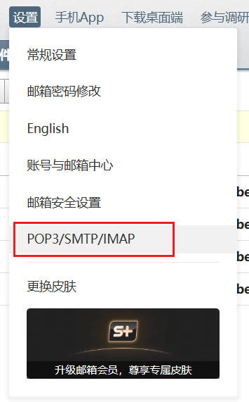

## 前言

平时自己很少使用邮件通信，但最近在做告警和通知的功能的时候，使用的比较频繁，故记录下如何使用 Python 的 SMTP 库发送邮件。

---

## 设置

一般都会使用第三方邮箱服务器发送邮件，比如 gmail，163，qq 等邮箱服务器的 SMTP 服务，需要在对应网站的页面设置一下：

1. 开启 SMTP
2. 获取授权码



不同的邮箱的设置可能都不太一样，自行搜索——xxx邮箱设置 SMTP

---

## smtplib

Python 的标准库包含了 smtp 服务客户端的实现。

示例代码：

```python
import smtplib
from email.mime.text import MIMEText
from email.header import Header

# 邮件服务器地址和端口号
smtp_server = 'smtp.163.com'
smtp_port = 465

# 发件人邮箱地址和授权码
sender_email = '你的开启了SMTP服务的邮箱地址'
sender_password = '你的授权码'

# 收件人邮箱地址
recipient_email = [
    'example@qq.com',
    'example@163.com'
]


def main():
    message = MIMEText('Python 邮件发送-测试-正文', 'plain', 'utf-8')
    message['From'] = sender_email
    message['To'] = ",".join(recipient_email)
    message['Subject'] = Header('Hello World', 'utf-8')

    try:
        with smtplib.SMTP_SSL(smtp_server, smtp_port) as server:
            server.login(sender_email, sender_password)
            server.sendmail(sender_email, recipient_email, message.as_string())
    except Exception as e:
        print(f'发送失败: {e}')
    else:
        print(f'发送成功')


if __name__ == '__main__':
    main()


```

---

## 日志的邮件处理

Python 标准库 logging 中提供了 `logging.handlers.SMTPHandler` 处理类，但是有些邮箱（比如 163）使用起来会爆出 time out 的问题。

可以自己编写一个继承了 SMTPHandler 的自定义类，重写 emit 方法即可。


---

## 参考

1. https://docs.python.org/zh-cn/3.13/library/smtplib.html#module-smtplib
2. https://www.mailabc.cn/blog/2024/09/20/%e9%82%ae%e4%bb%b6%e5%8d%8f%e8%ae%ae%e7%ab%af%e5%8f%a3%e6%b1%87%e6%80%bb/
3. https://www.runoob.com/python/python-email.html
4. https://docs.python.org/3/library/email.mime.html
5. https://madmalls.com/blog/post/smtphandler-send-error-email/
