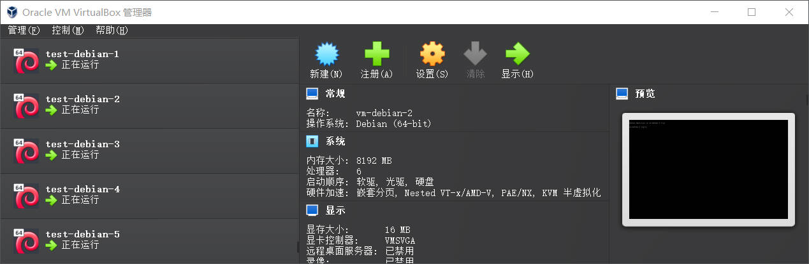

## 前言

之前一直使用 Virtualbox 手动安装 ISO 镜像文件来搭建测试环境，或者使用 Docker 来跑一些服务，最近看到 vagrant，发现它和 Docker 类似，比较轻量，但是 Docker 是容器化技术，而 Vagrant 的隔离性更好，是面向虚拟机的环境管理工具。

Vagrantfile 是 vagrant 的配置文件，可以用来批量创建虚拟机环境。

官方介绍是：

> Vagrant 是用于管理虚拟机生命周期的命令行工具。
> 在单一可支配且一致的环境中隔离依赖关系及其配置。

---

## 初始化

### VirtualBox 和 Vagrant 的关系

VirtualBox 是一个虚拟机软件（Hypervisor），作用是在宿主机上真正创建虚拟机，提供 CPU / 内存 / 磁盘 / 网络，负责启动、暂停、关闭虚拟机。

Vagrant 是一个虚拟机自动化管理工具，它本身不会创建虚拟机，而是通过配置文件（Vagrantfile）自动调用 VirtualBox / VMware 等 provider 批量创建 VM。

Vagrant 不负责模拟硬件，而是负责管理 VirtualBox。

### 步骤

vagrant 的项目（或者说虚拟机）需要一个空目录，类似 git，所以初始化工作包含：创建目录以及初始化命令的执行：

比如我在本篇文章中，想要用 vagrant 快速创建一个 debian 的集群：

```shell
mkdir debian-cluster
cd debian-cluster
```

然后执行初始化命令：

```shell
vagrant init debian/bookworm64
```

init 后面跟着的是 box name，我这里创建的是 [Debian12](https://portal.cloud.hashicorp.com/vagrant/discover/debian/bookworm64)，vagrant 会自动从网络上拉取本地没有的 Box。

初始化命令结束后，目录下会多出一个 Vagrantfile，这就是 vagrant 对于虚拟机的描述，即配置文件。

在团队项目中，需要把 Vagrantfile 纳入版本控制，这样其它人可以根据该文件创建一样的虚拟机环境。

---

## Vagrantfile

如果只是简单的使用，那么 Vagrantfile 有以下内容就够了：

```ruby
Vagrant.configure("2") do |config|
  config.vm.box = "debian/bookworm64"
  config.vm.box_version = "12.20250126.1"
end
```

我们可以往文件里写入更多复杂的配置，比如我想要创建 5 台 Debian 虚拟机：

- 都是 2 核心 2GB 内存的配置
- hostname 都改成 test-debian-{1..5} 的格式
- 网络使用桥接模式，IP 固定为 192.168.0.21{1..5}
- 配置 APT 镜像源，安装一些常用工具
- 设置用户和密码

那么 Vagrantfile 内容如下：

```ruby
Vagrant.configure("2") do |config|
  # Debian 12 官方 box
  config.vm.box = "debian/bookworm64"

  # 桥接到你的物理网卡（重要）
  # 第一次 up 时会让你选择网卡
  BRIDGE_IFACE = nil

  (1..5).each do |i|
    config.vm.define "test-debian-#{i}" do |node|
      node.vm.hostname = "test-debian-#{i}"

      # 桥接模式和 IP 地址配置
      node.vm.network "public_network",
        ip: "192.168.0.21#{i}",
        bridge: BRIDGE_IFACE

      node.vm.provider "virtualbox" do |vb|
        # hostname 和 CPU 内存配置
        vb.name = "test-debian-#{i}"
        vb.memory = 2048
        vb.cpus = 2
      end

      node.vm.provision "shell", inline: <<-SHELL
        set -e
        # 国内 APT 镜像源
        echo ">>> Configure apt mirror"
        cat > /etc/apt/sources.list << 'EOF'
deb https://mirrors.tuna.tsinghua.edu.cn/debian/ bookworm main contrib non-free non-free-firmware
deb https://mirrors.tuna.tsinghua.edu.cn/debian/ bookworm-updates main contrib non-free non-free-firmware
deb https://mirrors.tuna.tsinghua.edu.cn/debian/ bookworm-backports main contrib non-free non-free-firmware
deb https://security.debian.org/debian-security bookworm-security main contrib non-free non-free-firmware
EOF

        apt-get update

        # 基础工具安装
        echo ">>> Install base packages"
        apt-get install -y wget curl gcc vim sudo

        # 允许远程密码登录
        echo ">>> Updating SSH configuration"
        cp /etc/ssh/sshd_config /etc/ssh/sshd_config.bak

        # 1. 强制将 PasswordAuthentication no 改为 yes
        # 使用 -i 直接修改，g 确保全局替换（防止一行内多次出现）
        sed -i 's/PasswordAuthentication no/PasswordAuthentication yes/g' /etc/ssh/sshd_config
        
        # 2. 如果原本是注释掉的，或者根本不存在，则通过追加确保它存在
        if ! grep -q "^PasswordAuthentication yes" /etc/ssh/sshd_config; then
            echo "PasswordAuthentication yes" >> /etc/ssh/sshd_config
        fi

        # 3. 设置 PermitRootLogin
        # 先尝试修改已有行（无论是否带 #），如果没有则追加
        if grep -q "PermitRootLogin" /etc/ssh/sshd_config; then
            sed -i 's/^#\?PermitRootLogin.*/PermitRootLogin yes/' /etc/ssh/sshd_config
        else
            echo "PermitRootLogin yes" >> /etc/ssh/sshd_config
        fi

        # 4. 重启服务
        systemctl restart ssh

        # 设置 root 密码
        echo ">>> Set root password"
        echo "root:123456" | chpasswd

        # 创建 test 用户，把 test 添加到 sudo 组中
        echo ">>> Create test user"
        if ! id test >/dev/null 2>&1; then
          useradd -m -s /bin/bash test
        fi
        echo "test:123456" | chpasswd
        usermod -aG sudo test

        echo ">>> Done on $(hostname)"
      SHELL
    end
  end
end
```

---

## 基础操作

### 启动虚拟机

创建好 Vagrantfile 后，可以通过以下命令创建和启动虚拟机：

```shell
vagrant up
```

启动成功后，可以在 virtualbox 中看到：




### SSH
vagrant 创建的虚拟机会有一个默认的 sudo 用户——vagrant，可以通过 vagrant 命令连接虚拟机：


```shell
vagrant ssh test-debian-1
```
由于我上面通过 sed 把 sshd 的 PasswordAuthentication 改成 yes 了，也可以通过 ssh 正常连接：

```shell
ssh test@192.168.0.211
```

### 状态

查看虚拟机状态：

```shell
$ vagrant status
Current machine states:

test-debian-1             running (virtualbox)
test-debian-2             running (virtualbox)
test-debian-3             running (virtualbox)
test-debian-4             running (virtualbox)
test-debian-5             running (virtualbox)

This environment represents multiple VMs. The VMs are all listed
above with their current state. For more information about a specific
VM, run `vagrant status NAME`.
```

### 销毁和启动

销毁某一个虚拟机：

```shell
vagrant destroy -f test-debian-1
```

销毁所有：

```shell
vagrant destroy -f
```

启动某一个虚拟机：

```shell
vagrant up test-debian-1
```

启动所有：

```shell
vagrant up
```

---

## 参考

1. https://developer.hashicorp.com/vagrant/intro
2. https://developer.hashicorp.com/vagrant/tutorials/get-started/setup-project