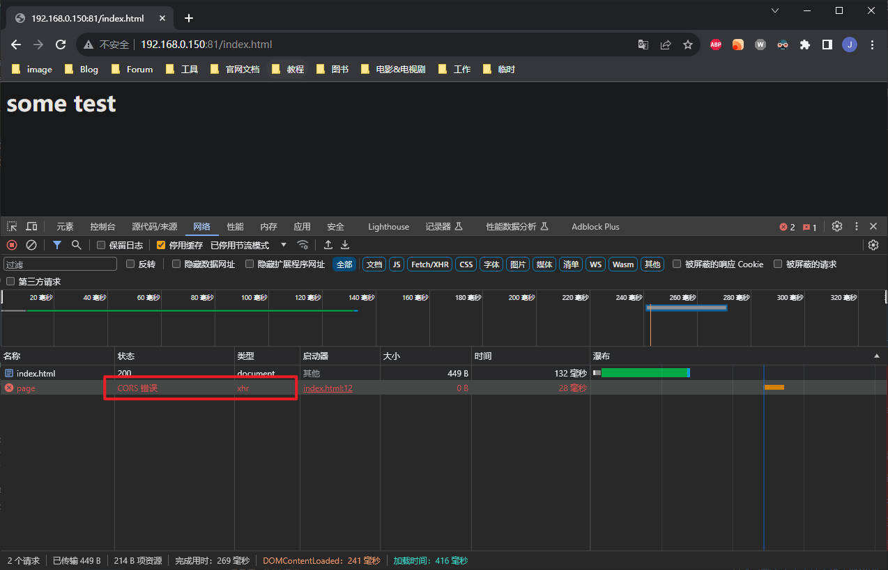
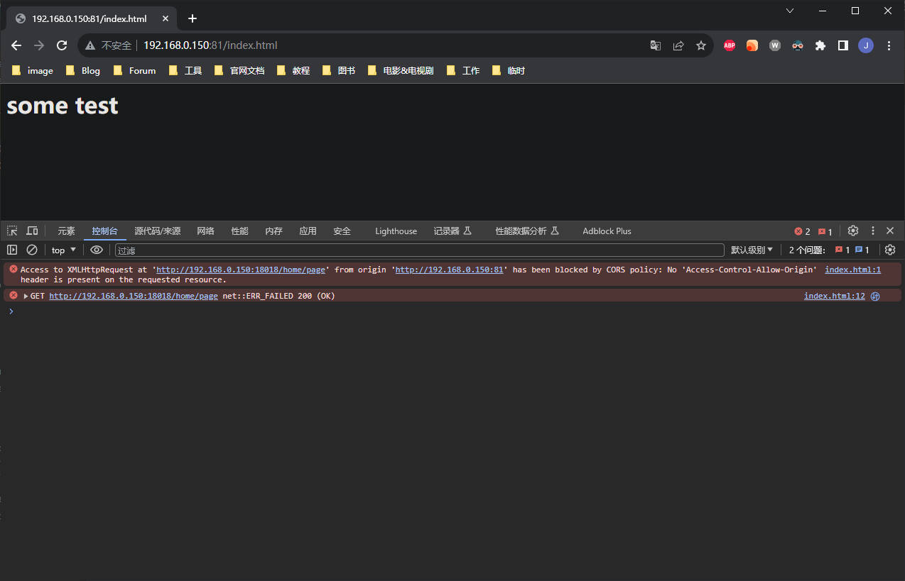
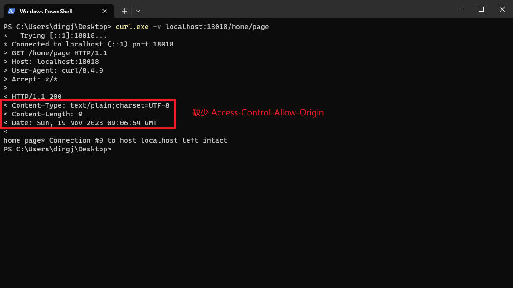
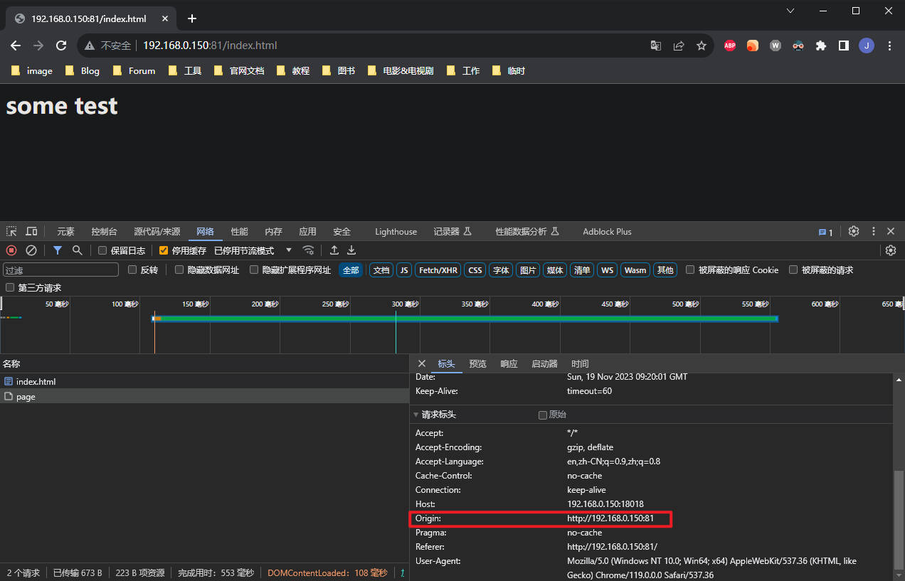
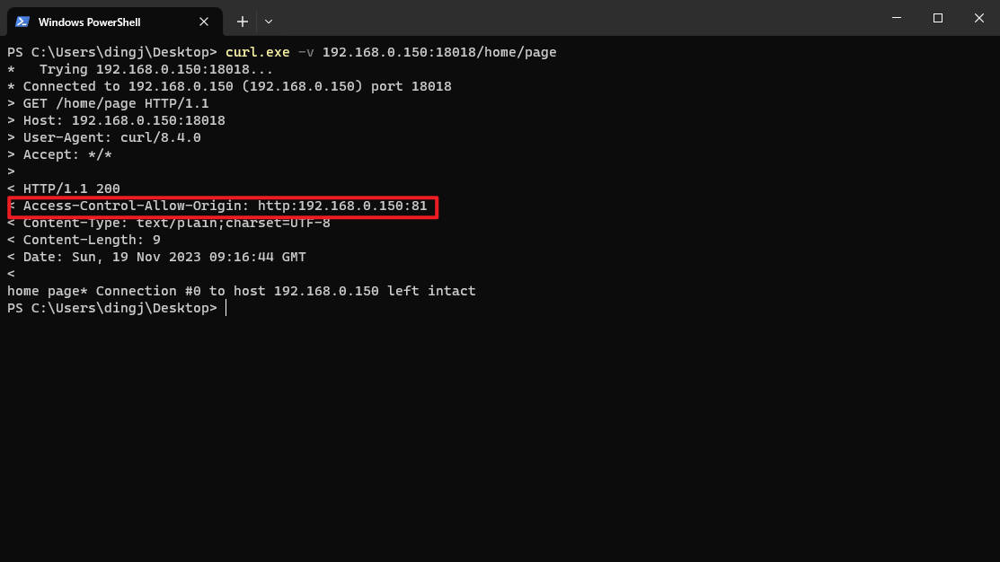
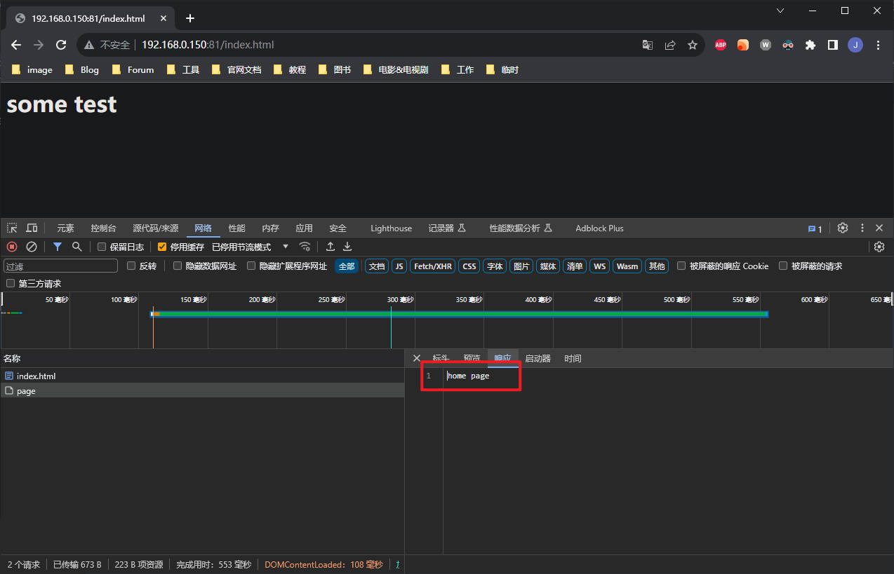
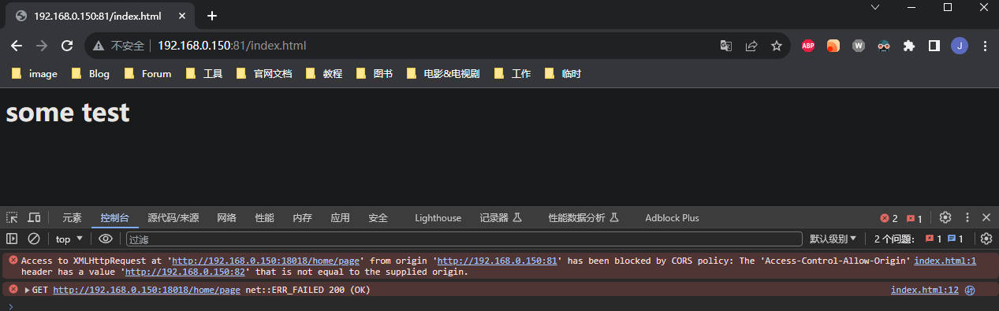
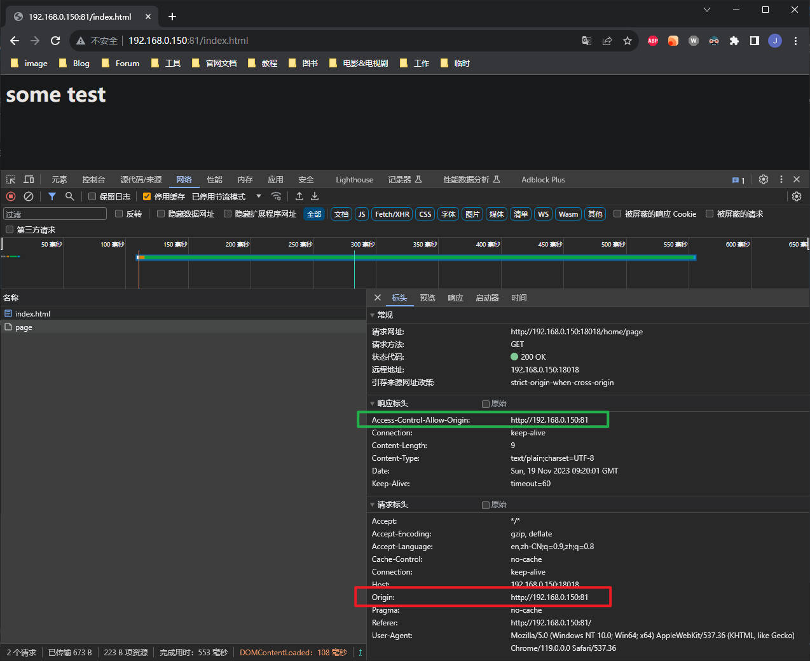

## 前言

跨域问题大概是前后端对接接口的时候碰到的最多，也是最摸不清头脑的问题之一，如果对于相关协议没有很好的了解，只能是闭着眼睛摸石头过河。

显然，瞎猜是很难解决实际问题的，还是要对 CORS 相关的细节有所了解，才能真正了解到本质的解决方式。

---

## CORS 概览

### 什么是源？

CORS 的全称是 Cross-Origin Resource Sharing，中文名是跨源资源共享，首先需要知道“Origin（源）”指的是什么。

源由三部分组成：

* URI Scheme：访问协议，例如 http 或者 https
* Domain：主机地址，例如 korilweb.cn，192.168.0.101
* Port：服务端口号，例如 8080

举些例子：

| URL                                      | scheme | domain        | port |
| ---------------------------------------- | ------ | ------------- | ---- |
| https://baidu.com                        | https  | baidu.com     | 80   |
| https://korilweb.cn                      | https  | korilweb.cn   | 80   |
| http://some-web.com:8090                 | http   | some-web.com  | 8090 |
| http://192.168.0.101:8080/web/index.html | http   | 192.168.0.101 | 8080 |

### 跨源是什么？

现在就很好理解什么是跨源，即 Cross-Origin，只要访问者和被访问者的源的三部分（Scheme，Domain，Port），一旦有一个不一样，那么此次访问就构成了跨源访问资源。

假设，客户端的 URL 是 https://korilweb.cn，那么以下的 URL，其中部分存在跨源访问（也可以叫做：跨域访问）的问题。

| URL                                | 是否同源 | 原因                        |
| ---------------------------------- | -------- | --------------------------- |
| https://korilweb.cn:80             | 非同源   | port 不同（https 默认 443） |
| http://korilweb.cn                 | 非同源   | scheme 不同                 |
| https://baidu.com                  | 非同源   | domain 不同                 |
| https://other.korilweb.cn          | 非同源   | domain 不同                 |
| https://korilweb.cn/web/index.html | 同源     | 三者相同                    |
| http://korilweb.cn:8080            | 非同源   | scheme 和 port 不同         |

不同源的网站之间，能不能访问，会有什么漏洞，这就需要了解同源策略（SOP，Same-Origin Policy）。

### 同源策略

假如现在用户在浏览器中，先后打开以下两个网站：

1. http://bank.com
2. http://bad.com

第一个网站是银行网站，第二个是恶意网站。用户先登录了银行网站，此时该网站的 Cookie 就会存储在用户浏览器中，以便维持会话。

紧接着，用户打开了第二个恶意网站，网站内有一串代码是调用了 http://bank.com 的转账接口，如果是正常情况下，恶意代码是无法进行转账的（因为没有登陆获取 cookie），但是由于用户先打开并且登录了银行网站，恶意网站就可以向转账接口，携带 cookie，发起请求。

这就是跨站请求伪造（CSRF，Cross-site request forgery）。简单地说，是攻击者通过一些技术手段欺骗用户的浏览器去访问一个自己曾经认证过的网站并运行一些操作（如发邮件，发消息，甚至财产操作如转账和购买商品）。由于浏览器曾经认证过该站点，所以被访问的网站会误认为，该次请求是真正的用户操作，而去运行接口。

这利用了web中用户身份验证的一个漏洞：简单的身份验证只能保证请求发自某个用户的浏览器，却不能保证请求本身是用户自愿发出的。

为了防御这种攻击，所有浏览器现在都实施同源策略。

如今，同源策略下，浏览器强制客户端只能向与客户端 URL 具有相同来源的资源发送请求。客户端 URL 的协议（scheme）、端口（port）和主机名（port）都应该与其请求的服务器相匹配。

同源策略，主要针对 JS 脚本，而非 HTML 标签，这意味着网站可以通过相对应的 HTML 标签来访问不同源的图片，CSS 和其他资源文件。

同源策略带了更高的安全性，但是在实际应用的过程中缺乏了一些灵活度，如果我们希望允许跨源访问一些资源，比如从公共的，或者经过授权的 API 获取数据，我们就需要今天介绍的主角——CORS。

## CORS 请求

跨源资源共享，是一种基于 HTTP 标头（header）的机制，通过一些特殊的 header 来允许服务器能够指示除了自身之外的其他源，让浏览器能够从中加载资源。除此之外，CORS 还有一个预检机制（preflight），浏览器通过向服务器发出预检请求，来确认服务器是否允许实际请求。

如果说，SOP 是为了安全，那么 CORS 就是为了灵活。在 SOP 下，脚本只能访问同源下的资源或者接口，而 CORS 就开了个口子，让服务器端来指定是否允许跨域访问。

### 简单请求

跨源请求，分为两种：简单请求和复杂请求。

必须是满足以下的要求，才能称为简单请求

请求方法：

* GET

* POST

* HEAD

其中 POST 的 Content-Type 只能是三种之一：

* text/plain
* multipart/form-data
* application/x-www-form-urlencoded

现在页面中模拟一个 GET 的简单请求，index.html：

```html
<html>
<body>
    <h1>some test</h1>

    <script>
        const xhr = new XMLHttpRequest();
        const url = "http://192.168.0.150:18018/home/page";

        xhr.open("GET", url);
        xhr.send();
    </script>
</body>
</html>

```

页面中使用了 XMLHttpRequest 向 http://192.168.0.150:18018/home/page 接口发起了请求。

使用 Nginx 做下静态资源代理，我们将这个页面部署在 192.168.0.150:81 上面，现在就构成了跨域：

1. 客户端页面：http://192.168.0.150:81/index.html
2. 接口：http://192.168.0.150:18018/home/page

尽管 Scheme 和 Domain 一致，但是 Port 一个是 81，一个是 18018，所以该请求是跨域请求。

后台 API 使用 Spring Boot 模拟：

```java
@RestController
@RequestMapping("/home")
public class HomeController {
    
    @GetMapping("/page")
    public String page() {
        return "home page";
    }
}
```

然后，将后台接口部署到 192.168.0.150:18018 上。

打开页面，发现请求爆出 CORS 错误，更加具体的错误，需要在控制台中看：



控制台的报错：



报错详细信息：

> Access to XMLHttpRequest at 'http://192.168.0.150:18018/home/page' from origin 'http://192.168.0.150:81' has been blocked by CORS policy: No 'Access-Control-Allow-Origin' header is present on the requested resource.
>
> 翻译：
>
> 从源 'http://192.168.0.150:81' 向 'http://192.168.0.150:18018/home/page' 发起的 XMLHttpRequest 请求被 CORS 政策封锁：请求资源的 header 中不存在 'Access-Control-Allow-Origin'。


就像之前提到的，CORS 的机制是通过 header 中一些特殊的字段来实现的，所以结论很明显，因为该请求是跨源请求，而服务器并没有在响应 header 中添加 Access-Control-Allow-Origin，所以并未通过 CORS 检测。



解决方法就是，在服务器返回 header 中添加该字段，可以是拦截器，也可以是过滤器，也可以是 Spring Web 提供的一些其他设置方式。

这里为了演示方便，使用最直观的过滤器，定义如下过滤器：

```java
@Component
public class CorsFilter implements Filter {
    @Override
    public void doFilter(ServletRequest request, ServletResponse response, FilterChain chain) throws IOException, ServletException {
        HttpServletResponse res = (HttpServletResponse) response;

        // 添加 Access-Control-Allow-Origin header
        res.setHeader("Access-Control-Allow-Origin", "http://192.168.0.150:81");

        chain.doFilter(request, response);
    }
}
```

当发生跨域请求的时候，浏览器会设置 request header 中的 Origin 字段，告诉服务器，请求的源是什么：



所以后端 API 设置 access-control-allow-origin 和 该字段保持一致即可：



刷新页面，再次请求，就可以正常获取到 response body 了：



简单请求的跨域协商的原理，就是依靠这个 header——Access-Control-Allow-Origin，跨域请求时，浏览器自动加上 Origin 标头，然后服务器如果没有返回 Access-Control-Allow-Origin 标头，就会爆出刚刚的错误，如果返回了，但是不一致，就会爆出如下的错误：



如果返回了 Access-Control-Allow-Origin 标头，并且两个值相同，就能正确获取到接口信息：



如果希望这个接口，允许所有的源都可以访问，指定通配符 * 即可：

```
Access-Control-Allow-Origin: *
```

另外，可以看到 Access-Control-Allow-Origin 的 Origin 是单数，所以它无法指定多个不同的源，下面的这些用法，都希望可以指定多个源，但都是不合法的：

1. value 由多个值构成，中间用英文逗号隔开。
2. 多个 Access-Control-Allow-Origin 标头，value 不同。
3. value 使用正则表达式。

换句话说，这个标头，要么是单个具体的源，要么是 *，那么如何匹配多个源呢？

一般的实践是，将匹配的代码放在后端返回该标头前，例如下面所示：

```java
@Component
public class CorsFilter implements Filter {

    private final Set<String> allowOrigins = new HashSet<>();

    @PostConstruct
    public void init() {
        allowOrigins.add("http://192.168.0.150:81");
        allowOrigins.add("http://192.168.0.150:82");
        allowOrigins.add("http://192.168.0.151:81");

    }

    @Override
    public void doFilter(ServletRequest request, ServletResponse response, FilterChain chain) throws IOException, ServletException {

        HttpServletRequest req = (HttpServletRequest) request;
        HttpServletResponse res = (HttpServletResponse) response;

        String origin = req.getHeader("origin");

        // 判断是否匹配 allowOrigins 中的任何值
        // 匹配到了，就设置 Access-Control-Allow-Origin
        if (StringUtils.hasText(origin)) {
            if (allowOrigins.contains(origin)) {
                res.setHeader("Access-Control-Allow-Origin", origin);
            }
        }
        chain.doFilter(request, response);
    }
}
```

### 复杂请求

暂略


---

## 参考

1. https://cloud.tencent.com/developer/article/1838494
2. https://developer.mozilla.org/en-US/docs/Web/HTTP/CORS
3. https://fetch.spec.whatwg.org/#http-cors-protocol
4. https://portswigger.net/web-security/cors/same-origin-policy
5. https://portswigger.net/web-security/cors/access-control-allow-origin
