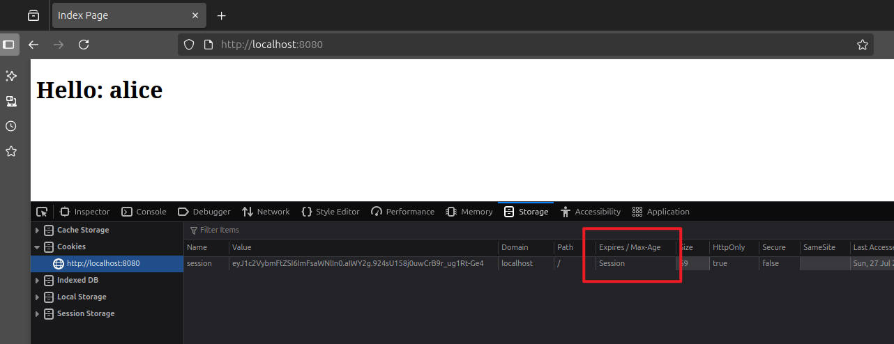
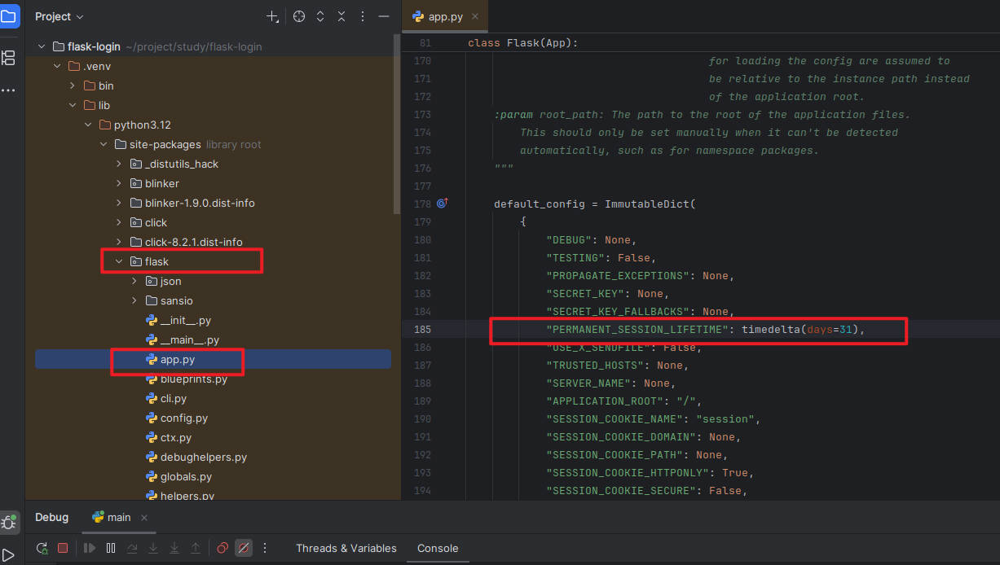

## 目录

[TOC]

---

## 前言

Flask 的登陆功能依赖于 session 机制，Flask 的 session 是服务端无状态的，类似于 JWT，本文通过一个简单的 demo 来解释如何使用 Flask 自带的 session 实现登陆功能。

---

## session

Flask 的 session 使用 HTTP cookie 实现，服务端将 session 数据序列化为 JSON 格式，然后 Base64 编码，将数据部分进行 HMAC 签名，签名的作用是防止客户端篡改数据，最后拼接数据部分和签名部分，通过 set-cookie 发送给浏览器。

浏览器受到 set-cookie 后，会自动在之后的请求中使用该 cookie 访问站点。

所以 Flask 应用不存储 session 数据，session 信息都保存在客户端浏览器。

---

## HTML 页面

这里编写两个 HTML 页面作为首页和登陆页面：

index.html

```html
<!DOCTYPE html>
<html lang="en">
<head>
    <meta charset="UTF-8">
    <title>Index Page</title>
</head>
<body>

<h1>Hello: {{ username }}</h1>

</body>
</html>
```

login.html

```html
<!DOCTYPE html>
<html lang="en">
<head>
    <meta charset="UTF-8">
    <title>Login Page</title>
    <style>
        .error-msg {
          color: red;
        }
    </style>
</head>
<body>
<form method="post" action="/login">
    
        <div class="error-msg">{{ error }}</div>
    
    <div>
        <label for="username">Username: </label>
        <input id="username" name="username" type="text" placeholder="Enter your username" required />
    </div>
    <div>
        <label for="password">Password: </label>
        <input id="password" name="password" type="password" placeholder="Enter your password" required />
    </div>
    <input type="submit" value="Login" />
</form>
</body>
</html>
```

首页会展示当前登陆用户，登陆页需要用户输入用户名和密码进行登陆。

---

## 后端接口

```python
import datetime
import random

from flask import Flask, render_template, request, session, redirect, url_for

app = Flask(__name__)
# session 密钥
app.secret_key = 'fj@lsdfXk1fds234'
# app.secret_key = str(random.randint(1, 999))
# session 有效时间
app.permanent_session_lifetime = datetime.timedelta(minutes=3)
# app.config["SESSION_REFRESH_EACH_REQUEST"] = False
users = {
    'alice': 'alice',
    'bob': 'bob'
}

@app.route('/')
def index():
    return render_template('index.html', username=session.get('username', 'anonymous'))

@app.route('/login', methods=['GET', 'POST'])
def login():
    error = None
    if request.method == 'POST':
        username = request.form.get('username')
        password = request.form.get('password')

        user_password = users.get(username)
        if user_password and user_password == password:
            # session.permanent = True
            session['username'] = username
            return redirect(url_for('index'))
        else:
            error = '用户名或密码错误'

    return render_template('login.html', error=error)


@app.get('/logout')
def logout():
    username = session.get('username')
    if username:
        session.pop('username')
    return redirect(url_for('index'))

if __name__ == '__main__':
    app.run(host='0.0.0.0', port=8080, debug=False)
```

使用 session 前一定要指定 app.secret_key，不然给 session 添加数据时，会爆出以下错误：

```
[2025-07-27 11:09:04,001] ERROR in app: Exception on /login [POST]
Traceback (most recent call last):
省略部分内容
packages/flask/sessions.py", line 104, in _fail
    raise RuntimeError(
RuntimeError: The session is unavailable because no secret key was set.  Set the secret_key on the application to something unique and secret.
```

app.secret_key 一定要尽可能长，随机，且不可泄露。

session 默认是不持久化的，关闭浏览器该 cookie 就会自动删除，重新打开浏览器需要再次登陆：



想要持久化 session，添加 session 数据前，调用以下代码：

```python
session.permanent = True
```

默认持久化的时间是 31 天，通过源码可以看到默认值：



也可以自定义 session 失效时间：

```python
app.permanent_session_lifetime = datetime.timedelta(minutes=3)
```

---

## cookie 刷新机制

如果 session 是非持久化的，那么每次刷新页面都是一个 cookie，Flask 服务器是不会在 response 里面 set 新的 cookie，但如果 session 是持久化的，那么每次刷新页面，服务器都会 set 一个新的 cookie。

官方的文档：

> - **SESSION_REFRESH_EACH_REQUEST**[¶](https://flask.palletsprojects.com/en/stable/config/#SESSION_REFRESH_EACH_REQUEST)
>
>   Control whether the cookie is sent with every response when `session.permanent` is true. Sending the cookie every time (the default) can more reliably keep the session from expiring, but uses more bandwidth. Non-permanent sessions are not affected.Default: `True`

大意是：当 session.permanent 为 true 时，SESSION_REFRESH_EACH_REQUEST 这个参数可以控制是否每次响应都发送 cookie。每次都发送 cookie（默认设置）可以更可靠地防止会话过期，但会占用更多带宽。非永久会话不受影响。

如果不希望每次刷新新的 cookie （不想延长会话过期），那么可以把该参数手动指定为 False：

```python
app.config["SESSION_REFRESH_EACH_REQUEST"] = False
```

---

## 参考

1. https://flask.palletsprojects.com/en/stable/config/
2. https://blog.csdn.net/m0_37519490/article/details/80774069
